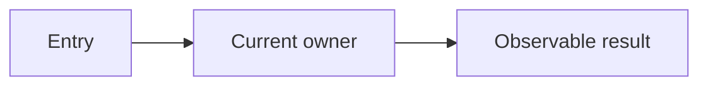
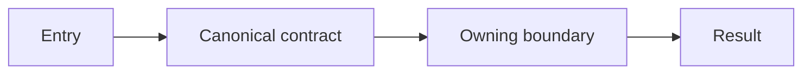
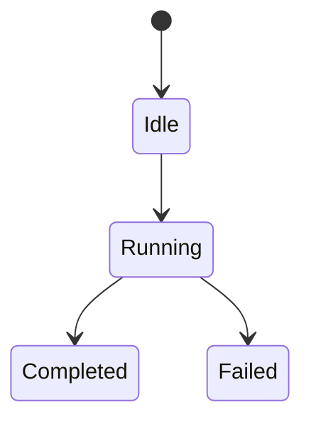

<!--
Cognia technical proposal template (standard depth).
Delete all comments, placeholders, and inapplicable sections.
Use current repository evidence; do not copy historical counts.
-->

# <Outcome-focused proposal title>

| Field | Value |
|---|---|
| Status | Draft / In review / Approved |
| Author · Date | <owner> · <YYYY-MM-DD> |
| Scope | <layers, packages, processes> |
| Source | <issue / PRD / request> |
| Related | <ADRs, plans, APIs> |
| Branch / Milestone | <branch> · <milestone> |
| Reviewers | <roles or people> |

> **Executive summary**
>
> - **Change:** <recommended design>
> - **Reason:** <confirmed problem and magnitude>
> - **Impact:** <contracts/data/security/platform/rollout>
> - **Decision:** <Q1–Qn reviewers must approve>

## 1. <Conclusion about the problem and target outcome>

### Context

<SCQA: confirmed situation, complication, decision question, proposed answer>

### Goals

| Goal | Baseline | Target | Acceptance evidence |
|---|---:|---:|---|
| | | | |

### Scope and non-goals

- ✅ In scope: <...>
- ⏭️ Deferred but compatible: <... and why>
- ❌ Not supported: <... and why>

## 2. <Conclusion about the current system>

### Evidence

| Claim | Status | Source | Verification |
|---|---|---|---|
| | Confirmed / Inferred / Open | <file + symbol> | <command/read> |

### Current flow



> Figure 1: <one-sentence conclusion>

### Constraints and invariants

- <must remain true>

## 3. <Recommended design and why it wins>

### Alternatives

| Option | Design | Benefits | Costs/risks | Decision |
|---|---|---|---|---|
| A | | | | ✅ / rejected |

### Proposed architecture



> Figure 2: <what the design centralizes, removes, or protects>

### Decisions and rationale

| Decision | Chosen design | Why | Tradeoff |
|---|---|---|---|
| | | | |

## 4. Contracts, state, and data

### Ownership

| Contract/data | Producer | Validator | Consumer | Persistence/version |
|---|---|---|---|---|
| | | | | |

### Interface/schema

```typescript
// Exact public shape or pseudocode; remove if not useful.
```

### State and lifecycle



<Define guards, side effects, terminal states, ordering, idempotency, timeout, cancellation, retry, and recovery.>

## 5. Failure, compatibility, and recovery

| Failure/skew | Detection | User/system behavior | Recovery | Test |
|---|---|---|---|---|
| | | | | |

<Cover old/new data, clients/plugins/SDKs, providers, web/Tauri/mobile/headless where applicable.>

## 6. Security, privacy, and permissions

| Boundary/threat | Control | Audit/evidence |
|---|---|---|
| | | |

<Cover authn/authz, approvals, secrets, PII redaction, filesystem/network/process access, isolation, retention/deletion.>

## 7. Observability and operations

| Signal | Dimensions | Threshold/SLO | Owner action |
|---|---|---|---|
| | | | |

<Include logs, metrics, traces, audits, health, runbook links, bounded cardinality.>

## 8. Migration, rollout, and rollback

| Phase | Preconditions | Change | Verification | Abort/rollback |
|---|---|---|---|---|
| 0 | | | | |

<Define compatibility window, backfill/reconciliation, flags/kill switch, and rollback effect on written data.>

## 9. Verification and acceptance

### Behavior contracts

```text
Given <precondition>
When <action/request>
Then <observable result>
And <diagnostic/persisted evidence>
```

### Test matrix

| Layer/project/platform | Contract | Command | Required result |
|---|---|---|---|
| Unit/integration | | | |
| E2E/native | | | |
| Gate/build | | | |

### Unverified constraints

- <environment/platform/credential and residual risk>

## 10. Work plan, dependencies, and risks

### Work packages

| Package | Deliverable | Dependencies | Owner | Verification | Rollback |
|---|---|---|---|---|---|
| WP-1 | | | <one role/person> | | |

### Risks and mitigations

| Risk | Likelihood/impact | Mitigation | Trigger/owner |
|---|---|---|---|
| | | | |

## 11. Decisions and review record

### Decisions required

- **Q1:** <context and options> — **Recommendation:** <choice and why>
- **Q2:** <context and options> — **Recommendation:** <choice and why>

### Review record

| Reviewer | Conclusion | Date | Conditions/TODO |
|---|---|---|---|
| | Approved / Conditional / Rejected | | |

### TODO

- [ ] <action> — Owner: <one person/role> · DDL: <YYYY-MM-DD>

## Sources

- <repository evidence and current external primary sources>
