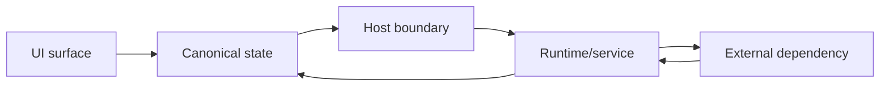
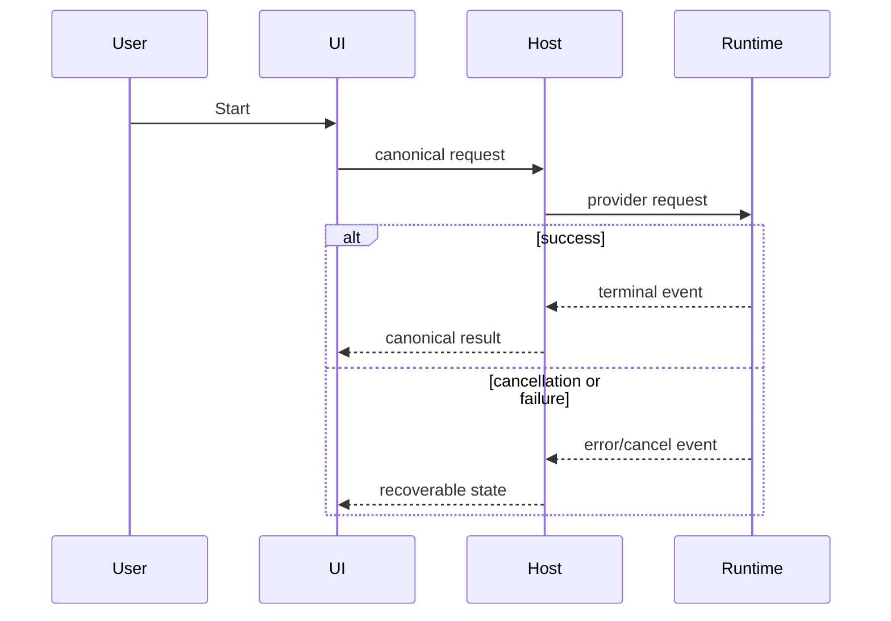
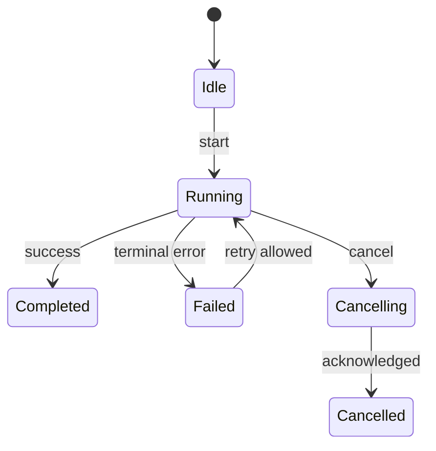
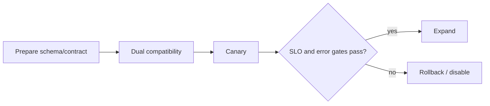

# Message-first diagram cookbook

## Selection

Write the diagram's conclusion first. Then map relationship to visual:

| Relationship | Visual |
|---|---|
| data/control movement | flow or layered architecture |
| ordered calls/async callbacks | sequence or swimlane |
| lifecycle/recovery | state machine |
| module ownership/nesting | tree or architecture |
| alternatives/field mappings | table/matrix |
| branches/decision logic | flowchart/decision tree |
| stored entities | ER or schema map |
| phases/dependencies | milestone/dependency graph |

Skip a diagram when a short paragraph or table is clearer.

## Whole-system flow

Caption example: “All provider-specific data is normalized at the host boundary; UI and persistence consume one canonical event model.”

Mark:

- trust/process/package boundaries;
- source of truth;
- changed edges;
- failure/rollback seam.

## Sequence

Include async returns, cancellation, timeout, and retry when they matter. Do not draw implementation calls that add no review value.

## State machine

For each transition define owner, guard, side effects, persistence, and recovery.

## Ownership/contract table

| Field/event | Producer | Validator | Consumer | Stored? | Versioning |
|---|---|---|---|---|---|

Use this instead of a diagram when exact repeated mappings are the central problem.

## Compatibility matrix

| Producer | Consumer | Old data | New data | Behavior |
|---|---|---|---|---|
| old | new | yes | n/a | compatible |
| new | old | n/a | yes/no | fallback or blocked |

Cover desktop/mobile/headless, old/new DB, old/new plugin/SDK, and provider variants only when in scope.

## Rollout

Caption must name abort thresholds and the data effect of rollback.

## Rendering rules

- Keep a diagram to roughly 5–9 primary nodes; split larger views.
- Quote Mermaid labels containing punctuation.
- Use one direction consistently.
- Do not encode meaning only by color.
- Label changed/new boundaries.
- Add one caption sentence with the conclusion.
- Keep source in Markdown even if a Lark whiteboard is created.
- Visually inspect rendered output; syntax success does not prove readability.

## Anti-patterns

- Code directory tree presented as architecture with no message.
- Happy-path sequence without error/cancel/retry despite those being design risks.
- State names without transition owners or terminal semantics.
- One giant diagram containing data flow, deployment, class hierarchy, and rollout.
- Diagram copied from an old plan without reconciling current code.
