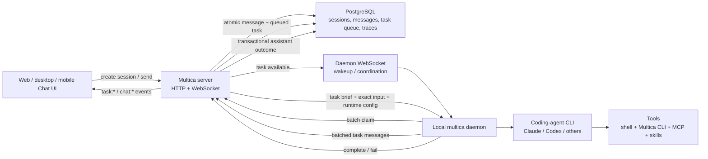

# Multica source-code research: Chat, runtime, and orchestration

> Research date: 2026-08-15  
> Canonical repository: [`multica-ai/multica`](https://github.com/multica-ai/multica)  
> Source snapshot: [`2c0912b6ec764b373d44eeea1e80f0d9f11ab417`](https://github.com/multica-ai/multica/commit/2c0912b6ec764b373d44eeea1e80f0d9f11ab417) (`main`, 2026-08-14T11:49:37Z)  
> Latest release at research time: [`v0.4.26`](https://github.com/multica-ai/multica/releases/tag/v0.4.26), commit `19155e4`; the researched `main` snapshot is five commits newer.  
> Method: direct reading of the pinned source tree. All file links below are immutable commit links. “Design rationale” explicitly distinguishes source comments from my own inference.

## Executive conclusion

The most important thing to understand is that Multica Chat is **not a web client calling an LLM streaming API**. A chat turn is converted into a durable `agent_task_queue` task. The central server owns sessions, messages, permissions, the queue, audit data, and realtime events; a user-run local daemon claims the task, prepares an isolated execution environment, then delegates the actual reasoning/tool loop to an installed coding-agent CLI such as Claude Code or Codex. The daemon streams the CLI's work trace back as `task:message` events, while the final user-facing answer is persisted once, transactionally, and delivered as `chat:done`.

That division explains most of the implementation:

- Chat is a collaboration/control-plane surface over the same task runtime used by issues and Autopilots.
- Multica does not implement its own model planning loop. Its abstraction boundary is `agent.Backend`; the selected external CLI owns model calls and tool decisions.
- Multi-turn memory is primarily the provider's `session_id` plus a reusable `work_dir`; the Multica transcript is the durable product record and a recovery context source, not the sole model memory.
- Reliability comes from database transactions and explicit state machines, not from optimistic UI assumptions.
- “Streaming” has two layers: a live execution timeline (`thinking`, text, tool use/result) and a single terminal chat reply. The assistant bubble itself is not token-streamed into `chat_message`.

## 1. System architecture



The repository is a monorepo. The relevant boundaries are:

| Layer                 | Main source                                                                    | Responsibility                                                                                    |
| --------------------- | ------------------------------------------------------------------------------ | ------------------------------------------------------------------------------------------------- |
| Product clients       | `packages/views/chat/**`, `packages/core/chat/**`, `packages/core/realtime/**` | Chat UI/controller, React Query caches, realtime reconciliation                                   |
| HTTP/control plane    | `server/internal/handler/**`, `server/cmd/server/router.go`                    | Authentication, authorization, API shape, daemon claim response construction                      |
| Domain/task service   | `server/internal/service/task.go`                                              | Queueing, claiming, cancellation, retries, terminal transactions, events                          |
| Local execution plane | `server/internal/daemon/**`                                                    | Runtime detection, claim loop, environment preparation, prompt construction, execution, reporting |
| Runtime adapters      | `server/pkg/agent/**`                                                          | Uniform interface over many external coding-agent CLIs                                            |
| Persistence           | `server/migrations/**`, `server/pkg/db/queries/**`                             | PostgreSQL schema and concurrency/state-machine queries                                           |

The public routing makes the two-plane split explicit: member Chat endpoints live under `/api/chat/sessions`, while daemon-only claim/start/message/complete endpoints live under `/api/daemon` and require daemon authentication ([member Chat routes](https://github.com/multica-ai/multica/blob/2c0912b6ec764b373d44eeea1e80f0d9f11ab417/server/cmd/server/router.go#L1742-L1769), [daemon routes](https://github.com/multica-ai/multica/blob/2c0912b6ec764b373d44eeea1e80f0d9f11ab417/server/cmd/server/router.go#L1047-L1087)).

## 2. Direct Chat end-to-end

### Phase A — local compose state and lazy session creation

The shared `useChatController` drives both the full Chat page and the floating chat window. A “new chat” initially exists only as client compose state; the server session is created lazily on the first send. The client derives a deterministic short title, creates the session with agent/project context, and de-duplicates concurrent creation with a shared promise ([controller and `ensureSession`](https://github.com/multica-ai/multica/blob/2c0912b6ec764b373d44eeea1e80f0d9f11ab417/packages/views/chat/components/use-chat-controller.ts#L57-L72), [lazy session creation](https://github.com/multica-ai/multica/blob/2c0912b6ec764b373d44eeea1e80f0d9f11ab417/packages/views/chat/components/use-chat-controller.ts#L387-L419)).

On the server, `CreateChatSession`:

1. requires an authenticated user and workspace;
2. validates the target agent and optional project;
3. applies the **invoke** permission, because opening a Chat is allowed to lead to agent runs;
4. locks workspace/project deletion fences;
5. creates a creator-owned `chat_session` ([source](https://github.com/multica-ai/multica/blob/2c0912b6ec764b373d44eeea1e80f0d9f11ab417/server/internal/handler/chat.go#L39-L137)).

Every later transcript read/send gates both session ownership and current private-agent access. Send applies the stricter invoke gate again, so a once-valid session cannot become a back door after permissions change ([ownership/access gates](https://github.com/multica-ai/multica/blob/2c0912b6ec764b373d44eeea1e80f0d9f11ab417/server/internal/handler/chat.go#L245-L330), [per-send checks](https://github.com/multica-ai/multica/blob/2c0912b6ec764b373d44eeea1e80f0d9f11ab417/server/internal/handler/chat.go#L831-L885)).

### Phase B — accept one turn atomically

The client uses an “await, then render” policy. It keeps the composer and draft intact until the HTTP request succeeds; only then does it insert the server-issued message/task IDs into the cache and clear the draft. A rejection therefore cannot create a fake user bubble or lose the user's text ([send flow](https://github.com/multica-ai/multica/blob/2c0912b6ec764b373d44eeea1e80f0d9f11ab417/packages/views/chat/components/use-chat-controller.ts#L451-L609)).

The server preflights archive state, agent runtime readiness, attachments, and current invoke permission **before mutation**. It then calls `SendDirectChatMessage` ([handler](https://github.com/multica-ai/multica/blob/2c0912b6ec764b373d44eeea1e80f0d9f11ab417/server/internal/handler/chat.go#L805-L974)).

`SendDirectChatMessage` writes a complete turn envelope in one database transaction:

- lock the session, then the agent/runtime carrier;
- decide whether an older turn is already ahead in the positional queue;
- create an `agent_task_queue` chat task at medium priority;
- set `chat_input_task_id = task.id`;
- create the user `chat_message` with `task_id = task.id`;
- bind validated attachments;
- touch the session;
- commit;
- only after commit, emit `task:queued` and wake the daemon.

This guarantees the daemon cannot observe a task without its input, or input without its task ([transaction](https://github.com/multica-ai/multica/blob/2c0912b6ec764b373d44eeea1e80f0d9f11ab417/server/internal/service/task.go#L1886-L2055)).

An agent with a runtime binding but a temporarily offline daemon is intentionally **not** rejected: the turn stays durable and queued until that runtime comes back. “No runtime has ever been assigned / the local CLI cannot execute” is a blocking configuration error; “assigned runtime is currently disconnected” is a waitable state ([server distinction](https://github.com/multica-ai/multica/blob/2c0912b6ec764b373d44eeea1e80f0d9f11ab417/server/internal/service/task.go#L1528-L1537), [handler preflight](https://github.com/multica-ai/multica/blob/2c0912b6ec764b373d44eeea1e80f0d9f11ab417/server/internal/handler/chat.go#L849-L870)).

### Phase C — queue wakeup and claim

The daemon has one machine-level batch poller. It acquires local execution slots **before** claiming, then performs a WS-first batch claim across all runtime IDs; HTTP/polling remains the recovery path. Acquiring capacity first avoids leaving a server task stuck in `dispatched` while the machine has no local slot ([poll/claim loop](https://github.com/multica-ai/multica/blob/2c0912b6ec764b373d44eeea1e80f0d9f11ab417/server/internal/daemon/daemon.go#L4627-L4798)).

The server-side claim is transactional and capacity-aware. It locks the agent, respects `max_concurrent_tasks`, atomically changes one runnable row from queued to dispatched, and has stale-dispatch recovery when a previous claim response was lost ([claim state machine](https://github.com/multica-ai/multica/blob/2c0912b6ec764b373d44eeea1e80f0d9f11ab417/server/internal/service/task.go#L2917-L3018), [stale claim recovery](https://github.com/multica-ai/multica/blob/2c0912b6ec764b373d44eeea1e80f0d9f11ab417/server/internal/service/task.go#L3021-L3085)).

### Phase D — construct the exact runtime input at claim time

Claim returns more than the queue row. The handler resolves the freshest agent definition, skills, model/reasoning settings, project/resources, MCP configuration, session continuation pointers, and the exact chat input batch.

For Chat specifically:

1. Load `chat_session`, workspace, title, channel binding, and optional project.
2. Project context may replace workspace repos with project-scoped repositories/resources; stale/deleted project references degrade safely to workspace context.
3. Resume only a provider session created by the **same runtime**. Prefer the session pointer on `chat_session`, then fall back to the most recent chat task session so one failed middle turn does not erase the whole conversation.
4. If the task has `chat_input_task_id`, load only messages owned by that input task. Do not scan trailing history. Collect attachment IDs/metadata for those messages.
5. Fail closed if a task-owned direct turn has no input.

See [Chat claim enrichment](https://github.com/multica-ai/multica/blob/2c0912b6ec764b373d44eeea1e80f0d9f11ab417/server/internal/handler/daemon.go#L2313-L2464) and [exact input loading](https://github.com/multica-ai/multica/blob/2c0912b6ec764b373d44eeea1e80f0d9f11ab417/server/internal/handler/daemon.go#L2465-L2545).

The exact input-owner mechanism is a central correctness device. The migration states the invariant directly: each task owns an immutable message batch, and retries inherit the root `chat_input_task_id`, so a later user message can never be absorbed by an earlier claim or replayed by a retry ([migration](https://github.com/multica-ai/multica/blob/2c0912b6ec764b373d44eeea1e80f0d9f11ab417/server/migrations/158_agent_task_queue_chat_input_task_id.up.sql#L1-L17)). Channel Chat now seals batches in the same model too ([channel enqueue](https://github.com/multica-ai/multica/blob/2c0912b6ec764b373d44eeea1e80f0d9f11ab417/server/internal/service/task.go#L1568-L1756)).

### Phase E — prepare an execution environment and prompt

The daemon resolves the requested runtime to either a built-in CLI or a custom command speaking a supported protocol. It ensures pinned skill bundles, builds a task context, and either reuses a safe prior work directory or prepares a fresh isolated environment. Local project resources support in-place and disposable-worktree modes; worktree changes are finalized into a branch even on partial failure, while Multica's injected sidecars are cleaned out before delivery ([runtime/environment preparation](https://github.com/multica-ai/multica/blob/2c0912b6ec764b373d44eeea1e80f0d9f11ab417/server/internal/daemon/daemon.go#L6077-L6233), [reuse/fresh prepare and project resource modes](https://github.com/multica-ai/multica/blob/2c0912b6ec764b373d44eeea1e80f0d9f11ab417/server/internal/daemon/daemon.go#L6382-L6522), [finalization/cleanup](https://github.com/multica-ai/multica/blob/2c0912b6ec764b373d44eeea1e80f0d9f11ab417/server/internal/daemon/daemon.go#L6529-L6631)).

Only after the work directory exists does the daemon mark the server task `running`. It then injects a runtime brief into the provider's discoverable file (`CLAUDE.md`, `AGENTS.md`, etc.), builds the per-turn prompt, and exports a task-scoped Multica token and environment so the agent can call `multica` safely as the task/agent actor—not as the daemon owner ([start-after-prepare and task credentials](https://github.com/multica-ai/multica/blob/2c0912b6ec764b373d44eeea1e80f0d9f11ab417/server/internal/daemon/daemon.go#L6643-L6695)).

The prompt is intentionally split:

- stable workflow/persona/skills/project material lives in an injected runtime file, improving provider prompt-cache reuse;
- changing per-turn material is appended to the user prompt;
- direct Chat includes audience, exact user message, explicitly selected slash skills, input attachment download instructions, and output-attachment delivery rules;
- channel Chat adds channel/history semantics, but web Chat relies on provider-session continuation plus the Multica transcript.

See [prompt-routing and cache rationale](https://github.com/multica-ai/multica/blob/2c0912b6ec764b373d44eeea1e80f0d9f11ab417/server/internal/daemon/prompt.go#L64-L145) and [Chat prompt construction](https://github.com/multica-ai/multica/blob/2c0912b6ec764b373d44eeea1e80f0d9f11ab417/server/internal/daemon/prompt.go#L468-L620).

### Phase F — delegate to a provider adapter

Multica's runtime abstraction is deliberately narrow:

```go
type Backend interface {
    Execute(ctx context.Context, prompt string, opts ExecOptions) (*Session, error)
}
```

`Session` exposes a message channel and one final `Result`. Normalized message types are text, thinking, tool use/result, status, error, and log. Options carry workdir, model, reasoning level, MCP config, timeout, and resume session ([interface and event model](https://github.com/multica-ai/multica/blob/2c0912b6ec764b373d44eeea1e80f0d9f11ab417/server/pkg/agent/agent.go#L16-L168)). `agent.New` selects adapters for Claude, Codex, Copilot, OpenCode, OpenClaw, Hermes, Pi, Cursor, Kimi, Kiro, Qwen, and others ([factory](https://github.com/multica-ai/multica/blob/2c0912b6ec764b373d44eeea1e80f0d9f11ab417/server/pkg/agent/agent.go#L265-L395)).

This is the key orchestration insight: **Multica orchestrates durable work, context, isolation, permissions, and lifecycle; the coding-agent CLI orchestrates the model/tool loop.** Multica does not interpret a tool plan and execute individual tools itself.

### Phase G — live trace streaming

`executeAndDrain` starts the backend, consumes its message channel, and batches the trace every 500 ms. Thinking/text chunks are coalesced; tool use/result and errors receive monotonically increasing sequence numbers. Tool output is bounded, secrets are redacted at the daemon, and each batch has a 5-second reporting timeout. The daemon waits for the transcript tail to flush before returning the final result ([drain loop](https://github.com/multica-ai/multica/blob/2c0912b6ec764b373d44eeea1e80f0d9f11ab417/server/internal/daemon/daemon.go#L7499-L7626), [message normalization and redaction](https://github.com/multica-ai/multica/blob/2c0912b6ec764b373d44eeea1e80f0d9f11ab417/server/internal/daemon/daemon.go#L7642-L7786)).

The server persists every normalized event to `task_message`, redacts again as defense in depth, and publishes `task:message` over realtime ([ingest](https://github.com/multica-ai/multica/blob/2c0912b6ec764b373d44eeea1e80f0d9f11ab417/server/internal/handler/daemon.go#L4100-L4180)). The client merges these by sequence into the task timeline ([client handler](https://github.com/multica-ai/multica/blob/2c0912b6ec764b373d44eeea1e80f0d9f11ab417/packages/core/realtime/use-realtime-sync.ts#L1237-L1259)).

Therefore the UI's “Thinking / tool activity / work log” is a durable task transcript. It is distinct from the eventual assistant `chat_message`.

### Phase H — finalization and `chat:done`

On completion, server-side `CompleteTask` performs one transaction that:

- changes the task from running to completed;
- stores task result/session/workdir/branch;
- updates the `chat_session` resume pointer and runtime ID;
- retires an unusable old provider session when required;
- writes exactly one assistant outcome row for direct Chat, including an explicit `no_response` row for a legitimate tool-only/empty-text turn;
- binds files uploaded by the agent during this task to that assistant row.

Only after commit does it broadcast `chat:done`, start optional quick-action generation asynchronously, reconcile agent status, and broadcast `task:completed` ([completion transaction](https://github.com/multica-ai/multica/blob/2c0912b6ec764b373d44eeea1e80f0d9f11ab417/server/internal/service/task.go#L3535-L3615), [post-commit Chat events](https://github.com/multica-ai/multica/blob/2c0912b6ec764b373d44eeea1e80f0d9f11ab417/server/internal/service/task.go#L3709-L3739), [assistant-outcome rules](https://github.com/multica-ai/multica/blob/2c0912b6ec764b373d44eeea1e80f0d9f11ab417/server/internal/service/task.go#L3742-L3875)).

The client inserts the assistant message into both message caches **before** removing the pending task, avoiding a flicker between the live timeline and final bubble. It then invalidates against the database for authoritative reconciliation ([cache application](https://github.com/multica-ai/multica/blob/2c0912b6ec764b373d44eeea1e80f0d9f11ab417/packages/core/realtime/use-realtime-sync.ts#L187-L240), [global `chat:done` handler](https://github.com/multica-ai/multica/blob/2c0912b6ec764b373d44eeea1e80f0d9f11ab417/packages/core/realtime/use-realtime-sync.ts#L1311-L1337)).

## 3. State and persistence model

The foundational schema is simple:

- `chat_session`: workspace, agent, creator, title, provider `session_id`, `work_dir`, active/archived state;
- `chat_message`: user/assistant content linked to a session and optionally a task;
- `agent_task_queue.chat_session_id`: makes a task a Chat task rather than an issue task.

See the original schema migration ([source](https://github.com/multica-ai/multica/blob/2c0912b6ec764b373d44eeea1e80f0d9f11ab417/server/migrations/033_chat.up.sql#L1-L36)). Later migrations add runtime ownership, project context, pin/read cursors, attachments, message kinds, quick actions, and exact input ownership.

Conceptually, the durable relationships are:

```text
chat_session 1 ── * chat_message
      │
      └── * agent_task_queue 1 ── * task_message
                    │
                    └── chat_input_task_id ──> immutable user-message batch
```

The three “memory” stores serve different purposes:

| Store                              | Purpose                                                                     |
| ---------------------------------- | --------------------------------------------------------------------------- |
| `chat_message`                     | Product transcript, pagination, unread state, recovery/history commands     |
| `task_message`                     | Live and durable execution trace: thinking, tools, intermediate text/errors |
| provider `session_id` + `work_dir` | Provider-native multi-turn reasoning/tool context and local working state   |

### Multi-turn continuity

Continuation is guarded rather than assumed:

- only resume a session created on the same runtime;
- reuse the corresponding workdir when safe;
- for Codex, require the rollout/session artifact to exist before pinning/resuming;
- if the provider explicitly rejects resume, perform at most one fresh-session retry, and only when the daemon observed zero tool calls in the failed attempt;
- add a surface-specific continuity notice so the agent does not pretend it remembers lost hidden context;
- retain transcript-based recovery where the surface persists history.

The resume options and loss semantics are documented in the adapter contract ([source](https://github.com/multica-ai/multica/blob/2c0912b6ec764b373d44eeea1e80f0d9f11ab417/server/pkg/agent/agent.go#L61-L81), [result/rejection contract](https://github.com/multica-ai/multica/blob/2c0912b6ec764b373d44eeea1e80f0d9f11ab417/server/pkg/agent/agent.go#L193-L230)). The zero-tool safety gate exists to avoid duplicating non-idempotent side effects ([source](https://github.com/multica-ai/multica/blob/2c0912b6ec764b373d44eeea1e80f0d9f11ab417/server/internal/daemon/daemon.go#L7312-L7353)); the one-shot retry rebuilds both prompt and runtime brief as cold-session context ([source](https://github.com/multica-ai/multica/blob/2c0912b6ec764b373d44eeea1e80f0d9f11ab417/server/internal/daemon/daemon.go#L7006-L7070)).

### Queueing, follow-ups, cancellation

Every send creates a task row. The database state may say `queued`, while product queue position additionally asks whether another visible task in the same chat is ahead. Each follow-up owns its own input, and claims are serialized against session/agent locks. The API exposes pending head plus ordered queued follow-ups, prioritize, remove/edit, and clear operations.

Cancellation is cooperative but durable: the server marks the task terminal; the daemon watches server state (normally at a 5-second interval plus reconnect reconciliation), cancels the local process, flushes the trace, then sends a cancellation acknowledgement. That acknowledgement lets the server settle whether to preserve an assistant snapshot or restore the cancelled draft ([daemon cancellation watcher](https://github.com/multica-ai/multica/blob/2c0912b6ec764b373d44eeea1e80f0d9f11ab417/server/internal/daemon/daemon.go#L4871-L4952), [post-run cancellation acknowledgement](https://github.com/multica-ai/multica/blob/2c0912b6ec764b373d44eeea1e80f0d9f11ab417/server/internal/daemon/daemon.go#L5058-L5104)).

## 4. Tools, skills, and MCP layering

Multica supplies an agent with capabilities through four channels:

1. **Native coding-agent tools** — owned by the selected CLI/provider.
2. **Task-scoped Multica CLI** — the daemon puts `multica` on `PATH` and injects a task-bound token plus workspace/task identifiers. This is how an agent reads/updates Multica, checks out allowed repositories, downloads/uploads attachments, and collaborates.
3. **Skills/runtime brief** — server-pinned skill bundles are materialized into the execution environment; provider-specific discovery files point the runtime at them.
4. **MCP configuration** — assembled at claim time and passed through the adapter.

MCP configuration is layered deliberately:

- runtime/default servers at the environment layer;
- workspace MCP library entries only when explicitly assigned and enabled for the agent;
- the agent's private `mcp_config`, winning name collisions over assigned workspace entries;
- a per-task, initiator-scoped integration overlay (currently Composio), winning collisions because it contains live user-scoped session URLs.

The claim-time merge is visible in [`buildClaimedTaskResponse`](https://github.com/multica-ai/multica/blob/2c0912b6ec764b373d44eeea1e80f0d9f11ab417/server/internal/handler/daemon.go#L1806-L1858). The per-task overlay is resolved **before queue insertion**, so a daemon can never claim between task creation and a network lookup and miss its credentials ([source](https://github.com/multica-ai/multica/blob/2c0912b6ec764b373d44eeea1e80f0d9f11ab417/server/internal/service/task.go#L290-L334)).

Source-based inference: this separation makes capabilities both auditable and revocable at clear scopes—workspace library, agent assignment, or one initiator's task—without baking provider-specific tool behavior into the core task runner.

## 5. Project and resource context

A Chat session may bind an optional `project_id`. The session carries that choice across future turns. At claim, the server revalidates the project inside the workspace, then attaches:

- project title/description;
- `github_repo` resources, which replace broad workspace repos for the task;
- `local_directory` resources pinned to a daemon;
- resource labels and opaque JSON refs.

Stale/deleted project references degrade to workspace context rather than crossing tenants ([claim projection](https://github.com/multica-ai/multica/blob/2c0912b6ec764b373d44eeea1e80f0d9f11ab417/server/internal/handler/daemon.go#L2382-L2433)).

The client deliberately starts a **fresh chat** when switching from one project to another, because provider session memory and a reused workdir could leak the previous project's context. Detaching a project in place is allowed because it only affects future turns ([source](https://github.com/multica-ai/multica/blob/2c0912b6ec764b373d44eeea1e80f0d9f11ab417/packages/views/chat/components/use-chat-controller.ts#L96-L139)).

Source-based inference: a project is not just display metadata. It is an execution-context boundary; changing it may require a new provider conversation, not merely a field update.

## 6. Channel Chat compared with direct Chat

Feishu/Lark, Slack, WeCom, and DingTalk converge on the same `chat_session` + task runtime. Their adapters persist inbound messages, bind an external conversation to a session, debounce bursts, and seal the resulting input batch before enqueue.

Important differences are decided at claim/prompt time:

- web/mobile Chat is creator-private and its output becomes a browser assistant row;
- channel Chat may have group audience and must not be described as private;
- Slack history is read from the live channel; transcript-backed channels such as Feishu read stored `chat_message` history through `multica chat history`;
- file delivery is a server-provided capability verdict, not guessed from channel type;
- an empty channel completion can remain silent, while direct Chat receives an explicit `no_response` outcome.

The channel-awareness policy is encoded in the Chat prompt ([source](https://github.com/multica-ai/multica/blob/2c0912b6ec764b373d44eeea1e80f0d9f11ab417/server/internal/daemon/prompt.go#L479-L543)) and terminal output rules ([source](https://github.com/multica-ai/multica/blob/2c0912b6ec764b373d44eeea1e80f0d9f11ab417/server/internal/service/task.go#L3748-L3767)).

## 7. Autopilot in the same runtime model

Autopilot is another producer of durable work, not a separate agent engine. Its core dispatch creates an `autopilot_run`, then chooses one of two modes:

| Mode           | Flow                                              | Operational intent                                                                                     |
| -------------- | ------------------------------------------------- | ------------------------------------------------------------------------------------------------------ |
| `create_issue` | create an issue and regular issue task            | durable, visible audit trail; may wait for an offline runtime                                          |
| `run_only`     | enqueue a task directly against the Autopilot run | ephemeral scheduled execution; skip at admission when runtime is offline to avoid an unbounded backlog |

This distinction is explicit in `DispatchAutopilot` ([source](https://github.com/multica-ai/multica/blob/2c0912b6ec764b373d44eeea1e80f0d9f11ab417/server/internal/service/autopilot.go#L96-L127)) and the downstream mode switch ([source](https://github.com/multica-ai/multica/blob/2c0912b6ec764b373d44eeea1e80f0d9f11ab417/server/internal/service/autopilot.go#L460-L529)). Scheduled, webhook, API, and manual triggers share the same run model; manual runs carry the human as originator/accountable actor, while non-human triggers attribute to the rule owner.

After dispatch, `run_only` still reaches the same daemon `runTask` path, with an Autopilot-specific prompt/context branch. This is further evidence that Multica's architecture is “many work sources → one queue/runtime state machine.”

## 8. Realtime and client-state strategy

Producers publish synchronous in-process domain events. A listener serializes them to WebSocket messages and hands them to a realtime broadcaster ([event bus](https://github.com/multica-ai/multica/blob/2c0912b6ec764b373d44eeea1e80f0d9f11ab417/server/internal/events/bus.go#L8-L87), [forwarder](https://github.com/multica-ai/multica/blob/2c0912b6ec764b373d44eeea1e80f0d9f11ab417/server/cmd/server/listeners.go#L206-L249)).

The code already has workspace, user, task, and chat rooms plus optional Redis relay support, but this snapshot intentionally still broadcasts task/chat events to the **workspace room**. The client does not yet reliably subscribe/replay per-resource scopes on reconnect, so enabling narrow routing would drop live events ([explicit rollout comment](https://github.com/multica-ai/multica/blob/2c0912b6ec764b373d44eeea1e80f0d9f11ab417/server/cmd/server/listeners.go#L225-L243), [room abstraction](https://github.com/multica-ai/multica/blob/2c0912b6ec764b373d44eeea1e80f0d9f11ab417/server/internal/realtime/broadcaster.go#L3-L42)).

That has an important client consequence: a workspace-wide `task:*` event cannot be trusted to update another user's cross-session Chat aggregate. The client only invalidates and refetches the permission-filtered server endpoint instead of optimistically setting `has_pending`, preventing cross-user information leakage ([source](https://github.com/multica-ai/multica/blob/2c0912b6ec764b373d44eeea1e80f0d9f11ab417/packages/core/realtime/use-realtime-sync.ts#L1261-L1291)). Per-session caches can be patched directly because opening that session is already server-gated.

Source-based inference: the architecture prefers complete delivery plus server-side filtering over premature fine-grained routing. Scalability infrastructure is present, but correctness of reconnect/subscription semantics is treated as a prerequisite to switching it on.

### Critical privacy caveat in this exact snapshot

Official product semantics and REST/database access checks describe direct Chat as creator-private. The storage and ordinary HTTP read paths do enforce that. However, the pinned implementation explicitly broadcasts `chat:*` and `task:*` frames to the entire **workspace** until per-chat client subscriptions are complete, and `chat:message` / `chat:done` payloads include message content. Therefore this source snapshot does **not** justify an unqualified claim of end-to-end private realtime transport between only the creator and agent. At minimum, documentation should say “creator-private in storage and REST/API projection” and record workspace-wide realtime fanout as an implementation caveat requiring confirmation/fix ([workspace fanout rationale](https://github.com/multica-ai/multica/blob/2c0912b6ec764b373d44eeea1e80f0d9f11ab417/server/cmd/server/listeners.go#L225-L243), [Chat event payload consumption](https://github.com/multica-ai/multica/blob/2c0912b6ec764b373d44eeea1e80f0d9f11ab417/packages/core/realtime/use-realtime-sync.ts#L1297-L1337)).

This is not merely a scaling detail: a workspace member's client receives the frame before any React Query permission-filtered refetch. The client code is careful not to derive cross-session pending aggregates from those events, but that does not remove content from the received frame.

## 9. Design principles inferred from the source

### 9.1 The database is the orchestration source of truth

Queue order, input ownership, retries, status transitions, cancellation, and final output all have durable rows and compare-and-set/locking semantics. WebSocket is a latency optimization and reconciliation hint, not the only copy of state.

### 9.2 Atomic boundaries are drawn around user-visible invariants

- send: task + input message + attachments + session touch;
- completion: terminal task + provider resume pointer + assistant outcome;
- notify/broadcast only after commit.

This prevents almost every “ghost bubble,” “task with no prompt,” and “completed but no reply” race.

### 9.3 The control plane is vendor-neutral; the execution loop is delegated

Provider differences stop at `agent.Backend`, environment materialization, and normalized trace/result contracts. Adding a provider does not require rewriting the task state machine or Chat UI.

### 9.4 Chat memory is layered, not singular

Provider sessions preserve hidden conversational state efficiently; Multica transcripts preserve product/audit history; workdirs preserve local artifacts. The code never treats one as a perfect substitute for the others, so it detects and discloses continuity loss.

### 9.5 Stable context and per-turn context are separated for cost

The runtime brief is designed as a stable provider-cache prefix; initiator, connected apps, exact message, and continuity notices are appended per turn. This is an optimization visible in source comments, not speculation.

### 9.6 “Agent” is a configured teammate, not a model endpoint

An agent is a bundle of persona/instructions, skills, runtime binding, model/reasoning settings, custom environment/args, MCP assignments, permissions, and concurrency. A run resolves the current bundle at claim time and executes it locally.

### 9.7 Intermediate activity and final communication are separate products

`task_message` is the inspectable execution trace; `chat_message` is the human conversation. This lets Multica show tool activity without polluting the final chat transcript or forcing the final answer to be reconstructed from arbitrary streaming chunks.

## 10. A concise sequence suitable for a product document

1. The user sends a message to a chosen agent.
2. If needed, the client first creates a private, creator-owned Chat session.
3. The server validates current invoke permission and runtime readiness.
4. In one transaction it creates the task, binds the exact user-message batch and attachments, and updates the session.
5. After commit it wakes the user's local daemon.
6. The daemon claims only when it has a free local slot; the server atomically dispatches one eligible task.
7. At claim, the server assembles fresh agent settings, project/resources, skills/MCP, resume pointer, and the task's immutable input batch.
8. The daemon prepares/reuses an isolated workdir, injects the runtime brief, and gives the coding-agent CLI a task-scoped Multica identity.
9. The selected CLI runs its own model/tool loop. The daemon normalizes and batches thinking/text/tool events back to the server.
10. The server persists those events and the UI renders them as a live task timeline.
11. The CLI emits one final result. The daemon flushes the trace and reports completion/failure.
12. In one transaction the server finalizes the task, updates multi-turn resume state, and writes the assistant outcome/attachments.
13. `chat:done` replaces the pending timeline with the final assistant bubble; background quick actions may arrive later.
14. Follow-up messages repeat the same pipeline, normally resuming the same provider session/workdir; a rejected resume gets one explicit fresh-session recovery attempt.

## 11. Points worth highlighting when comparing or reusing the design

- Do not copy only the WebSocket layer. The core reliability comes from transactions, immutable input ownership, and idempotent terminal state transitions.
- Do not equate `task:message` with the final Chat response. It is a work trace; `chat:done` is the committed conversational result.
- If project context can change, treat it as a memory/workdir boundary, not merely a filter.
- If supporting multiple runtimes, pin provider session continuation to the runtime identity that created it.
- Task-scoped authentication is essential when a local agent can call the product's own API; never let it inherit the daemon owner's general credential.
- External channel support should distinguish history availability, audience privacy, and file-delivery capability. They are separate axes in Multica's prompt logic.
- Workspace-wide realtime fanout means the client must not infer private aggregate state from raw lifecycle events.

## 12. Versioning and licensing caveats

- `main` moves quickly and the repository states a near-daily release cadence, so all implementation claims in this note are pinned to the SHA above rather than an unversioned `main` link.
- The repository's license should not be summarized simply as Apache-2.0. [`LICENSE`](https://github.com/multica-ai/multica/blob/2c0912b6ec764b373d44eeea1e80f0d9f11ab417/LICENSE#L1-L74) contains the Apache-2.0 terms plus additional Multica restrictions around hosted service, commercial embedding, and branding. Any reuse/commercial assessment needs to read that exact license text.
