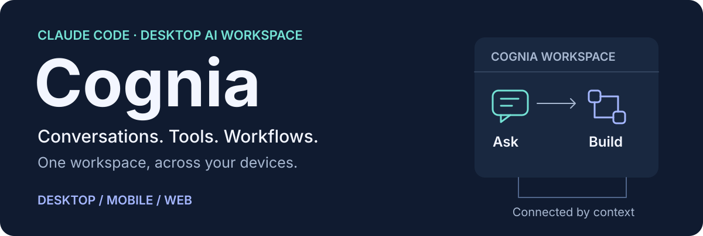
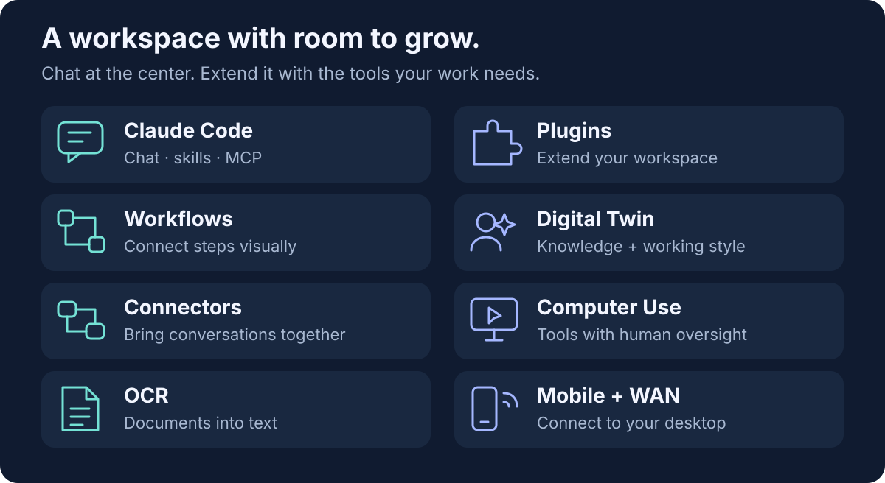
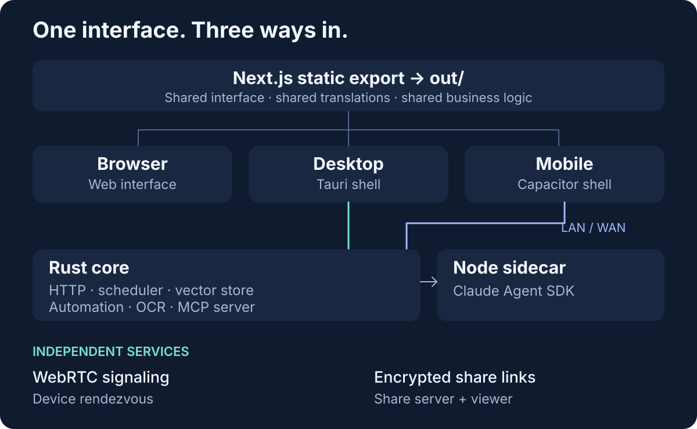
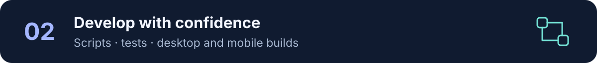

<p align="center">
  
</p>

<p align="center">
  <a href="./LICENSE"></a>
  
  
  
  
  
  
</p>

<p align="center">
  <a href="./README_zh.md">中文</a> ·
  <a href="#quick-start">Quick start</a> ·
  <a href="#how-it-works">Architecture</a> ·
  <a href="./docs/content/docs/en/adr/">ADRs</a> ·
  <a href="./CLAUDE.md">Working rules</a>
</p>

**Cognia** is a desktop-first AI client for **Claude Code**. It wraps the Claude Agent SDK in a
native app and extends it with a plugin runtime, visual workflows, an employee digital twin, IM
connectors, computer-use automation, and OCR — then ships the _same_ interface to the browser, the
desktop, and mobile from a single Next.js codebase.

> [!WARNING]
> **This project is undergoing a major refactoring.** APIs, data schemas, and features may change
> or break without notice, and overall availability is **not guaranteed** at this stage. Pin a
> known-good commit if you depend on it.

## What Cognia does

<p align="center">
  
</p>

- **Claude Code client** — chat surface, slash commands, agents, skills, MCP, and hooks.
- **Plugin runtime** — 20+ first-party plugins on a WASM host (`wasmtime` + WIT bindings):
  computer-use, OCR, GitHub delivery, clipboard, screenshot, Stagehand/Playwright MCP, e2b
  sandbox, prompt templates, and more.
- **Visual workflows** — a React Flow editor with a hybrid TypeScript/Rust runtime; cron, webhook,
  connector, chat, and `/goal`-completed triggers.
- **Employee Digital Twin** — staged ingest, multi-agent distillation, runtime RAG + style
  few-shot, all gated by a shared PII redactor.
- **IM connectors** — 11 platforms (Telegram, Discord, Slack, Lark, OneBot, WeCom, DingTalk,
  Matrix, QQ, WeChat OA & personal WeChat) behind one `ConnectorBus`, with quiet-hours, circuit
  breakers, and an A2UI ⇄ IM bridge that downgrades rich content per platform.
- **Computer Use** — Anthropic native tool calls dispatched to per-OS automation (Windows UIA,
  macOS AX, Linux AT-SPI) with a 3-tier permission model and a human-in-the-loop consent overlay.
- **OCR** — 17 providers (cloud-doc, LLM-vision, specialist, Lark, and local backends) behind a
  single `extract()` API with a Dexie-backed cache.
- **Mobile + WAN** — a Capacitor client over LAN/HTTPS with mDNS discovery and JWT pairing, plus an
  optional WebRTC tier served by a standalone signaling server.
- **Zero-knowledge share links** — a Cloudflare Worker + R2/KV backend; the key lives in the URL
  fragment and is decrypted in the viewer.

## How it works

<p align="center">
  
</p>

One Next.js 16 **static export** (`out/`) is the single source of UI, i18n, and business logic.
The browser serves it directly; **Tauri 2** wraps it in a desktop window backed by a Rust core
(axum HTTP, scheduler, `sqlite-vec` vector store, automation, OCR, MCP server) plus a **Node
sidecar** that hosts the Claude Agent SDK; **Capacitor 8** wraps the same `out/` on mobile and
talks to the Rust core over LAN/WAN.

Two standalone services live under `services/`, each an independent deploy artifact with its own
`Cargo.lock`, Dockerfile, and Fly.io config:

- `services/signaling-server/` — WebRTC rendezvous (axum + workers-rs).
- `services/share-server/` — Cloudflare Worker + Vite viewer for public share links.

The full subsystem catalogue, with one ADR per topic, lives under
[`docs/content/docs/en/adr/`](./docs/content/docs/en/adr/).

## Quick start

<p align="center">
  
</p>

```bash
git clone https://github.com/MaxQian888/cognia-next
cd cognia-next
pnpm install                   # workspace (main + docs + mobile + plugin-sdk)
pnpm sidecar:install           # Node sidecar (separate lockfile)
pnpm dev                       # browser dev server → http://localhost:3000
```

For the desktop and mobile shells:

```bash
pnpm tauri dev                 # desktop window
pnpm mobile:sync:ios          # iOS (build + sync, then mobile:open:ios)
```

> Husky hooks are wired automatically through the root `prepare` script — no extra setup.

**Requirements**

| Target  | Requirements                                                                                           |
| ------- | ------------------------------------------------------------------------------------------------------ |
| Web     | Node.js ≥ 20, pnpm 10                                                                                  |
| Desktop | Rust ≥ 1.84.1 (Tauri 2) + platform C/C++ toolchain ([prereqs](https://tauri.app/start/prerequisites/)) |
| Mobile  | Xcode 26+ (iOS) or Android Studio Hedgehog+ (Android); CocoaPods for iOS                               |

Optional: TURN credentials for self-hosted WebRTC, CMake/C++ for the `ocr-tesseract` Cargo feature.

**Fail-closed agent proxy (macOS)** — launch any HTTP-proxy-aware CLI agent while Seatbelt limits
its entire process tree to one local proxy port:

```bash
AGENT_PROXY_URL=http://127.0.0.1:7890 pnpm agent:proxy -- claude
AGENT_PROXY_URL=http://127.0.0.1:7890 pnpm agent:proxy -- codex
AGENT_PROXY_URL=http://127.0.0.1:7890 pnpm agent:proxy -- gemini
AGENT_PROXY_URL=http://127.0.0.1:7890 pnpm agent:proxy --check
```

The launcher injects upper- and lower-case `HTTP_PROXY`, `HTTPS_PROXY`, and `ALL_PROXY`, clears
`NO_PROXY`, validates an HTTP CONNECT tunnel, and verifies that a second local port is blocked.
Agents that ignore HTTP proxy variables fail closed instead of connecting directly. Use
`AGENT_PROXY_CHECK_TARGET=host:port` to change the TLS-capable preflight destination. SOCKS and
remote proxy endpoints are intentionally rejected.

## Development

<p align="center">
  
</p>

```bash
# App
pnpm dev | build | start | lint | format | typecheck
pnpm test | test:watch | test:coverage

# Desktop / mobile (run pnpm build first — Capacitor wraps out/)
pnpm tauri dev | build | info
pnpm mobile:sync:ios | mobile:sync:android
pnpm mobile:open:ios | mobile:open:android

# Docs (Fumadocs, port 3001) · sidecars · E2E
pnpm docs:dev | docs:build
pnpm sidecar:install | sidecar:start | sidecar:test | sidecars:build
pnpm test:e2e | test:e2e:workflows | test:e2e:mobile | test:e2e:tauri

# Repo gates
pnpm audit:slots            # plugin slot manifest
pnpm lint:i18n              # next-intl key parity (lint:i18n:baseline to rebaseline)
pnpm webrtc:smoke           # signaling-server protocol smoke test
```

See [`package.json`](./package.json) for the complete script list.

**Testing** — co-located `*.test.ts(x)` next to source (no `__tests__/` dirs); coverage stays
≥ 90 % lines / branches / functions (`pnpm test:coverage`, Jest 30 + RTL). Rust uses in-file
`#[cfg(test)]` modules with integration tests under `src-tauri/tests/`; the sidecar uses Node's
built-in runner (`pnpm sidecar:test`). E2E is Playwright with dedicated `mobile-*` and `tauri`
projects — the Tauri project drives a real debug bundle.

**Commit hooks** — `pre-commit` runs `lint-staged` (`eslint --fix` + `prettier --write`);
`commit-msg` enforces Conventional Commits via `commitlint`. Never bypass with `--no-verify`; if a
hook fails, fix the root cause, re-stage, and create a **new** commit.

**Builds** — `pnpm build` produces the static export (`out/`, consumed by Tauri and Capacitor);
`pnpm tauri build` produces the desktop bundles; `pnpm mobile:sync` then Xcode / Android Studio
signs and archives. Optional OCR backends are gated by Cargo features (`ocr-tesseract`,
`ocr-windows`, `ocr-ocrs`, `ocr-paddle`); the default build ships placeholder backends, except
`apple-vision`, which is always real on macOS.

## Reference

<p align="center">
  
</p>

### Project layout

```
cognia-next/
├── app/                   Next.js App Router (static export)
├── components/            React components (ui/ = shadcn, ai-elements/ = vendored)
├── hooks/  lib/  types/   Business logic, hooks, shared types
├── plugins/               First-party in-tree plugins
├── plugin-sdk/typescript/ Published plugin SDK (workspace package)
├── i18n/                  next-intl request + messages (en, zh-CN)
├── src-tauri/             Tauri 2 Rust core (axum HTTP, scheduler, automation, OCR, …)
├── sidecar/               Node sidecar (Claude Agent SDK host, A2UI MCP) — separate lockfile
├── mobile/                Capacitor 8 shell (workspace package)
├── docs/                  Fumadocs site + ADRs (workspace package, port 3001)
├── services/              Standalone deploy artifacts (own Cargo.lock / Docker / Fly.io)
│   ├── signaling-server/  WebRTC rendezvous service (axum + workers-rs)
│   └── share-server/      Cloudflare Worker + Vite viewer for share links
├── tests/e2e/             Playwright suites (workflows, mobile, tauri)
└── scripts/               Build, audit, and migration helpers
```

### Configuration

- **Environment** — `cp .env.example .env.local`. `NEXT_PUBLIC_*` vars are exposed to the browser;
  `lib/env.ts` validates required vars at first access. Never commit `.env.local`.
- **Tauri** — `src-tauri/tauri.conf.json` defines the product name (`Cognia`), identifier
  (`com.cognia.desktop`), deep-link scheme (`cognia://`), a hard `'self'` CSP, the custom title
  bar, and the bundled sidecar resources.
- **Path aliases** — `@/components`, `@/lib`, `@/ui`, `@/hooks`, `@/utils`.
- **Styling** — Tailwind v4 via `@tailwindcss/postcss`, oklch CSS variables, class-based dark mode
  (`@custom-variant dark (&:is(.dark *))`).

### Tech stack

| Layer        | Tools                                                                                                                                |
| ------------ | ------------------------------------------------------------------------------------------------------------------------------------ |
| Frontend     | Next.js 16, React 19, TypeScript, Tailwind v4, shadcn/ui (`new-york`), Radix UI, `next-intl`                                         |
| State / data | Zustand 5, Dexie 4 + `dexie-react-hooks`, `zundo`, React Hook Form, Zod 4                                                            |
| Editor / viz | React Flow, Monaco, CodeMirror, Mermaid, KaTeX, three / r3f, Recharts, `motion`                                                      |
| AI           | Vercel AI SDK v6, `@ai-sdk/*` providers, `@modelcontextprotocol/sdk`, `@anthropic-ai/claude-agent-sdk` (sidecar), `@opencode-ai/sdk` |
| Desktop core | Tauri 2.11, Rust 1.84.1+, `axum`, `tokio`, `rusqlite` + `sqlite-vec`, `webrtc-rs`, `wasmtime` 26, `keyring`, `git2`                  |
| Mobile       | Capacitor 8 (iOS / Android), barcode scanner, biometric / secure-storage / voice-recorder plugins                                    |
| Sidecar      | Node 26+ ESM, Claude Agent SDK, AI SDK providers                                                                                     |
| Quality      | Jest 30 + RTL, Playwright, ESLint 9, Prettier 3, Husky + lint-staged + commitlint                                                    |

### Critical notes

- **pnpm only** — install from the repo root; the lockfile is pnpm-format.
- **Do not remove `output: "export"` in `next.config.ts`** — both Tauri and Capacitor consume
  `out/`. `docs/next.config.ts` is a full server app; keep the two configs separate.
- **No `app/api/` at runtime.** HTTP servers (MCP HTTP, webhook receiver, headless V2 API) live in
  Tauri Rust (axum), not Next.js routes.
- **Server-only deps** — vector-DB SDKs and `simple-git` are aliased to `lib/browser-stubs/empty.js`.
  Add new server-only deps to both `SERVER_ONLY_PACKAGES` and `serverExternalPackages`; truly
  Node-only built-ins go in `NODE_ONLY_MODULES`.

### Conventions

Project-level hard rules — see [`CLAUDE.md`](./CLAUDE.md) for the full ruleset.

1. **Research before implementing.** Search `lib/`, `components/`, `hooks/`, `src-tauri/`, and the
   relevant ADR before writing a new utility, hook, or component. Reuse first.
2. **No silent simplifications.** Ship the full behavior or surface the blocker.
3. **Tests are not optional.** Every new file under `components/**`, `hooks/**`, `lib/**`, or
   `src-tauri/src/**` (except `components/ui/` and `components/ai-elements/`) ships with a
   co-located test; coverage stays ≥ 90 %.
4. **i18n is mandatory.** No hard-coded user-facing strings in `.tsx`. Add keys to **both**
   `i18n/messages/en.json` and `i18n/messages/zh-CN.json`, then `pnpm lint:i18n`.
5. **Reuse shared hooks.** PII redaction (`packages/redact/src/index.ts`), quiet-hours
   (`lib/connectors/outbound-runner`), the build-options pipeline (`lib/claude/build-options.ts`),
   and the A2UI ⇄ IM bridge (`lib/connectors/a2ui-bridge/`) are shared entry points — touch them,
   don't fork them.

### Troubleshooting

| Symptom                                        | Fix                                                                                                                                               |
| ---------------------------------------------- | ------------------------------------------------------------------------------------------------------------------------------------------------- |
| Port 3000 already in use                       | Windows: `Get-NetTCPConnection -LocalPort 3000 \| % { Stop-Process -Id $_.OwningProcess -Force }` · macOS/Linux: `lsof -ti:3000 \| xargs kill -9` |
| Tauri build fails                              | `pnpm tauri info && rustup update && (cd src-tauri && cargo clean)`                                                                               |
| Module not found                               | `rm -rf node_modules docs/node_modules mobile/node_modules pnpm-lock.yaml && pnpm install`                                                        |
| Docs `Cannot find module 'collections/server'` | `pnpm docs:dev` once to generate `docs/.source/`                                                                                                  |
| i18n parity check fails                        | `pnpm lint:i18n` to diff · `pnpm lint:i18n:baseline` after intentional changes                                                                    |
| Monaco assets missing                          | `pnpm monaco:copy` (also runs via `predev` / `prebuild`)                                                                                          |

## Contributing

1. Fork and create a feature branch — `<type>/<short-kebab>` (e.g. `feat/connector-wecom`).
2. Make focused, surgical changes — see [Conventions](#conventions).
3. Add or update co-located tests.
4. Run `pnpm lint`, `pnpm typecheck`, `pnpm test`, and any relevant `pnpm test:e2e:*`.
5. Commit with Conventional Commits and open a PR linking related ADRs.

## Learn more

- **ADRs** — [`docs/content/docs/en/adr/`](./docs/content/docs/en/adr/) (rendered at
  <http://localhost:3001> once `pnpm docs:dev` is running)
- **Plugin SDK** — [`plugin-sdk/typescript/`](./plugin-sdk/typescript/)
- **Working rules** — [`CLAUDE.md`](./CLAUDE.md)
- **External docs** — [Tauri 2](https://tauri.app/) · [Next.js 16](https://nextjs.org/docs) ·
  [shadcn/ui](https://ui.shadcn.com/) · [Capacitor](https://capacitorjs.com/docs) ·
  [Fumadocs](https://fumadocs.dev/)

## License

[AGPL-3.0-or-later](./LICENSE).

## Support

- Read the relevant ADR under [`docs/content/docs/en/adr/`](./docs/content/docs/en/adr/).
- File an issue: <https://github.com/MaxQian888/cognia-next/issues>.
