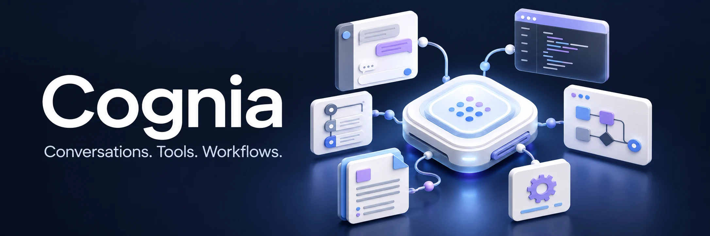
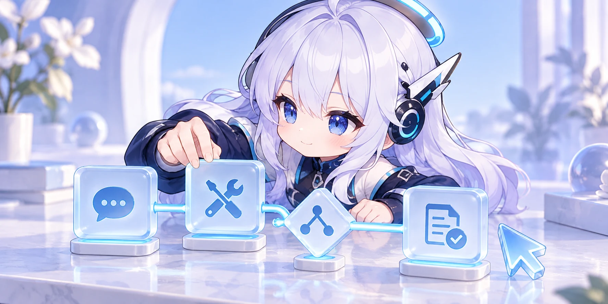
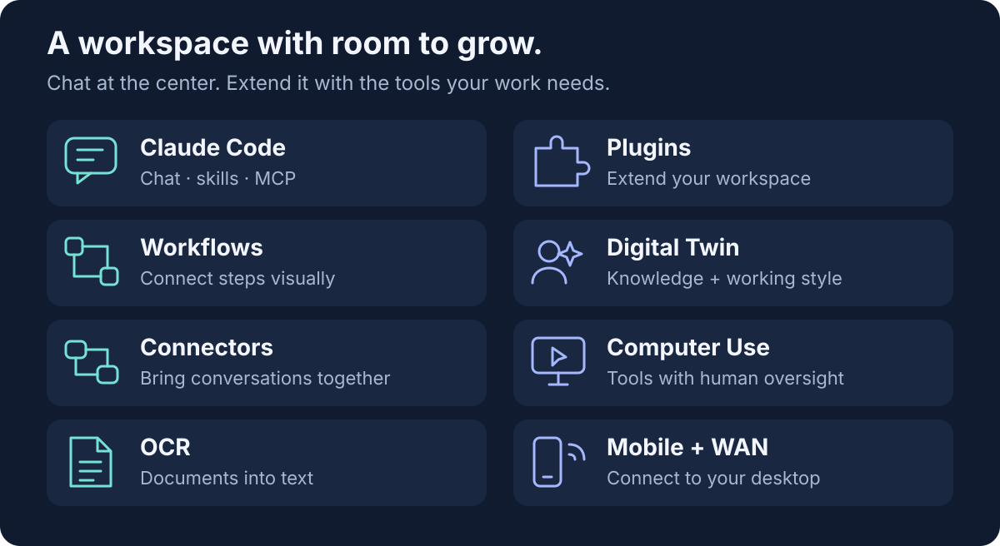
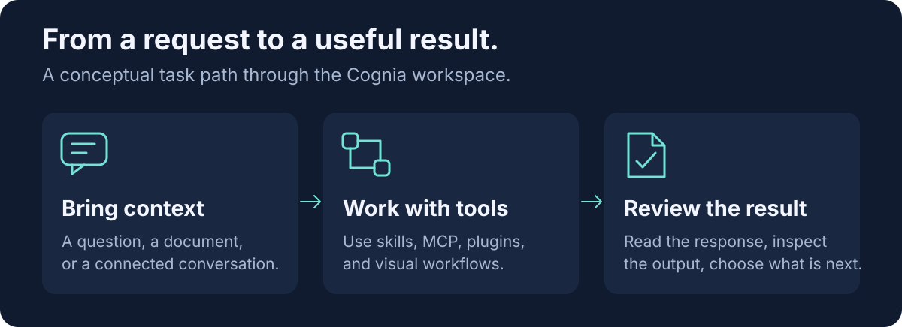
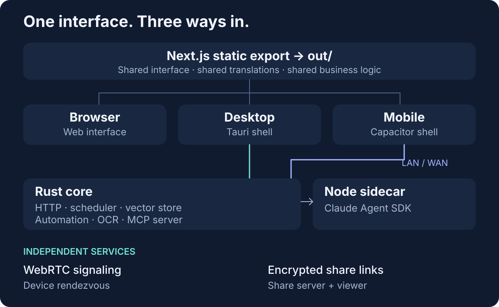

<p align="center">
  
</p>

<p align="center">
  <a href="./LICENSE"></a>
  
  
  
  
  
  
</p>

<p align="center">
  <a href="./README_zh.md">中文</a> ·
  <a href="#what-cognia-does">Explore features</a> ·
  <a href="#quick-start">Quick start</a> ·
  <a href="#how-it-works">Architecture</a> ·
  <a href="./docs/content/docs/en/adr/">ADRs</a> ·
  <a href="./CLAUDE.md">Working rules</a>
</p>

**Cognia** is an AI workspace for coding, knowledge work, and automation. Use its built-in multi-provider agent or connect external agents such as Codex, Claude Code, Gemini CLI, OpenCode, and Pi. Conversations, project files, terminals, browsers, artifacts, and task runs share one workbench.

The desktop app runs a local Rust host and Node agent sidecar. Browser and mobile clients can connect to a paired host. The standalone `cognia-agent` CLI runs terminal conversations and automation without a desktop window. Available features depend on host capabilities, device grants, and plugin compatibility.

> [!WARNING]
> **This project is undergoing major refactoring.** APIs, data schemas, and features may change or stop working without notice. Availability is **not guaranteed** at this stage. If you depend on Cognia, use a commit that you have verified.

## What Cognia does

The images below are concept illustrations based on Cognia’s original artwork. They are not product screenshots.

### Work with agents, projects, and knowledge

<p align="center">
  
</p>

- **Choose an agent runtime**: Select Cognia’s built-in runtime, a configured external agent, or a paired host’s agent configuration for each conversation. The built-in runtime uses the Claude Agent SDK or AI SDK according to the provider.
- **Work in project context**: Bind conversations to a workspace and execution directory. Inspect files, Git changes, terminals, browser previews, and generated artifacts in the workbench.
- **Reuse knowledge and history**: Use project knowledge, long-term memory, and the Employee Digital Twin. Import external agent histories. Skills, slash commands, hooks, and Model Context Protocol (MCP) extend conversations.

### Coordinate tasks, teams, and automation

<p align="center">
  
</p>

- **Squads and run management**: Coordinate agents, inspect runs and task boards, and handle approvals, interruptions, and recoverable execution.
- **Goals and delivery tracking**: Manage goals, issues, delivery projects, and cycles. Link planning to agent execution.
- **Visual workflows**: Connect execution steps in a React Flow editor. Start tasks from schedules, webhooks, connectors, or chat.
- **Computer Use and sandboxes**: Use native desktop automation or configured remote desktop sandboxes with permission checks, human review, and audit records. The desktop app can manage Docker desktop sandboxes and inspect or control their desktops.

### Connect devices, messages, and extensions

<p align="center">
  
</p>

- **Messages and integrations**: Handle connected platform messages in a unified inbox. Use connectors, bots, and plugins to integrate external services.
- **Devices and remote hosts**: Connect to desktop or headless hosts over a local or wide area network (LAN or WAN). Manage pairing, grants, and execution hosts in the device console.
- **Plugins and browser extension**: Install tools, skills, UI contributions, themes, and workflows. The Chrome/Edge companion extension sends pages or selected text to the local Cognia host when you request it.

<details>
<summary><strong>Explore the full capability map and technical details</strong></summary>

<p align="center">
  
</p>

The current implementation includes these capabilities. The illustration’s groups show concepts:

- **Agent runtimes**: Built-in Claude Agent SDK and provider-neutral AI SDK loops. External adapters include Agent Client Protocol (ACP), Codex App Server, OpenCode V2, Pi RPC, Aider CLI, and Agent2Agent (A2A). DeepSeek Harness uses a managed runtime and remains experimental. Model, tool, and approval support differs by adapter.
- **Models and providers**: Configure provider credentials, model catalogs, model selection, and reasoning settings. Inspect usage and costs. External agents supply their own authentication and model lists.
- **Session history**: Import histories from Claude Code, Codex, OpenCode, Gemini CLI, Pi, Cursor, and other sources. Desktop scans and watches local histories. Native resume depends on the source, session format, and configured agent.
- **Project workbench**: Browse and edit workspace files, inspect Git changes, use terminals and Monaco or code-server editors, and open browser and artifact previews. File and process operations run on the selected execution host.
- **Artifacts and Canvas**: Inspect generated documents, code, and interactive content. Edit documents in Canvas. Public share links encrypt content and keep the decryption key in the URL fragment.
- **Squads and run recovery**: Coordinate agent tasks through boards and run consoles. Retain durable execution records and handle checkpoints, approvals, and interruption recovery.
- **Workflows, schedules, and bots**: Combine agent, tool, and branch nodes. Configure scheduled and event triggers, then inspect results. Bots use configured connectors and integrations.
- **Goals and issue tracking**: Manage goals, issues, delivery projects, cycles, and milestones. Code workspaces and delivery projects have separate management surfaces.
- **Knowledge, memory, and digital twin**: Ingest documents, retrieve project knowledge, retain long-term memory, and use knowledge and style examples in conversations. Retrieval-augmented generation (RAG) and twin processing use a shared personally identifiable information (PII) redaction gate.
- **Plugin ecosystem**: JavaScript, Python, WASM, compatible VS Code extensions, character packs, and themes. Plugins contribute tools, skills, MCP configurations, UI, connectors, and workflows. Pi package management and conversion preserve Pi-specific extensions and themes, which still require Pi.
- **Messaging connectors**: `ConnectorBus` includes adapters for Telegram, Discord, Slack, Lark, OneBot, WeCom, DingTalk, Matrix, QQ, WeChat OA, and personal WeChat. Shared controls include a unified inbox, quiet hours, circuit breakers, and an A2UI rich-content bridge. Availability depends on platform authentication, permissions, and protocol support.
- **Shared conversations**: Share sessions, invite participants, and synchronize run state under organization and workspace membership permissions. Deploy the collaboration service, build with `NEXT_PUBLIC_SHARED_CHAT_ENABLED=true`, and enable the local shared-chat preference.
- **Computer Use, sandboxes, and OCR**: Use operating-system automation backends, remote desktop sandboxes, and a shared OCR interface. Docker sandboxes, native OCR, recording, and browser control have their own runtime and permission requirements.
- **Clients and CLI**: Tauri desktop, Capacitor mobile, browser companion, Chrome/Edge extension, and standalone `cognia-agent`. The CLI supports interactive terminal chat, one-shot runs, JSON/JSONL output, external-agent backends, and host API calls.

For implementation entry points and limits, read [unified agent execution](./docs/content/docs/en/subsystems/unified-agent-execution/), [the plugin system](./docs/content/docs/en/subsystems/plugin-system/), [sandboxes](./docs/content/docs/en/subsystems/sandbox/), and [the CLI guide](./cli/README.md).

</details>

### From a request to a result

<p align="center">
  
</p>

**Add context → use tools → review the result.** The diagram shows how the capabilities work together. The steps depend on the task, configured tools, and permissions.

## Quick start

<p align="center">
  
</p>

Install shared dependencies and Node sidecars from source:

```bash
git clone https://github.com/MaxQian888/cognia-next
cd cognia-next
pnpm install
pnpm sidecars:install
```

Choose the launch path for your task:

| Task                               | Command                                             | Execution location                                                                                |
| ---------------------------------- | --------------------------------------------------- | ------------------------------------------------------------------------------------------------- |
| Desktop workspace                  | `pnpm tauri dev`                                    | Local Rust host and Node sidecar; also starts the frontend dev server                             |
| Browser UI development             | `pnpm dev`                                          | `http://localhost:3000`; the UI server alone does not start a native host                         |
| Browser with a local headless host | `pnpm dev:web-headless`                             | Starts the frontend, `cognia-server`, and workspace browser runtime; pair the client on first use |
| Standalone terminal agent          | `pnpm cli:dev chat`                                 | CLI starts the runtime directly; no desktop window                                                |
| iOS app                            | `pnpm mobile:sync:ios`, then `pnpm mobile:open:ios` | Mobile-target build and Xcode project                                                             |
| Android live development           | `pnpm mobile:dev:android`                           | Mobile dev server and an authorized Android device                                                |
| Android offline package            | `pnpm mobile:build:android`                         | Full mobile-target build and debug APK                                                            |

Desktop and headless launch paths compile Rust hosts. The first build downloads tools and resources. `dev:web-headless` confines paired clients to this checkout by default. Use `--workspaces-dir PATH` to select another allowed directory. Read the requirements below, [the CLI guide](./cli/README.md), and [mobile workflows](./mobile/README.md).

**Requirements for source development**

| Target                     | Requirements                                                                                                                      |
| -------------------------- | --------------------------------------------------------------------------------------------------------------------------------- |
| Shared frontend and CLI    | Node.js ≥ 26; pnpm 11.18.0, as declared in `package.json`                                                                         |
| Desktop and headless hosts | Shared tools, Rust ≥ 1.96, and the platform C/C++ toolchain ([Tauri prerequisites](https://tauri.app/start/prerequisites/))       |
| iOS                        | Shared tools, Xcode 26+, and CocoaPods                                                                                            |
| Android                    | Shared tools, JDK 21, and the Android SDK; Android Studio can manage the toolchain                                                |
| Optional capabilities      | Docker for local desktop sandboxes; external agents need their runtimes and authentication; WebRTC relay needs TURN configuration |

Configure your first session:

1. Complete onboarding. Configure provider authentication and a default model, or choose an authenticated external agent. Desktop onboarding can scan existing configuration and import histories you select.
2. Choose standalone or host-connected mode on browser and mobile clients. Standalone mode uses your provider credentials and is limited by Cross-Origin Resource Sharing (CORS) and tool compatibility. Host files and external-agent processes need an available execution host. Network-based agents follow their endpoint requirements.
3. In host-connected mode, pair with a host through the device flow and grant the permissions your task needs. Chat and external-agent Agent Control grants are separate. Offline hosts and missing grants expose recovery actions in the UI.
4. Choose a code workspace and conversation runtime. Enable the plugins, skills, MCP services, or connectors you need. Discovery alone does not grant an extension permission to run.

The root `prepare` script configures Husky hooks automatically.

<details>
<summary>Optional: fail-closed agent proxy on macOS</summary>

**Fail-closed agent proxy (macOS)**: Start a CLI agent that supports HTTP proxy variables. Seatbelt restricts network access for the agent and all child processes to one local proxy port:

```bash
AGENT_PROXY_URL=http://127.0.0.1:7890 pnpm agent:proxy -- claude
AGENT_PROXY_URL=http://127.0.0.1:7890 pnpm agent:proxy -- codex
AGENT_PROXY_URL=http://127.0.0.1:7890 pnpm agent:proxy -- gemini
AGENT_PROXY_URL=http://127.0.0.1:7890 pnpm agent:proxy --check
```

The launcher sets both uppercase and lowercase `HTTP_PROXY`, `HTTPS_PROXY`, and `ALL_PROXY`, then clears `NO_PROXY`. It validates an HTTP CONNECT tunnel and checks that a second local port is blocked. Agents that ignore the proxy variables cannot connect directly. To change the TLS-capable preflight destination, set `AGENT_PROXY_CHECK_TARGET=host:port`. The launcher rejects SOCKS and remote proxy endpoints.

</details>

## How it works

<p align="center">
  
</p>

The shared Next.js 16 app builds static assets for each target. Web/Tauri and Capacitor use the same `out/` path with different compile targets. **Tauri 2** loads desktop assets and runs a local host. **Capacitor 8** packages mobile assets and can connect to desktop or headless hosts. Browsers can use standalone mode or connect to a host through the Companion protocol.

Execution has these parts:

- **Rust host**: The Tauri app or renderer-free `cognia-server` supplies files, Git, terminals, device grants, scheduling, vector storage, OCR, automation, and MCP. Implementations live in `crates/`; desktop integration and command entry points live in `src-tauri/`.
- **Agent processes**: `sidecar/agent-host.mjs` selects the Claude Agent SDK or AI SDK from the execution configuration. Protocol adapters connect external agents; stdio processes start on the selected host. The standalone CLI reuses agent and tool logic with its own configuration.
- **Browser and editor runtimes**: Local desktop capabilities or a workspace runtime handle browser control. code-server and the VS Code extension host supply editor capabilities. Browser companions, mobile clients, and the Chrome/Edge extension do not contain a desktop process host.
- **Data and collaboration**: Dexie stores client-local data and host-state mirrors. Rust hosts retain SQLite data and durable execution state. The collaboration service owns membership permissions and shared conversation state.

Services run separately according to the deployment, for example:

- `services/workspace-runtime/`: Workspace browser runtime.
- `services/signaling-server/`: WebRTC signaling, with axum and workers-rs implementations.
- `services/share-server/`: Share-link service, encrypted content storage, and viewer.

`web/` is the product website. `docs/` is the Fumadocs site. Both build separately from the root app. Generate assets for the correct target before packaging.

Major architecture decisions are recorded in [`docs/content/docs/en/adr/`](./docs/content/docs/en/adr/). Read the subsystem documentation for current behavior and verify it against the implementation and tests. An ADR explains why a decision was made.

## Development

<p align="center">
  
</p>

Run development commands from the repository root. This table lists common commands; each inline code item is a separate command. Run one frontend launch path at a time: desktop development and `dev:web-headless` already start the app server.

| Task                         | Commands                                                                                                |
| ---------------------------- | ------------------------------------------------------------------------------------------------------- |
| App                          | `pnpm dev`, `pnpm build`, `pnpm start`, `pnpm lint`, `pnpm format`, `pnpm typecheck`                    |
| Unit tests                   | `pnpm test`, `pnpm test:watch`; run `pnpm test:coverage` only when a coverage check is requested        |
| Desktop                      | `pnpm tauri dev`, `pnpm tauri build`, `pnpm tauri info`                                                 |
| Headless and browser hosts   | `pnpm dev:headless`, `pnpm dev:web-headless`, `pnpm dev:workspace-runtime`                              |
| Standalone CLI               | `pnpm cli:dev chat`, `pnpm cli:build`, `pnpm cli:test`, `pnpm cli:api:check`                            |
| Mobile build and sync        | `pnpm mobile:sync:ios`, `pnpm mobile:sync:android`                                                      |
| Mobile IDE                   | `pnpm mobile:open:ios`, `pnpm mobile:open:android`                                                      |
| Android development and APKs | `pnpm mobile:dev:android`, `pnpm mobile:build:android`, `pnpm mobile:deploy`, `pnpm mobile:deploy:fast` |
| Docs, port 3001              | `pnpm docs:dev`, `pnpm docs:build`                                                                      |
| Product website, port 3002   | `pnpm web:dev`, `pnpm web:build`                                                                        |
| Chrome/Edge extension        | `pnpm browser-ext:build`                                                                                |
| Sidecars                     | `pnpm sidecars:install`, `pnpm sidecar:start`, `pnpm sidecar:test`, `pnpm sidecars:build`               |
| E2E                          | `pnpm test:e2e`, `pnpm test:e2e:workflows`, `pnpm test:e2e:mobile`, `pnpm test:e2e:tauri`               |
| Repository checks            | `pnpm audit:slots`, `pnpm i18n:build:check`, `pnpm lint:i18n`, `pnpm webrtc:smoke`                      |

See [`package.json`](./package.json) for the complete script list.

**Testing**: Place `*.test.ts(x)` beside the source file. Use in-file `#[cfg(test)]` modules for Rust and `src-tauri/tests/` for Rust integration tests. The sidecar uses Node’s built-in runner (`pnpm sidecar:test`). Playwright provides E2E tests, including mobile and Tauri projects; the Tauri project runs a real debug bundle. Coverage checks are opt-in. When requested, use `pnpm test:coverage` and the ≥ 90% line, branch, and function target.

**Commit hooks**: `pre-commit` runs `lint-staged` with `eslint --fix` and `prettier --write`. `commit-msg` enforces Conventional Commits through `commitlint`. If a hook fails, fix the cause, stage the affected files again, and create a **new** commit. Do not bypass hooks with `--no-verify`.

**Builds**: `pnpm build` produces the web/Tauri static export in `out/`. `pnpm tauri build` produces desktop installation packages. Mobile sync commands build for the mobile target; use Xcode or Android Studio to sign and archive the app. The default desktop build enables `ocr-paddle`. Other native OCR backends depend on Cargo features (`ocr-tesseract`, `ocr-windows`, `ocr-ocrs`) and runtime prerequisites. Apple Vision is available on macOS without an extra feature.

## Reference

<p align="center">
  
</p>

### Project layout

```text
cognia-next/
├── app/                   Next.js App Router (static export)
├── components/            React components (ui/ = shadcn, ai-elements/ = vendored)
├── hooks/  lib/  types/   Business logic, hooks, shared types
├── plugins/               First-party in-tree plugins
├── packages/             Shared SDKs and business packages (agent, plugin-sdk, provider-*)
├── crates/               Rust hosts, protocols, security, and runtimes
├── cli/                  cognia-agent standalone terminal / headless agent
├── browser-extension/    Chrome/Edge page companion
├── web/                  Product website (workspace package, port 3002)
├── i18n/                  next-intl request + messages (en, zh-CN)
├── src-tauri/             Tauri 2 Rust core (axum HTTP, scheduler, automation, OCR, …)
├── sidecar/               Node agent / extension hosts; separate dependencies and lockfiles
├── mobile/                Capacitor 8 shell (workspace package)
├── docs/                  Fumadocs site + ADRs (workspace package, port 3001)
├── services/              Independently deployed services
│   ├── workspace-runtime/ Workspace browser runtime
│   ├── signaling-server/  WebRTC rendezvous service (axum + workers-rs)
│   └── share-server/      Cloudflare Worker + Vite viewer for share links
├── tests/e2e/             Playwright suites (workflows, mobile, tauri)
└── scripts/               Build, audit, and migration helpers
```

### Configuration

- **Environment**: Copy `.env.example` to `.env.local` with `cp .env.example .env.local`. `NEXT_PUBLIC_*` variables are visible to the browser. `lib/env.ts` validates required values when first accessed. Never commit `.env.local`.
- **Tauri**: `src-tauri/tauri.conf.json` defines the product name (`Cognia`), identifier (`com.cognia.desktop`), deep-link scheme (`cognia://`), Content Security Policy (CSP), custom title bar, and bundled sidecar resources.
- **Path aliases**: Use `@/components`, `@/lib`, `@/ui`, `@/hooks`, and `@/utils`.
- **Styling**: Use Tailwind v4 through `@tailwindcss/postcss`, oklch CSS variables, and class-based dark mode (`@custom-variant dark (&:is(.dark *))`).

### Tech stack

| Layer                 | Tools                                                                                                             |
| --------------------- | ----------------------------------------------------------------------------------------------------------------- |
| Frontend              | Next.js 16, React 19, TypeScript, Tailwind v4, shadcn/ui (`new-york`), Radix UI, `next-intl`                      |
| State / data          | Zustand 5, Dexie 4 + `dexie-react-hooks`, `zundo`, React Hook Form, Zod 4                                         |
| Editor / viz          | React Flow, Monaco, CodeMirror, Mermaid, KaTeX, three / r3f, Recharts, `motion`                                   |
| AI                    | Claude Agent SDK, Vercel AI SDK v7, `@ai-sdk/*`, MCP, ACP, Codex App Server, OpenCode V2, Pi RPC                  |
| Desktop core          | Tauri 2.12, Rust 1.96+, `axum`, `tokio`, `rusqlite` + `sqlite-vec`, `webrtc-rs`, `wasmtime` 49, `keyring`, `git2` |
| Mobile                | Capacitor 8 (iOS / Android), barcode scanner, biometric / secure-storage / voice-recorder plugins                 |
| Sidecar               | Node 26+ ESM / TypeScript, agent host, VS Code extension host, page snapshots, and editor bridge                  |
| Terminal / extensions | Ink / React TUI, WXT browser extension, JavaScript / Python / WASM plugin runtimes                                |
| Quality               | Jest 30 + RTL, Playwright, ESLint 9, Prettier 3, Husky + lint-staged + commitlint                                 |

### Critical notes

- **Package manager**: Install dependencies from the repository root with the pnpm version declared in `package.json`. Preserve `pnpm-lock.yaml`.
- **Static exports**: Preserve the production `output: "export"` configuration in `next.config.ts`. Tauri and Capacitor consume `out/`, but require their own build targets. The docs site has a separate static-export configuration in `docs/next.config.ts`.
- **HTTP services**: The app has no `app/api/` server at runtime. Desktop or headless hosts supply MCP, webhook reception, and Companion APIs. Workspace browser services run separately.
- **Browser dependencies**: Keep Node-only operations outside the browser bundle. `next.config.ts` uses `NODE_ONLY_MODULES` and browser stubs to resolve Node built-ins reached through third-party dependencies. Check both Turbopack and Webpack handling when extending these aliases.

### Conventions

Follow the project rules in [`AGENTS.md`](./AGENTS.md) and the development guidance in [`CLAUDE.md`](./CLAUDE.md):

1. **Research before implementing.** Search `lib/`, `components/`, `hooks/`, `src-tauri/`, and the relevant ADR before adding a utility, hook, or component. Extend an existing implementation when possible.
2. **Implement the full behavior.** If a blocker prevents completion, report it. Do not omit required behavior silently.
3. **Keep tests beside the source.** New or edited files under `components/**`, `hooks/**`, `lib/**`, and `src-tauri/src/**` need co-located tests. The vendored `components/ui/` and `components/ai-elements/` directories are exempt. Coverage checks require an explicit request.
4. **Use i18n for user-facing text.** Do not hard-code strings in `.tsx`. Add keys to both split source trees, `i18n/messages/en/**` and `i18n/messages/zh-CN/**`. Run `pnpm i18n:build`, `pnpm i18n:build:check`, and `pnpm lint:i18n`. Do not edit the generated `i18n/messages/en.json` or `i18n/messages/zh-CN.json` files.
5. **Reuse shared modules.** Use the existing PII redaction (`packages/redact/src/index.ts`), quiet-hours control (`lib/connectors/outbound-runner`), build-options pipeline (`lib/claude/build-options.ts`), and A2UI ⇄ IM bridge (`lib/connectors/a2ui-bridge/`). Extend these entry points instead of creating parallel implementations.

### Troubleshooting

| Symptom                                               | Next step                                                                                                                                                               |
| ----------------------------------------------------- | ----------------------------------------------------------------------------------------------------------------------------------------------------------------------- |
| Port 3000 is in use                                   | Identify the process and stop it only if it is safe to do so, or use `pnpm dev --port 3002`.                                                                            |
| Tauri build fails                                     | Run `pnpm tauri info`, then check the build error and platform prerequisites.                                                                                           |
| Module is missing                                     | Run `pnpm install --frozen-lockfile` from the root. For sidecar dependencies, run `pnpm sidecars:install`. Preserve the lockfile.                                       |
| Docs report `Cannot find module 'collections/server'` | Run `pnpm docs:dev` to generate `docs/.source/`.                                                                                                                        |
| i18n check fails                                      | Run `pnpm i18n:build`, `pnpm i18n:build:check`, and `pnpm lint:i18n`. Fix the reported source or parity issue; do not reset the baseline merely to suppress it.         |
| Monaco assets are missing                             | Run `pnpm monaco:copy`. `predev` and `prebuild` also run this step.                                                                                                     |
| Browser or mobile cannot send, or requests pairing    | Check the selected host, pairing credential, and chat grant. `pnpm dev` starts the UI only; use `pnpm dev:web-headless` when you need a local host.                     |
| External agent cannot start                           | Check the installed runtime, version, authentication, and execution host. Paired clients also need an Agent Control grant. Follow the agent settings diagnostics.       |
| Plugin is discovered but cannot enable                | Inspect compatibility and permission diagnostics. Native plugins cannot run directly in an unpaired browser or mobile client. Pi-specific resources need their runtime. |
| Android fast deployment rejects existing assets       | Assets are stale, modified, or built for another target. Run `pnpm mobile:build:android` before deploying again.                                                        |

## Contributing

1. Fork the repository and create a feature branch such as `<type>/<short-kebab>` (for example, `feat/connector-wecom`).
2. Make focused changes. Follow [Conventions](#conventions).
3. Add or update co-located tests.
4. Run `pnpm lint`, `pnpm typecheck`, `pnpm test`, and any relevant `pnpm test:e2e:*`.
5. Use Conventional Commits and open a PR with the relevant ADRs and validation results.

## Learn more

- **ADRs**: [`docs/content/docs/en/adr/`](./docs/content/docs/en/adr/) (rendered at <http://localhost:3001> once `pnpm docs:dev` is running)
- **Standalone agent CLI**: [`cli/README.md`](./cli/README.md)
- **Agent execution and recovery**: [`unified-agent-execution/`](./docs/content/docs/en/subsystems/unified-agent-execution/)
- **Mobile workflows**: [`mobile/README.md`](./mobile/README.md)
- **Browser companion extension**: [`browser-extension/`](./browser-extension/)
- **Plugin SDK**: [`packages/plugin-sdk/`](./packages/plugin-sdk/)
- **Working rules**: [`CLAUDE.md`](./CLAUDE.md)
- **External docs**: [Tauri 2](https://tauri.app/) · [Next.js 16](https://nextjs.org/docs) · [shadcn/ui](https://ui.shadcn.com/) · [Capacitor](https://capacitorjs.com/docs) · [Fumadocs](https://fumadocs.dev/)

## License

[AGPL-3.0-or-later](./LICENSE).

## Support

- Read the relevant ADR under [`docs/content/docs/en/adr/`](./docs/content/docs/en/adr/).
- Describe the problem and steps to reproduce it in the [issue tracker](https://github.com/MaxQian888/cognia-next/issues).
