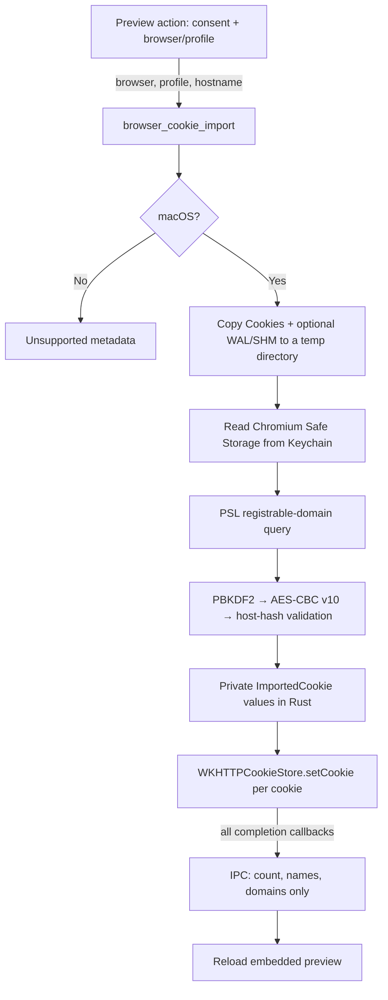

# ADR-0073 — Chromium cookie import for the embedded browser

**Status**: Accepted (2026-07-16)
**Authors**: Max Qian + Codex

## Context

The embedded browser is isolated from every external browser profile. On macOS
it is a WKWebView; Windows uses WebView2 and Linux uses WebKitGTK. Opening an
authenticated site in Chrome therefore does not authenticate the same site in
the preview used by browser agents, action recording, or human inspection.

Driving the user's real Chrome through CDP does not solve this reliably: Chrome
136 requires a non-default user-data directory for remote debugging. Directly
decrypting current Windows Chromium cookies would require bypassing App-Bound
Encryption. That technique is outside Cognia's security boundary. Linux
credential-store variants are deliberately deferred so the first release has
one auditable decryption path.

## Decision

Add an opt-in macOS import flow for Chrome, Edge, Brave, and Chromium. The user
opens a public HTTP(S) page in the embedded preview, enables the feature under
Settings → Desktop, accepts Cognia's local-access explanation, chooses a browser
profile, and starts the import. macOS may then show its own Keychain prompt.

The feature toggle and remembered consent are UX gates in Cognia's trusted main
renderer. The native security gate is the browser's Keychain item and the OS
authorization prompt. The command does not create or modify Keychain entries.

### Platform matrix

| Platform | Behavior | Rationale |
| --- | --- | --- |
| macOS | Read the selected Chromium profile, decrypt matching cookies, and inject them into the live WKWebView | Chromium uses the authorized Safe Storage Keychain scheme supported here |
| Windows | Return `unsupported` with reason `macos_only`; disable the action with guidance | Do not bypass App-Bound Encryption |
| Linux | Return `unsupported` with reason `macos_only`; disable the action with guidance | libsecret/KWallet variants remain future work |

The dormancy path is pinned at three levels: a tagged Rust result, a disabled
localized UI, and a platform-branch unit test.

### One native command keeps values out of IPC

`ImportedCookie.value` is private to `src-tauri/src/browser/cookie_import/` and
its custom `Debug` implementation always emits `[REDACTED]`. Values are not
logged, persisted in Dexie, returned to the Cognia renderer, or uploaded to
Cognia. The target website receives its own cookies normally after injection;
non-HttpOnly cookies remain readable by that target page, and authenticated page
content remains available to the browser agent by design.

### Chromium profile and database handling

The availability command never reads Keychain. It lists profile directories
that contain either the current `Network/Cookies` path or the legacy `Cookies`
path. The import command accepts only one normal path component, preventing
absolute paths, traversal, and nested-path injection.

The selected database and optional `-wal` / `-shm` companions are copied to an
auto-cleaned temporary directory before opening SQLite through a
`mode=ro&immutable=1` URI. The query is
narrowed to the registrable domain derived by the Public Suffix List and then
checked again against the exact target host using cookie-domain applicability
rules. Importing `www.github.com` therefore admits `.github.com` domain cookies
and `www.github.com` host cookies, but rejects host-only `github.com` cookies,
sibling-domain cookies such as `.api.github.com`, and `evilgithub.com`.
When a modern schema exposes `top_frame_site_key`, partitioned rows are skipped
instead of being promoted into unpartitioned WKWebView cookies.

### macOS decryption

Each supported browser supplies a fixed Safe Storage service/account pair and
profile root. The Keychain password is used directly as the PBKDF2 passphrase:

- PBKDF2-HMAC-SHA1, salt `saltysalt`, 1003 rounds, 16-byte key;
- AES-128-CBC with a sixteen-byte `0x20` IV and PKCS#7 padding;
- a required `v10` prefix;
- for database version 24 or newer, a required 32-byte
  `SHA256(host_key)` prefix before the UTF-8 value;
- Chromium's 1601-based microsecond expiry converted to Unix seconds, with zero
  preserved as a session cookie.

Malformed rows, unsupported prefixes, bad padding, host-hash mismatches, and
invalid UTF-8 are skipped individually. A missing profile and a domain with no
valid matching rows return typed non-error results.

### WKWebView compatibility

Injection uses the existing `browser-embed` child webview and enters its native
WKWebView through `with_webview`. Cookies are constructed with name, value,
domain, path, Secure, HttpOnly, Expires, and SameSite fields. They are set one at
a time with `setCookie:completionHandler:` and an aggregate completion counter.
The newer bulk setter is intentionally not used because it is only available on
macOS 26. The Rust command reports success only after all singular completion
handlers have fired, with a bounded timeout.
Cookies rejected by Foundation are skipped individually, and the returned
summary describes only cookies actually handed to WebKit.

## Implementation

- `src-tauri/src/browser/cookie_import/` — platform dispatch, profile discovery,
  SQLite snapshot/read, crypto, Keychain adapter, and WKWebView sink.
- `lib/browser/cookie-import.ts` — typed metadata-only transport and the
  feature-off short circuit.
- `components/browser/browser-cookie-import-action.tsx` — public-URL gate,
  availability probe, first-use consent, browser/profile picker, result UX, and
  preview reload.
- `components/settings/desktop-section.tsx` — default-off opt-in and platform
  explanation.

## Verification and limits

Pure Rust tests cover the known-answer key, both database-version decryption
branches, invalid ciphertext and host hashes, timestamp conversion, PSL domain
boundaries, SQLite parsing, WAL/SHM copying, profile traversal, redacted debug,
fake Keychain/sink orchestration, and non-macOS dormancy. Jest covers the
settings default, transport short circuits and payloads, consent, browser/profile
selection, rejected probes, unsupported platforms, native denial/failure,
success reload, and preview wiring.

Real Keychain authorization and WKWebView persistence still require a macOS
desktop smoke test. A future Chromium switch to App-Bound Encryption on macOS
would invalidate this path and requires revisiting this ADR, not weakening the
decryption boundary.

## Consequences

- Browser agents and recordings can reuse an existing macOS Chromium login
  without exporting the cookie jar through JavaScript.
- Users see two explicit boundaries: Cognia's explanation and macOS Keychain
  authorization.
- Windows, Linux, Firefox, and control of the user's real browser remain outside
  this decision.

## Addendum (2026-08-09) — real-browser control is now a separate seam

The final consequence above is superseded only for Chrome and Edge control.
The `playwright-existing-browser` MCP preset can connect to tabs explicitly
selected through Microsoft's official Playwright extension and therefore reuse
their live login state. It does not export or migrate cookies into Cognia, and
it remains separately installed, authorized, trusted, and disconnected from the
embedded WebView.

Cookie import remains the supported bridge for the embedded WKWebView. It is
still opt-in, macOS-specific, metadata-redacted, and protected by Keychain
authorization. This ADR does not cover Firefox, Safari, arbitrary Chromium
forks, or automatic session migration.
