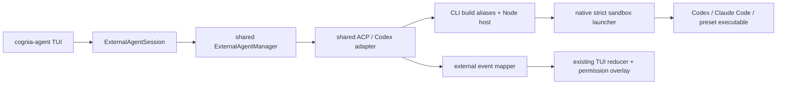

# ADR-0077 — TUI external-agent hosting

**Status**: Accepted (2026-07-16)

## Context

The desktop app already had a mature external-agent protocol plane: presets, ACP and Codex
adapters, `ExternalAgentManager`, permission callbacks, event types, credential overlays, and
session lifecycle. The standalone `cognia-agent` TUI could only run its built-in sidecar. Proxying
through a running desktop would have contradicted the CLI's desktop-independent contract, while
copying the adapters into `cli/` would have created a second protocol implementation.

The reusable plane was not completely host-neutral. A small set of modules reached Tauri process,
event, hook, filesystem, and terminal commands. External events also contained plan, diff, and
error variants that the built-in `CaptureStreamEvent` union could not represent losslessly.

## Decision

Use a hybrid host:

1. Reuse the shared preset registry, adapters, manager, ACP client, credential builder, and public
   event contracts unchanged.
2. Redirect only the host-specific imports at CLI bundle time to Node shims. The Node backend owns
   allowlisted spawn, stdio line framing, lifecycle events, process groups, and command discovery.
3. Add a CLI session adapter and event mapper. They translate external sessions into the existing
   `AgentSession`, TUI reducer actions, permission overlay, usage state, and JSONL transcript.
4. Launch every external process through the native `cognia-external-agent-launcher`. macOS uses
   Seatbelt and Linux uses bubblewrap. Missing launcher support is a hard error; there is no
   unsandboxed fallback.
5. Select the host with `cognia-agent chat --backend <preset>` or the persisted `agentBackend`
   configuration. `builtin` remains the default.

## Recorded decisions

- **D1 — strict sandbox**: required. macOS and Linux are supported; unsupported platforms fail
  closed. The workspace is writable, home is readable, network is enabled, and only the selected
  agent's state paths are additionally writable.
- **D2 — host seam**: CLI build aliases for v1. The shared desktop adapters remain frozen while the
  feature stabilizes; completing every raw host call through a shared seam can be a later cleanup.
- **D3 — ACP terminal capability**: disabled in the CLI host. Filesystem callbacks are available;
  desktop-only terminal RPC is not advertised.
- **D4 — TUI localization**: existing TUI conventions continue. New Ink and doctor strings remain
  English and do not introduce `next-intl` into the terminal bundle.

## Authentication

The CLI config loader already resolves `~/.cognia/credentials.json` and ordinary environment
variables. The session adapter maps Codex credentials to `CODEX_ACCESS_TOKEN` or
`OPENAI_API_KEY`/`CODEX_API_KEY`, and Anthropic credentials to `CLAUDE_CODE_OAUTH_TOKEN` or
`ANTHROPIC_API_KEY`. The existing shared env builder remains in the spawn path. If Cognia has no
credential to inject, the external CLI's native login state (`~/.codex/auth.json` or Claude Code's
login) remains the fallback.

## Consequences

- The TUI can host Codex and Claude Code without a running desktop and without a forked ACP stack.
- External text, thinking, tools, plans, diffs, usage, errors, and permission requests use the same
  cells and approval surface as built-in turns.
- The native launcher becomes a packaging requirement. Development builds can point
  `COGNIA_EXTERNAL_AGENT_LAUNCHER` at an explicit executable.
- Windows intentionally cannot host external agents until an equivalent strict, stdio-preserving
  sandbox exists.
- The allowlist means an arbitrary command string is not a supported backend. New executable
  presets must be added deliberately.

## Alternatives considered

- **Proxy to a running desktop**: rejected because headless use would depend on a GUI process.
- **Port the protocol stack into `cli/`**: rejected because adapters and behavior would drift.
- **Run local processes unsandboxed**: rejected because the CLI is commonly used in unattended and
  repository-wide contexts.
- **Port container and Kubernetes backends**: rejected; this decision only covers local executable
  hosting.
