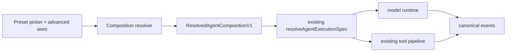

# ADR-0117: Composed agent modes, Creator, and code tool presentation

**Status:** Accepted, staged rollout
**Date:** 2026-08-14

## Context

`types/agent/agent-mode.ts` declares one flat `AgentModeType` union that mixes
four unrelated concerns: persona (`research`, `writing`, `academic`), permission
posture (`plan`, `build`), orchestration (`workflow`), and provenance
(`plugin`, `custom`). Every new capability has to become another union member,
and every consumer branches on the whole union. `plan` and `build` are not
personas at all — they only set `permissionMode`.

The selection is also mis-scoped. `stores/agent/agent-runtime-store.ts` keeps a
single global `modeId` in localStorage, so the mode is not owned by a session
and nothing prevents it changing between two model calls of the same turn.

Two authorities already exist and must not be forked. Runtime routing belongs to
`AgentExecutionPolicy` / `ResolvedAgentExecutionSpec` (ADR-0090), which already
emits a stable `executionFingerprint`. Permission narrowing belongs to
`AgentPermissionCeiling`. A mode system that re-declares either would create a
second router and a second permission model.

## Decision

A mode is a composition of five independent axes, not a single enum value.

| Axis              | Values                                                     | Owner                        |
| ----------------- | ---------------------------------------------------------- | ---------------------------- |
| Preset            | Standard, Minimal, Code, Creator, domain presets, custom   | new `AgentPresetDefinitionV1` |
| Authority         | `plan`, `default`, `acceptEdits`, `bypassPermissions`      | existing `AgentPermissionCeiling` |
| Tool presentation | `native`, `code`, `both`                                   | new `ToolPresentationMode`   |
| Orchestration     | `direct`, `subagent`, `workflow`, `verified-fresh-agent`   | new `AgentOrchestrationPolicy` |
| Runtime binding   | Claude Agent SDK, AI SDK, External/ACP                     | existing `AgentExecutionPolicy` |

Three versioned contracts land in `packages/agent-config-types` so the CLI,
sidecar, and plugin SDK consume the same definitions: `AgentPresetDefinitionV1`
(persona, prompt delta, default tool set, recommended axis values),
`AgentCompositionSelectionV1` (what the user chose), and
`ResolvedAgentCompositionV1` (what a turn actually ran, carrying
`promptDigest`, `toolDigest`, `compositionDigest`, and the existing
`executionFingerprint`).

Selection is per-session. New sessions inherit an app-level default; the global
localStorage value stops being the authority for an active session. A
composition may only change while idle or at a turn boundary, and is frozen for
the duration of a model call. Child agents may narrow the resolved ceiling and
may never widen it; reviewer children default to read-only with independent
context.

Creator is a real built-in preset plus a `/creator` workbench, visible only
under developer mode. The two global developer-mode signals collapse to one
source, `pluginSettings.developerModeEnabled`
(`stores/plugin-runtime/plugin-store.ts`), which is already persisted and
already has an `updatePluginSettings` action; the direct localStorage read of
`cognia.plugins.developerMode` in
`components/plugins/plugin-devtools-panel.tsx` becomes a reader of it, and the
legacy key is migrated once at boot. The per-plugin `config.debug` /
`config.devMode` instrumentation flag in `lib/plugin/core/manager.ts` is a
different concept — debug instrumentation for one plugin, not a global gate —
and stays separate. The route stays in the static export and renders an access
gate when developer mode is off. Creator writes only inside a user-chosen authoring root, and
records progress in the existing workflow run event log rather than a new store.

Code is `toolPresentation: "code"`: the model sees one `run_code` tool plus a
typed SDK, and every SDK call re-enters the normal tool registry, argument
validation, permission, sandbox, and event path. Eligibility is a first-party
allowlist flag, `programmaticReadOnly`. It is deliberately **not** derived from
the MCP `readOnlyHint` annotation, which is advisory metadata supplied by
third-party servers and is not a security boundary. First release is read-only;
when a strict sandbox is unavailable Code fails closed with no degraded path.

## Amendment (2026-08-21) — Engagement and Autonomy

Two axes join the five. Both come from the connector side, where a "mode" had
been decided by a different mechanism entirely, and adding them here is what
stops there being two mode systems.

The IM stack decided a turn's behaviour from two orthogonal fields that were
never named as axes: `ConnectorMode` (`auto` / `manual` / `draft`) and
`ImExecutionTarget` (`direct` / `team` / `workflow`). Their product is what
people had been calling "assistant mode" and "delegation mode" — neither of
which exists anywhere in the code. Nine cells, two of them silently broken.

### Engagement — `inline` / `background` / `human`

The decisive case is `direct` × `background`: one agent, no team, hand it a task,
it runs in the background with progress, steering, and a stop button. It uses the
**same executor** as `direct` × `inline`, so orchestration cannot express it; and
`human` has no agent loop at all.

Engagement does not choose an executor — that is orchestration's job. It names an
attachment switch that already existed implicitly and was already mutually
exclusive:

| Value | What it attaches to |
| --- | --- |
| `inline` | `opts.runAndCapture` — the turn answers in place |
| `background` | `ExecutionRun` + binding + presentation runner + run control |
| `human` | `setAssignee` + the SLA ladder |

### Autonomy — `observe` / `suggest` / `confirm` / `act` / `autopilot`

Autonomy is **not a second permission model**. It is a cap on Authority and a
floor under ceremony, reusing two existing mechanisms once each:

| Autonomy | Authority cap (via `narrowAuthority`) | Ceremony floor (ORed into `requiredCeremony`) |
| --- | --- | --- |
| `observe` | does not run | — |
| `suggest` | `plan` | `{gate, requirePlanApproval, requireAcceptance}` |
| `confirm` | `default` | `{gate}` |
| `act` | `acceptEdits` | none — risk alone decides |
| `autopilot` | uncapped (still bounded by the parent ceiling) | none |

`resolve-composition.ts` already narrows in order — `preset.maxAuthority`, then
`input.ceiling` — so the autonomy cap is a **third input to the same loop**, not
new permission code. Composition with risk is field-wise OR, which is the whole
safety property: a permissive autonomy level can never cancel a gate that risk
raised. `autopilot` clears only the *operator's* floor; the escape hatch from a
risk-raised gate remains the separate, visible `riskGating` switch.

The host default is `autopilot`, and that is deliberate: it is the only value
that contributes nothing, so adding the axis changes no existing behaviour.
Anything lower would silently narrow a user who had chosen `bypassPermissions`.

### What this fixes

The `draft` × delegation bug is a consequence of the old shape and disappears in
the new one. `draft` was a **route** — one branch of `routeInbound` — so a
conversation bound to a team resolved no target at all and silently degraded to a
single-agent draft. As an axis it is `autonomy: "suggest"`, which produces
`requireAcceptance`, and only the **delivery** stage changes: the turn runs the
real path, with the same routing, the same team, the same workflow, and the same
PII gate.

#### The three shapes of acceptance

`requireAcceptance` is a property of the PRODUCT, and each execution target
honours it through the mechanism it actually has. There is no fourth approval
system — every one of these is an existing gate given a new caller:

| Target | What is held | Mechanism | Audit |
| --- | --- | --- | --- |
| direct | the product | a `connectorDrafts` row a person approves, edits, or discards | `draft.prepared` |
| team | the plan | `requirePlanApprovalFloor` → the ADR-0070 plan gate, asked on an IM card (ADR-0137) | `team.dispatched` with `acceptance: "plan-approval"` |
| workflow | the dispatch | a `wf_approve` / `wf_cancel` card; the press starts the run through the dispatcher that already answers those bindings | `workflow.dispatch_held` with `acceptance: "run-approval"` |

A team's product lands minutes later through the presentation runner, where
there is nothing left to hold, so holding the finished output would review work
already done. A workflow has neither a plan gate nor a product that returns
here — its nodes deliver it — so by the time anything is holdable the work has
shipped. The only moment at which "a human signs off before it acts" is still
true for a workflow is BEFORE the run starts, which is what is held.

Two properties of the workflow hold are load-bearing. It **fails closed**: if the
card cannot be delivered the dispatch does not happen, because running the
workflow anyway is the original gap only louder. And the permission ceiling is
**frozen onto the binding** rather than re-derived at approval time: the card can
sit unanswered for hours, and re-deriving would let a policy change between the
ask and the press silently widen the run that was actually approved.

Engagement follows the **target**, not the mode — which is the axis-level
statement of the same defect:

| Legacy | Engagement | Autonomy | Authority cap | Orchestration |
| --- | --- | --- | --- | --- |
| `auto` + direct | `inline` | `act` | `acceptEdits` | `direct` |
| `auto` + team/workflow | `background` | `act` | `acceptEdits` | `team` / `workflow` + ref |
| `draft` (any target) | `inline` | `suggest` | `plan` | whatever routing resolved |
| `manual` | `human` | `observe` | — | — |
| `approvalMode: "yolo"` | — | — | `bypassPermissions` | — |
| `assignee.kind === "human"` | `human` | `observe` | — | — |

Orchestration gains `"team"` plus an `orchestrationRef`, so `ImExecutionTarget`
folds in. The routing fields stay the **storage authority** for orchestration — a
composition never carries a `teamId`. That is the hard line against a second
router: `/team`, `/workflow`, and `/character` writes are unchanged.

### The one seam

`BuildOptionsContext` gains a single field, `compositionSelection`. The connector
runtime fills it after `effectiveConfig` resolves; `resolveTurnCompositionSafely`
forwards it. Before this, `build-options.ts` called the resolver without a
selection, which fell back to reading the desktop zustand store out of
localStorage — so **every IM turn composed from whatever the desktop user last
clicked in the composer**, while the entire IM configuration stack sat unused.
One field is the whole convergence: no new resolver, no new store, no duplicated
precedence chain.

### Storage

No Dexie version. Every new field is non-indexed and optional, matching the
precedent already set by `teamId` / `workflowId` / `approvalMode` /
`reasoningOverride`. `ConversationOverrideRow` gains `autonomy` / `engagement` /
`authority` (plus assignment snapshots); `AdapterInstanceRow` gains the matching
`default*` fields. **No backfill**: deriving `{autonomy, engagement}` from `mode`
at read time is lossless and reversible; writing it into rows is not.

`ConnectorMode` stays as a compatibility mirror — `InboxSendPolicy.forcedMode` is
still a live path in scheduled outbound, and the plugin SDK mirrors the field.
Writes set both; reads prefer the axes and derive from `mode` when absent.

## Reused ownership

This decision adds no second runtime enum, router, event bus, permission
system, sandbox, or Dexie table. It extends `resolveAgentExecutionSpec()` and
its fingerprint, `AgentPermissionCeiling`, the existing tool registry and
permission pipeline, the workflow run event log in
`lib/workflow/runtime/event-log.ts`, and the existing plugin disposable scope,
CLI, and devtools for Creator preview and teardown. Source files remain the
truth for anything Creator generates.

## Compatibility and rollback

`agentModeId` stays a supported public field on sessions, scheduler payloads,
prompt presets, and plugin contributions. `general` maps to Standard, `plan` to
Standard with `plan` authority, `build` to Standard with `acceptEdits`,
`workflow` to Standard with workflow orchestration; domain modes stay as
presets; custom and plugin modes become presets with native presentation. An
unknown legacy id falls back to Standard with `default` authority and a visible
compatibility warning — it never infers or inherits `bypassPermissions`. The
runtime store moves to persist v2 with `modeId` and `setModeId` retained as a
compatibility adapter. Rollout is gated by `agentCompositionV2`; Code carries
its own kill switch, and Creator is hidden by the developer-mode gate. All new
fields are additive and optional, so rollback needs no reverse migration.

## Consequences

Authority, orchestration, and tool presentation become independently
selectable and independently testable, and every turn carries a digest that
makes the composition reproducible (ADR-0118 consumes it). The costs are a
per-turn resolve step, two representations of "mode" during the compatibility
window, and a hard dependency on a working strict sandbox before Code can be
offered to anyone beyond developers.
