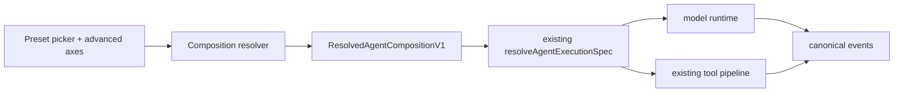

# ADR-0117: Composed agent modes, Creator, and code tool presentation

- Status: Accepted, staged rollout
- Date: 2026-08-14

## Context

`types/agent/agent-mode.ts` declares one flat `AgentModeType` union that mixes
four unrelated concerns: persona (`research`, `writing`, `academic`), permission
posture (`plan`, `build`), orchestration (`workflow`), and provenance
(`plugin`, `custom`). Every new capability has to become another union member,
and every consumer branches on the whole union. `plan` and `build` are not
personas at all — they only set `permissionMode`.

The selection is also mis-scoped. `stores/agent/agent-runtime-store.ts` keeps a
single global `modeId` in localStorage, so the mode is not owned by a session
and nothing prevents it changing between two model calls of the same turn.

Two authorities already exist and must not be forked. Runtime routing belongs to
`AgentExecutionPolicy` / `ResolvedAgentExecutionSpec` (ADR-0090), which already
emits a stable `executionFingerprint`. Permission narrowing belongs to
`AgentPermissionCeiling`. A mode system that re-declares either would create a
second router and a second permission model.

## Decision

A mode is a composition of five independent axes, not a single enum value.

| Axis              | Values                                                     | Owner                        |
| ----------------- | ---------------------------------------------------------- | ---------------------------- |
| Preset            | Standard, Minimal, Code, Creator, domain presets, custom   | new `AgentPresetDefinitionV1` |
| Authority         | `plan`, `default`, `acceptEdits`, `bypassPermissions`      | existing `AgentPermissionCeiling` |
| Tool presentation | `native`, `code`, `both`                                   | new `ToolPresentationMode`   |
| Orchestration     | `direct`, `subagent`, `workflow`, `verified-fresh-agent`   | new `AgentOrchestrationPolicy` |
| Runtime binding   | Claude Agent SDK, AI SDK, External/ACP                     | existing `AgentExecutionPolicy` |

Three versioned contracts land in `packages/agent-config-types` so the CLI,
sidecar, and plugin SDK consume the same definitions: `AgentPresetDefinitionV1`
(persona, prompt delta, default tool set, recommended axis values),
`AgentCompositionSelectionV1` (what the user chose), and
`ResolvedAgentCompositionV1` (what a turn actually ran, carrying
`promptDigest`, `toolDigest`, `compositionDigest`, and the existing
`executionFingerprint`).

Selection is per-session. New sessions inherit an app-level default; the global
localStorage value stops being the authority for an active session. A
composition may only change while idle or at a turn boundary, and is frozen for
the duration of a model call. Child agents may narrow the resolved ceiling and
may never widen it; reviewer children default to read-only with independent
context.

Creator is a real built-in preset plus a `/creator` workbench, visible only
under developer mode. The two global developer-mode signals collapse to one
source, `pluginSettings.developerModeEnabled`
(`stores/plugin-runtime/plugin-store.ts`), which is already persisted and
already has an `updatePluginSettings` action; the direct localStorage read of
`cognia.plugins.developerMode` in
`components/plugins/plugin-devtools-panel.tsx` becomes a reader of it, and the
legacy key is migrated once at boot. The per-plugin `config.debug` /
`config.devMode` instrumentation flag in `lib/plugin/core/manager.ts` is a
different concept — debug instrumentation for one plugin, not a global gate —
and stays separate. The route stays in the static export and renders an access
gate when developer mode is off. Creator writes only inside a user-chosen authoring root, and
records progress in the existing workflow run event log rather than a new store.

Code is `toolPresentation: "code"`: the model sees one `run_code` tool plus a
typed SDK, and every SDK call re-enters the normal tool registry, argument
validation, permission, sandbox, and event path. Eligibility is a first-party
allowlist flag, `programmaticReadOnly`. It is deliberately **not** derived from
the MCP `readOnlyHint` annotation, which is advisory metadata supplied by
third-party servers and is not a security boundary. First release is read-only;
when a strict sandbox is unavailable Code fails closed with no degraded path.

## Reused ownership

This decision adds no second runtime enum, router, event bus, permission
system, sandbox, or Dexie table. It extends `resolveAgentExecutionSpec()` and
its fingerprint, `AgentPermissionCeiling`, the existing tool registry and
permission pipeline, the workflow run event log in
`lib/workflow/runtime/event-log.ts`, and the existing plugin disposable scope,
CLI, and devtools for Creator preview and teardown. Source files remain the
truth for anything Creator generates.

## Compatibility and rollback

`agentModeId` stays a supported public field on sessions, scheduler payloads,
prompt presets, and plugin contributions. `general` maps to Standard, `plan` to
Standard with `plan` authority, `build` to Standard with `acceptEdits`,
`workflow` to Standard with workflow orchestration; domain modes stay as
presets; custom and plugin modes become presets with native presentation. An
unknown legacy id falls back to Standard with `default` authority and a visible
compatibility warning — it never infers or inherits `bypassPermissions`. The
runtime store moves to persist v2 with `modeId` and `setModeId` retained as a
compatibility adapter. Rollout is gated by `agentCompositionV2`; Code carries
its own kill switch, and Creator is hidden by the developer-mode gate. All new
fields are additive and optional, so rollback needs no reverse migration.

## Consequences

Authority, orchestration, and tool presentation become independently
selectable and independently testable, and every turn carries a digest that
makes the composition reproducible (ADR-0118 consumes it). The costs are a
per-turn resolve step, two representations of "mode" during the compatibility
window, and a hard dependency on a working strict sandbox before Code can be
offered to anyone beyond developers.
