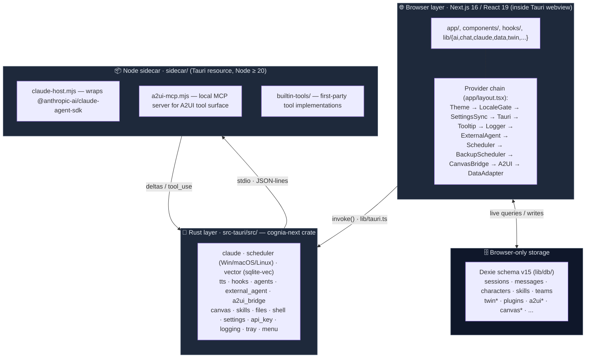

# Architecture

Cognia has four collaborating layers. Understanding which layer a piece of work belongs in is the single most important architectural decision when contributing.



## Layer 1 — Browser / React

Everything in `app/`, `components/`, `hooks/`, and most of `lib/` runs inside the webview. This includes:

- **Routes** (`app/`) — Chat workspace, twin workbench, scheduler, agent teams, A2UI, canvas, skills, logs.
- **State** — Zustand stores for ephemeral UI state; Dexie (IndexedDB) for persistent data; `lib/settings/` for user preferences.
- **AI orchestration** — `lib/ai/`, `lib/claude/build-options.ts`, `lib/twin/runtime/apply-twin-context.ts`.
- **Domain logic** — `lib/character/` (via `lib/claude/types.ts`), `lib/skills/`, `lib/data/` (backup), …

The browser layer has **no direct access** to OS resources — all native operations go through Layer 2.

### Provider chain in `app/layout.tsx`

The order of providers in `app/layout.tsx` matters:

1. `ThemeProvider` (next-themes) — class-based dark mode driver.
2. `LocaleGate` — waits for `next-intl` translations before rendering.
3. `SettingsSyncProvider` — reads/writes the `settings` Dexie table.
4. `TauriProvider` — supplies `isTauri()` context, OS info, deep-link events.
5. `TooltipProvider` — Radix; mounted once globally.
6. `LoggerProvider` — wires the browser logger into the Rust logging bridge.
7. `ExternalAgentInitializer`, `SchedulerInitializer` — boot subsystems on first paint.
8. `BackupSchedulerProvider` — schedules encrypted auto-backups (Tauri only).
9. `CanvasBridgeProvider`, `A2UIDispatchProvider` — surface routers for Claude responses.
10. `DataAdapterProvider` — injects the Dexie adapter into the data-hooks layer.

Adding a provider that depends on locale → put it inside `LocaleGate`. Depends on Tauri → inside `TauriProvider`. The chain is intentionally deep; do not collapse it.

## Layer 2 — IPC bridge (`lib/tauri.ts`)

`lib/tauri.ts` is the **single point** that calls Tauri's `invoke()`. Every Rust command has a typed wrapper here. Business code imports named functions from `@/lib/tauri`, never `invoke()` directly.

```ts
import { greet, isTauri } from "@/lib/tauri"
if (isTauri()) {
  greet("World").then(console.log)
}
```

`isTauri()` lets the same component work in both web mode and desktop mode. It returns `true` only when `window.__TAURI_INTERNALS__` is present.

The wrappers re-export from `lib/tauri/index.ts`, which groups by plugin (clipboard, dialog, fs, notification, opener, os, process, store, …). Adding a new wrapper is described in [Runtime & Tauri](./runtime-and-tauri).

## Layer 3 — Rust backend (`src-tauri/src/`)

The `cognia-next` crate is the production Rust backend. Top-level modules:

| Module                                             | Purpose                                                                                                                                                        |
| -------------------------------------------------- | -------------------------------------------------------------------------------------------------------------------------------------------------------------- |
| `claude`                                           | Spawns and supervises the Node sidecar (`SidecarState`); restarts on key change.                                                                               |
| `scheduler`                                        | Cross-platform native scheduler — `windows.rs` (Task Scheduler), `macos.rs` (launchd), `linux.rs` (systemd), with a sqlite-backed metadata store for recovery. |
| `vector`                                           | sqlite-vec backend; loads the FFI extension before any connection opens.                                                                                       |
| `tts`                                              | Provider key vault (keyring), Edge-TTS WebSocket bridge, generic HTTP proxy.                                                                                   |
| `hooks`                                            | Lifecycle hooks (chat send, response, error).                                                                                                                  |
| `agents` / `external_agent`                        | Agent team coordination, external CLI agents.                                                                                                                  |
| `a2ui_bridge`                                      | Bridge between the webview and the A2UI MCP sidecar.                                                                                                           |
| `canvas`                                           | File-backed canvas document storage.                                                                                                                           |
| `skills`                                           | Skill resource resolution + sandbox setup.                                                                                                                     |
| `files`, `shell`, `settings`, `api_key`, `logging` | Filesystem ops, shell exec, settings persistence, key store, fern → native log dispatch.                                                                       |
| `tray`, `menu`, `window_behavior`                  | Desktop chrome (system tray, menu bar, window state).                                                                                                          |

Plus Tauri plugins registered in `lib.rs`: `single-instance`, `deep-link`, `autostart`, `global-shortcut`, `cli`, `store`, `updater`, `dialog`, `fs`, `notification`, `clipboard-manager`, `opener`, `os`, `process`, `log`, `window-state`.

Native-only modules are gated by `cfg(desktop)` and `cfg(not(any(target_os = "android", target_os = "ios")))` — Cognia targets desktop only.

## Layer 4 — Node sidecar (`sidecar/`)

The sidecar is a small Node process spawned by Tauri at app start. It hosts:

- `claude-host.mjs` — the official `@anthropic-ai/claude-agent-sdk`, exposed via a JSON-lines protocol on stdio.
- `a2ui-mcp.mjs` — a local MCP server for the A2UI tool surface (`builtin-tools/`).

Why a separate process?

- The Claude Agent SDK has Node-only dependencies that can't run in the webview.
- Process isolation lets the host kill / restart the sidecar without bringing the app down (e.g., on API key change).
- The sidecar can fork its own subprocesses for shell-tool execution.

The Rust side (`src-tauri/src/claude/sidecar.rs`) owns the child process handle in `SidecarState` and exposes commands like `claude_send`, `claude_set_api_key`, `claude_restart_sidecar`.

## Cross-cutting concerns

### Storage strategy

| Data                                                  | Where                                                                     | Why                                                                                                                   |
| ----------------------------------------------------- | ------------------------------------------------------------------------- | --------------------------------------------------------------------------------------------------------------------- |
| Chat sessions, characters, skills, teams, twin tables | Dexie (IndexedDB)                                                         | Webview-local, low-latency, indexed. Schema versions are append-only; never mutate an old `version().stores()` block. |
| Vector embeddings                                     | `<app_data>/cognia/vectors.sqlite` (desktop) or remote (web)              | Native fixed-vector index needs sqlite-vec; web falls back to cloud backends.                                         |
| Backup snapshots                                      | User-chosen folder via Tauri dialog                                       | Encrypted by default with AES-GCM.                                                                                    |
| Scheduler metadata                                    | sqlite (Rust side, `metadata_store.rs`)                                   | Survives app restarts; cross-references native task IDs.                                                              |
| Settings                                              | Dexie `settings` table (single row keyed `"singleton"`) + `lib/settings/` | Synced from Rust at boot via `SettingsSyncProvider`.                                                                  |
| API keys                                              | OS keyring via `keyring` crate                                            | Never written to disk in plaintext.                                                                                   |

### Logging

Browser logger (`lib/logger/`) is mirrored into Rust via the `tauri-log-bridge`. Rust uses `fern` to dispatch into:

- The Tauri log plugin (file + console).
- The native platform logger (Windows Event Log, macOS `os_log`, Linux `systemd-journald` / `syslog`).

This means a single `logger.error(...)` call from React reaches the OS-native log viewer without any extra wiring.

### Observability

`lib/observability/` is a thin shim over `@opentelemetry/api`. AI providers, twin pipelines, and the scheduler emit spans that surface in dev console.

## Next

<Cards>
  <Card
    title="Runtime & Tauri"
    href="./runtime-and-tauri"
    description="How the IPC bridge actually works in practice."
  />
  <Card
    title="Sidecar & Claude Agent SDK"
    href="./sidecar-and-claude-sdk"
    description="The JSON-lines protocol over stdio."
  />
  <Card title="Storage" href="./storage" description="Dexie schema v15 in detail." />
  <Card
    title="Plugin system"
    href="./plugin-system"
    description="The sandbox + permissions model."
  />
</Cards>
