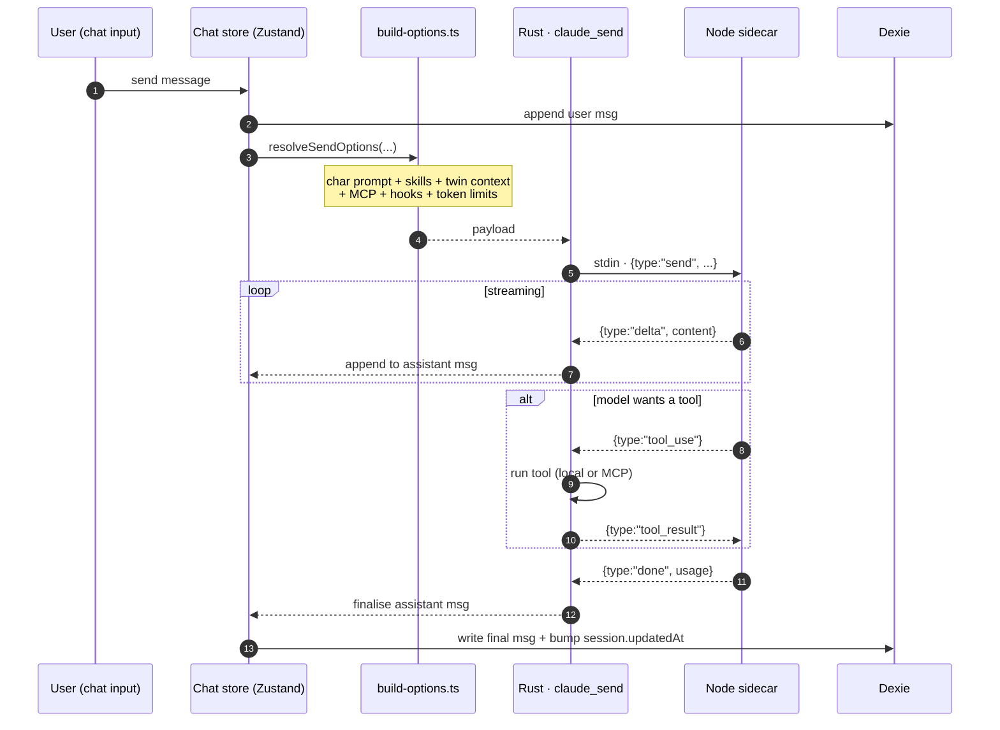

# Chat, Characters, Skills & Teams

The chat workspace is Cognia's largest user-facing surface. It is built around five composable concepts.

## Concepts at a glance

| Concept        | Owns                                                                          | Persisted in                      |
| -------------- | ----------------------------------------------------------------------------- | --------------------------------- |
| **Session**    | A conversation thread (title, model, last update)                             | `sessions` table                  |
| **Message**    | A single user / assistant / tool turn                                         | `messages` table                  |
| **Character**  | A reusable persona (system prompt, model preset, tone, optional twin binding) | `characters` table                |
| **Skill**      | A reusable capability (prompts, MCP servers, tool allow-list, resources)      | `skills`, `skillResources` tables |
| **Team**       | A multi-character routing configuration (delegates between characters)        | `teams` table                     |
| **MCP server** | A tool / resource provider plugged into Claude                                | `mcpServers` table                |

All persisted in Dexie (IndexedDB); types live in `lib/claude/types.ts`.

## Session and message flow



The chat store lives in `lib/chat/`; UI in `components/chat/`. The store is intentionally thin — most logic happens in `lib/claude/` so it can be reused outside the chat surface (e.g., the agent-teams workspace).

## Characters

A `Character` is defined in `lib/claude/types.ts`:

<TypeTable
  type={{
    id: { description: "Stable unique identifier.", type: "string", required: true },
    name: { description: "Display name.", type: "string", required: true },
    description: { description: "Short user-facing summary.", type: "string" },
    systemPrompt: {
      description: "System prompt prepended to every send for this character.",
      type: "string",
      required: true,
    },
    modelId: {
      description: "Default Claude model ID (overrides app default).",
      type: "string",
    },
    maxTokens: {
      description: "Per-turn output cap; resolved against `lib/ai/model-limits.ts`.",
      type: "number",
    },
    temperature: {
      description: "Sampling temperature (0–1).",
      type: "number",
    },
    defaultSkillIds: {
      description: "Skills auto-enabled when this character is selected.",
      type: "string[]",
      required: true,
    },
    twinId: {
      description: "Optional twin binding — opts into the twin runtime path.",
      type: "string",
    },
    twinSettings: {
      description: "Per-character twin tuning. See Employee Digital Twin.",
      type: "TwinSettings",
    },
    isBuiltIn: {
      description: "Marks built-in characters; protected from backup wipe.",
      type: "boolean",
      default: "false",
    },
    avatar: {
      description: "Avatar source — gradient seed, image URL, or Rive scene id.",
      type: "string",
    },
  }}
/>

Built-in characters ship as seed data (`lib/db/seed.ts`, `lib/db/preset-built-ins.ts`). User characters are user-created. Both live in the same `characters` table.

The character editor is `components/settings/...` plus dedicated workbench tabs. Avatars use the shared `lib/avatar.ts` helpers (gradient, initials, image, or 3D Rive scene from `@rive-app/react-webgl2`).

### Twin binding

Setting `Character.twinId = "<some-twin-id>"` opts the character into the twin runtime. At send time:

- The user's most recent message is embedded.
- RAG runs against the bound twin's chunks (`twinChunks` table).
- Top-K style examples are pulled from the twin's profile (`twinProfile`).
- The system prompt is augmented with retrieved chunks + style few-shot.

Tunable via `Character.twinSettings` — `enableRag`, `ragTopK`, `enableStyleFewShot`, `styleSamplesK`. Multiple characters can share a twin; multiple twins can co-exist. See [Employee Digital Twin](./employee-twin).

## Skills

A `Skill` is a packaged capability that can be enabled per-character or per-session.

<TypeTable
  type={{
    id: { description: "Stable unique identifier.", type: "string", required: true },
    name: { description: "Display name.", type: "string", required: true },
    description: { description: "User-facing summary.", type: "string", required: true },
    promptFragment: {
      description: "Prompt snippet appended to the system prompt when active.",
      type: "string",
    },
    mcpServerIds: {
      description: "MCP servers to include when this skill is active.",
      type: "string[]",
    },
    toolAllowList: {
      description:
        "Restrict tool calls to this allowlist (intersection if multiple skills set it).",
      type: "string[]",
    },
    resources: {
      description: "Referenceable assets (files, URLs); materialised at send time.",
      type: "SkillResource[]",
    },
    category: {
      description: "Group label used by the workbench sidebar.",
      type: "string",
      required: true,
    },
    isBuiltIn: {
      description: "Marks built-in skills; protected from backup wipe.",
      type: "boolean",
      default: "false",
    },
  }}
/>

The skill executor (`lib/skills/executor.ts`) takes a list of skill IDs and produces:

- A merged prompt fragment.
- A merged MCP server list (deduplicated).
- A merged tool allow-list (intersection if multiple skills declare lists).
- Materialised resource paths.

Skills are managed via:

- **The skill workbench** (`app/skills/`, `components/skills/`) — author, edit, validate.
- **Marketplace** (`lib/skills/marketplace-*.ts`) — install community skills with signature checks.
- **Validation** (`lib/skills/validate.ts`) — every skill is validated on save / import.
- **Sync** (`lib/skills/sync.ts`) — keep skills in sync with the Claude Code skill format.

Built-in skills seed at first run (`lib/db/seed.ts`). User skills can be exported to disk via `lib/skills/sync.ts`, edited externally, and re-imported.

## Teams

A `Team` orchestrates multiple characters in one session:

```ts
interface Team {
  id: string
  name: string
  members: TeamMember[] // characterId + role + delegation rules
  routingStrategy: "round-robin" | "first-best" | "router-character"
  // ...
}
```

`lib/claude/team-router.ts` decides which character handles the next turn based on the strategy. The agent-teams workspace (`app/agent-teams/`, `components/agent/`) is the UI for designing and running teams.

## MCP servers

`McpServer` rows describe how to connect to a tool/resource provider:

<TypeTable
  type={{
    id: { description: "Stable unique identifier.", type: "string", required: true },
    name: { description: "Display name.", type: "string", required: true },
    command: {
      description: "Executable for **stdio** servers (mutually exclusive with `url`).",
      type: "string",
    },
    args: {
      description: "Arguments passed to `command`.",
      type: "string[]",
    },
    url: {
      description: "URL for **SSE / HTTP** servers (mutually exclusive with `command`).",
      type: "string",
    },
    env: {
      description: "Environment variables passed to stdio servers.",
      type: "Record<string, string>",
    },
    enabled: {
      description: "If false, the server is omitted from the active MCP list at send time.",
      type: "boolean",
      required: true,
    },
  }}
/>

Built-in MCP servers (`lib/claude/builtin-mcp/`) are merged with user servers (`mcpServers` table) at every send. Presets in `lib/claude/mcp-presets.ts` cover common integrations (filesystem, GitHub, Slack, …).

The A2UI MCP sidecar (`sidecar/a2ui-mcp.mjs`) is always-on and exposes interactive UI surfaces. See [Sidecar & Claude Agent SDK](./sidecar-and-claude-sdk).

## System prompt presets

`SystemPromptPreset` (`promptPresets` table) is a saved system-prompt snippet that can be plugged into a character without permanently modifying it. Useful for:

- A/B testing prompt variants.
- Sharing across multiple characters.
- Quick "system instructions" toggles.

Edited in the settings → prompts tab.

## Per-session export

Each chat header has a `SingleExportTrigger` (`components/chat/dialogs/single-export-trigger.tsx`). The dialog supports:

- Markdown
- JSON
- Plain text
- Beautiful HTML (themed)
- Animated HTML (with replay controls)

The HTML formats use `lib/themes/` to render in the user's chosen theme; users can also load a custom theme JSON. Implementation: `lib/export/`.

## Surfaces inside messages

A single assistant message can contain multiple "surfaces":

- **Markdown / streaming text** — rendered with `streamdown` (`@streamdown/code`, `@streamdown/math`, `@streamdown/mermaid`, `@streamdown/cjk`).
- **Tool calls + results** — collapsible cards from `components/ai-elements/`.
- **A2UI** — interactive nodes (forms, lists, cards). Routed via `A2UIDispatchProvider`.
- **Canvas documents** — long-form artifacts persisted in the `canvasDocuments` family of tables. Routed via `CanvasBridgeProvider`.
- **Generic artifacts** — code/text/HTML blocks the user can fork into `components/artifacts/`.
- **Charts** — Chart.js + Recharts via `chart.js` / `recharts`; rendered when the model emits a `chart` block.

Each surface has a renderer in `components/chat/` that consumes events from its respective bridge.

## Where to start contributing

| Goal                         | Files                                                          |
| ---------------------------- | -------------------------------------------------------------- |
| Add a new chat-input action  | `components/chat/`, `lib/chat/`, `lib/claude/build-options.ts` |
| Add a new built-in character | `lib/db/preset-built-ins.ts`                                   |
| Add a new built-in skill     | `lib/db/preset-built-ins.ts`, `lib/skills/`                    |
| Add a new MCP preset         | `lib/claude/mcp-presets.ts`                                    |
| Add a new export format      | `lib/export/`, `components/chat/dialogs/`                      |
| Tweak twin behaviour         | See [Employee Digital Twin](./employee-twin)                   |

## Related

<Cards>
  <Card
    title="Sidecar & Claude SDK"
    href="./sidecar-and-claude-sdk"
    description="The Node host that handles claude_send."
  />
  <Card
    title="Employee Digital Twin"
    href="./employee-twin"
    description="The deepest character / send-time customisation surface."
  />
  <Card
    title="Plugin system"
    href="./plugin-system"
    description="How plugins extend skills / characters / MCP."
  />
  <Card
    title="Storage"
    href="./storage"
    description="The Dexie tables that back chat / characters / skills / teams."
  />
</Cards>

## Next

- [Employee Digital Twin](./employee-twin) — the deepest customisation surface.
- [Plugin system](./plugin-system) — how plugins extend skills/characters/MCP.
