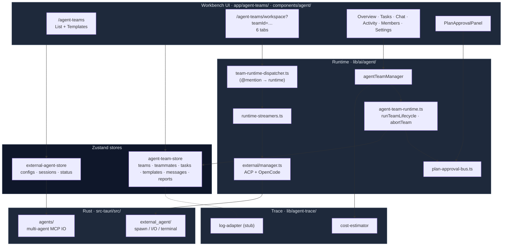
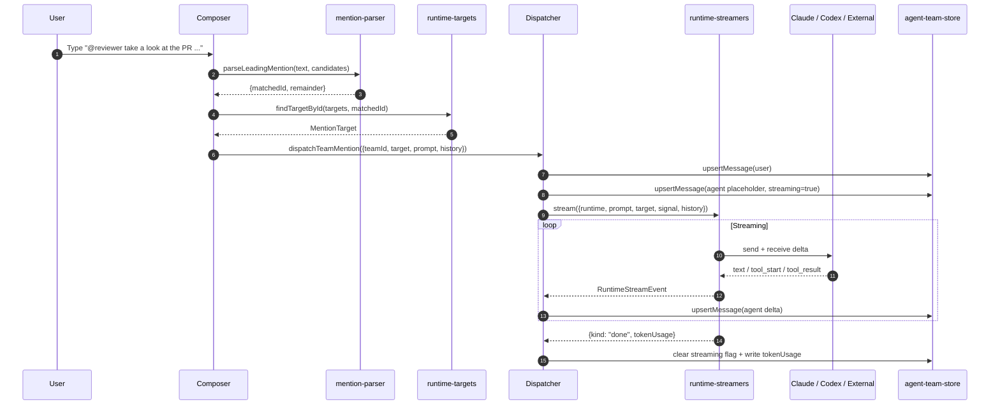

# Agent Teams

Agent Teams allow multiple AI roles to be grouped into a "squad", coordinated by a lead and executed in parallel by teammates. This page is a deep dive into the agent-teams subsystem; for how teams are referenced from the chat side, see [Chat, Characters, Skills & Teams](./chat-and-skills).

<TLDR>
Team = lead + teammates + tasks + execution report. The lead may go through a "plan approval" step; teammates are dispatched in parallel with a concurrency cap. Runtime is driven by `runTeamLifecycle` and cancelled via `abortTeam`. Each teammate's runtime can be Claude, Codex, or an external CLI (ACP / OpenCode); external agents are spawned by the Rust process manager. `@<name>` mentions in workspace chat route through `dispatchTeamMention`.
</TLDR>

## Use Cases

- A task needs to be split into multi-role collaboration (e.g. "code review + testing + documentation" roles running in parallel).
- You want to use multiple tools — Claude API, OpenAI Codex CLI, external Claude Code CLI, Cursor, Cline — in a single workbench.
- You need a human to approve the lead's plan before dispatching begins.
- You need to archive team execution results (checkpoints + tokenUsage + failure reasons) for replay.

## Architecture Diagram



## Key Modules and File Paths

### TypeScript Business Layer

| File / Module                                 | Purpose                                                                                                                                                                                                                                                                    |
| --------------------------------------------- | -------------------------------------------------------------------------------------------------------------------------------------------------------------------------------------------------------------------------------------------------------------------------- |
| `lib/ai/agent/agent-team.ts`                  | `agentTeamManager` — CRUD + lifecycle entry point on the Zustand store. `start` / `pause` / `shutdown` are thin wrappers around `runTeamLifecycle` / `abortTeam`. `configureAgentTeamRuntime(deps)` injects the real `runTeammateTask` / `runLeadPlanning` at app startup. |
| `lib/ai/agent/agent-team-runtime.ts`          | Core lifecycle: set status to executing → optional plan approval round → dispatch tasks with `maxConcurrentTeammates` concurrency → write `TeamExecutionReport`. Every exit path explicitly calls `setTeamStatus` to prevent "stuck executing".                            |
| `lib/ai/agent/agent-team-runtime-deps.ts`     | Default dependency factory — wires Claude SDK + ExternalAgentManager into `runTeammateTask`.                                                                                                                                                                               |
| `lib/ai/agent/plan-approval-bus.ts`           | Pure pub/sub. Runtime calls `waitForDecision(teamId, signal)`, UI calls `approve(teamId, plan)` / `reject(teamId, feedback)`. Up to `maxPlanRevisions` rounds; exceeding the limit is treated as failed.                                                                   |
| `lib/ai/agent/agent-executor.ts`              | Concretizes "one teammate runs one task" into a single send to Claude SDK / external agent.                                                                                                                                                                                |
| `lib/ai/agent/background-agent-manager.ts`    | Runtime queue for background agents (long-running).                                                                                                                                                                                                                        |
| `lib/ai/agent/sample-team.ts`                 | Factory behind the "Try a sample team" button — creates 1 lead + 2 teammates + 3 tasks demo.                                                                                                                                                                               |
| `lib/ai/agent/external/manager.ts`            | `ExternalAgentManager` — unified entry for external CLI agents; selects `acp-client` or `opencode-client` by protocol.                                                                                                                                                     |
| `lib/ai/agent/external/protocol-adapter.ts`   | Protocol adapter registry (one each for ACP / OpenCode).                                                                                                                                                                                                                   |
| `lib/ai/agent/external/canonical-contract.ts` | External agent config normalization — different CLI argument formats → one `ExternalAgentConfig`.                                                                                                                                                                          |
| `lib/ai/agent/external/ecosystem-adapters.ts` | "Ready" probes for each ecosystem: Claude Code / Cursor / Codex / Cline / Roo Code / Windsurf / Gemini.                                                                                                                                                                    |
| `lib/ai/agent/external/agent-trace-bridge.ts` | Forwards external agent trace events into the chat agent-trace view.                                                                                                                                                                                                       |
| `lib/agent-team/team-runtime-dispatcher.ts`   | Routes `@<name>` in team workspace chat to the corresponding runtime. No React dependency (injected streamer + writer); streams back into a placeholder assistant message.                                                                                                 |
| `lib/agent-team/mention-parser.ts`            | Pure function parsing the first token `@<name>`; returns `target: null` on miss.                                                                                                                                                                                           |
| `lib/agent-team/runtime-targets.ts`           | Merges team members + two reserved virtual agents (`@claude`, `@codex`) into a mentionable target list; virtual agents take priority when names collide.                                                                                                                   |
| `lib/agent-team/runtime-streamers.ts`         | Wraps Anthropic SDK / external agent streams into `RuntimeStreamEvent` sequences.                                                                                                                                                                                          |
| `lib/agent-team/conversation-context.ts`      | Converts team message lists into `ConversationTurn[]`, providing multi-turn context to the runtime.                                                                                                                                                                        |
| `lib/agent-team/use-runtime-availability.ts`  | React hook that determines whether each runtime is available based on current API key / external agent status.                                                                                                                                                             |
| `lib/agent/index.ts`                          | Cross-subsystem shared constants and icons (status colors, tool states, task board columns, playback events).                                                                                                                                                              |
| `lib/agent-trace/cost-estimator.ts`           | Estimates cost (USD) by model + tokens, used by the team token usage panel.                                                                                                                                                                                                |
| `lib/agent-trace/log-adapter.ts`              | Currently a stub — will be wired when the real agent-trace subsystem lands.                                                                                                                                                                                                |

### React Workbench

```text
app/agent-teams/
├── page.tsx                # Team list + template browser + create dialog
└── workspace/page.tsx      # ?teamId=... unified detail, 6 tabs
```

`workspace` uses `?teamId=...` instead of a dynamic segment because Tauri's `next.config.ts` enforces `output: "export"`, making it impossible to enumerate runtime-created ids at build time (see [Architecture](../core/architecture)).

UI component matrix (`components/agent/`):

- **`workspace/overview.tsx`** — Team progress card + Run / Stop buttons.
- **`workspace/tasks.tsx`** — Task board (pending / in_progress / completed / failed / blocked).
- **`workspace/chat.tsx`** — Multi-agent chat panel; input parses the first `@<name>` then routes through the dispatcher.
- **`workspace/activity.tsx`** — Real-time event stream (checkpoints + token usage).
- **`workspace/members.tsx`** — Teammate management (add / edit / delete).
- **`workspace/settings.tsx`** — Team-level config (concurrency limit, plan approval toggle, max plan revision count, etc.).
- **`plan-approval-panel.tsx`** — Plan approval UI; calls `approve` / `reject` to resolve `waitForDecision`.
- **`external-agent-*.tsx`** — External agent selection, configuration, command, plan, and session panels.
- **`tool-approval-dialog.tsx`** — Single tool call human approval dialog.
- **`trace-health-badge.tsx`** — Agent-trace integration health indicator.
- **`agent-mode-selector.tsx`** + **`agent-runtime-selector.tsx`** — Chat-side agent mode and runtime selectors.
- **`custom-mode-editor/`** — Custom agent mode editor (icon / template / tool / MCP tool picker).

### Rust Backend

| Module                                     | Command / Purpose                                                                                                                                                                                      |
| ------------------------------------------ | ------------------------------------------------------------------------------------------------------------------------------------------------------------------------------------------------------ |
| `src-tauri/src/agents/mod.rs`              | Multi-agent MCP config IO entry point. Reads / writes MCP config files for Claude Code / Cursor / VS Code / Codex / Gemini / Windsurf / Cline / Roo Code.                                              |
| `src-tauri/src/agents/paths.rs`            | Resolves config paths by OS + agent, registering each format (JSON / JSONC / TOML).                                                                                                                    |
| `src-tauri/src/agents/io.rs`               | Preserves comments on read/write (`toml_edit`, etc.) and tolerates JSONC comments / trailing commas.                                                                                                   |
| `src-tauri/src/agents/commands.rs`         | Tauri commands `read_agent_config` / `write_agent_config`, consumed by frontend adapters in `lib/claude/agents/*`.                                                                                     |
| `src-tauri/src/external_agent/process.rs`  | `ExternalAgentProcessManager` — tokio subprocess manager, tracks Starting / Running / Stopping / Stopped / Failed five-state machine, stdout / stderr fed back through mpsc.                           |
| `src-tauri/src/external_agent/terminal.rs` | `AcpTerminalManager` — pseudo-terminal under ACP protocol: writes to stdin, receives exit code.                                                                                                        |
| `src-tauri/src/external_agent/commands.rs` | Tauri commands `spawn_external_agent` / `send_to_external_agent` / `kill_external_agent`, etc. Every state transition emits an `external-agent://state-change` event for the frontend to subscribe to. |

## Data Flow / Control Flow

### Team Lifecycle

```mermaid
sequenceDiagram
  autonumber
  participant User
  participant UI as Workspace UI
  participant Mgr as agentTeamManager
  participant LC as runTeamLifecycle
  participant Bus as plan-approval-bus
  participant Worker as runTeammateTask
  participant Store as agent-team-store

  User->>UI: Click Run
  UI->>Mgr: start(teamId)
  Mgr->>LC: runTeamLifecycle(teamId, deps)
  LC->>Store: setTeamStatus("executing")

  alt config.requirePlanApproval
    LC->>Worker: runLeadPlanning(team, lead)
    Worker-->>LC: planText
    LC->>Store: updateTeammate(lead, {proposedPlan})<br/>setTeammateStatus("awaiting_approval")
    LC->>Bus: waitForDecision(teamId, signal)
    User->>UI: Click Approve / Reject + feedback
    UI->>Bus: approve(teamId, plan) / reject(teamId, fb)
    Bus-->>LC: decision
    note over LC: Up to maxPlanRevisions rounds; exceeding fails
  end

  loop Concurrent dispatch (maxConcurrentTeammates)
    LC->>Worker: runTeammateTask({team, teammate, task, signal})
    Worker-->>LC: { result, tokenUsage } | { error }
    LC->>Store: setTaskStatus + setTeammateStatus + checkpoint
  end

  LC->>Store: setTeamStatus(completed | failed | cancelled)
  LC->>Store: upsertExecutionReport(report)
```

**Concurrency Model**:

- `concurrency = max(1, team.config.maxConcurrentTeammates ?? 1)`.
- Tasks are enqueued in ascending `task.order`, skipping any status other than pending.
- An `inflight: Set<Promise>` maintains a sliding window; the next task is only sent after a `Promise.race(inflight)` resolves.
- Teammate selection uses simple round-robin (`teammateRotation++ % workers.length`).

**Abort Semantics**:

- `inflightControllers` is a `Map<teamId, AbortController>`.
- `abortTeam(teamId, reason?)` calls the corresponding controller's `abort`; the runtime checks `ac.signal.aborted` before each branch and sets the team to `cancelled`.
- Starting the same team again while it is running throws "Team X is already running".

**TeamExecutionReport** is always persisted to the store (`upsertExecutionReport`), even on failure / cancellation, to enable historical replay.

### Workspace Chat `@<name>` Dispatch



**Reserved Virtual Agents**:

- `@claude` — Anthropic Claude API (available without adding a teammate).
- `@codex` — OpenAI Codex CLI.
- When a real teammate shares a name with a virtual agent, the virtual agent takes priority (appears first in the candidate list), and the UI marks that teammate with a `nameCollision` badge.

**Never throws**: the dispatcher converts all errors into "error indicator card" messages, ensuring the demo path is always deterministic.

### External Agent Process Integration

`ExternalAgentManager` on the React side selects `AcpClientAdapter` or `OpenCodeClientAdapter` by protocol; the actual process is spawned by Rust's `ExternalAgentProcessManager`.

```text
[React] useExternalAgent
    │
    ▼
ExternalAgentManager
    │ protocol switch
    ├── AcpClientAdapter ─── stdio JSON-lines ─┐
    └── OpenCodeClientAdapter ─── HTTP / WS ───┤
                                                ▼
                                    Tauri invoke()
                                                │
                                                ▼
                                   src-tauri/external_agent/
                                   ├── process.rs (spawn + mpsc)
                                   └── terminal.rs (ACP terminal)
```

Process state machine: `Starting → Running → (Stopping → ) Stopped | Failed`; every transition emits an `external-agent://state-change` event, which the frontend subscribes to in order to drive badges / lists.

## Database Tables

See [Storage](../data/storage). Current agent-team data lives **primarily in the Zustand store** (persisted to IndexedDB via zustand persist), not in the main Dexie schema. Core stores involved:

- `stores/agent/agent-team-store` — teams / teammates / tasks / templates / messages / reports.
- `stores/agent/external-agent-store` — external agent configs / sessions / status.
- `stores/agent/sub-agent-store` — generic sub-agent state.

Some cross-subsystem data falls back to Dexie:

- `teams` table (from v3 schema) — used on the chat side for "team" as a router reference (see [chat-and-skills](./chat-and-skills)).
- `mcpServers` — shared MCP server pool for team members.

## Configuration and Extension Points

### Team-level Config (`AgentTeam.config`)

- `requirePlanApproval: boolean` — Whether the lead must produce a plan and a human must approve it.
- `maxPlanRevisions: number` — Maximum plan revision rounds (default 1).
- `maxConcurrentTeammates: number` — Dispatch concurrency limit (default 1).
- `executionMode: "coordinated" | "autonomous" | "delegate"` — Types are defined, but the runtime currently follows the coordinated default path.
- `executionPattern: TeamExecutionPattern` — Recommended execution pattern; types are defined, not yet consumed by the runtime.

### Teammate-level Config (`AgentTeammate.config`)

- `runtime: TeammateRuntime` — `claude` / `codex` / `external`; determines which streamer the dispatcher sends the message to.
- `model: string` — Override model.
- `systemPromptOverride?: string` — Replace the role's default system prompt.
- `allowedTools?: string[]` — Tool whitelist (union).
- `externalAgentId?: string` — External agent config id bound when runtime === "external".

### Extension Point: Inject a Custom Runner

Call at app startup:

```ts title="app/layout.tsx"
import { configureAgentTeamRuntime } from "@/lib/ai/agent/agent-team"

configureAgentTeamRuntime({
  runTeammateTask: async ({ team, teammate, task, signal }) => {
    // Custom implementation — default is in lib/ai/agent/agent-team-runtime-deps.ts
    return { result: "...", tokenUsage: {...} }
  },
  runLeadPlanning: async ({ team, lead, feedback, signal }) => {
    return { planText: "...", tokenUsage: {...} }
  },
})
```

If not injected, `start()` throws "runtime not configured"; `pause` / `shutdown` are unaffected (they only abort the existing controller).

### Extension Point: Add a New External Agent CLI Adapter

1. Create `<your-cli>-client.ts` in `lib/ai/agent/external/` implementing `ProtocolAdapter`.
2. Register it in `protocol-adapter.ts:protocolAdapterRegistry`.
3. Add a "ready" probe in `ecosystem-adapters.ts`.
4. Normalize the CLI's own config into `ExternalAgentConfig` in `canonical-contract.ts`.

### Extension Point: Plugin-contributed Teammate / Team Templates

The plugin manifest's `agentTeams` field (if declared) is merged into `agent-team-store.templates` by the plugin manager on enable; on disable, all entries with that `pluginId` are removed in bulk. See [Plugin System](../subsystems/plugin-system).

## Related Subsystems

- [Chat, Characters, Skills & Teams](./chat-and-skills) — The chat-side `Team` is a lighter router; the workspace is a heavier collaboration stage.
- [Scheduler](../subsystems/scheduler) — Scheduler `agent`-type tasks can trigger the team lifecycle; the dispatch entry also goes through `resolveSendOptions`.
- [Visual Workflows](../subsystems/visual-workflows) — The workflow node `action.team.run` calls `runTeamLifecycle` directly; recursion depth is hard-capped at 10.
- [Slash Commands](./slash-commands) — `/agents` and similar commands can open the settings characters / teams panel.
- [Sidecar & Claude SDK](../core/sidecar-and-claude-sdk) — The Claude runtime for teammates shares the sidecar.
- [Plugin System](../subsystems/plugin-system) — Plugins can contribute templates, teammate runtimes, and external agent adapters.

## Related ADRs

- [ADR-0002 Scheduler full agent resolution](../adr/0002-scheduler-full-agent-resolution) — Scheduler entry must go through `resolveSendOptions` equivalent to interactive chat; agent tasks can therefore be triggered without entering the workspace.
- [ADR-0011 Workflows subsystem](../adr/0011-workflows-subsystem) — Contract for the workflow node `action.team.run` calling `runTeamLifecycle`.

## Known Limitations

- **`executionMode` / `executionPattern` are type-only**: The runtime currently always follows the coordinated single-lead + concurrent worker mode; autonomous / delegate / parallel_specialists modes are not consumed.
- **Consensus voting / structured message routing / deadlock recovery / automatic retry backoff / routing mode auto-recommendation** — Types are defined, engine not implemented (explicitly marked "out of scope" in runtime top comments).
- **`teammateRotation` is simple round-robin**: Does not rebalance under load skew. Extend `runOne` for weighted assignment in production scenarios.
- **Plan-approval revision cap**: Exceeding `maxPlanRevisions` directly fails; there is no "ask again" UI fallback.
- **External agent process persistence**: Process state is held in Rust memory; all external agent processes must be respawned after app restart.
- **`@<name>` parsing only recognizes the first token of a message**: Multiple inline mentions do not trigger multiple dispatches; use team-level Run for "broadcast" behavior.
- **`AgentTeamMessage` is currently persisted mainly in the Zustand store**, not in the main Dexie backup schema. Full team history requires a dedicated export (see follow-up ADR for the backup subsystem).
- **`agent-trace` integration is a stub**: `lib/agent-trace/log-adapter.ts` is currently always-null; playback / analysis views will only be available after the real trace subsystem lands.
- **External agents are unavailable in web mode**: The Tauri process manager is the sole process source; `useRuntimeAvailability` grays out external runtimes on the web.
