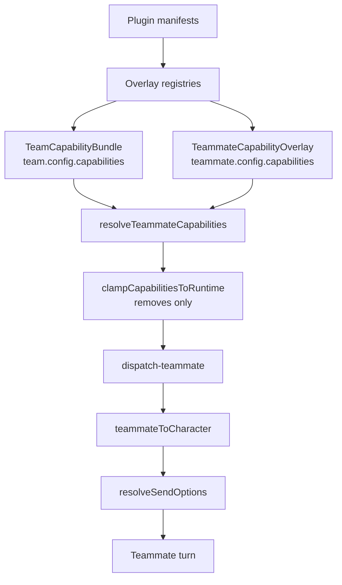

# Capabilities & Plugins

A Squad is a first-class plugin ecosystem consumer. It carries a default capability pool, each teammate overlays it, the resolver flattens the pair, the runtime clamps the result to what the execution binding can actually offer, and the teammate then rides the *same* build-options pipeline direct chat uses. Plugins extend all of it through uniform overlay registries, and reach in the other direction through `ctx.team`.

<TLDR>
- **Two layers plus a clamp.** `TeamCapabilityBundle` is the pool, `TeammateCapabilityOverlay` adjusts it per member, `resolveTeammateCapabilities` (`lib/ai/agent/team/capability-resolver.ts:91`) merges them, and `clampCapabilitiesToRuntime` (`:170`) can only remove.
- **7 capability keys**, enumerated once as `CAPABILITY_KEYS` (`capability-resolver.ts:36-44`).
- **Character bridge.** `teammateToCharacter` (`lib/ai/agent/team/teammate-character.ts:62`) is pure, never persisted, stable id `__teammate__:{id}`, consumed at `dispatch-teammate.ts:236`.
- **20 overlay capabilities** in `OVERLAY_REGISTRY_CAPABILITIES` (`lib/plugin/contracts/capability-bridge-map.ts:220`), dispatched by one loop in the plugin manager.
- **Audit gate.** `buildKnownCapabilityIds` (`capability-audit.ts:109`) plus `validateInstanceCapabilitiesWith` (`:155`) feed a pre-run gate whose behaviour depends on the run's gate policy.
- **`ctx.team`** exposes 30 methods behind five permission ids.
</TLDR>

## The two-layer capability scope

A Squad's capabilities are declared in two layers. The Squad-level `TeamCapabilityBundle` is the default pool every teammate inherits, and each teammate optionally narrows or extends it through a `TeammateCapabilityOverlay`. The merge is one pure function producing a flat `ResolvedCapabilities` record with no undefined fields, so downstream consumers iterate without null guards.

```typescript
// lib/ai/agent/team/capability-resolver.ts:36-44
const CAPABILITY_KEYS = [
  "mcpServerIds",
  "skillIds",
  "nativeAnthropicToolIds",
  "characterPackIds",
  "externalAgentPresetIds",
  "subagentIds",
  "a2uiTemplateIds",
] as const
```

| Key | Resolves to | Consumed by |
| --- | --- | --- |
| `mcpServerIds` | MCP server presets | `Character.mcpServerIds` |
| `skillIds` | Plugin and native skills | `Character.skillIds` plus `pluginSkillIds` |
| `nativeAnthropicToolIds` | Computer-use tool ids | `enableComputerUse` and `computerUseSettings` |
| `characterPackIds` | ADR-0030 persona packs | persona projection at run time |
| `externalAgentPresetIds` | External CLI presets | `lib/ai/agent/external/presets.ts` |
| `subagentIds` | Built-in or `pluginId:id` subagents | `resolveAllSubagents` |
| `a2uiTemplateIds` | A2UI rich-content templates | the A2UI to IM bridge |

### Overlay semantics

For each key the merge follows one rule. If `replace` is present it short-circuits and wins, so the Squad default is ignored. Otherwise the result is the Squad default minus `remove`, unioned with `add`. Duplicate ids are deduplicated preserving first-occurrence order, so the runtime always sees a stable, minimal id list. `applyOverlay` (`:65`) is the per-key kernel, and the whole function is pure and synchronous: no registry lookups, no persistence, no logging.

`resolveTeamCapabilities` (`:135`) resolves the Squad-level pool alone. It backs the Plugins settings view and validates a team template's `requires` block at registration time.

### The third stage: the runtime clamp

`clampCapabilitiesToRuntime(resolved, effective)` (`:170`, ADR-0090 Phase 7) narrows the resolved bundle to what the effective execution binding actually supports. It can only **remove**.

| Runtime axis | Clamps |
| --- | --- |
| `mcp` | `mcpServerIds` |
| `subagents.native` | `subagentIds` |
| `tools.ordinary` | `nativeAnthropicToolIds` and `skillIds` |

Character packs, A2UI templates and external presets pass through untouched. So a teammate dispatch resolves in three stages, Squad bundle then teammate overlay then runtime clamp, and only then reaches `lib/claude/build-options.ts`.



The resolved bundle is cached per teammate per run on the `TeamRunContext`, so the merge runs once each (`dispatch-teammate.ts:598`).

## The teammate to Character bridge

A teammate is not a persisted persona. To run one, the dispatcher synthesizes an ephemeral `Character` from the teammate config plus its resolved capabilities. The synthesis is pure and never persisted, with a stable id `__teammate__:{id}` so it can be referenced consistently within a run without colliding with a real character.

That single projection is what buys the Squad the whole direct-chat pipeline. Skills, MCP servers, computer-use, permissions, hooks, memory and the sidecar all come from `resolveSendOptions` unchanged.

## Plugin overlay registries

Plugins contribute capabilities the same way they contribute to characters and skills, through uniform overlay registries. Each entry in `OVERLAY_REGISTRY_CAPABILITIES` pairs a manifest field with register and unregister handlers. There are twenty entries in total. These are the ones a Squad reads.

| Capability key | Source | Capability id and manifest field |
| --- | --- | --- |
| `skillIds` | `lib/plugin/registries/skill-registry.ts:15` | `skills` / `skills` |
| `mcpServerIds` | `lib/plugin/registries/mcp-server-preset-registry.ts:25` | `mcp-server-preset` / `mcpServerPresets` |
| `nativeAnthropicToolIds` | `lib/plugin/registries/native-anthropic-tool-registry.ts:24` | `native-anthropic-tool` / `nativeAnthropicTools` |
| `characterPackIds` | `lib/plugin/registries/character-pack-registry.ts:42` | `character-pack` / `characterPacks` |
| `externalAgentPresetIds` | `lib/ai/agent/external/presets.ts:331` | `external-agent-preset` / `externalAgentPresets` |
| `subagentIds` | `lib/plugin/registries/subagent-registry.ts:25` | `subagent` / `subagents` |
| `a2uiTemplateIds` | Dexie `a2uiTemplates`, not a plugin overlay registry | the `a2ui` capability, via the A2UI bridge |

Two more registries are Squad-adjacent rather than capability keys. `agent-team-template-registry.ts:62` takes Squad blueprints from a plugin manifest, validates each template's `requires` block at registration, and stamps non-blocking warnings rather than refusing, so a template with missing dependencies stays visible but inert and the operator gets a discoverability nudge instead of a silent failure. `shared-memory-adapter-registry.ts` is opted into per Squad through `config.sharedMemoryAdapterId`.

A plugin's own template is projected into the host `AgentTeamTemplate` shape by `projectPluginTemplate`, which mints the runtime id `pluginId:templateId` and carries the ADR-0032 extended fields (system prompt, capabilities, governance hints, tags, icon key). That is the same string the template platform registers it under, which is why a plugin row's definition id is returned unchanged.

### The dispatch loop

All twenty overlay capabilities are registered and unregistered by one loop in the plugin manager (`lib/plugin/core/manager.ts:5280` for register, `:5778` for unregister), iterating `OVERLAY_REGISTRY_CAPABILITY_KEYS` with per-entry try/catch isolation, so one bad manifest entry never aborts a plugin's registration.

Registering or unregistering one capability can resolve or stale another's warnings, so several entries fan out. Registering a skill, an MCP preset or a native tool refreshes character-pack, team-template and workflow-template warnings. Registering a subagent refreshes team-template and workflow-template warnings. Templates clear their missing-dependency warnings as soon as the dependencies arrive.

## The capability audit and its gate

Because capabilities are stored as plain id lists, a disabled plugin can leave a Squad referencing ids that no longer resolve. The audit detects this without ever persisting the result.

`buildKnownCapabilityIds()` (`capability-audit.ts:109`) snapshots eight buckets, the seven capability lists plus `sharedMemoryAdapterIds`, by unioning the Dexie skill, MCP and A2UI tables, the overlay registries, and the built-in subagent ids. `validateInstanceCapabilitiesWith(known, team, teammate?)` (`:155`) diffs an instance against that snapshot into `CapabilityAuditWarning[]`. `refreshAllInstanceCapabilityWarnings()` (`:250`) maintains a derived, never-persisted sidecar map, and `getInstanceCapabilityWarnings` (`:257`) and `getTeammateCapabilityWarnings` (`:262`) feed the UI.

The pre-run gate is in `lib/ai/agent/agent-team-runtime.ts:495`. Its behaviour depends on the run's gate policy, which is the headless split rather than a single hardcoded modal.

- `capabilityAudit === "block"` (interactive) raises a critical notification carrying `openApproval: { scope: "agent-team-capability-audit", id: runId }` and waits on the approval bus. Anything other than approve cancels the run. The notify is load-bearing: without it the gate used to wait on a scope no UI ever produced, hanging even on the desktop.
- Otherwise the run emits a warning that it is proceeding with stale capabilities, and continues.

<Callout type="warn" title="Cleanup has no store action any more">
  The store's `clearStaleCapabilityIds` went with the retired workspace. The audit still
  detects and reports stale ids, and the gate still stops an interactive run, but there is no
  one-click strip. The operator edits the Squad's capabilities in Settings.
</Callout>

## Teammate editing reuses PresetEditor

Teammate editing does not fork an editor. `teammateToPresetState(teammate, team)` (`lib/ai/agent/team/teammate-preset-adapter.ts:97`) maps a teammate into `PresetEditorState`, flattening each capability overlay against the Squad bundle, and `presetStateToTeammateConfig(state, previous, team)` (`:180`) is the inverse, rebuilding per-key overlays through `diffListToOverlay` (`:149`). `TeammateConfigDialog` wraps `PresetEditor` with extra sections and a roster section. Fields with no preset equivalent, such as specialization, runtime and temperature, ride along as metadata across the round trip.

## Lifecycle hooks

Thirteen hooks, declared on `PluginHooks` and dispatched from `lib/plugin/messaging/hooks-system.ts:544-594` through one private `dispatchTeamHook` helper:

`onTeamStart`, `onTeamPlanReady`, `onTeammateClaim`, `onTeammateRelease`, `onTeamBudgetWarn`, `onTeamComplete`, `onConsensusOpened`, `onConsensusVoted`, `onConsensusResolved`, `onSharedMemoryWrite`, `onSharedMemoryDelete`, `onTeamDelegationStart`, `onTeamDelegationComplete`.

All are fire-and-forget `void` handlers dispatched in hook execution order, each in its own microtask with per-plugin try/catch, and each recorded through `recordPluginHookEvent`, so one misbehaving plugin's errors are observable without crashing the Squad runtime. Every payload carries a `PluginTeamHookContext` with `teamId` and `runId`. Budget warnings reuse `BudgetGuard`'s existing emitters rather than adding new infrastructure.

`ctx.team.getRunStatus` is the pull-style complement for a plugin that holds only `ctx.team`.

## The `ctx.team` API

The host module is `lib/plugin/api/team-api.ts`, wired into every plugin context by `createTeamAPI(pluginId)`. It is published to authors both from the SDK root (as types, through `./context`) and from the dedicated subpath `@cognia/plugin-sdk/api/team`, which under ADR-0156 is the explicit allowlist. Every SDK export is a **type**, because the host owns the behaviour.

Thirty methods, gated by five permission ids.

| Group | Permission | Methods |
| --- | --- | --- |
| Reads | `team:read` | `listTeams`, `getTeam`, `listTeammates`, `getTeammate`, `listTasks`, `subscribe`, `getRunStatus`, `listEvents`, `getExecutionReport`, `listCheckpoints` |
| Board and roster | `team:write` | `createTask`, `updateTask`, `reorderTask`, `assignTask`, `addComment`, `attachTaskFile`, `moveTask`, `addTeammate`, `updateTeammate`, `removeTeammate`, `updateTeamConfig`, `instantiateTemplate` |
| Lifecycle | `team:write` | `createTeam`, `deleteTeam`, `duplicateTeam` |
| Save as template | `team:write` **and** `templates:library:write` | `saveAsTemplate` |
| Run control | `agent:dispatch` for `start`, `agent:control` for the rest | `start`, `pause`, `resume`, `stop` |

Five details worth knowing before writing against it.

- **`saveAsTemplate` is dual-gated on purpose.** It is two writes: a Squad template in the legacy store *and* a draft in the user's unified template library. Naming only `team:write` was what made it a back door. It additionally goes through the same library-write confirmation broker `ctx.templates.createDraft` uses, and stamps authorship by refusing a foreign stamp rather than overwriting one.
- **`createTeam` goes through `createSquad`**, not the raw store action, so a plugin-made Squad lands on durable-v2 where the workspace supports it.
- **`instantiateTemplate` uses the legacy instantiator**, so a Squad a plugin creates from a template gets no `TemplateInstanceRecord`, and therefore no lineage, update or detach. See [Surfaces](./surfaces) for the path that does.
- **Denials are values, not throws.** `moveTask`, `removeTeammate` and `deleteTeam` return a refusal (`{ ok: false, reason }` or `false`) rather than raising.
- **`start` goes through `startSquadRun`**, ADR-0140's one dispatch funnel. `pause`, `resume` and `stop` share one body mapping onto `agentTeamManager`, answering `squad_not_found` for an unknown id.

`subscribe` is the only method with a disposer, so a plugin must release it. The rest are one-shot calls.

## Related

<Cards>
  <Card href="./data-model" title="Data Model & Store" description="AgentTeam and AgentTeammate config shapes" />
  <Card href="./consensus-delegation-memory" title="Consensus, Delegation & Memory" description="The three thin orchestrators and their hooks" />
  <Card href="./surfaces" title="Surfaces" description="The Settings gallery, the template lineage path, the composer chip" />
  <Card href="../subsystems/plugin-system" title="Plugin System" description="Overlay registries and the manifest contract" />
  <Card href="../adr/0032-agent-team-plugin-integration" title="ADR-0032" description="Agent Team Plugin Integration decision record" />
</Cards>
