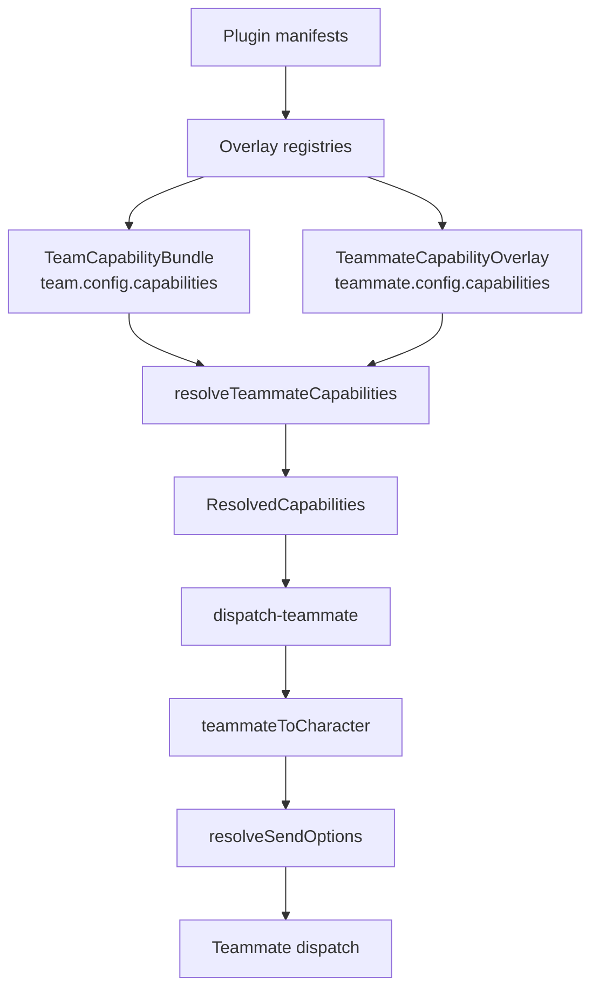

# Capabilities & Plugin Integration

Agent Team is a **first-class plugin ecosystem consumer**. A team carries a default
capability pool; each teammate overlays it; the resolver flattens the pair into a
`ResolvedCapabilities` snapshot; that snapshot is projected onto a synthetic
`Character`; and the teammate then rides the *full* build-options pipeline — the same
one direct chat uses for skills, MCP servers, computer-use, and permissions. Plugins
extend all of this through uniform overlay registries, exactly as they extend
characters and skills. This page traces every seam ADR-0032 introduced.

<TLDR>
- **Two-layer scope** — `TeamCapabilityBundle` (`types/agent/agent-team.ts:193`) is the team default pool; `TeammateCapabilityOverlay` (`:222`) adds/removes/replaces per key; `resolveTeammateCapabilities` (`lib/ai/agent/team/capability-resolver.ts:91`) merges them into `ResolvedCapabilities` (`:238`).
- **7 capability keys** — `mcpServerIds`, `skillIds`, `nativeAnthropicToolIds`, `characterPackIds`, `externalAgentPresetIds`, `subagentIds`, `a2uiTemplateIds` (`capability-resolver.ts:36-44`).
- **Character bridge** — `teammateToCharacter` (`lib/ai/agent/team/teammate-character.ts:56`) is pure, never persisted, stable id `__teammate__:{id}`; consumed at `lib/ai/agent/team/dispatch-teammate.ts:107-113`.
- **Plugin overlays** — `PluginSubagentDef` (`types/plugin/plugin-subagent.ts:29`) and `PluginAgentTeamTemplateDef` (`types/plugin/plugin-agent-team-template.ts:110`); dispatched by the plugin manager loop (`lib/plugin/core/manager.ts:2482-2495`) over `OVERLAY_REGISTRY_CAPABILITIES` (`lib/plugin/contracts/capability-bridge-map.ts:156-303`).
- **Audit gate** — `buildKnownCapabilityIds` (`lib/ai/agent/team/capability-audit.ts:110`) + `validateInstanceCapabilitiesWith` (`:156`) feed the pre-run operator gate (`lib/ai/agent/team/agent-team-runtime.ts:173-199`).
</TLDR>

## 1. The two-layer capability scope

A team's capabilities are declared in two layers. The team-level
`TeamCapabilityBundle` is the **default pool** every teammate inherits; each teammate
optionally narrows or extends it through a `TeammateCapabilityOverlay`. The merge is a
single pure function — `resolveTeammateCapabilities` — that produces a flat
`ResolvedCapabilities` record with no undefined fields, so downstream consumers iterate
without null guards.

```typescript
// types/agent/agent-team.ts:193 (TeamCapabilityBundle) + :222 (overlay) + :238 (resolved)
export interface TeamCapabilityBundle {
  mcpServerIds?: string[]
  skillIds?: string[]
  nativeAnthropicToolIds?: string[]
  characterPackIds?: string[]
  externalAgentPresetIds?: string[]
  subagentIds?: string[]
  a2uiTemplateIds?: string[]
}

export interface CapabilityListOverlay {
  add?: string[]      // add these ids to the team default
  remove?: string[]   // subtract these ids from the team default
  replace?: string[]  // replace the team default entirely (wins over add/remove)
}

export interface TeammateCapabilityOverlay {
  mcpServerIds?: CapabilityListOverlay
  // ... one CapabilityListOverlay per capability key
}
```

### The 7 capability keys

The resolver enumerates exactly seven keys as a module-level tuple
(`capability-resolver.ts:36-44`). Every key is overlaid independently.

| Key | Resolves to | Consumed by |
|-----|-------------|-------------|
| `mcpServerIds` | MCP server presets | `Character.mcpServerIds` |
| `skillIds` | Plugin / native skills | `Character.skillIds` + `pluginSkillIds` |
| `nativeAnthropicToolIds` | Computer-use tool ids | `enableComputerUse` + `computerUseSettings` |
| `characterPackIds` | ADR-0030 persona packs | persona projection at run time |
| `externalAgentPresetIds` | External CLI presets | `lib/ai/agent/external/presets.ts` |
| `subagentIds` | Built-in or `pluginId:id` subagents | `resolveAllSubagents` |
| `a2uiTemplateIds` | A2UI rich-content templates | IM &#124; A2UI bridge |

### Overlay semantics

For each key the merge follows one rule: if `replace` is present it short-circuits and
wins (the team default is ignored); otherwise the result is `(team default minus remove)
union add`. Duplicate ids are deduplicated preserving first-occurrence order, so the
runtime always sees a stable, minimal id list. The function is deliberately pure and
sync — no registry lookups, no persistence, no logging.

```typescript
// lib/ai/agent/team/capability-resolver.ts:91-127
export function resolveTeammateCapabilities(
  team: Pick<AgentTeam, "config">,
  teammate: Pick<AgentTeammate, "config">
): ResolvedCapabilities {
  const teamBundle: TeamCapabilityBundle = team.config.capabilities ?? {}
  const overlay: TeammateCapabilityOverlay = teammate.config.capabilities ?? {}
  // ... fast path: both empty → fresh empty bundle (never shares the sentinel
  // arrays, because callers commonly push onto the returned lists) ...
  const result: ResolvedCapabilities = {
    mcpServerIds: [], skillIds: [], nativeAnthropicToolIds: [],
    characterPackIds: [], externalAgentPresetIds: [], subagentIds: [], a2uiTemplateIds: [],
  }
  for (const key of CAPABILITY_KEYS) {
    result[key] = applyOverlay(teamBundle[key], overlay[key])
  }
  return result
}
```

`applyOverlay` (`:65-84`) is the per-key kernel: `if (overlay?.replace !== undefined)
return dedupe(overlay.replace)`, else dedupe `(base minus removeSet) ++ add`.
`resolveTeamCapabilities` (`:135`) resolves the team-level pool alone, used when emitting
team-scoped artifacts with no teammate context.

### End-to-end flow



The resolved capabilities are cached per teammate per run so the merge runs once each:

```typescript
// lib/ai/agent/team/dispatch-teammate.ts:182-188
if (!teamCtx.resolvedCapabilities.has(teammate.id)) {
  teamCtx.resolvedCapabilities.set(
    teammate.id,
    resolveTeammateCapabilities(teamCtx.team, teammate)
  )
}
```

## 2. The teammate → Character bridge

A teammate is not a persisted persona. To run one, the dispatcher synthesizes an
ephemeral `Character` from the teammate config plus its `ResolvedCapabilities`. The
synthesis is **pure and never persisted**, with a stable id `__teammate__:{id}` so it
can be referenced consistently within a run without colliding with real characters.

```typescript
// lib/ai/agent/team/teammate-character.ts:56-103 (trimmed)
export function teammateToCharacter(input: TeammateCharacterInput): Character {
  const { team, teammate, resolvedCaps, cwd, modelHint } = input
  const systemPrompt =
    teammate.config?.systemPrompt?.trim() ||
    team.config?.defaultSystemPrompt?.trim() ||
    DEFAULT_TEAMMATE_SYSTEM_PROMPT
  const enableComputerUse = resolvedCaps.nativeAnthropicToolIds.length > 0
  const character: Character = {
    id: teammateCharacterId(teammate),   // __teammate__:{id}
    name: teammate.name,
    systemPrompt, createdAt: ts, updatedAt: ts,
    ...(mcpServerIds ? { mcpServerIds } : {}),
    ...(skillIds ? { skillIds, pluginSkillIds: skillIds } : {}),
    ...(allowedTools ? { allowedTools } : {}),
    ...(cwd ? { workingDir: cwd } : {}),
    enableComputerUse,
    ...(enableComputerUse
      ? { computerUseSettings: { allowedToolIds: [...resolvedCaps.nativeAnthropicToolIds] } }
      : {}),
  }
  return character
}
```

### Field mapping

| Source | Character field | Notes |
|--------|-----------------|-------|
| `resolvedCaps.mcpServerIds` | `mcpServerIds` | empty → omitted → inherits defaults |
| `resolvedCaps.skillIds` | `skillIds` + `pluginSkillIds` | both set, for polymorphic resolution |
| `resolvedCaps.nativeAnthropicToolIds` | `enableComputerUse` + `computerUseSettings.allowedToolIds` | non-empty list flips computer-use on |
| `teammate.config.tools` | `allowedTools` | direct tool allowlist |
| `cwd` | `workingDir` | per-dispatch working directory |
| `teammateCharacterId(teammate)` | `id` | stable `__teammate__:{id}` (`:23`) |

Subagents are enabled at the **session** level (session kind `team`), not on the
Character — see §3. The synthesized character is consumed immediately by the dispatcher,
which threads it through the full send-options pipeline:

```typescript
// lib/ai/agent/team/dispatch-teammate.ts:107-113
const character = teammateToCharacter({ team, teammate, resolvedCaps, cwd, modelHint })
const sendOptions = await resolveSendOptions({ character, session, /* ... */ })
```

From here teammates ride the same path documented in <LinkCard href="./built-in-agent"
title="Built-in Agent" description="resolveSendOptions assembly" /> and
<LinkCard href="./characters" title="Characters" description="Character runtime shape" />.

## 3. Plugin subagents (overlay registry #6)

Plugins declare subagents via `manifest.subagents`, mirroring the Claude SDK
`AgentDefinition` shape. They register through a one-line `createOverlayRegistry`
instance and are namespaced `pluginId:id` so dispatcher-name collisions are impossible.

```typescript
// types/plugin/plugin-subagent.ts:29
export interface PluginSubagentDef {
  id: string
  name: string
  description: string
  prompt: string
  tools?: string[]
  disallowedTools?: string[]
  model?: string
  maxTurns?: number
  effort?: string
}
```

Four host-bundled subagents ship alongside the overlay (`lib/claude/agents/subagents`):
<Term>workflow-designer</Term>, <Term>workflow-debugger</Term>,
<Term>workflow-refactorer</Term>, and <Term>workflow-doc-writer</Term>.
`resolveAllSubagents({ context })` (`lib/claude/agents/subagents/index.ts:118`) unions
the built-ins with the live overlay registry and projects plugin entries under their
namespaced ids. The team session enables them at build time:

```typescript
// lib/claude/build-options.ts:1458-1462 (team context union)
const { resolveAllSubagents } = await import("@/lib/claude/agents/subagents")
opts.agents = { ...(opts.agents ?? {}), ...resolveAllSubagents({ context: "team" }) }
```

## 4. Plugin agent-team templates (overlay registry #7)

Plugins declare complete team blueprints via `manifest.agentTeamTemplates`. Each entry
can declare a `requires` block of cross-capability dependencies.

```typescript
// types/plugin/plugin-agent-team-template.ts:110
export interface PluginAgentTeamTemplateDef {
  id: string
  name: string
  description: string
  category: string
  teammates: /* roster */ unknown[]
  taskTemplates?: unknown[]
  config?: unknown
  icon?: string
  requires?: TeamAgentTemplateRequires   // :41 — cross-capability dependency block
}
```

At register time `validateTemplateRequires(template)`
(`lib/plugin/registries/agent-team-template-registry.ts:88`) checks each capability
bucket against the live registries and stamps **non-blocking** warnings
(`missing-subagent`, etc.); `refreshAllTemplateWarnings()` (`:139`) re-runs when sibling
registries mutate. The settings UI surfaces these as a destructive missing-dependencies
badge and disables the Use button:

```tsx
// components/settings/agent/agent-team-templates-section.tsx:350-378
{hasMissingDeps && <Badge variant="destructive">{t("missingDependencies")}</Badge>}
<Button disabled={hasMissingDeps} onClick={onUse}>{t("use")}</Button>
```

`projectPluginTemplate(entry)` (`lib/agent-team/project-plugin-template.ts:21`) projects
a plugin def into the host `AgentTeamTemplate` consumed by the workspace template picker —
id namespaced `pluginId:id`, carrying systemPrompt, capabilities, governanceHints, tags,
and iconKey.

<Status status="info">Templates with missing deps stay visible but inert — operators get
a discoverability nudge instead of a silent failure.</Status>

## 5. Capability audit + pre-run gate

Because capabilities are stored as plain id lists, a disabled plugin can leave a team
referencing ids that no longer resolve. The audit detects this without ever persisting
the result.

`buildKnownCapabilityIds()` (`lib/ai/agent/team/capability-audit.ts:110`) snapshots **8
buckets** — the 7 capability lists plus `sharedMemoryAdapterIds` — by unioning the Dexie
skill/MCP/A2UI tables, the overlay registries, and `BUILT_IN_SUBAGENT_IDS`.
`validateInstanceCapabilitiesWith(known, team, teammate?)` (`:156`) diffs an instance
against that snapshot into `CapabilityAuditWarning[]`.
`refreshAllInstanceCapabilityWarnings()` (`:251`) maintains a derived, never-persisted
sidecar map, refreshed on plugin disable; `getInstanceCapabilityWarnings(teamId)` (`:258`)
and `getTeammateCapabilityWarnings(teamId, teammateId)` (`:263`) feed the UI.

```typescript
// lib/ai/agent/team/agent-team-runtime.ts:173-199 (trimmed) — pre-run gate
const known = await buildKnownCapabilityIds()
const auditWarnings = [
  ...validateInstanceCapabilitiesWith(known, team),
  ...workers.flatMap((w) => validateInstanceCapabilitiesWith(known, team, w)),
]
if (auditWarnings.length > 0) {
  void refreshAllInstanceCapabilityWarnings()
  const decision = await waitForDecision(
    { scope: "agent-team-capability-audit", id: runId }, ac.signal
  ).catch(() => ({ outcome: "reject" as const }))
  if (decision.outcome !== "approve") {
    return { runId: "", status: "cancelled", reason: "Operator declined to run with stale capabilities" }
  }
}
```

The store-side `clearStaleCapabilityIds` action strips stale ids from an instance once
the operator chooses to clean up rather than approve.

## 6. The plugin-manager dispatch loop

All nine uniform-shaped capabilities are dispatched by one loop. The descriptor table
`OVERLAY_REGISTRY_CAPABILITIES` (`lib/plugin/contracts/capability-bridge-map.ts:156-303`)
maps each capability to its manifest field and register/unregister handlers.

| Capability | capability-bridge-map.ts lines |
|------------|--------------------------------|
| skills | 157-177 |
| mcp-server-preset | 178-193 |
| native-anthropic-tool | 194-209 |
| external-agent-preset | 210-227 |
| character-pack | 228-245 |
| subagent | 246-265 |
| agent-team-template | 266-277 |
| shared-memory-adapter | 278-290 |
| workflow-template | 291-302 |

The manager iterates the descriptor keys with per-entry try/catch isolation, so one bad
entry never aborts a plugin's registration:

```typescript
// lib/plugin/core/manager.ts:2482-2495 (register loop; :2720 mirrors for unregister)
for (const cap of OVERLAY_REGISTRY_CAPABILITY_KEYS) {
  const descriptor = OVERLAY_REGISTRY_CAPABILITIES[cap]
  const entries = plugin.manifest[descriptor.manifestField] as
    ReadonlyArray<{ id: string }> | undefined
  if (!entries?.length) continue
  for (const entry of entries) {
    try { descriptor.registerEntry(entry, { pluginId }) }
    catch (err) { loggers.manager.warn(`[plugin:${pluginId}] failed to register ${cap} ${entry.id}:`, err) }
  }
}
```

### Cross-registry refresh hooks

Registering or unregistering one capability can resolve or stale another's warnings.

| When this registry changes | Refreshes warnings for | Lines |
|----------------------------|------------------------|-------|
| skill / mcp / native-tool | char-pack + team-template + workflow-template | 165-208 |
| character-pack | team-template | 237-244 |
| external-preset | team-template | 219-226 |
| subagent | team-template + workflow-template | 255-264 |

Templates clear their missing-dependency warnings as soon as the deps arrive.

## 7. Teammate preset adapter (PresetEditor reuse)

Teammate editing reuses the existing `<PresetEditor>` rather than a bespoke editor. The
teammate-preset-adapter bridges the two shapes:

- `teammateToPresetState(teammate, team)` (`lib/ai/agent/team/teammate-preset-adapter.ts:97`)
  maps a teammate into `PresetEditorState`: systemPrompt → content, model → model,
  tools → allowed/disallowed lists, and each `capabilities.*` overlay flattened via
  `overlayToFlatList(undefined, overlay.X, teamBundle.X)`; `characterPackIds[0]` →
  `characterPackId`, `externalAgentPresetIds[0]` → `externalAgentPresetId`.
- `presetStateToTeammateConfig(state, previous, team)` (`:180`) is the inverse, rebuilding
  per-key overlays via `diffListToOverlay` (`:149-171`).

`<TeammateConfigDialog>` wraps `<PresetEditor>` with the new `extraSections` /
`requireContent` props plus a roster section. Lossy fields with no preset equivalent
(specialization / runtime / temperature) are carried as metadata across the round-trip.

## 8. Lifecycle hooks

`runTeamLifecycle` and the dispatch executor fire the canonical team hook set. Budget
warnings reuse `BudgetGuard`'s existing `on("warning_crossed")` /
`on("critical_crossed")` emitters — no new emitter infrastructure was added.

Canonical hooks: `onTeamStart`, `onTeamPlanReady`, `onTeammateClaim`,
`onTeammateRelease`, `onTeamBudgetWarn`, `onTeamComplete`, `onConsensusOpened`,
`onConsensusVoted`, `onConsensusResolved`, `onSharedMemoryWrite`, `onSharedMemoryDelete`,
`onTeamDelegationStart`, `onTeamDelegationComplete`.

```typescript
// lib/ai/agent/team/dispatch-teammate.ts:190-216 (claim/release lifecycle)
dispatchOnTeammateClaim(payload); dispatchOnAgentStart(payload)
// ... teammate runs ...
dispatchOnTeammateRelease(payload)
dispatchOnAgentComplete(payload) // or dispatchOnAgentError on failure
```

The consensus / shared-memory / delegation orchestrators each fire their matching hook
set — see <LinkCard href="./consensus-delegation-memory" title="Consensus, Delegation & Memory"
description="The three thin orchestrators" />.

## 9. ADR-0032 verification

Every mechanism the ADR promised is wired and verified against source — no drift.

| # | Mechanism | Evidence |
|---|-----------|----------|
| 1 | Two-layer capability scope | capability-resolver.ts:91, :135 |
| 2 | Subagent plugin capability | plugin-subagent.ts:29 + subagent-registry + subagents/index.ts:118 |
| 3 | Agent-team-template capability | agent-team-template-registry.ts:88 validates requires |
| 4 | Full hook integration | dispatch-teammate.ts:190-216 |
| 5 | Consensus / SharedMemory / Delegation | three orchestrator modules |
| 6 | PresetEditor reuse | teammate-preset-adapter.ts:97, :180 |
| 7 | Workspace settings refactor | accordion + Plugins & capabilities section |
| + | Capability audit | capability-audit.ts:110, :156, :251 + pre-run gate |
| + | Plugin manager dispatch | capability-bridge-map.ts:156-303 |
| + | Teammate &#124; Character bridge | teammate-character.ts:56 |

## Related

<Cards>
  <Card href="./data-model" title="Data Model" description="AgentTeam / AgentTeammate config shapes" />
  <Card href="./consensus-delegation-memory" title="Consensus, Delegation & Memory" description="The three thin orchestrators and their hooks" />
  <Card href="./workspace-ui" title="Workspace UI" description="Plugins & capabilities accordion, template picker" />
  <Card href="../subsystems/plugin-system" title="Plugin System" description="Overlay registries and the manifest contract" />
  <Card href="../adr/0032-agent-team-plugin-integration" title="ADR-0032" description="Agent Team Plugin Integration decision record" />
</Cards>
