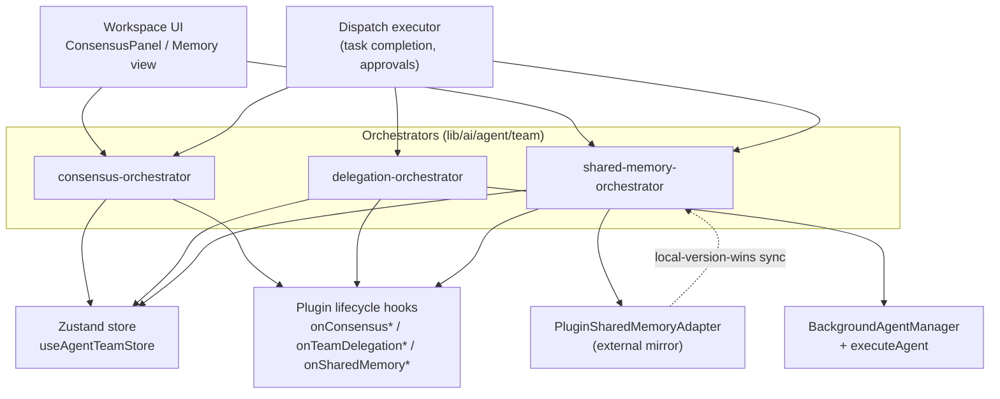

# Consensus, Delegation & Shared Memory

Three small orchestrators in `lib/ai/agent/team/` layer behavior over the raw store CRUD that `stores/agent/agent-team-store/` exposes (ADR-0032 §5). None of them owns state: each computes, gates, fires plugin hooks, and then defers persistence to the Zustand store. They are deliberately thin — the store is the single source of truth, these modules are the policy layer.

<TLDR>
- **Consensus** — `lib/ai/agent/team/consensus-orchestrator.ts` (283 lines): vote tally, five quorum rules, auto-resolve on threshold, lead override. Drives the workspace `ConsensusPanel`.
- **Delegation** — `lib/ai/agent/team/delegation-orchestrator.ts` (271 lines): bridges team tasks into the background-agent and external-agent runtimes; quiet-hours gated; full status machine.
- **Shared memory** — `lib/ai/agent/team/shared-memory-orchestrator.ts` (207 lines): deep PII gate on every write, version-counter writes, fire-and-forget plugin-adapter mirror, local-version-wins reverse sync.
- Store CRUD they wrap: `upsertConsensus` / `upsertDelegation` / `writeSharedMemory` etc. in `stores/agent/agent-team-store/slices/actions.slice.ts`; ACL selectors in `stores/agent/agent-team-store/selectors.ts:234`.
</TLDR>



## Consensus orchestrator

Vote collection, quorum evaluation, and auto/manual resolution over `ConsensusRequest` records (`types/agent/agent-team.ts:750`). Each entry persists through the store's `upsertConsensus` action.

| Symbol | Location | Purpose |
|---|---|---|
| tallyVotes | consensus-orchestrator.ts:40 | Counts votes per option, applying weight for the "weighted" type. Returns a per-option-index count array. |
| computeWinner | consensus-orchestrator.ts:69 | Picks the winning option or null; uses voterCount as the denominator for majority-style types. |
| thresholdMet | consensus-orchestrator.ts:111 | True when computeWinner is non-null; used by castVote to decide auto-resolution. |
| createConsensus | consensus-orchestrator.ts:130 | Builds the ConsensusRequest, persists it, fires the opened hook. |
| castVote | consensus-orchestrator.ts:165 | Appends or replaces a vote (deduped by voterId), recomputes the winner, auto-resolves on threshold. |
| resolveConsensus | consensus-orchestrator.ts:233 | Manual lead override — forces resolved with the supplied winning option. |
| cancelConsensus | consensus-orchestrator.ts:271 | Transitions open to cancelled. No hook. |

### Quorum rules

The five rule kinds map to one switch (consensus-orchestrator.ts:86):

```typescript
// lib/ai/agent/team/consensus-orchestrator.ts:86-103
switch (type) {
  case "majority":
    return voterCount > 0 && leaderCount > voterCount / 2 ? leader : null
  case "supermajority":
    return voterCount > 0 && leaderCount > (voterCount * 2) / 3 ? leader : null
  case "unanimous":
    return voterCount > 0 && leaderCount === voterCount ? leader : null
  case "weighted":
    return leaderCount > total / 2 ? leader : null
  case "lead_override":
    return null // Requires explicit resolveConsensus call
  default:
    return null
}
```

<Status status="info">lead_override always returns null from computeWinner — it can only ever be resolved by an explicit resolveConsensus call, never auto-resolved.</Status>

Votes are **deduped by voterId**: a re-cast replaces the prior vote rather than stacking. On `castVote`, when the recomputed winner is non-null the record flips to status "resolved" with winningOption, resolvedAt, and a summary line, is upserted, and fires the resolved hook in addition to the voted hook.

### Plugin hooks & consumers

`createConsensus`, `castVote`, and `resolveConsensus` fire <Term>onConsensusOpened</Term>, <Term>onConsensusVoted</Term>, and <Term>onConsensusResolved</Term> respectively, letting plugins observe the lifecycle. The renderer consumer is the `ConsensusPanel` on the `/agent-runs` Coordination tab (see <LinkCard href="./surfaces" title="Surfaces" description="Where ConsensusPanel renders" />).

## Delegation orchestrator

Bridges a team task into either the background-agent runtime or an external-agent runtime, persisting a `TeamDelegationRecord` (`types/agent/agent-team.ts:828`) through `upsertDelegation` / `updateDelegationStatus`.

| Symbol | Location | Purpose |
|---|---|---|
| delegateToBackground | delegation-orchestrator.ts:121 | Creates the record, fires the start hook, registers an abort signal, runs executeAgent. Returns a sync record plus an async completion promise. |
| delegateToExternal | delegation-orchestrator.ts:194 | Creates a record for an external agent and persists it; settlement happens out-of-process. |
| completeExternalDelegation | delegation-orchestrator.ts:222 | Settles once the external runtime returns (status plus result); fires the complete hook. |
| approveDelegation | delegation-orchestrator.ts:243 | Transitions awaiting_approval to active and re-dispatches the background run. |
| cancelDelegation | delegation-orchestrator.ts:256 | Aborts the background signal, sets cancelled, fires the complete hook. |

### Quiet-hours gate

Delegation respects the team's governance quiet hours by reusing the connector outbound runner's predicate — no second time-window implementation:

```typescript
// lib/ai/agent/team/delegation-orchestrator.ts:41-46
function isDelegationQuietGated(sourceTeamId: string, nowMs: number = Date.now()): boolean {
  const quietHours =
    useAgentTeamStore.getState().teams[sourceTeamId]?.config.governancePolicy?.delivery?.quietHours
  if (!quietHours) return false
  return isInQuietHours(nowMs, quietHours.from, quietHours.to, quietHours.tz)
}
```

`isInQuietHours` is imported from `lib/connectors/outbound-runner`, and `quietHours` lives on `TeamGovernancePolicy.delivery` (`types/agent/agent-team.ts:135`).

### Background lifecycle & status machine

`delegateToBackground` (delegation-orchestrator.ts:121) builds the record, upserts it, fires <Term>onTeamDelegationStart</Term>, then calls `getBackgroundAgentManager().registerAgent(agentId)`. Asynchronously: if the run is deferred (awaiting approval) it returns; otherwise it invokes `executeAgent(prompt, { systemPrompt, abortSignal: signal })`. The final status is "cancelled" when the signal aborted, "completed" on a clean return, or "failed" on a thrown error — settled via `updateDelegationStatus` plus the <Term>onTeamDelegationComplete</Term> hook.

The full `TeamDelegationRecord.status` machine is **pending → awaiting_approval → active → completed / failed / cancelled / timeout**.

<LinkCard href="./capabilities-and-plugins" title="Capabilities & Plugins" description="The hook surface fired by delegation and consensus" />

## Shared-memory orchestrator

A team knowledge store with a deep PII gate on writes, a monotonic version counter, ACL-aware reads, and an optional bidirectional plugin-adapter mirror. Entries are `SharedMemoryEntry` records (`types/agent/agent-team.ts:678`) persisted under `writeSharedMemory` / `deleteSharedMemory`.

| Symbol | Location | Purpose |
|---|---|---|
| publishEntry | shared-memory-orchestrator.ts:70 | Deep PII gate, version increment, store write, write hook, then adapter mirror. |
| deleteEntry | shared-memory-orchestrator.ts:125 | Delete plus the delete hook plus an adapter mirror. |
| autoPublishTaskResult | shared-memory-orchestrator.ts:149 | After task completion, publishes under the "task:taskId" key; silently skips empty or PII-flagged strings. |
| clearTeamMemory | shared-memory-orchestrator.ts:168 | Drops every entry for the team. |
| syncSharedMemoryFromAdapter | shared-memory-orchestrator.ts:183 | Pulls remote changes since the cursor, local-version-wins, returns the pulled count. |

### Deep PII gate

Every published value passes the deep PII scan before it can reach the store — the same gate shared across Twin, Goal, and Connectors:

```typescript
// lib/ai/agent/team/shared-memory-orchestrator.ts:70-79
export function publishEntry(input: PublishEntryInput): SharedMemoryEntry {
  // ...
  // Deep PII gate: scans every string leaf of strings, arrays, and plain objects
  if (!hasNoLeakingPiiDeep(input.value)) {
    throw new SharedMemoryPiiError(input.key)
  }
  // ... version increment + store.writeSharedMemory
}
```

`hasNoLeakingPiiDeep` walks every string leaf of strings, arrays, and plain objects; a rejection throws a typed `SharedMemoryPiiError` (shared-memory-orchestrator.ts:55) carrying the offending key.

<LinkCard href="../adr/0032-agent-team-plugin-integration" title="ADR-0032" description="The shared PII gate reused by Twin / Goal / Connectors and Agent Team" />

### Adapter mirror

When the team config names a `sharedMemoryAdapterId`, writes are mirrored to the external adapter as a fire-and-forget microtask. The mirror is skipped for synthetic reverse-sync writes — those carry a writerName ending in ":sync" — so a pulled remote entry is never re-pushed:

```typescript
// lib/ai/agent/team/shared-memory-orchestrator.ts:108-119
const adapterId = team.config.sharedMemoryAdapterId
if (adapterId && !writerName.endsWith(":sync")) {
  const adapter = getSharedMemoryAdapter(adapterId)
  if (adapter) {
    queueMicrotask(() => {
      adapter.write(teamId, entry).catch((err) => {
        console.warn("[shared-memory] adapter mirror failed", err)
      })
    })
  }
}
```

### Reverse sync — local-version-wins

`syncSharedMemoryFromAdapter` reads the persisted per-(teamId, adapterId) cursor `lastAdapterSyncVersion`, asks the adapter for changes since that cursor, and applies each remote entry only when it strictly out-versions the local copy. The applied write is tagged with the ":sync" writer suffix so the mirror guard above does not bounce it back:

```typescript
// lib/ai/agent/team/shared-memory-orchestrator.ts:194-204
for (const remote of entries) {
  const local = useAgentTeamStore.getState().sharedMemory[teamId]?.[remote.key]
  if (local && local.version >= remote.version) continue // local wins
  useAgentTeamStore.getState().writeSharedMemory(teamId, remote.key, {
    ...remote,
    writerName: `${adapterId}:sync`,
  })
  pulled += 1
}
useAgentTeamStore.getState().setAdapterSyncVersion(teamId, adapterId, cursor)
```

The cursor is the one piece of shared-memory state that **is** persisted (store persist v3 partializes `lastAdapterSyncVersion`); the entries themselves are RAM-only per run.

### Adapter contract

Plugins register a mirror by implementing this interface:

```typescript
// types/plugin/plugin-shared-memory-adapter.ts:26-47
export interface PluginSharedMemoryAdapterDef {
  id: string
  name: string
  description?: string
  icon?: string
  write(teamId: string, entry: SharedMemoryEntry): Promise<void>
  read(teamId: string, key: string): Promise<SharedMemoryEntry | undefined>
  listChanges(teamId: string, sinceVersion?: number): Promise<SharedMemoryAdapterChangeSet>
  delete(teamId: string, key: string): Promise<void>
  clear?(teamId: string): Promise<void>
}
```

### Store-side ACL

Reads are filtered by a `readableBy` allow-list on each entry, evaluated by the store selector. The operator (synthetic reader id "operator") always sees everything:

```typescript
// stores/agent/agent-team-store/selectors.ts:234-239
export function isEntryReadableBy(entry: SharedMemoryEntry, readerId: string): boolean {
  if (readerId === OPERATOR_READER_ID) return true
  if (!entry.readableBy || entry.readableBy.length === 0) return true
  if (entry.writtenBy === readerId) return true
  return entry.readableBy.includes(readerId)
}
```

`OPERATOR_READER_ID` is "operator" (selectors.ts:225). An empty or missing `readableBy` means all-can-read; the writer always reads its own entries; otherwise the reader must be on the allow-list. `selectSharedMemoryEntriesForReader(teamId, readerId)` (selectors.ts:245) is the ACL-aware projection the UI consumes.

## Related

<Cards>
  <Card href="./data-model" title="Data Model & Store" description="ConsensusRequest, TeamDelegationRecord, SharedMemoryEntry types and the Zustand store CRUD these orchestrators wrap." />
  <Card href="./capabilities-and-plugins" title="Capabilities & Plugins" description="The plugin hook surface (onConsensus*, onTeamDelegation*, onSharedMemory*) and the shared-memory adapter registry." />
  <Card href="./surfaces" title="Surfaces" description="Where ConsensusPanel and DelegationsPanel render." />
  <Card href="../adr/0032-agent-team-plugin-integration" title="ADR-0032" description="Agent Team plugin integration — the architectural decision behind these three orchestrators." />
</Cards>
