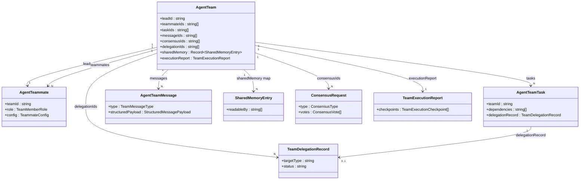

# Data Model & Store

Agent Teams are described by one type module — `types/agent/agent-team.ts` — and held at runtime by one Zustand store under `stores/agent/agent-team-store/`. The store deliberately persists almost nothing: only templates, the default config, and UI preferences survive a reload. Team instances, teammates, tasks, messages, shared memory, consensus, and delegations are RAM-only and rebuilt per run, while durable run history lives in Dexie `workflowRuns` with `triggerKind: "team"`.

<TLDR>
  `types/agent/agent-team.ts` is the authoritative schema — `AgentTeam` (`:882`), `AgentTeamConfig`
  (`:266`), `AgentTeammate` (`:486`), `AgentTeamTask` (`:547`, with `dependencies`), and the messaging /
  governance / capability types. The store (`stores/agent/agent-team-store/store.ts:104`) is `persist`
  v3 with a `partialize` that keeps only `templates`, `defaultConfig`, `displayMode`, `workspaceTab`,
  `lastAdapterSyncVersion`. Everything operational is RAM-only by design (ADR-0022 non-goal). Run
  history persists to Dexie `workflowRuns`/`workflowRunEvents`. The chat-side `teams` Dexie table is a
  different concept (`lib/claude/types.ts` Team).
</TLDR>

## Type Inventory — `types/agent/agent-team.ts`

Every user-facing entity in the subsystem is declared here. Line numbers are exact.

| Type | Line | Description |
| --- | --- | --- |
| `TeamMemberRole` | `:25` | "lead" or "teammate" |
| `TeamStatus` | `:30-37` | 7 states: idle, planning, executing, paused, completed, failed, cancelled |
| `TeammateStatus` | `:42-51` | 9 states: idle, planning, awaiting_approval, executing, paused, completed, failed, cancelled, shutdown |
| `TeamExecutionMode` | `:61-64` | coordinated, autonomous, delegate |
| `TeamExecutionPattern` | `:69-82` | manager_worker, parallel_specialists, background_handoff, external_handoff, single_agent_recommended, ultracode_orchestration |
| `TeamGovernancePolicy` | `:135-166` | approval / budget / escalation / delivery sub-policies (see below) |
| `TeamCapabilityBundle` | `:193-201` | mcpServerIds, skillIds, nativeAnthropicToolIds, characterPackIds, externalAgentPresetIds, subagentIds, a2uiTemplateIds |
| `CapabilityListOverlay` | `:208-215` | 3-state per key: `add` unions, `remove` subtracts, `replace` wins |
| `TeammateCapabilityOverlay` | `:222-230` | per-teammate overlay for each capability kind |
| `ResolvedCapabilities` | `:238-246` | flattened set resolved at runtime from team default + teammate overlay |
| `AgentTeamConfig` | `:266-371` | the team config object (verbatim below) |
| `TeammateConfig` | `:445-481` | systemPrompt + provider/model/apiKey/baseURL/temperature overrides, tools, requirePlanApproval, specialization, `runtime`, metadata, `capabilities` overlay |
| `AgentTeammate` | `:486-525` | id, teamId, name, role, status, config, spawnPrompt, currentTaskId, proposedPlan, planFeedback, completedTaskIds, tokenUsage, progress, timestamps, error, specialization |
| `TeamTaskStatus` | `:534-542` | pending, blocked, claimed, in_progress, review, completed, failed, cancelled |
| `AgentTeamTask` | `:547-594` | id, teamId, title, status, priority, assignedTo/claimedBy, `dependencies`, tags, result, timings, `delegationRecord`, metadata |
| `TeamMessageType` | `:603-614` | 11 kinds: direct, broadcast, system, plan_approval, plan_feedback, task_update, result_share, shutdown, idle, task_assignment, consensus |
| `AgentTeamMessage` | `:642-669` | id, teamId, type, senderId, recipientId, content, taskId, read, timestamp, `structuredPayload` |
| `SharedMemoryEntry` | `:678-697` | key, value, writtenBy, writtenAt, expiresAt, version, tags, `readableBy` (ACL allow-list) |
| `ConsensusRequest` | `:750-779` | id, teamId, initiatorId, question, options, `type`, status, votes, winningOption, timeoutMs, timestamps |
| `TeamDelegationRecord` | `:828-843` | id, sourceTeamId, sourceTaskId, `targetType`, targetId, `status`, reason, manual, timestamps, result, metadata |
| `AgentTeam` | `:882-937` | the team aggregate (verbatim below) |
| `TeamExecutionReport` | `:988-1000` | id, teamId, status, routingAssessment, activeExecutionPattern, checkpoints, summary, traceSessionId, timestamps |

The `runtime` field on `TeammateConfig` selects the execution backend per teammate — one of `claude`, `codex`, `claude-code`, `gemini-cli`, or `cursor-cli`. `ConsensusRequest.type` is one of `majority`, `supermajority`, `unanimous`, `weighted`, or `lead_override`. `TeamDelegationRecord.targetType` is `sub_agent`, `team`, or `background`; its `status` advances through pending, awaiting_approval, active, completed, failed, cancelled, or timeout.

`types/agent/index.ts:5-14` re-exports all of the above via `export * from "./agent-team"`, alongside `SubAgentTokenUsage` / `SubAgentPriority` (from `sub-agent.ts`, used in tasks) and the separate `agent-mode.ts` concern.

### `AgentTeamConfig` (verbatim)

```typescript
// types/agent/agent-team.ts:266-371
export interface AgentTeamConfig {
  maxTeammates: number
  maxConcurrentTeammates: number
  executionMode: TeamExecutionMode
  preferredExecutionPattern?: TeamExecutionPattern
  displayMode: TeamDisplayMode
  defaultProvider?: ProviderName
  defaultModel?: string
  tokenBudget?: number
  maxRetries?: number
  enableTaskRetry?: boolean
  enableDeadlockRecovery?: boolean
  governancePolicy?: TeamGovernancePolicy
  capabilities?: TeamCapabilityBundle
  sharedMemoryAdapterId?: string
  ultracode?: {
    enabled?: boolean
    autoMode?: "auto" | "always" | "never"
    maxFinderRounds?: number
    skepticsPerFinding?: number
    judgesPerAttempt?: number
    dryRoundsToStop?: number
  }
  workingDir?: string
}
```

`DEFAULT_TEAM_CONFIG` (`:376`) seeds `maxTeammates: 10`, `maxConcurrentTeammates: 5`, `executionMode: "coordinated"`, `preferredExecutionPattern: "manager_worker"`, `displayMode: "expanded"`. `TeamGovernancePolicy` (`:135-166`) groups four sub-policies: **approval** (`requirePlanApproval`, `requireDelegationApproval`), **budget** (`tokenBudget`, warning/critical thresholds, an `onCritical` action), **escalation** (`allowOperatorPatternOverride`, `pauseOnHighRisk`), and **delivery** (quiet-hours window with timezone).

### `AgentTeam` (verbatim)

```typescript
// types/agent/agent-team.ts:882-937
export interface AgentTeam {
  id: string
  name: string
  description: string
  task: string
  status: TeamStatus
  config: AgentTeamConfig
  routingAssessment?: TeamRoutingAssessment
  selectedExecutionPattern?: TeamExecutionPattern
  leadId: string
  teammateIds: string[]
  taskIds: string[]
  messageIds: string[]
  progress: number
  totalTokenUsage: SubAgentTokenUsage
  finalResult?: string
  executionReport?: TeamExecutionReport
  sharedMemory?: Record<string, SharedMemoryEntry>
  consensusIds?: string[]
  delegationIds?: string[]
}
```

## Entity Relationships

The `AgentTeam` aggregate references everything by id collections; the store holds the entity tables it points into.



## Zustand Store — `stores/agent/agent-team-store/`

The store is split into `store.ts` (persist layer), `initial-state.ts`, `types.ts` (state + action signatures), `selectors.ts`, and `slices/actions.slice.ts` (implementations).

### Persist config (verbatim)

```typescript
// stores/agent/agent-team-store/store.ts:104-124
export const useAgentTeamStore = create<AgentTeamState>()(
  persist(
    (set, get) => ({
      ...initialState,
      ...createAgentTeamActionsSlice(set, get),
    }),
    {
      name: "cognia-agent-teams",
      storage: createJSONStorage(() => localStorage),
      version: PERSIST_VERSION,
      partialize: (state) => ({
        templates: state.templates,
        defaultConfig: state.defaultConfig,
        displayMode: state.displayMode,
        workspaceTab: state.workspaceTab,
        lastAdapterSyncVersion: state.lastAdapterSyncVersion,
      }),
      migrate: (persistedState, version) => migrateAgentTeamPersisted(persistedState, version),
    }
  )
)
```

<Status>PERSIST_VERSION is 3</Status>

**What IS persisted** (the `partialize` allow-list): `templates`, `defaultConfig`, `displayMode`, `workspaceTab`, and `lastAdapterSyncVersion` — the last being a per-(teamId, adapterId) reverse-sync cursor for shared-memory adapters.

**What is NOT persisted** (intentional, ADR-0022 non-goal): `teams`, `teammates`, `tasks`, `messages`, `events`, `consensus`, `sharedMemory`, `delegations`, and `executionReports`. All operational state is RAM-only and rebuilt per run. The store still declares these slots in `initialState` so reads never throw.

### Migrations

`migrateAgentTeamPersisted` (`store.ts:50-102`) is idempotent against v3+ input:

- **v1 to v2** — backfill `governancePolicy` and `capabilities` on the default config and every template config.
- **v2 to v3** — backfill `sharedMemoryAdapterId` and initialize `lastAdapterSyncVersion` to `{}`.

### Initial state (verbatim)

```typescript
// stores/agent/agent-team-store/initial-state.ts:1-51
export const initialState = {
  teams: {} as Record<string, AgentTeam>,
  teammates: {} as Record<string, AgentTeammate>,
  tasks: {} as Record<string, AgentTeamTask>,
  messages: {} as Record<string, AgentTeamMessage>,
  templates: builtInTemplatesMap, // BUILT_IN_TEAM_TEMPLATES
  events: [] as AgentTeamEvent[],
  consensus: {} as Record<string, ConsensusRequest>,
  sharedMemory: {} as Record<string, Record<string, SharedMemoryEntry>>,
  delegations: {} as Record<string, TeamDelegationRecord>,
  activeTeamId: null,
  selectedTeammateId: null,
  displayMode: "expanded" as TeamDisplayMode,
  isPanelOpen: false,
  workspaceTab: "overview" as const,
  workspaceFocus: { teammateId: null, taskId: null, messageId: null },
  workspaceDetailOpen: true,
  defaultConfig: { ...DEFAULT_TEAM_CONFIG },
  lastAdapterSyncVersion: {} as Record<string, Record<string, number>>,
}
```

### Action surface

Signatures live in `types.ts`; implementations in `slices/actions.slice.ts` (`createAgentTeamActionsSlice`, line 121+).

| Group | Actions | Lines |
| --- | --- | --- |
| Team | createTeam, upsertTeam, updateTeam, updateTeamConfig, updateTeamCapabilities, clearStaleCapabilityIds, deleteTeam, setTeamStatus | `:62-83` |
| Teammate | addTeammate, upsertTeammate, updateTeammate, updateTeammateCapabilities, removeTeammate, setTeammateStatus, setTeammateProgress | `:86-100` |
| Task | createTask, upsertTask, updateTask, deleteTask, setTaskStatus, claimTask, assignTask | `:103-109` |
| Message | addMessage, upsertMessage, removeMessage, markMessageRead, markAllMessagesRead, markTeamMessagesRead | `:112-117` |
| Events | addEvent, clearEvents | `:120-121` |
| Template CRUD | addTemplate, deleteTemplate, saveAsTemplate, updateTemplate, importTemplates, exportTemplates | `:124-133` |
| UI state | setActiveTeam, setSelectedTeammate, setDisplayMode, setIsPanelOpen, setWorkspaceTab, setWorkspaceFocus, setWorkspaceTeamFromRoute, closeAgentTeamWorkspaceDetail | `:136-143` |
| Read views | getTeam, getTeammate, getTeammates, getTeamTasks, getTeamMessages, getUnreadMessages, getActiveTeam | `:146-152` |
| Batch ops | cancelAllTasks, shutdownAllTeammates, cleanupTeam | `:155-157` |
| Consensus | upsertConsensus, deleteConsensus, clearTeamConsensus | `:160-162` |
| Shared memory | writeSharedMemory, deleteSharedMemory, clearTeamSharedMemory, setAdapterSyncVersion | `:165-169` |
| Delegation | upsertDelegation, updateDelegationStatus, clearTeamDelegations | `:172-178` |
| Execution report | upsertExecutionReport, addExecutionCheckpoint | `:181-182` |
| Protocol / lifecycle | addStructuredMessage, requestTeammateShutdown | `:185-190` |
| Settings | updateDefaultConfig, reset | `:193-196` |

Notable implementation guards in `actions.slice.ts`: `createTeam` auto-spawns the lead and runs `normalizeAgentTeamConfig`; `clearStaleCapabilityIds` (`:217-259`) strips ids that no longer resolve after a plugin is disabled; `upsertTeammate` / `removeTeammate` guard against orphaning the lead; `setTeammateProgress` clamps to `[0, 100]`; `setTeamStatus` stamps `startedAt` on entering "executing" and `completedAt` + `totalDuration` on terminal states.

### Selectors

`selectors.ts` (`:1-305`) exposes base selectors plus derived families. Highlights:

- **Governance summary** — `selectActiveTeamGovernanceSummary` (`:57-77`) composes routing assessment + active execution pattern + execution report into the single object the workspace governance view renders.
- **Shared-memory ACL** (`:212-250`) — `OPERATOR_READER_ID = "operator"`; `isEntryReadableBy(entry, readerId)` grants the operator everything, treats an empty `readableBy` as world-readable, always lets the writer read its own entry, and otherwise checks the `readableBy` allow-list. `selectSharedMemoryEntriesForReader(teamId, readerId)` applies this per reader.
- **Resolved capabilities** — `selectResolvedCapabilities(teamId, teammateId)` (`:262-279`) merges the team default bundle with the teammate overlay via `resolveTeammateCapabilities`.
- Other families: team-derived (`:43-77`), teammates by status (`:83-99`), tasks by status/assignee (`:105-137`), messages unread/by-type/structured (`:143-191`), consensus active/pending (`:197-206`), delegations and events (`:285-304`).

## Persistence Matrix

Three tiers, by intent. Note that the operational tier is RAM-only **on purpose** — ADR-0022 sets "no new Dexie tables for team runs" as a goal, so durable history rides the workflow run log instead.

| Data | Persisted? | Where |
| --- | --- | --- |
| Templates, defaultConfig, UI prefs, adapter-sync cursor | YES | localStorage (`partialize`, persist v3) |
| Team instances, teammates, tasks, messages | NO | RAM only (ephemeral per run) |
| Shared memory, consensus, delegations, execution reports | NO | RAM only (ephemeral per run) |
| Team run history + step events | YES | Dexie `workflowRuns` (`triggerKind: "team"`) + `workflowRunEvents` |
| Pending HITL gates | NO | RAM only (run-scoped by design) |

Dexie wiring (`lib/db/schema.ts`): `workflowRuns` (`:194`, indexed by id, createdAt, status, workflowId, triggerKind) persists each team run; `workflowRunEvents` (`:195`, indexed by id, runId, timestamp) is the step-level log. The facade comment in `lib/ai/agent/agent-team.ts:113` directs the UI to "subscribe to workflowRuns directly".

<Status>The chat-side teams Dexie table is a DIFFERENT concept</Status>

The Dexie `teams` table (`schema.ts:130, 356`, indexed by id, name, updatedAt, isBuiltIn) stores **chat-side** persistent team definitions typed by `lib/claude/types.ts` Team. It is unrelated to the agent-team store's RAM-only `teams` record — do not conflate them.

## Compatibility Layer — `lib/ai/agent/agent-team-compat.ts`

The normalizers run on every store input; `dispatchAgentTeam` is the headless dispatch seam used by workflow nodes and remote control.

| Export | Line | Purpose |
| --- | --- | --- |
| `dispatchAgentTeam(options)` | `:32-52` | Starts a run via `agentTeamManager.start(teamId)`; returns `{ ok, reason? }` |
| `normalizeAgentTeamConfig(config)` | `:68-124` | Trims name/description/task; clamps negative `maxTeammates`, `maxConcurrentTeammates`, `tokenBudget` |
| `normalizeAgentTeamTask(task)` | `:131-158` | Trims strings; clamps negative `order` / `retryCount` |
| `agentTeamCompat` | `:54-56` | Facade exposing `dispatch: dispatchAgentTeam` |

## Pending Gates Store — `stores/agent/pending-gates-store.ts`

A separate, also-RAM-only store mirrors open HITL approval gates. `TeamNotifier` pushes critical notifications carrying `openApproval: { scope, id }`; the workspace mounts a `GateModalsHost` rendering one `ApprovalGateDialog` per pending entry. `gateTypeFromScope` maps the approval-bus scope to a UI gate kind:

```typescript
// stores/agent/pending-gates-store.ts:35-44
export function gateTypeFromScope(scope: string): PendingGateType {
  switch (scope) {
    case "agent-team-budget": return "budget"
    case "agent-team-deadlock": return "deadlock"
    case "agent-team-teammate-fix": return "teammate_fix"
    case "agent-team":
    default: return "plan"
  }
}
```

The `PendingGate` carries `key` (an `ApprovalKey` of scope + id), `gateType`, `title`, optional `body`, `runId`, `teamId`, optional `taskId`, and `openedAt`. The store API is `open(gate)` (dedup by scope + id), `close(key)`, and `clearForRun(runId)`. See [HITL Gates](./hitl-gates) for the full approval-bus story.

## Related

<Cards>
  <Card title="Overview" href="./index" description="What Agent Teams are and how the pieces fit." />
  <Card title="Lifecycle & Synthesis" href="./lifecycle-and-synthesis" description="How a team is planned, run, and synthesized into a final result." />
  <Card title="Capabilities & Plugins" href="./capabilities-and-plugins" description="How bundles and overlays resolve into a teammate's tool set." />
  <Card title="ADR-0022" href="../adr/0022-agent-team-runtime-hardening" description="Runtime hardening — the source of the RAM-only and no-new-Dexie-table decisions." />
</Cards>
