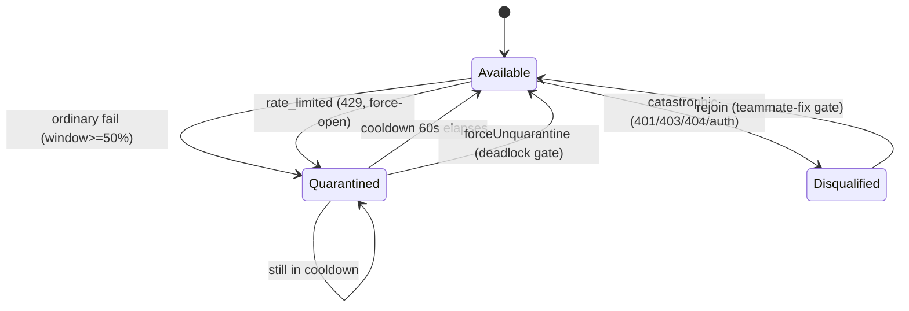

# Teammate Dispatch & Per-Run Shared State

`runTeamLifecycle` synthesizes a team into a `VisualWorkflow`, then hands every node off to one reusable primitive: `dispatchTeammate`. That primitive claims a teammate, runs one turn (tool-enabled or text-only), validates the output, and feeds the per-run shared state — the <Term>teammate pool</Term> (circuit breaker), the <Term>budget guard</Term> (token escalation), and the <Term>notifier</Term> (level-routed fan-out). Retry is the orchestrator's job, not the dispatcher's. This page traces that dispatch path and each shared-state module it touches.

<TLDR>
- One dispatch primitive: `dispatchTeammate` (`lib/ai/agent/team/dispatch-teammate.ts:171-344`) — shared by the task executor and every ultracode pattern via `dispatchStructured`.
- Channel split: sidecar (Tauri tool-enabled) vs text (AI-SDK) chosen at `dispatch-teammate.ts:236-241`; one-shot contract in `executeAgent` (`lib/ai/agent/agent-executor.ts:190-202`).
- Per-teammate circuit breaker + 5-kind error classification in `teammate-pool.ts:81-219`; budget escalation (4 onCritical actions) in `budget-guard.ts:97-158`.
- Notifier routes info/warn/critical to event-log/toast/OS/HITL-gate (`team-notifier.ts:106-159`), via ADR-0042 `deliver()` (`agent-team-runtime-deps.ts:133-165`).
- `defaultTimeout` (600s) and `minOutputChars` are live; `maxRetries` is NOT read here.
</TLDR>

## 1. `dispatchTeammate` — the single dispatch primitive

<Status status="stable">lib/ai/agent/team/dispatch-teammate.ts:1-345</Status>

`dispatchTeammate(teamCtx, args)` is the extracted equivalent of the ultracode `agent()` call. The `action.team.task.dispatch` node executor AND the higher-order pattern nodes both route through it, so claim/run/validate/record happens in exactly one place.

**Key exports:** `dispatchTeammate` (171), `DispatchTeammateArgs` (41), `DispatchTeammateResult` (66), `TeammateChannel` = "sidecar" &#124; "text" (33), `TokenUsage` (35).

**Flow (`dispatch-teammate.ts:171-344`), in order:**

1. **Claim** (175-179) — `teamCtx.pool.claim(taskId)`; throws (retryable) when the pool is empty.
2. **Capability cache** (182-188) — resolved capabilities are populated once per run into `resolvedCapabilities`.
3. **Hooks** (191-203) — `onTeammateClaim` / `onAgentStart` fire.
4. **Timeout combine** (218-225) — `defaultTimeout` (600s fallback) folded into the abort signal.
5. **System prompt resolution** (227-231) — args → teammate config → team default → built-in default.
6. **Channel select** (236-241) — Tauri + `runtime === "claude"` → `"sidecar"`; otherwise `"text"`.
7. **Trace span** (246-255) — one `invoke_agent` span per dispatch; threads `teamCtx.traceId` for eval.
8. **Run** (259-270) — `runToolEnabled` or `runTextOnly`.
9. **Failure path** (271-287) — `pool.recordFailure` + `setTaskStatus("failed")` + release hook + rethrow.
10. **Output validation** (299-321) — empty / below-`minOutputChars` → `EMPTY_OUTPUT` error.
11. **Success accounting** (323-334) — `recordSuccess` + `budget.add` + `result_share` message + `setTaskStatus("completed")`.

### Timeout combine

The per-task timeout falls back to `team.config.defaultTimeout` (default `DEFAULT_PER_TASK_TIMEOUT_MS`, 600s), then is combined with the caller's signal via `AbortSignal.any`:

```typescript
// lib/ai/agent/team/dispatch-teammate.ts:218-225
const timeoutMs =
  args.timeoutMs ??
  (typeof teamCtx.team.config?.defaultTimeout === "number" &&
  teamCtx.team.config.defaultTimeout > 0
    ? teamCtx.team.config.defaultTimeout
    : DEFAULT_PER_TASK_TIMEOUT_MS)
const timeoutSignal = AbortSignal.timeout(timeoutMs)
const combinedSignal = args.signal ? AbortSignal.any([args.signal, timeoutSignal]) : timeoutSignal
```

### Output validation

Two checks gate the result. An empty trim is always a failure; `minOutputChars` (from args, else team config, else 0) rejects too-short output. Both record a breaker failure and rethrow:

```typescript
// lib/ai/agent/team/dispatch-teammate.ts:299-321
if (args.validateOutput !== false) {
  if (trimmed.length === 0) {
    const empty = new Error("EMPTY_OUTPUT: teammate returned empty response")
    teamCtx.pool.recordFailure(teammate.id, empty)
    if (args.recordToStore) {
      teamCtx.storeWriter.setTaskStatus(args.taskId, "failed", undefined, empty.message)
    }
    release("failure", empty)
    throw empty
  }
  const minChars = args.minOutputChars ?? teamCtx.team.config?.minOutputChars ?? 0
  if (minChars > 0 && trimmed.length < minChars) {
    const short = new Error(
      `EMPTY_OUTPUT: output below minOutputChars=${minChars} (got ${trimmed.length})`
    )
    teamCtx.pool.recordFailure(teammate.id, short)
    if (args.recordToStore) {
      teamCtx.storeWriter.setTaskStatus(args.taskId, "failed", undefined, short.message)
    }
    release("failure", short)
    throw short
  }
}
```

### Success accounting

On success the pool, budget, and store are all updated; the shared `result_share` message is truncated to 1200 chars:

```typescript
// lib/ai/agent/team/dispatch-teammate.ts:323-334
teamCtx.pool.recordSuccess(teammate.id)
if (turn.usage) teamCtx.budget.add(turn.usage)
if (args.recordToStore) {
  teamCtx.storeWriter.addMessage({
    teamId: teamCtx.teamId,
    senderId: teammate.id,
    type: "result_share",
    content: text.length > 1200 ? `${text.slice(0, 1199)}…` : text,
    taskId: args.taskId,
  })
  teamCtx.storeWriter.setTaskStatus(args.taskId, "completed", text)
}
```

<Status status="info">Retry note: `maxRetries` / `enableTaskRetry` config are NOT read here — retry is delegated to the workflow orchestrator's `runStep`, where each retry re-claims and rotates teammates. Only `defaultTimeout` and `minOutputChars` are live in this primitive (both were dead per ADR-0022).</Status>

## 2. `executeAgent` — one-shot agent contract

<Status status="stable">lib/ai/agent/agent-executor.ts:1-250</Status>

`executeAgent(prompt, config)` is the plugin-safe one-shot entrypoint. When `toolsEnabled` and Tauri is present, it runs through the sidecar (full tools, channel `"sidecar"`); otherwise it falls through to the AI-SDK text-only channel:

```typescript
// lib/ai/agent/agent-executor.ts:194-202
if (config.toolsEnabled) {
  const { isTauri } = await import("@/lib/tauri")
  if (isTauri()) {
    const { text } = await runToolEnabledStandalone(prompt, config)
    return { text, finishReason: "stop", channel: "sidecar", toolsAvailable: true }
  }
  // Requested tools but no sidecar — fall through to the text-only channel.
}
```

**Consumers:** the `dispatchTeammate` text fallback (`dispatch-teammate.ts:157`), the delegation/background orchestrator, plugins via the public agent-executor API, and lead planning (`runLeadPlanning` in `agent-team-runtime-deps.ts`).

## 3. `teammate-pool` — round-robin + per-teammate circuit breaker

<Status status="stable">lib/ai/agent/team/teammate-pool.ts:1-260</Status>

The pool selects round-robin over `available` teammates (`!disqualified && breaker.canPass()`) and wraps each entry in its own `CircuitBreaker`: sliding window with `minEvents=2`, `failureThresholdPct=50`, `cooldownMs=60s`.

### Error classification

`classifyError` maps a thrown error into one of five kinds, which decide the failure action:

```typescript
// lib/ai/agent/team/teammate-pool.ts:81-90
export function classifyError(err: unknown): TeammateFailureKind {
  const msg = err instanceof Error ? err.message : String(err)
  if (/EMPTY_OUTPUT/.test(msg)) return "empty_output"
  if (/REFUSAL_DETECTED/.test(msg)) return "refusal"
  if (/\b429\b|rate.?limit/i.test(msg)) return "rate_limited"
  if (/\b40[134]\b|unauthor(ized|ised)|invalid.{0,5}key|forbidden/i.test(msg)) {
    return "catastrophic"
  }
  return "ordinary"
}
```

### `recordFailure` switch

`catastrophic` (401/403/404/auth) disqualifies permanently and notifies disqualification listeners. `rate_limited` (429) force-opens the breaker by recording 100 failures. Everything else takes the ordinary sliding-window path:

```typescript
// lib/ai/agent/team/teammate-pool.ts:191-219
recordFailure: (teammateId, error) => {
  const e = entries.get(teammateId)
  if (!e) return
  const kind = classifyError(error)
  switch (kind) {
    case "catastrophic":
      if (!e.disqualified) {
        e.disqualified = true
        for (const fn of disqualListeners) {
          try { fn(teammateId, "catastrophic") }
          catch (err) { console.warn("TeammatePool onTeammateDisqualified listener threw:", err) }
        }
      }
      break
    case "rate_limited":
      for (let i = 0; i < 100; i += 1) e.breaker.recordFailure()
      break
    default:
      e.breaker.recordFailure()
  }
  dispatchRelease(teammateId, "failure", ...)
  checkAllUnavailableEdge()
},
```

### Health states

| State | Cause | Recovery |
|---|---|---|
| Available | `!disqualified` and breaker closed | normal selection |
| Quarantined | breaker open (sliding window or 429 force-open) | auto-recovers after 60s cooldown, or `forceUnquarantine` via HITL |
| Disqualified | catastrophic failure (auth/4xx) | operator `rejoin` via the teammate-fix gate |

**API surface:** `claim(taskId)` (161-182, fires `onTeammateClaim`, returns `null` when none available), `recordSuccess` (184-189), `allUnavailable()` (229), `onAllUnavailable(cb)` (230-235, edge-triggered once on false→true), `onTeammateDisqualified(cb)` (236-240), `forceUnquarantine(input)` (242-249), `rejoin(teammateId)` (251-256, clears disqualified AND resets breaker).



When every teammate becomes either disqualified or quarantined, the edge-triggered `onAllUnavailable` fires once — the synthesizer wires this to the deadlock HITL gate. Constructed at `agent-team-runtime.ts:255`; consumed by `dispatchTeammate` and the deadlock resolver.

## 4. `budget-guard` — token budget escalation

<Status status="stable">lib/ai/agent/team/budget-guard.ts:1-172</Status>

`createBudgetGuard(opts)` accumulates token usage and fires one-shot threshold events: `warning_crossed` at `warnAt` (default 0.80) and `critical_crossed` at `critAt` (default 0.95). `add(usage)` checks both thresholds independently so a single jump from 0 to 96% fires both.

### `handleCritical` — four onCritical actions

On the critical crossing, exactly one `onCritical` action runs:

```typescript
// lib/ai/agent/team/budget-guard.ts:97-131
const handleCritical = (): void => {
  opts.notifier.notify({
    level: "critical",
    title: "Token budget critical",
    body: `Used ${used} of ${limit} tokens (${((used / limit) * 100).toFixed(1)}%)`,
    runId: opts.runId,
    teamId: "",
    dedupeKey: `budget-critical:${opts.runId}`,
  })
  emit("critical_crossed")
  switch (opts.onCritical) {
    case "notify":
      // notification already sent above
      break
    case "pause_for_review":
      emit("pause_for_review")
      break
    case "reduce_concurrency":
      opts.concurrencyCtrl?.reduceTo(1)
      opts.notifier.notify({
        level: "warn",
        title: "Concurrency reduced to 1",
        body: "Budget critical; further tasks will serialize.",
        runId: opts.runId,
        teamId: "",
        dedupeKey: `budget-reduce:${opts.runId}`,
      })
      break
    case "handoff_to_background":
      opts.concurrencyCtrl?.reduceTo(1)
      opts.modelCtrl?.downshift()
      opts.notifier.suspend()
      emit("entered_background_mode")
      break
  }
}
```

- **notify** — critical notification only; the run continues.
- **pause_for_review** — emits `pause_for_review`; the synthesizer opens the budget HITL gate.
- **reduce_concurrency** — caps concurrency at 1, warns that tasks will serialize.
- **handoff_to_background** — caps concurrency, downshifts the model (`modelCtrl.downshift()`), suspends the notifier, and emits `entered_background_mode`.

**`extendLimit(extraTokens)`** (160-163) raises the cap AND resets `warned`/`critical`, so the budget gate's approve path lets the same run re-trigger thresholds if usage jumps again. `status()` (159) returns `{ used, limit, level }` where level is "ok" / "warning" / "critical". `budget.add(turn.usage)` is called from `dispatch-teammate.ts:324` after each success.

## 5. `team-notifier` — level-routed fan-out

<Status status="stable">lib/ai/agent/team/team-notifier.ts:1-169</Status>

`createTeamNotifier(runCtx, deps)` routes by level. The event-log channel always fires (even while suspended); toast and OS notify escalate with severity; the HITL gate opens only for critical events that carry an `openApproval` key.

| Level | Event-log | Toast | OS notify | HITL gate |
|---|---|---|---|---|
| info | yes | no | no | no |
| warn | yes | yes | no | no |
| critical | yes | yes | yes | yes (if openApproval) |

### ADR-0042 `deliver()` vs legacy fallback

When `deps.deliver` is present, ONE `deliver(p)` call routes the event through the Unified Notification Center; otherwise the per-channel `toast()` / `osNotify()` calls are the legacy test fallback. `suspend()` (handoff_to_background) silences toast/OS but the event-log stays complete; a 5-min dedupe window applies per `dedupeKey`:

```typescript
// lib/ai/agent/team/team-notifier.ts:130-143 (within notify)
if (suspended) return
// Unified delivery (ADR-0042): one emit per event
if (deps.deliver) {
  callSafely(() => deps.deliver!(p), "deliver")
} else {
  // Legacy fallback: per-channel
  if (p.level === "warn" || p.level === "critical") {
    if (deps.toast) {
      callSafely(() => deps.toast!(p.title, p.body ? { description: p.body } : undefined), "toast")
    }
  }
  if (p.level === "critical" && deps.osNotify) {
    callSafely(() => deps.osNotify!({ title: p.title, body: p.body }), "osNotify")
  }
}
```

**Production deps wiring** (`agent-team-runtime-deps.ts:133-165`): `deliver` → `lib/notifications/runtime.notify` with source `"agent-team"`, `groupKey` runId, `sourceRef { kind: "team-run" }`, and `directed` when critical; `log` → console; `openGate` → `usePendingGatesStore.getState().open({...})` keyed by `gateTypeFromScope(scope)`.

## 6. `structured-dispatch` — StructuredOutput mirror

<Status status="stable">lib/ai/agent/team/structured-dispatch.ts:1-83</Status>

There is no forced-JSON tool on the sidecar, so `dispatchStructured<T>` mirrors Claude Code's StructuredOutput: it appends a fenced-JSON instruction, parses with `parseProposedPlan`, validates with Zod, and retries ONCE with the validation error fed back. After two failed attempts it throws.

```typescript
// lib/ai/agent/team/structured-dispatch.ts:50-81
for (let attempt = 0; attempt < 2; attempt += 1) {
  const retryNote =
    attempt === 0
      ? ""
      : `\n\nYour previous response was invalid: ${lastError}\nReturn corrected JSON only — no other text.`
  const prompt = `${args.prompt}${JSON_INSTRUCTION}${schemaHint}${retryNote}`

  const result = await dispatchTeammate(teamCtx, {
    ...args,
    prompt,
    validateOutput: true,
    recordToStore: false,
  })

  const parsed = parseProposedPlan(result.text)
  if (!parsed.ok) {
    lastError = `response was not valid JSON (${parsed.reason})`
    continue
  }

  const validated = schema.safeParse(parsed.plan)
  if (!validated.success) {
    lastError = validated.error.issues
      .map((i) => `${i.path.join(".") || "(root)"}: ${i.message}`)
      .join("; ")
    continue
  }

  return { value: validated.data, teammateId: result.teammateId, raw: result.text }
}
```

`recordToStore` is forced to `false` here (retries should not spam `result_share`). All ultracode pattern nodes and the ultracode planner consume `dispatchStructured`.

## 7. Background manager & sample team

<Status status="info">lib/ai/agent/background-agent-manager.ts:1-83 · lib/ai/agent/sample-team.ts:1-91</Status>

- **`background-agent-manager`** — a minimal fire-and-forget lifecycle for plugins and delegation. `getBackgroundAgentManager()` is a singleton (74); `registerAgent(id, { pluginId?, label? })` returns an `AbortSignal` (25); `finishAgent` / `cancelAgent` / `cancelByPlugin` / `list` round it out. No persistence — it only tracks abort signals.
- **`sample-team`** — the one-click "Demo Research Squad" factory: a Lead Strategist plus Researcher / Risk Analyst / Writer and three ordered tasks (EU AI Act research → risks → one-page brief). Pure store function, no LLM coupling; config preset `maxTeammates 5`, `maxConcurrentTeammates 2`, `executionMode "autonomous"`, `requirePlanApproval false`. Returns `{ teamId }`.

## 8. Integration summary

| Module | Config in | State out | Downstream |
|---|---|---|---|
| dispatch-teammate | defaultTimeout, minOutputChars, teammate runtime | TokenUsage, result_share writes, trace spans | dispatchStructured, pattern nodes |
| agent-executor | toolsEnabled, systemPrompt, model, timeoutMs | text + channel flag | dispatch text fallback, delegation, plugins |
| teammate-pool | teammates list | claim / quarantine / disqualified | dispatch, deadlock resolver |
| budget-guard | limit, warnAt, critAt, onCritical | crossing events, escalation | notifier, concurrency, model downshift |
| team-notifier | deliver / toast / osNotify / openGate deps | notify() side effects, suspend / resume | all modules, Unified Notification Center |
| structured-dispatch | zod schema | validated typed result | patterns (judge / verify / synthesize) |

## Related

<Cards>
  <Card title="Team Lifecycle & Synthesis" href="./lifecycle-and-synthesis" />
  <Card title="HITL Approval Gates" href="./hitl-gates" />
  <Card title="Ultracode Patterns" href="./ultracode-and-patterns" />
  <Card title="ADR-0022 Runtime Hardening" href="../adr/0022-agent-team-runtime-hardening" />
</Cards>
