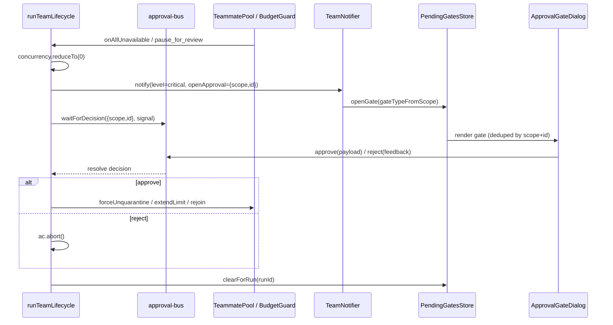

# Human-in-the-Loop Gates

A team run is autonomous until something needs a human. ADR-0022 §4 defines **five HITL (human-in-the-loop) gates** that the synthesizer can open mid-run: an approval before a plan executes, a pause when the token budget hits critical, a freeze when every teammate is unavailable, a per-teammate fix prompt when one is disqualified, and a pre-run confirmation when capability ids are stale. Every gate rides the **same** generic primitive — `waitForDecision` on the approval bus — so the runtime blocks (or doesn't) on a single, well-tested seam, and the UI renders one modal family for all of them.

The runtime side lives in `lib/ai/agent/agent-team-runtime.ts`; the primitive in `lib/runtime/approval-bus.ts`; the UI mirror in `stores/agent/pending-gates-store.ts` and `components/agent/team/approval-gate-dialog.tsx`.

<TLDR>
  `runTeamLifecycle` calls `waitForDecision(key, signal)` (`lib/runtime/approval-bus.ts:41`) which returns
  a promise that resolves on `approve(key, plan)` / `reject(key, feedback)` or rejects when the run's
  `AbortSignal` fires. For blocking gates (deadlock, budget) it first `concurrency.reduceTo(0)` so the
  orchestrator schedules nothing while awaiting. `TeamNotifier` carries `openApproval: { scope, id }` into
  `notifierDeps.openGate`, which pushes a `PendingGate` into `usePendingGatesStore`
  (`stores/agent/pending-gates-store.ts:38`, deduped by scope+id, NOT persisted). `GateModalsHost` renders
  one `ApprovalGateDialog` (`components/agent/team/approval-gate-dialog.tsx:42`) per gate; its approve/reject
  buttons forward to `useApprovalGate` (`use-approval-gate.ts:13`), which calls `approve` / `reject` back into
  the bus — resolving the runtime's waiter. The synthesizer's `finally` block (`agent-team-runtime.ts:515-522`)
  releases any waiters left open so nothing leaks.
</TLDR>

## The approval primitive

`lib/runtime/approval-bus.ts` is a scope+id-keyed in-memory pub/sub for "wait until something decides approve/reject". It was extracted from the agent-team-specific bus so the same primitive powers both team gates and GitHub Delivery's HITL guard. A key is `{ scope, id }`; a decision is `{ outcome: "approve" | "reject", feedback?, plan? }`. The durable side of any approval (Dexie rows, draft state) lives in the caller's domain — the bus itself is pure RAM.

```ts
// lib/runtime/approval-bus.ts:41-66
export function waitForDecision(key: ApprovalKey, signal?: AbortSignal): Promise<ApprovalDecision> {
  return new Promise((resolve, reject) => {
    if (signal?.aborted) {
      reject(signal.reason ?? new Error("Aborted"))
      return
    }
    const k = keyStr(key)
    const set = pending.get(k) ?? new Set<Resolver>()
    pending.set(k, set)

    const resolver: Resolver = (decision) => {
      set.delete(resolver)
      if (set.size === 0) pending.delete(k)
      if (signal) signal.removeEventListener("abort", onAbort)
      resolve(decision)
    }

    const onAbort = () => {
      set.delete(resolver)
      if (set.size === 0) pending.delete(k)
      reject(signal?.reason ?? new Error("Aborted"))
    }

    set.add(resolver)
    if (signal) signal.addEventListener("abort", onAbort, { once: true })
  })
}
```

The producers are `approve(key, plan?)` and `reject(key, feedback?)`, which resolve every waiter for a key with the given outcome and return the fanout count. `lib/ai/agent/plan-approval-bus.ts` is a thin backward-compat wrapper that hard-codes `scope = "agent-team"` so legacy `teamId`-keyed call sites keep compiling:

```ts
// lib/ai/agent/plan-approval-bus.ts:42-52
export function waitForDecision(
  teamId: string,
  signal?: AbortSignal
): Promise<PlanApprovalDecision> {
  return genericWaitForDecision({ scope: SCOPE, id: teamId }, signal)
}

export function approve(teamId: string, plan?: unknown): number {
  return genericApprove({ scope: SCOPE, id: teamId }, plan)
}
```

## The five gates

Each gate is a distinct `scope`; the `id` is either the `teamId` (plan only — keyed before a `runId` exists) or the per-run `runId` (and `runId:teammateId` for the per-teammate gate). The `plan` field of the approve decision carries the gate-specific payload.

| Gate | scope | id | Opens when | Approve payload |
| --- | --- | --- | --- | --- |
| Plan | `agent-team` | `teamId` | Lead proposes a plan and `config.requirePlanApproval` | none |
| Budget | `agent-team-budget` | `runId` | Budget guard fires `pause_for_review` at critical | `{ extraTokens }` |
| Deadlock | `agent-team-deadlock` | `runId` | All teammates disqualified or quarantined | `{ teammateIds }` or `{ resetAll }` |
| Teammate-fix | `agent-team-teammate-fix` | `runId:teammateId` | One teammate disqualified (catastrophic) | `{ action }` rejoin / skip&#95;permanently |
| Capability-audit | `agent-team-capability-audit` | `runId` | Stale capability ids detected pre-run | none |

<Status type="note">
Plan, deadlock, budget, and capability-audit are **blocking**: the synthesizer `await`s the decision before
proceeding (deadlock and budget also drop concurrency to 0). Teammate-fix is **non-blocking** — the run keeps
going on the remaining workers while the operator decides.
</Status>

## Gate wiring in `runTeamLifecycle`

The synthesizer wires gate subscriptions onto the per-run shared state right after building it (`agent-team-runtime.ts:265-391`). Each subscription pushes its disposer into `subs[]` so the `finally` block can tear them all down.

### Deadlock gate (blocking)

When `TeammatePool.onAllUnavailable` fires, the run cannot make progress. The handler notifies critical with an `openApproval`, freezes scheduling via `concurrency.reduceTo(0)`, then awaits the decision: approve calls `pool.forceUnquarantine` (defaulting to `{ resetAll: true }`), reject aborts the run. A `deadlockResolverActive` latch prevents re-entry while a decision is pending.

```ts
// lib/ai/agent/agent-team-runtime.ts:269-302
subs.push(
  pool.onAllUnavailable(() => {
    if (ac.signal.aborted || deadlockResolverActive) return
    deadlockResolverActive = true
    notifier.notify({
      level: "critical",
      title: "All teammates unavailable",
      body: "Run paused awaiting operator decision.",
      runId,
      teamId,
      openApproval: { scope: "agent-team-deadlock", id: runId },
      dedupeKey: `deadlock:${runId}`,
    })
    concurrency.reduceTo(0)
    void waitForDecision({ scope: "agent-team-deadlock", id: runId }, ac.signal)
      .then((decision) => {
        if (decision.outcome === "approve") {
          pool.forceUnquarantine(
            (decision.plan as { teammateIds?: string[]; resetAll?: boolean }) ?? {
              resetAll: true,
            }
          )
        } else {
          ac.abort(new Error("Operator aborted on deadlock"))
        }
      })
      .catch(() => {
        // signal aborted while waiting — no-op
      })
      .finally(() => {
        deadlockResolverActive = false
      })
  })
)
```

### Teammate-fix gate (non-blocking)

When a single teammate is disqualified (a catastrophic failure — auth / 404 / persistent refusal), the run does **not** pause: it continues on the remaining workers. The gate lets the operator fix the teammate's config and rejoin it, or skip it permanently. The key is `runId:teammateId`, so concurrent disqualifications open independent modals. There is no `reduceTo(0)` and no abort-on-reject here.

```ts
// lib/ai/agent/agent-team-runtime.ts:307-338
subs.push(
  pool.onTeammateDisqualified((teammateId, reason) => {
    if (ac.signal.aborted) return
    const tm = workers.find((w) => w.id === teammateId)
    notifier.notify({
      level: "critical",
      title: `Teammate disqualified: ${tm?.name ?? teammateId}`,
      body: `Reason: ${reason}. Fix configuration and rejoin, or skip.`,
      runId,
      teamId,
      openApproval: {
        scope: "agent-team-teammate-fix",
        id: `${runId}:${teammateId}`,
      },
      dedupeKey: `teammate-fix:${runId}:${teammateId}`,
    })
    void waitForDecision(
      { scope: "agent-team-teammate-fix", id: `${runId}:${teammateId}` },
      ac.signal
    )
      .then((decision) => {
        if (decision.outcome === "approve") {
          const action = (decision.plan as { action?: "rejoin" | "skip_permanently" })?.action
          if (action === "rejoin") pool.rejoin(teammateId)
        }
        // reject: leave disqualified; run keeps going on the rest.
      })
      .catch(() => {
        // signal aborted while waiting — no-op
      })
  })
)
```

### Budget gate (blocking)

`BudgetGuard` is configured with `onCritical: governancePolicy.budget.onCritical` (`agent-team-runtime.ts:259`). When that action is `pause_for_review`, the guard emits a `pause_for_review` event; the synthesizer's listener freezes scheduling and awaits the decision. Approve with `{ extraTokens }` calls `budget.extendLimit(extra)` so the run can continue under a raised cap; reject aborts. The `warning_crossed` and `critical_crossed` events are forwarded to the plugin hook pipeline (`dispatchOnTeamBudgetWarn`) but never block.

```ts
// lib/ai/agent/agent-team-runtime.ts:370-391
subs.push(
  budget.on("pause_for_review", () => {
    if (ac.signal.aborted || budgetResolverActive) return
    budgetResolverActive = true
    concurrency.reduceTo(0)
    void waitForDecision({ scope: "agent-team-budget", id: runId }, ac.signal)
      .then((decision) => {
        if (decision.outcome === "approve") {
          const extra = (decision.plan as { extraTokens?: number })?.extraTokens ?? 0
          if (extra > 0) budget.extendLimit(extra)
        } else {
          ac.abort(new Error("Operator declined budget extension"))
        }
      })
      .catch(() => {
        // signal aborted — no-op
      })
      .finally(() => {
        budgetResolverActive = false
      })
  })
)
```

### Plan-approval loop (blocking)

If `team.config.requirePlanApproval` is set, the synthesizer runs a revision loop **before** any per-run state exists — which is why the plan gate keys on `teamId`, not `runId`. Up to `maxPlanRevisions` rounds: each round calls `deps.runLeadPlanning` (threading the previous round's `feedback`), then awaits the decision. Approve breaks the loop and fires `dispatchOnTeamPlanReady`; reject feeds `decision.feedback` into the next round. If no round approves, the run ends `failed` (or `cancelled` if the signal aborted).

```ts
// lib/ai/agent/agent-team-runtime.ts:217-239
for (let i = 0; i < maxRev; i++) {
  if (ac.signal.aborted) break
  const planResult = await deps.runLeadPlanning({
    team,
    lead,
    feedback,
    signal: ac.signal,
  })
  const decision = await waitForDecision(
    { scope: "agent-team", id: teamId },
    ac.signal
  ).catch(() => ({ outcome: "reject" as const, feedback: "aborted" }))
  if (decision.outcome === "approve") {
    approved = true
    hooks.dispatchOnTeamPlanReady({
      teamId,
      runId,
      plan: planResult.planText,
    })
    break
  }
  feedback = decision.feedback
}
```

The lead's raw planning text is parsed by `parseProposedPlan` (`agent-team-runtime.ts:106-120`), a strict JSON-fenced-block reader: it pulls the first ` ```json ` fence (or falls back to the trimmed whole string) and `JSON.parse`s it, returning `{ ok: false, reason }` on empty or invalid input rather than throwing.

### Capability-audit pre-run gate (blocking)

Before spending a single token, the synthesizer validates that every capability id referenced by the team and its teammates still resolves. If a contributing plugin was disabled, those ids are stale; the gate surfaces them and asks the operator to confirm a degraded run. Reject (or an aborted wait) ends the run `cancelled`. See [Capabilities & Plugins](./capabilities-and-plugins) for how the bundle is resolved.

```ts
// lib/ai/agent/agent-team-runtime.ts:178-198
const known = await buildKnownCapabilityIds()
const auditWarnings = [
  ...validateInstanceCapabilitiesWith(known, team),
  ...workers.flatMap((w) => validateInstanceCapabilitiesWith(known, team, w)),
]
if (auditWarnings.length > 0) {
  void refreshAllInstanceCapabilityWarnings()
  const decision = await waitForDecision(
    { scope: "agent-team-capability-audit", id: runId },
    ac.signal
  ).catch(() => ({ outcome: "reject" as const }))
  if (decision.outcome !== "approve") {
    return {
      runId: "",
      status: "cancelled",
      reason: "Operator declined to run with stale capabilities",
    }
  }
}
```

## From runtime to modal and back

The runtime never touches React. It calls `notifier.notify(...)` with `openApproval`; the production `TeamNotifier` deps route critical notifications carrying `openApproval` into `notifierDeps.openGate`, which translates the scope into a `gateType` and pushes a `PendingGate` onto the store.

### PendingGatesStore

`stores/agent/pending-gates-store.ts` is a deliberately minimal Zustand store — **no persist middleware**, because pending gates are run-scoped and should not survive a refresh (the approval-bus waiter drops on refresh too). `open` dedupes by scope+id; `close` removes one gate; `clearForRun` drops every gate for a run.

```ts
// stores/agent/pending-gates-store.ts:18-29
export type PendingGateType = "budget" | "deadlock" | "plan" | "teammate_fix"

export interface PendingGate {
  key: ApprovalKey
  gateType: PendingGateType
  title: string
  body?: string
  runId: string
  teamId: string
  taskId?: string
  openedAt: number
}
```

The scope-to-variant mapping is centralized so the notifier and the modal host agree:

```ts
// stores/agent/pending-gates-store.ts:59-70
export function gateTypeFromScope(scope: string): PendingGateType {
  switch (scope) {
    case "agent-team-budget":
      return "budget"
    case "agent-team-deadlock":
      return "deadlock"
    case "agent-team-teammate-fix":
      return "teammate_fix"
    case "agent-team":
    default:
      return "plan"
  }
}
```

### ApprovalGateDialog

`GateModalsHost` renders one `ApprovalGateDialog` (`components/agent/team/approval-gate-dialog.tsx:42`) per pending gate. The component is presentation-only — it never calls the approval bus directly. It branches on `gateType` into four payload forms and forwards the assembled payload through the `onApprove` / `onReject` props:

```tsx
// components/agent/team/approval-gate-dialog.tsx:50-65
const handleApprove = (): void => {
  switch (props.gateType) {
    case "budget":
      props.onApprove({ extraTokens: Number.parseInt(extraTokens || "0", 10) })
      return
    case "deadlock":
      props.onApprove(resetAll ? { resetAll: true } : { teammateIds: [...selected] })
      return
    case "teammate_fix":
      props.onApprove({ action: "rejoin" })
      return
    case "plan":
      props.onApprove()
      return
  }
}
```

The **budget** variant renders a numeric `extraTokens` input; the **deadlock** variant renders a "reset all" checkbox plus a per-teammate checklist of `quarantinedTeammates` (used only when reset-all is off); the **teammate-fix** variant is a plain rejoin/skip confirm; the **plan** variant is approve/reject only (the richer plan editor with feedback lives in the inline panel below).

### Binding back to the bus

The dialog's handlers come from `useApprovalGate(scope, id)` (`use-approval-gate.ts:13`), a thin hook that closes over the bus producers:

```ts
// components/agent/team/use-approval-gate.ts:13-31
export function useApprovalGate(
  scope: string,
  id: string
): {
  approve: (plan?: unknown) => void
  reject: (feedback?: string) => void
} {
  return useMemo(
    () => ({
      approve: (plan?: unknown) => {
        approve({ scope, id }, plan)
      },
      reject: (feedback?: string) => {
        reject({ scope, id }, feedback)
      },
    }),
    [scope, id]
  )
}
```

Calling `approve`/`reject` resolves the runtime's pending `waitForDecision` promise, which unblocks (or aborts) the corresponding gate handler — closing the loop.

### The inline plan panel

The plan gate also has an inline surface in the workspace Overview tab: `PlanApprovalPanel` (`components/agent/team/plan-approval-panel.tsx:26`). It reads `lead.proposedPlan`, offers a feedback textarea, and calls `approve` / `reject` from `lib/ai/agent/plan-approval-bus` (the `scope = "agent-team"` wrapper) — the same waiter the modal would resolve, just rendered inline when `requirePlanApproval && lead.status === "awaiting_approval"`.

## Sequence: open → decide → resume



## Releasing waiters

When the run ends — success, failure, or abort — the synthesizer's `finally` block tears down subscriptions and **resolves any still-pending waiters** so a leftover gate promise can never leak past the run:

```ts
// lib/ai/agent/agent-team-runtime.ts:507-522
for (const u of subs) {
  try {
    u()
  } catch {
    /* listener already gone */
  }
}
unregisterTeamRunContext(runId)
// Release any pending approval-bus waiters keyed to this run.
approveBus({ scope: "agent-team-deadlock", id: runId })
approveBus({ scope: "agent-team-budget", id: runId })
rejectBus({ scope: "agent-team-deadlock", id: runId })
rejectBus({ scope: "agent-team-budget", id: runId })
for (const w of workers) {
  rejectBus({ scope: "agent-team-teammate-fix", id: `${runId}:${w.id}` })
}
```

Combined with the per-waiter abort listener in `waitForDecision`, this guarantees that every gate promise the run opened is settled by the time `runTeamLifecycle` returns.

## Related

<Cards>
  <Card title="Lifecycle & Synthesis" href="./lifecycle-and-synthesis" description="How runTeamLifecycle resolves, gates, and synthesizes a VisualWorkflow." />
  <Card title="Dispatch & Shared State" href="./dispatch-and-shared-state" description="TeammatePool, BudgetGuard, and the per-run context the gates act on." />
  <Card title="Capabilities & Plugins" href="./capabilities-and-plugins" description="What the capability-audit gate validates before a run." />
  <Card title="Workspace UI" href="./workspace-ui" description="Where GateModalsHost and the plan panel render." />
  <Card title="ADR-0022 Runtime Hardening" href="../adr/0022-agent-team-runtime-hardening" description="The decision record defining the five gates." />
</Cards>
