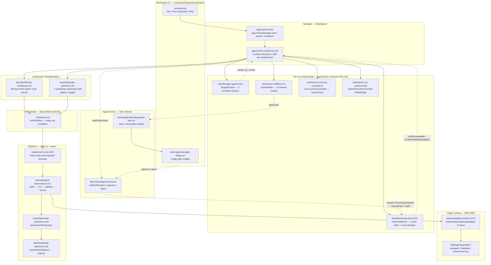

# Agent Teams

An **Agent Team** is a lead coordinator, a set of teammates, and a set of tasks. Each teammate can be backed by a different runtime — the in-app Claude agent or an external CLI (Codex / Claude Code / Gemini CLI / Cursor CLI). Where the [built-in agent](./built-in-agent) is one long-lived session, a team is a *fan-out*: the lead plans, teammates execute tasks in parallel under a concurrency cap, and the whole thing reports back as one run.

Since [ADR-0022](../adr/0022-agent-team-runtime-hardening), a team does **not** have its own orchestrator. `runTeamLifecycle` (`lib/ai/agent/agent-team-runtime.ts:122-527`) is a ~400-line *synthesizer*: it turns the team + tasks into a `VisualWorkflow` and hands that to the one workflow orchestrator everything else already uses. There is no second engine to keep in sync, and team runs persist exactly like any other workflow run — as `workflowRuns` rows with `triggerKind: "team"`.

<TLDR>
  Clicking Run calls `agentTeamManager.start` (`lib/ai/agent/agent-team.ts:91`), which invokes
  `runTeamLifecycle` (`agent-team-runtime.ts:122`). The synthesizer resolves team/teammates/tasks from
  the Zustand store, runs the capability-audit and plan-approval gates, builds per-run shared state
  (TeammatePool + BudgetGuard + TeamNotifier + ConcurrencyController, lines 251-263), registers a
  `TeamRunContext` (line 397), then synthesizes a `VisualWorkflow` — a flat task DAG via
  `synthesizeTeamWorkflow` (`team/synthesize-workflow.ts:44`) or a pattern graph via
  `planUltracodeWorkflow` + `synthesizeUltracodeWorkflow`. It delegates to `runWorkflow`
  (`lib/workflow/runtime/orchestrator.ts`), whose `action.team.task.dispatch` executor
  (`lib/workflow/nodes/built-ins.ts:1537`) calls `dispatchTeammate` (`team/dispatch-teammate.ts:171`),
  which synthesizes a Character via `teammateToCharacter` and rides the **same** `resolveSendOptions`
  + sidecar as the built-in agent. HITL gates pause the run by reducing concurrency to 0 and awaiting
  `waitForDecision` on the approval bus.
</TLDR>

<StatGrid>
  <Stat label="HITL gates" value="5" hint="plan / budget / deadlock / teammate-fix / capability-audit, on the approval-bus" />
  <Stat label="Ultracode pattern nodes" value="6" hint="multi-modal-sweep · loop-until-dry · adversarial-verify · judge-panel · completeness-critic · synthesize" />
  <Stat label="Capability keys" value="7" hint="mcpServerIds · skillIds · nativeAnthropicToolIds · characterPackIds · externalAgentPresetIds · subagentIds · a2uiTemplateIds" />
  <Stat label="Workspace tabs" value="6" hint="overview · tasks · chat · activity · members · settings" />
  <Stat label="Teammate runtimes" value="5" hint="claude · codex · claude-code · gemini-cli · cursor-cli" />
  <Stat label="Store persist version" value="3" hint="templates + defaultConfig + UI prefs only; instances are RAM-only" />
</StatGrid>

## What It Is

A team is a thin synthesis layer over the workflow engine. The architecture is built around five commitments:

1. **One orchestrator.** Per ADR-0022, the duplicate team executor was removed. `runWorkflow` is the only step scheduler; the team runtime only *produces* the workflow it runs. Concurrent scheduling, retries, crash recovery, and event logging come for free from the workflow layer.
2. **Ephemeral state, durable runs.** Team instances, teammates, tasks, messages, shared memory, consensus, and delegations live in the Zustand store as RAM-only state. Only templates, the default config, and a few UI preferences persist (`stores/agent/agent-team-store/store.ts:104-124`, persist version 3). The run *history* persists as `workflowRuns` + `workflowRunEvents` rows — no team-specific Dexie table.
3. **Everything is a Character at dispatch time.** A teammate carries its own runtime, model, system prompt, and capability overlay. At dispatch, `teammateToCharacter` (`team/teammate-character.ts:56`) projects it into a synthetic `Character`, so each teammate's Claude turn goes through the same build-options pipeline (skills, MCP, computer-use, permissions) as the [built-in agent](./built-in-agent).
4. **Two-layer capability scope.** A team capability bundle (7 keys) is overlaid per-teammate via add / remove / replace semantics, resolved at runtime by `resolveTeammateCapabilities` (`team/capability-resolver.ts:91`). Plugins contribute capabilities ([ADR-0032](../adr/0032-agent-team-plugin-integration)) through overlay registries.
5. **Fail-visible HITL gates.** When the run cannot safely proceed — stale capability refs, a plan awaiting approval, budget critical, all teammates unavailable, a disqualified teammate — the run pauses, opens a gate modal, and waits for an operator decision on the approval bus rather than silently degrading.

## Architecture at a Glance

Each box is annotated with the file and line where the work happens. The spine runs left-to-right: workspace UI → manager → synthesizer → orchestrator → dispatch. Gates and plugin registries clip onto the side.

## Design Principles

| Principle | What it means | Where |
| --- | --- | --- |
| **Single orchestrator** | The team runtime synthesizes a `VisualWorkflow` and delegates; `runWorkflow` is the only step scheduler. No duplicate engine. | `agent-team-runtime.ts:122` → `lib/workflow/runtime/orchestrator.ts` |
| **Ephemeral store, durable runs** | Team instances are RAM-only Zustand state; run history persists as `workflowRuns` rows with `triggerKind` set to "team". | `stores/agent/agent-team-store/store.ts:104-124` · `lib/db/schema.ts:194` |
| **Everything is a Character** | A teammate is projected to a synthetic `Character` at dispatch time, so teammates ride the full `resolveSendOptions` pipeline. | `team/teammate-character.ts:56` · `team/dispatch-teammate.ts:107-113` |
| **Two-layer capability scope** | A team bundle (7 keys) is overlaid per-teammate via add / remove / replace and resolved at runtime; plugins feed the registries. | `team/capability-resolver.ts:91` · ADR-0032 |
| **Fail-visible HITL gates** | When a run cannot proceed safely it pauses, opens a gate, and awaits a human decision on the approval bus — never silent degradation. | `agent-team-runtime.ts:265-391` · `lib/runtime/approval-bus.ts` |

## How This Section Is Organized

Each page below documents one slice with line-accurate internals. Start with **Lifecycle & synthesis** for the spine; the rest hang off it.

- [Data model](./data-model) — the `AgentTeam` / `AgentTeammate` / `AgentTeamTask` types, the Zustand store (persist v3, RAM-only instances), and the `workflowRuns` persistence path.
- [Lifecycle & synthesis](./lifecycle-and-synthesis) — `agentTeamManager`, the `runTeamLifecycle` synthesizer step-by-step, and `synthesizeTeamWorkflow` (Kahn cycle detection, synthetic workflow id).
- [Dispatch & shared state](./dispatch-and-shared-state) — `dispatchTeammate`, the `TeamRunContext` registry, `TeammatePool` (circuit breaker), `BudgetGuard` (four onCritical actions), and `TeamNotifier`.
- [HITL gates](./hitl-gates) — the five approval-bus gates (plan / budget / deadlock / teammate-fix / capability-audit), their payload schemas, and the pending-gates store.
- [Consensus, delegation & memory](./consensus-delegation-memory) — quorum voting, background / external delegation with quiet-hours gating, and the PII-gated shared-memory store with adapter sync.
- [Ultracode & patterns](./ultracode-and-patterns) — the complexity-aware trigger, the planner, and the six higher-order `pattern.*` quality nodes.
- [Capabilities & plugins](./capabilities-and-plugins) — the two-layer capability model, plugin subagents / team templates / shared-memory adapters, and the capability-audit gate (ADR-0032).
- [Workspace UI](./workspace-ui) — the six-tab workspace, the team list hub, the settings accordion, and the report timeline.
- [Workspace chat](./workspace-chat) — mention-based dispatch (`@claude`, `@codex`, teammates), the composite streamer, and runtime availability.

## Relationship to Other Subsystems

| Subsystem | How it connects | Link |
| --- | --- | --- |
| **Built-in agent** | Each teammate's Claude turn funnels through the **same** `resolveSendOptions` and sidecar as the in-app agent — everything on those pages applies to teammates. | [./built-in-agent](./built-in-agent) |
| **External agents** | Non-Claude teammate runtimes (Codex / Claude Code / Gemini CLI / Cursor CLI) dispatch through the external-agent runtime. | [./external-agents](./external-agents) |
| **Visual workflows** | The team runtime synthesizes a `VisualWorkflow` and runs it; conversely an `action.team.run` node lets any workflow invoke a team. | [../subsystems/visual-workflows](../subsystems/visual-workflows) |
| **Characters** | `teammateToCharacter` bridges a teammate into a synthetic, never-persisted `Character` so it inherits the character build-options path. | [./characters](./characters) |
| **Plugin system** | Plugins contribute subagents, team templates, and shared-memory adapters via overlay registries, surfaced as team capabilities. | [../subsystems/plugin-system](../subsystems/plugin-system) |

## Related ADRs

<Cards>
  <Card title="ADR-0022 — Runtime hardening" href="../adr/0022-agent-team-runtime-hardening" description="Convergence onto the workflow orchestrator: the thin synthesizer, per-run shared state, concurrent ready-set scheduling, and the HITL gates." />
  <Card title="ADR-0032 — Plugin integration" href="../adr/0032-agent-team-plugin-integration" description="The two-layer capability scope, plugin subagents / team templates / shared-memory adapters, and the capability-audit gate." />
  <Card title="ADR-0011 — Workflows subsystem" href="../adr/0011-workflows-subsystem" description="The VisualWorkflow model and the orchestrator the team runtime delegates to." />
</Cards>
