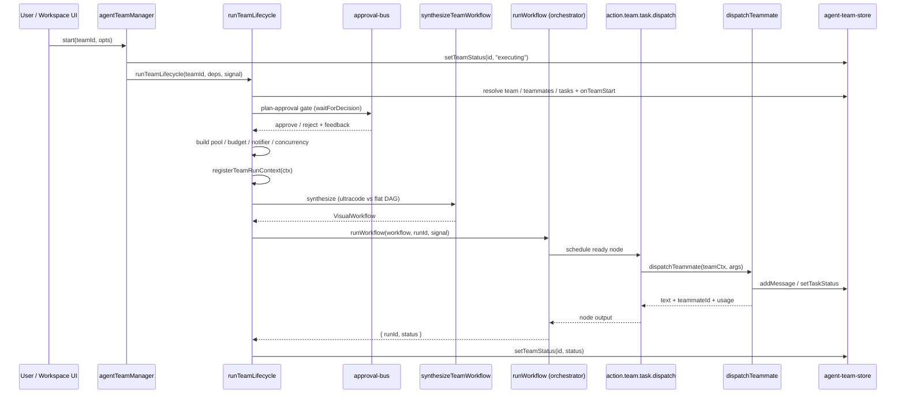

# Lifecycle & Workflow Synthesis

Per ADR-0022 ("Agent Team runtime hardening"), a team run is **not** a second orchestrator — it is a thin synthesizer that translates `(team, tasks)` into a `VisualWorkflow` and hands it to the one workflow runtime. This page traces the F-path spine end to end: the `agentTeamManager` facade, the ten ordered responsibilities of `runTeamLifecycle`, pure workflow synthesis, the per-run `TeamRunContext` registry, the orchestrator's concurrent ready-set scheduler, and the two node executors (`action.team.run`, `action.team.task.dispatch`) that bridge workflows back into teammate dispatch.

<TLDR>
  The UI calls `agentTeamManager.start` (`lib/ai/agent/agent-team.ts:91-115`), which sets the team
  status to `executing` and calls `runTeamLifecycle` (`agent-team-runtime.ts:122-527`). That function
  runs ten ordered steps — in-flight guard, store resolution, capability-audit gate, plan-approval
  loop, per-run module construction, HITL gate subscriptions, `registerTeamRunContext`
  (`team-run-context.ts:69`), synthesis (`synthesize-workflow.ts:44-154`, Kahn cycle check), and
  `runWorkflow`. The orchestrator's ready-set loop (`orchestrator.ts:446-475`) executes each
  `action.team.task.dispatch` node (`built-ins.ts:1537-1590`), which calls `dispatchTeammate` against
  the registered context. `abortTeam` (`agent-team-runtime.ts:530`) fires the per-team
  `AbortController` held in `inflightControllers` (`:99`). Deps are wired once at startup by
  `AgentTeamRuntimeInitializer` (`agent-team-runtime-initializer.tsx:22`).
</TLDR>

## The F-path sequence



## The manager facade — `lib/ai/agent/agent-team.ts`

`agentTeamManager` is a singleton object (`:78-124`) that proxies CRUD onto the Zustand `agent-team-store` and drives the runtime through `runTeamLifecycle` + `abortTeam`. Runtime dependencies are injected once via `configureAgentTeamRuntime`; calling `start` before configuration throws.

```typescript
// lib/ai/agent/agent-team.ts:48-52
export function configureAgentTeamRuntime(
  deps: Pick<RunTeamLifecycleDeps, "runLeadPlanning" | "notifierDeps">
): void {
  configuredDeps = deps
}
```

`start` maps the optional `opts.ultracode` boolean onto the runtime's `ultracodeOverride` enum (`force` / `off` / absent) and mirrors the lifecycle result back to the store:

```typescript
// lib/ai/agent/agent-team.ts:91-115
start: async (id, opts) => {
  if (!configuredDeps) {
    throw new Error(
      "Agent-team runtime is not configured — call configureAgentTeamRuntime(deps) at app startup."
    )
  }
  useAgentTeamStore.getState().setTeamStatus(id, "executing")
  const result = await runTeamLifecycle(id, {
    storeReader: bindStoreReader(),
    storeWriter: bindStoreWriter(),
    runLeadPlanning: configuredDeps.runLeadPlanning,
    notifierDeps: configuredDeps.notifierDeps,
    ...(opts?.ultracode === true
      ? { ultracodeOverride: "force" as const }
      : opts?.ultracode === false
        ? { ultracodeOverride: "off" as const }
        : {}),
  })
  useAgentTeamStore.getState().setTeamStatus(id, result.status)
},
```

| Method | Lines | Effect |
| --- | --- | --- |
| `configureAgentTeamRuntime` | `agent-team.ts:48-52` | Inject `runLeadPlanning` + `notifierDeps` at startup |
| `start(id, opts?)` | `agent-team.ts:91-115` | Set status `executing`, run lifecycle, mirror result |
| `pause(id)` | `agent-team.ts:116-119` | Call `abortTeam(id)`, set status `paused` |
| `shutdown(id)` | `agent-team.ts:120-123` | Call `abortTeam(id)`, set status `cancelled` |

Deps are wired exactly once at app startup, guarded against React Strict-Mode double-mount with a `useRef`:

```tsx
// components/providers/initializers/agent-team-runtime-initializer.tsx:16-28
export function AgentTeamRuntimeInitializer() {
  const hasInitialized = useRef(false)
  useEffect(() => {
    if (hasInitialized.current) return
    hasInitialized.current = true
    configureAgentTeamRuntime(buildAgentTeamRuntimeDeps())
  }, [])
  return null
}
```

## `runTeamLifecycle` — ten ordered responsibilities

`runTeamLifecycle` (`agent-team-runtime.ts:122-527`) is the synthesizer. It owns no execution loop of its own; every step below converges on `runWorkflow`. The order is load-bearing.

| # | Step | Lines |
| --- | --- | --- |
| 1 | Duplicate in-flight guard; allocate `runId`; wire `AbortController` into `inflightControllers` | `:127-139` |
| 2 | Resolve team / teammates / tasks from `storeReader`; dispatch `onTeamStart` hook | `:145-172` |
| 3 | Capability-audit gate — block on stale plugin refs until resolved | `:173-199` |
| 4 | Plan-approval loop — up to `maxPlanRevisions`, `runLeadPlanning` then `waitForDecision`, collect rejection feedback | `:202-249` |
| 5 | Build per-run modules — concurrency, model-preference, notifier, teammate pool, budget guard | `:251-263` |
| 6 | Wire HITL gate subscriptions — deadlock, teammate-fix, budget pause, budget warning/critical hooks | `:265-391` |
| 7 | `registerTeamRunContext(ctx)` | `:397-411` |
| 8 | Synthesize — ultracode patterns when active, else flat task DAG | `:413-437` |
| 9 | `runWorkflow({ workflow, trigger, runId, signal, concurrency })` | `:444-489` |
| 10 | `finally` — `unregisterTeamRunContext`, dispose subscriptions, release approval-bus waiters | `:500-523` |

Step 5 constructs the shared state objects passed to the executor through the run context:

```typescript
// lib/ai/agent/agent-team-runtime.ts:251-263 (per-run module construction)
const concurrency = createConcurrencyController(team.config?.maxConcurrentTeammates ?? 5)
const modelPref = createModelPreferenceController()
const notifier = createTeamNotifier({ runId, teamId }, deps.notifierDeps)
const pool = createTeammatePool({ teammates: workers, runId, teamId })
const budget = createBudgetGuard({
  limit: team.config?.tokenBudget ?? 0,
  onCritical: team.config?.onBudgetCritical ?? "notify",
  notifier,
  concurrencyCtrl: concurrency,
  modelCtrl: modelPref,
  runId,
})
```

### Abort semantics & state transitions

`inflightControllers` (`agent-team-runtime.ts:99`) is a module-scope `Map<teamId, AbortController>`. `abortTeam` looks the team up and aborts; the signal cascades into `runWorkflow`, which unwinds the ready-set loop:

```typescript
// lib/ai/agent/agent-team-runtime.ts:530-535
export function abortTeam(teamId: string, reason?: string): boolean {
  const ac = inflightControllers.get(teamId)
  if (!ac) return false
  ac.abort(new Error(reason ?? "Team aborted by operator"))
  return true
}
```

| State | Trigger | Action |
| --- | --- | --- |
| (idle) | `start()` | Allocate runId, set status `executing` |
| executing | plan-approval gate opens | Block at `waitForDecision`, await operator |
| executing | all teammates unavailable | `concurrency.reduceTo(0)`, open deadlock gate |
| executing | budget `pause_for_review` | `concurrency.reduceTo(0)`, open budget gate |
| executing | teammate disqualified | Non-blocking notify + open teammate-fix gate |
| executing | step fails / `abortTeam` fires | Record first failure, abort the run signal |
| executing -> completed/failed/cancelled | `runWorkflow` returns | Unregister context, mirror status, `onTeamComplete` |

<Status>HITL gate subscriptions reduce concurrency to zero rather than killing the run, so an approve decision can resume in place.</Status>

## Pure synthesis — `lib/ai/agent/team/synthesize-workflow.ts`

`synthesizeTeamWorkflow` (`:44-154`) is a pure function: no I/O, no side effects. It validates the task list, detects cycles with Kahn's algorithm, then emits one `action.team.task.dispatch` node per task and one edge per dependency.

- **Empty list** -> `SynthesizeError("empty")` (`:45-47`).
- **Unknown dependency id** -> `SynthesizeError("invalid_dep")` (`:52-58`).
- **Cycle** -> `SynthesizeError("cycle")` when the topological visit count differs from the task count.

```typescript
// lib/ai/agent/team/synthesize-workflow.ts (Kahn cycle detection, trimmed)
const inDegree = new Map<string, number>()
const adj = new Map<string, string[]>()
for (const t of input.tasks) {
  inDegree.set(t.id, t.dependencies.length)
  for (const dep of t.dependencies) {
    const arr = adj.get(dep) ?? []
    arr.push(t.id)
    adj.set(dep, arr)
  }
}
const queue: string[] = []
for (const [id, d] of inDegree) if (d === 0) queue.push(id)
let visited = 0
while (queue.length > 0) {
  const id = queue.shift()!
  visited += 1
  for (const next of adj.get(id) ?? []) {
    const d = (inDegree.get(next) ?? 0) - 1
    inDegree.set(next, d)
    if (d === 0) queue.push(next)
  }
}
if (visited !== input.tasks.length) {
  throw new SynthesizeError("cycle", `dependency cycle (visited ${visited} of ${input.tasks.length})`)
}
```

Node and edge construction is mechanical — each task becomes a `typeVersion: 1` dispatch node carrying its `teamId` / `taskId` params, and each dependency becomes an edge id `"depId->taskId"`:

```typescript
// lib/ai/agent/team/synthesize-workflow.ts (node + workflow assembly, trimmed)
const nodes = input.tasks.map((t) => ({
  id: t.id,
  type: "action.team.task.dispatch",
  typeVersion: 1,
  position: { x: 0, y: 0 },
  data: {
    label: t.title,
    params: {
      teamId: input.team.id,
      taskId: t.id,
      title: t.title,
      description: t.description,
      ...(t.expectedOutput ? { expectedOutput: t.expectedOutput } : {}),
    },
  },
}))

const workflowId = `__team__:${input.team.id}:${nanoid(8)}`
const workflow: VisualWorkflow = {
  id: workflowId,
  schemaVersion: 1,
  name: input.team.name,
  nodes,
  edges,
  settings: {
    errorPolicy: "stop",
    timeoutMs: input.wallClockTimeoutMs ?? 24 * 60 * 60_000,
    concurrency: 1,
    maxConcurrency: input.initialConcurrency,
    retryDefaults: DEFAULT_RETRY_POLICY,
  },
}
```

| Field | Value | Why |
| --- | --- | --- |
| `id` | `__team__:teamId:nanoid8` | Synthetic prefix; the UI must not navigate to a stored definition for this id |
| `settings.errorPolicy` | `stop` | First failure halts the DAG |
| `settings.timeoutMs` | `wallClockTimeoutMs` or 24h sentinel | Orchestrator skips a `0` timeout, so a 24h sentinel is used |
| `settings.maxConcurrency` | `initialConcurrency` | Seeded from `team.config.maxConcurrentTeammates` |
| node `typeVersion` | `1` | Pinned executor contract version |

## Per-run shared state — `lib/ai/agent/team/team-run-context.ts`

The synthesizer registers an immutable `TeamRunContext` keyed by `runId` before calling `runWorkflow`, so the dispatch executor can recover the live pool / budget / notifier from inside a node. The interface is verbatim:

```typescript
// lib/ai/agent/team/team-run-context.ts:40-65
export interface TeamRunContext {
  readonly runId: string
  readonly teamId: string
  readonly traceId?: string
  readonly team: AgentTeam
  readonly pool: TeammatePool
  readonly budget: BudgetGuard
  readonly notifier: TeamNotifier
  readonly concurrency: ConcurrencyController
  readonly modelPref: ModelPreferenceController
  readonly storeWriter: TeamStoreWriter
  readonly resolvedCapabilities: Map<string, ResolvedCapabilities>
}
```

| Function | Lines | Effect |
| --- | --- | --- |
| `registerTeamRunContext(ctx)` | `team-run-context.ts:69-71` | Insert into the module-scope registry Map |
| `getTeamRunContext(runId)` | `team-run-context.ts:73-75` | Lookup; `undefined` if the run is not registered |
| `unregisterTeamRunContext(runId)` | `team-run-context.ts:77-79` | Remove (called in the lifecycle `finally`) |

`TeamStoreWriter` (`:28-38`) is the minimal write surface — `addMessage`, `setTaskStatus`, `updateTeammate`, and an optional `setFinalResult` — so the dispatcher never imports the full store. Each field of the context is read-only; only the objects' internal state (breaker counters, budget totals, notifier dedupe cache) mutates, via their own methods.

## Orchestrator concurrency — `lib/workflow/runtime/orchestrator.ts`

The F-path adds concurrent ready-set scheduling to the shared workflow orchestrator. The default `maxConcurrency` of `1` preserves the legacy sequential behavior for every pre-existing workflow consumer.

```typescript
// lib/workflow/runtime/orchestrator.ts:446-475 (ready-set scheduling loop)
while (completed.size + skipped.size < validated.nodes.length) {
  if (firstFailure) break
  if (ac.signal.aborted && inflight.size === 0) break

  let scheduledThisTick = 0
  for (const stepId of order) {
    if (inflight.size >= concurrency.get()) break
    if (!isReady(stepId)) continue
    const promise = scheduleOne(stepId).finally(() => {
      inflight.delete(stepId)
    })
    inflight.set(stepId, promise)
    scheduledThisTick += 1
  }

  if (inflight.size === 0) {
    if (scheduledThisTick === 0) break
    await flushNewSkipLogs()
    continue
  }
  await Promise.race(inflight.values())
  await flushNewSkipLogs()
}
```

The loop re-reads `concurrency.get()` on every pass, so a HITL gate that calls `reduceTo(0)` immediately stops new scheduling while in-flight nodes drain. Two controllers feed it:

- **Concurrency** (`concurrency-controller.ts:21-53`): `reduceTo(n)` is **monotone non-increasing** — it never raises the cap — and `subscribe(fn)` fires on each reduction.
- **Model preference** (`model-preference-controller.ts:26-54`): `downshift()` sets `preferCheap = true` (and an optional cheaper `modelHint`), letting the budget guard's `handoff_to_background` action route subsequent dispatches to a smaller model.

## Node executors — `lib/workflow/nodes/built-ins.ts`

### `action.team.run` (`:1444-1525`)

A user-facing workflow node that invokes an entire team lifecycle. It threads any IM `trigger.binding` through as `triggeredFrom` for downstream fan-out, binds store reader/writer closures, and wraps the lifecycle call so any error is **non-retryable**:

```typescript
// lib/workflow/nodes/built-ins.ts:1444-1525 (trigger threading + non-retryable wrapper, trimmed)
const triggerBinding = ctx.trigger.binding
const triggeredFrom: WorkflowTriggeredFrom | undefined =
  triggerBinding?.adapterId && triggerBinding?.conversationKey
    ? {
        source: "im",
        adapterId: triggerBinding.adapterId,
        conversationKey: triggerBinding.conversationKey,
        ...(triggerBinding.sessionId ? { sessionId: triggerBinding.sessionId } : {}),
      }
    : undefined

const result = await runTeamLifecycle(teamId, deps, ctx.signal).catch((err: unknown) => {
  const message = err instanceof Error ? err.message : String(err)
  const wrapped = new Error(`action.team.run: ${message}`) as Error & { retryable?: boolean }
  wrapped.retryable = false
  throw wrapped
})
return { output: { teamId, teamRunId: result.runId, status: result.status, reason: result.reason } }
```

### `action.team.task.dispatch` (`:1537-1590`)

The synthesizer-emitted leaf node. It is **`retryable: true`** — a transient failure causes the orchestrator's `runStep` to back off and re-enter, and because each entry re-claims from the pool, retries naturally rotate to a different teammate:

```typescript
// lib/workflow/nodes/built-ins.ts:1537-1590 (trimmed)
registerNodeExecutor({
  kind: "action.team.task.dispatch",
  typeVersion: 1,
  retryable: true,
  execute: async (ctx) => {
    const params = ctx.params as {
      teamId?: string; taskId?: string; title?: string
      description?: string; expectedOutput?: string
    }
    if (!params.teamId || !params.taskId) {
      throw nonRetryable("action.team.task.dispatch requires 'teamId' and 'taskId'")
    }
    const [{ getTeamRunContext }, { buildTeammatePrompt }, { dispatchTeammate }] =
      await Promise.all([
        import("@/lib/ai/agent/team/team-run-context"),
        import("@/lib/ai/agent/agent-team-runtime-deps"),
        import("@/lib/ai/agent/team/dispatch-teammate"),
      ])
    const teamCtx = getTeamRunContext(ctx.runId)
    if (!teamCtx) {
      throw nonRetryable(
        `action.team.task.dispatch: no TeamRunContext registered for runId=${ctx.runId}`
      )
    }
    const task = {
      id: params.taskId,
      title: params.title ?? params.taskId,
      description: params.description ?? "",
      expectedOutput: params.expectedOutput,
    } as Parameters<typeof buildTeammatePrompt>[2]
    const result = await dispatchTeammate(teamCtx, {
      taskId: params.taskId,
      prompt: (teammate) => buildTeammatePrompt(teamCtx.team, teammate, task),
      signal: ctx.signal,
      validateOutput: true,
      recordToStore: true,
    })
    return {
      output: {
        text: result.text,
        teammateId: result.teammateId,
        teammateName: result.teammateName,
        tokenUsage: result.usage,
        attempt: ctx.attemptNumber ?? 1,
      },
    }
  },
})
```

| Node | Lines | Retryable | Role |
| --- | --- | --- | --- |
| `action.team.run` | `built-ins.ts:1444-1525` | No | Workflow -> team bridge; binds store, threads IM origin, returns `teamRunId` |
| `action.team.task.dispatch` | `built-ins.ts:1537-1590` | Yes | Per-task leaf; recovers context, dispatches, retry re-claims rotate teammates |

## Runtime deps wiring — `lib/ai/agent/agent-team-runtime-deps.ts`

`buildAgentTeamRuntimeDeps` (`:102-171`) supplies the two injected concerns: prompt builders and the production notifier deps. `buildTeammatePrompt` and `buildLeadPlanningPrompt` shape persona-aware prompts; `runLeadPlanning` runs the lead through `executeAgent`:

```typescript
// lib/ai/agent/agent-team-runtime-deps.ts:107-125 (lead planning, trimmed)
const runLeadPlanning = async ({ team, lead, feedback, signal }): Promise<LeadPlanResult> => {
  const workers = useAgentTeamStore
    .getState()
    .getTeammates(team.id)
    .filter((m) => m.role === "teammate")
  const prompt = buildLeadPlanningPrompt(team, workers, feedback)
  const systemPrompt =
    lead.config?.systemPrompt?.trim() ||
    team.config?.defaultSystemPrompt?.trim() ||
    LEAD_SYSTEM_PROMPT
  const result = await executeAgent(prompt, { systemPrompt, abortSignal: signal })
  return { planText: result.text ?? "" }
}
```

`defaultNotifierDeps` routes `deliver` into the ADR-0042 Unified Notification Center and `openGate` into the pending-gates store that renders HITL modals:

```typescript
// lib/ai/agent/agent-team-runtime-deps.ts:133-165 (notifier deps, trimmed)
const defaultNotifierDeps: TeamNotifierDeps = {
  deliver: (p) => {
    void import("@/lib/notifications/runtime").then(({ notify }) =>
      notify({
        source: "agent-team",
        level: p.level === "warn" ? "warning" : p.level === "critical" ? "critical" : "info",
        title: p.title,
        body: p.body,
        dedupeKey: p.dedupeKey,
        groupKey: p.runId,
        sourceRef: { kind: "team-run", id: p.runId },
        directed: p.level === "critical",
      })
    )
  },
  openGate: (gate) => {
    usePendingGatesStore.getState().open({
      key: gate.key,
      gateType: gateTypeFromScope(gate.key.scope),
      title: gate.title,
      body: gate.body,
      runId: gate.runId,
      teamId: gate.teamId,
      taskId: gate.taskId,
    })
  },
}
```

## Crash recovery

Because a team run **is** a workflow run (`triggerKind: "team"`), there is no team-specific recovery code. `resumeInFlightRuns` reads the shared `workflowRuns` table and replays through the same orchestrator, so a team run resumes exactly like any other interrupted workflow. The dispatch node simply re-acquires its `TeamRunContext` by `runId` on the resumed pass.

<StatGrid>
  <Stat label="Lifecycle steps" value="10" />
  <Stat label="Default maxConcurrency" value="1" />
  <Stat label="dispatch typeVersion" value="1" />
</StatGrid>

## Related

<Cards>
  <Card title="Data Model" href="./data-model" description="AgentTeam, teammates, tasks, and the workflow-run mapping." />
  <Card title="Dispatch & Shared State" href="./dispatch-and-shared-state" description="dispatchTeammate, the teammate pool circuit breaker, and the budget guard." />
  <Card title="HITL Gates" href="./hitl-gates" description="Plan-approval, deadlock, budget, teammate-fix, and capability-audit gates over the approval bus." />
  <Card title="Ultracode & Patterns" href="./ultracode-and-patterns" description="Complexity-aware trigger and the higher-order pattern nodes." />
  <Card title="Visual Workflows" href="../subsystems/visual-workflows" description="The orchestrator, node executors, and run persistence the synthesizer reuses." />
  <Card title="ADR-0022" href="../adr/0022-agent-team-runtime-hardening" description="The runtime-hardening decision behind the F-path spine." />
</Cards>
