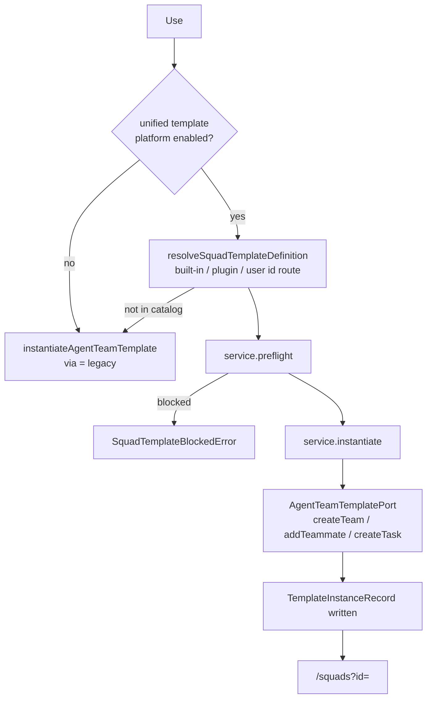

# Surfaces

ADR-0140 dissolved `/agent-teams/workspace`. A Squad is an executor a conversation can be handed to, not a place you navigate to, so its six tabs went to the surfaces that already owned each part.

<TLDR>
- **Configuration** lives in the Squads section of Settings: the library rail, a detail panel with roster, provenance and derive actions, and the template gallery.
- **Runtime** lives on `/squads`: a fleet console with a runs tab and a board tab, plus start, pause, resume and stop.
- **Per-run detail** lives on `/agent-runs`, which gains three Squad-only tabs (Coordination, Report, Operations) when the row is a Squad run.
- **The composer chip** binds a conversation to a Squad, stored on `sessions.squadId`.
- `/agent-teams` and `/agent-teams/workspace` are client-side redirects to `/squads` and render nothing.
</TLDR>

<StatGrid>
  <Stat label="Run-detail tabs" value="6 + 3" hint="overview · activity · changes · tests · artifacts · approvals, plus coordination · report · operations on a Squad run" />
  <Stat label="Fleet console tabs" value="2" hint="runs and board on desktop, with a third squads tab on the phone" />
  <Stat label="Template row actions" value="7" hint="Use · Edit · Duplicate · Publish · Export package · Fork · Delete" />
  <Stat label="Tombstone routes" value="3" hint="/agent-teams, /agent-teams/workspace and /me/agent-teams-settings, all redirecting to /squads" />
</StatGrid>

## Where Each Tab Went

| Old workspace tab | Lives now in |
| --- | --- |
| Overview, run controls | `/squads`, the inspector's `TeamRunControls` |
| Tasks (board) | `/squads`, the Board tab |
| Chat | The conversation itself, via the composer executor chip |
| Activity, operations, consensus | `/agent-runs`, the run detail's Squad tabs |
| Members, and the nine governance sections | Settings, under Squads, in the detail panel |
| Template gallery | Settings, under Squads, in the Templates panel |
| Live worktrees, reclaimed branches | `/workspace` |

## Settings > Squads

Registered as the `squads` section in the `ai` group (`components/settings/settings-nav-config.ts:274`), lazy-mounted by the Settings shell as one of the full-height sections: a rail plus a detail pane, both owning their own scroll.

Addressing is `?section=squads&squadTab=…`. `nav-config.ts` is pure and holds the whole vocabulary: one static panel (`templates`), squad panels keyed `squad:<id>`, and `resolveSquadPanel`, which degrades exact static, then exact live squad, then the first surviving squad, then `templates`. With no parameter at all it lands on the first Squad rather than on Templates.

### The rail

`squads-nav.tsx` renders, top to bottom: a search box that filters only the Squad list (Templates is deliberately never filtered away), a **New Squad** button, an **Auto-compose** icon button, the Templates row, a "Your Squads" label, and one row per Squad showing its portrait, name and member count. The empty state distinguishes "no Squads yet" from "nothing matched".

The list is workspace-scoped: a Squad is shown when it has no `projectId` or its `projectId` matches the active workspace. **New Squad** goes through the shared `useCreateSquad` hook so a new Squad starts on durable-v2 where the workspace supports it, and the same section consumes the native `File > New Squad` menu request. Auto-compose reuses `AutoComposeDialog` verbatim: it was only ever reachable from a tab of the retired workspace, so ADR-0140 took the door away without moving the room.

### The detail panel

`squad-detail-panel.tsx` renders, in order:

1. **Name** and **Description**, deferred inputs committing on blur through `updateTeam`. An empty name is rejected.
2. **Members**, which mounts `AgentTeamMembers` from `components/agent/workspace/members` whole. This is the real roster editor, not a read-only list.
3. A **plugin slot** at the `agent.team.panel` extension point. Its declared host used to be the workspace overview, which nothing rendered, so registrations silently never appeared.
4. **Made from a template**, the provenance block described below.
5. **Reuse this squad**, the derive actions described below.
6. A **danger zone** with Delete Squad behind a confirm dialog.
7. **Advanced governance**, one collapsed group mounting `AgentTeamSettings` whole, rather than nine more rows in the rail.

### Provenance: where a Squad came from

`squad-template-provenance.tsx` reads `useSquadTemplateInstance(squadId)`, which scans `repository.listInstances()` for the record whose `resources` contain `{ domain: "agentTeam", id: squadId }`. The scan is deliberate, because `listInstances` has no by-resource index and the row count is bounded.

When a record exists the block mounts `TemplateInstanceCard`, the same card the Template Studio uses, extended with a title and summary rather than forked. That is what makes the three lifecycle verbs reachable from Settings.

- **Update** is two steps. `service.planUpdate(instanceId, version)` produces a plan, and `service.applyUpdate(plan, { confirmed: true, resolutions })` applies it. `planUpdate` refuses an unknown or detached instance, a missing or yanked release, and a cross-domain move, and it consults the adapter's `isActive`, which for a Squad means "is it planning or executing". `applyUpdate` refuses a blocked plan, an unanswered conflict, and a `contentHash` that drifted since planning.
- **Detach** stamps `detachedAt` on the instance. It severs lineage and does **not** delete the Squad.
- **Rebind** is the way back. It clears both `detachedAt` and `sourceUnavailableAt`, which is what makes it a reattach rather than a second kind of detach.

Before this card existed, four of the five instance verbs had no caller anywhere in the app.

When no record exists the block says so explicitly rather than rendering nothing.

### Derive actions

`squad-derive-actions.tsx` offers two.

- **Duplicate** copies the Squad through `duplicateSquad(squadId, { name, projectId })`. The dialog includes a workspace picker, because `projectId` is a real Dexie boundary now, so copying into another workspace genuinely moves the copy.
- **Save as template** calls the store's `saveAsTemplate`, then awaits `publishSquadTemplateToPlatform` so the draft exists before anything reads it. A checkbox, on by default, additionally offers to **publish it as a version**, which runs `service.getPublishSuggestion` and confirms the bump before calling `service.publish`.

### The template gallery

`agent-team-templates-section.tsx` fills the Templates panel. Rows are ordered built-ins first (grouped by one of eight categories), then user templates, then plugin-contributed entries. Each row carries badges for its origin, its platform status, missing dependencies, and any fork lineage.

| Action | What it does |
| --- | --- |
| **Use** | The lineage path, described below |
| Edit | `updateTemplate`, then re-mirrors the draft to the platform |
| Duplicate | Copies to a new id, mirrors it, and opens the editor |
| **Publish** | `getPublishSuggestion`, then `service.publish` with the suggested bump |
| **Export package** | Lists non-yanked releases, then `service.exportPackage` and a `.cognia-template` download |
| **Fork** | `service.fork` into a new draft |
| Delete | Removes the local template |

Publish, Export and Fork are offered only for templates the user owns, and are rendered-and-disabled rather than hidden when the template is not in the right state, so the control can say why. The header also offers **Import package**, which inspects the archive first and shows its trust level (built-in, marketplace, signed-unknown or unsigned, the last two flagged) before importing.

### The lineage path behind Use

Clicking Use runs `applySquadTemplate` (`lib/agent-team/apply-squad-template.ts:90`).

A template resolves to a definition id by one of three routes. A built-in is `builtin.agentTeam.<id>` at `1.0.0`, a plugin's is `<pluginId>:<defId>` at `0.0.0-compat`, and a user template is `legacy.agentTeam.<id>`, a draft until it is published. Yanked and tombstoned rows are filtered out, the newest release wins, and the draft is the fallback.

The adapter's port owns every write. Its `instantiate` does four things the legacy path never did: it resolves team-scoped twin slots, writes each teammate's capability overlay, remaps task dependency ids in topological order, and rolls the whole partial Squad back by deleting it if anything throws.

Exactly two cases still take the legacy path, and both say so. Either the platform feature flag is off, or the definition is genuinely absent from the catalog, which happens for a user template mirrored while the flag was off, a plugin unloaded between render and click, or a built-in overlay not yet projected.

<Callout type="warn" title="One asymmetry worth knowing">
  `ctx.team.instantiateTemplate` still uses the legacy `instantiateAgentTeamTemplate`, so a
  Squad a plugin instantiates gets **no** `TemplateInstanceRecord` and therefore no lineage,
  no update and no detach. Only the Settings gallery goes through the platform.
</Callout>

## `/squads`

`app/squads/page.tsx` renders `SquadFleetConsole` on a wide layout and `SquadsMobileBody` on a compact one. It is deliberately runtime-only, because everything about *configuring* a Squad lives in Settings.

Deep links arrive as `?id=`, never `[id]`. This app ships as a static export consumed by Tauri and Capacitor, where dynamic segments do not exist at runtime. `use-squad-route-state.ts` owns five parameters: `?id=`, `?run=` (the execution run open in the Runs tab, the same id space as `/agent-runs?run=`), `?tab=` (one of `squads`, `runs`, `board`), `?q=` and `?filter=` (one of `all`, `waiting`, `live`). Defaults drop out of the URL, and every write is a `router.replace` with `scroll: false`.

The desktop console is a list pane, a centre with two tabs, and an inspector.

- **Runs** renders the canonical `AgentRunsPanel` embedded, pinned to `kind = team` and to the selected Squad (ADR-0169). Same rows, same detail pane, same `allowedActions` and the same review form as `/agent-runs`. The retired command centre and per-team runs list, with their own history queries, are gone.
- **Board** renders `AgentTeamTasks` for the selected Squad, and an explicit empty state when none is selected.
- The **inspector** shows name and description, then `TeamRunControls` (start, start with ultracode, pause, resume, stop, with Start disabled by the first readiness blocker), then the `SquadReadinessCard` with every blocker and the action that clears it, then a "Configure this Squad" link back into Settings. Abort is gone: the visible destructive action is Stop, and it is terminal.

The header offers **Manage Squads**, which is the Settings deep link, and **Live host activity** into `/fleet` when a fleet snapshot exists. The phone renders the same pieces under three tabs, with the inspector in a sheet.

## `/agent-runs`

The run cockpit lists every execution run and opens one in a detail pane. Six tabs are always present: Overview, Activity, Changes, Tests, Artifacts and Approvals. Three more appear only when the row is a Squad run, which `isSquadRun` decides by `row.kind === "team"`. Offering them on a direct-chat or workflow run would be a permanently empty section rather than a capability.

| Squad tab | Renders | Reuses |
| --- | --- | --- |
| **Coordination** | The open consensus rounds and delegations for the Squad | `ConsensusPanel` and `DelegationsPanel`, both given an explicit `teamId` |
| **Report** | KPI cards, token burn, the task line and a plugin slot | The four `activity-report` components |
| **Operations** | Durable-runtime operations, with links out to the editor, terminal and browser | `DurableOperations`, given an explicit `runId` |

All three resolve the Squad run by `row.sourceId`, never by `runId`. While a team run is live the row can arrive from the broker with no `runId` and no allowed actions at all. All three also carry a distinct "not on this device" empty state, because a phone syncs `executionRuns` and nothing else.

The Report tab says out loud that the report it shows is the latest for the Squad rather than one pinned to this run, because the runtime does not yet stamp a per-run report.

Both panels named above take a `teamId` prop for exactly this reason. Omitted, they fall back to `activeTeamId`, which only `createTeam` writes and nothing persists, so the cockpit would otherwise render whatever Squad happened to be created last in the session. See the selector notes in [Data Model & Store](./data-model).

## The Composer Executor Chip

A conversation picks its executor from the composition chip in the composer's bottom toolbar (`components/agent/composition/composition-chip.tsx`, with the executor rows in `executor-choice.tsx`).

- The chip's label is the bound Squad's name, or a "Squad missing" state when the binding names a Squad that no longer exists.
- Each Squad row shows a portrait, the member count and a status dot with three states: waiting, live, idle.
- With six or more Squads the popover form gains a search box. The dropdown form never does, because Radix typeahead would swallow the keystrokes.
- The empty note distinguishes "choosable once this conversation has started" from "no Squads yet, create one in Settings".
- While a Squad is bound, the Model picker and Effort chip are replaced by a read-only chip explaining that model and thinking level come from the Squad's members.

The chip is mounted on an external runtime too **when a Squad is bound**. Hiding it there hid the only control that could undo the binding, leaving a conversation permanently routed to a Squad with nothing on screen saying so.

### Where the binding lives, and how a turn routes

The binding is `sessions.squadId`, an indexed Dexie column introduced at v177 and today part of the collapsed schema. It is deliberately distinct from `sessions.teamId`, which is the conversation's *shape* (a Character Team room) rather than its executor.

Routing happens above `resolveSendOptions`, never inside it. That function answers "how do I run one model turn", and a Squad run is not one.

1. `resolveTurnSquad(sources)` picks the target. A turn override from the composition axis wins over the session binding. An override naming any non-`team` policy resolves to no Squad, so a bound conversation can still send one plain turn, and a `team` override with no `orchestrationRef` also resolves to none, because a half-made selection must not silently run something the user did not pick.
2. `startSquadRun(input)` is the one dispatch funnel. The chat controller branches to it before any direct-chat bookkeeping, leaves a `squad-run` message part carrying identity only, and reports `squadNotFound` or `squadDispatchFailed` as diagnostics on failure.

The same funnel serves the IM lane, the `/squad` slash command, and `ctx.team.start`.

## The Tombstones

`/agent-teams`, `/agent-teams/workspace` and `/me/agent-teams-settings` are client-side redirects to `/squads` and render nothing. They stay routable rather than 404ing because a bookmark, or a link inside an old message, names a team id, and `/squads?id=` still answers it. Client-side is the only kind of redirect available in a static export.

None of them is in navigation. The rail entry is `squads`, pinned by default, and a saved layout holding the old `agent-teams` id is rewritten on read. Without that alias a stale pin would silently become an unpinned entry sitting in More.

<Callout title="The @mention dispatch chain is gone">
  The workspace Chat tab had its own pipeline under `lib/agent-team/`: a mention parser, a
  composite streamer, a conversation-context builder and a runtime-availability hook. All four
  were deleted with the tab. `runtime-targets.ts` survives as the shared @mention target
  vocabulary for the chat composer and the mention picker, not as a dispatch chain.
</Callout>

## Related

<Cards>
  <Card href="./index" title="Squads" description="What a Squad is and how a run is synthesized" />
  <Card href="./data-model" title="Data Model & Store" description="Types, the persist-v8 store and the Dexie tables" />
  <Card href="./hitl-gates" title="HITL Gates" description="Where GateModalsHost and the plan panel render" />
  <Card href="./capabilities-and-plugins" title="Capabilities & Plugins" description="Capability scope, plugin overlays and ctx.team" />
</Cards>
