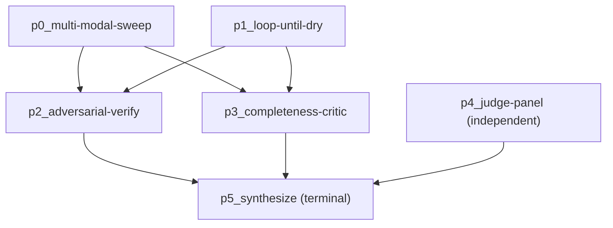

# Ultracode & Quality Patterns

A normal team run synthesizes a flat task DAG: one workflow node per `AgentTeamTask`, wired by `dependencies`. **Ultracode mode** replaces that. Instead of mirroring tasks, a lead-planner teammate composes a pipeline of higher-order `pattern.*` workflow nodes — each one internally fans out many tool-enabled `dispatchTeammate` calls under the run's concurrency bound. This is the Claude Code "ultracode" quality-orchestration model ported onto the Agent Team subsystem: parallel blind finders, adversarial refutation, judge panels, a completeness critic, and a terminal synthesizer that folds everything into one cited report.

The six pattern nodes live in `lib/ai/agent/team/patterns/`. The planner (`ultracode-planner.ts`) decides which patterns to compose and how wide; the synthesizer (`synthesize-ultracode.ts`) wires them into a forward-only DAG; the trigger (`ultracode-trigger.ts`) decides whether a run is ultracode at all; the type + Zod surface lives in `types/agent/ultracode.ts`.

<TLDR>
  `isUltracodeActive` (`lib/ai/agent/team/ultracode-trigger.ts:15-31`) gates the run: override `force`/`off`
  &gt; `config.ultracode.enabled` &gt; `autoMode` always/never/auto (auto = `taskComplexity === "complex"`).
  `planUltracodeWorkflow` (`ultracode-planner.ts:34-62`) dispatches a structured plan with
  `preferToolEnabled: false`. `synthesizeUltracodeWorkflow` (`synthesize-ultracode.ts:89-172`) wires
  `pattern.*` nodes forward-only: sweep/loop accumulate findingSources, adversarial-verify consumes all
  and survivors REPLACE them, completeness-critic reads without consuming, judge-panel is independent,
  synthesize fans in from EVERY prior node and is terminal. Workflow id `__team__:<teamId>:<nonce>`;
  the terminal report becomes `team.finalResult` (`agent-team-runtime.ts:413-487`).
</TLDR>

## When ultracode activates — `ultracode-trigger.ts`

`isUltracodeActive` mirrors Claude Code's effort toggle. An explicit operator override always wins; otherwise the team must have ultracode enabled, and `autoMode` decides. The `auto` default only orchestrates when the routing assessment judged the task complex.

```typescript
// lib/ai/agent/team/ultracode-trigger.ts:15-31
export function isUltracodeActive(
  team: Pick<AgentTeam, "config" | "routingAssessment">,
  override?: UltracodeOverride
): boolean {
  if (override === "force") return true
  if (override === "off") return false

  const uc = team.config.ultracode
  if (!uc?.enabled) return false

  const mode = uc.autoMode ?? "auto"
  if (mode === "never") return false
  if (mode === "always") return true

  // "auto": only for complex tasks, per the routing assessment.
  return team.routingAssessment?.factors.taskComplexity === "complex"
}
```

`UltracodeOverride` is `"force" | "off" | undefined`, threaded from the workspace run control (the **Run Ultracode** button forces it on).

## Lead planning — `ultracode-planner.ts`

Before a run fans out, a planner teammate decides WHICH patterns to compose and how wide to fan each one. `planUltracodeWorkflow` dispatches a single structured call with `taskId: "ultracode-plan"` and `preferToolEnabled: false` — planning is pure reasoning over the objective, no repo tools needed. Team knobs (`skepticsPerFinding`, `judgesPerAttempt`, `maxFinderRounds`) are appended to the prompt as defaults. The result is validated by `ultracodePlanSchema`.

```typescript
// lib/ai/agent/team/ultracode-planner.ts:34-62
export async function planUltracodeWorkflow(
  teamCtx: TeamRunContext,
  opts: PlanUltracodeOptions = {}
): Promise<UltracodePlan> {
  const objective =
    teamCtx.team.task?.trim() || teamCtx.team.description?.trim() || teamCtx.team.name
  const uc = teamCtx.team.config.ultracode ?? {}
  // knobs = skepticsPerFinding / judgesPerAttempt / maxFinderRounds, joined and appended
  const { value } = await dispatchStructured(
    teamCtx,
    {
      taskId: "ultracode-plan",
      prompt: `${PLANNER_GUIDANCE}\n\nObjective:\n${objective}${knobs ? `\n\nTeam knobs — ${knobs}.` : ""}`,
      signal: opts.signal,
      // Planning is pure reasoning — no repo tools needed.
      preferToolEnabled: false,
    },
    ultracodePlanSchema,
    { schemaHint: PLAN_HINT }
  )
  return value
}
```

`PLANNER_GUIDANCE` (`ultracode-planner.ts:17-27`) describes the six patterns and bakes in the composition heuristics:

- **audit / bug-hunt / research** → a finder (`multi-modal-sweep` or `loop-until-dry`) → `adversarial-verify` → `completeness-critic` → `synthesize`.
- **design / solution** → `judge-panel` → `synthesize`.
- Keep counts proportional to importance; never exceed **16** (enforced by `ultracodeStageSchema.count.max(16)`).

## Synthesizing the DAG — `synthesize-ultracode.ts`

`synthesizeUltracodeWorkflow` turns the plan's stage list into a `VisualWorkflow` of `pattern.*` nodes. The wiring is **forward-only** and stage-kind-driven. Each stage becomes a node with id `p${i}_${stage.pattern}` and type `pattern.${stage.pattern}`; a terminal `synthesize` stage is appended if the plan did not end with one.

```typescript
// lib/ai/agent/team/synthesize-ultracode.ts:122-145
    switch (stage.pattern) {
      case "multi-modal-sweep":
      case "loop-until-dry":
        findingSources.push(nodeId)
        break
      case "adversarial-verify":
        for (const src of findingSources) addEdge(src, nodeId)
        findingSources = [nodeId] // survivors replace raw findings
        break
      case "completeness-critic":
        for (const src of findingSources) addEdge(src, nodeId)
        break
      case "judge-panel":
        // Independent of findings — produces a winner from the objective.
        break
      case "synthesize":
        // Fan in from everything emitted so far.
        for (const prior of nodes) {
          if (prior.id !== nodeId) addEdge(prior.id, nodeId)
        }
        terminalNodeId = nodeId
        break
    }
```

The wiring rules in prose:

| Stage kind | Edges in | Effect on `findingSources` |
| --- | --- | --- |
| `multi-modal-sweep` / `loop-until-dry` | none | appends its node id |
| `adversarial-verify` | from every current findingSource | survivors **REPLACE** them (becomes the sole source) |
| `completeness-critic` | from every current findingSource | none — reads without consuming |
| `judge-panel` | none | none — independent, produces a winner from the objective |
| `synthesize` | from **every** prior node | terminal; sets `terminalNodeId` |

The workflow id is `__team__:<teamId>:<nonce>` (`nanoid(8)`); settings use `errorPolicy: "stop"`, `timeoutMs` from the wall-clock timeout, `concurrency: 1`, `maxConcurrency: max(1, initialConcurrency)`, and `retryDefaults: DEFAULT_RETRY_POLICY`. The function returns `{ workflow, terminalNodeId }`; the terminal `synthesize` node's `report` output becomes `team.finalResult`.

### Example synthesized DAG

A bug-hunt run where the planner composed a sweep plus a loop finder, a verify, a critic, and an independent design judge-panel:



After `adversarial-verify` runs, `findingSources` is `[p2_adversarial-verify]` only — but `synthesize` fans in from all prior nodes regardless, so critic gaps and the judge winner still reach the report.

## The six pattern nodes — `lib/ai/agent/team/patterns/`

Each module registers its executor on import via `registerNodeExecutor`. All are `retryable: false`, `typeVersion: 1`. Every pattern resolves the per-run `TeamRunContext` (`getTeamCtxOrThrow`), fans out tool-enabled `dispatchStructured` calls bounded by `fanoutLimit(teamCtx)`, and exchanges data through the upstream output map.

### pattern.multi-modal-sweep

Parallel finders, each blind to the others, each running a **different** search modality (by-container, by-content, by-entity, …). Returns the deduped union. Params: `MultiModalSweepParams` (`objective`, `modalities: string[]`). Output: `{ findings, finderCount }`.

```typescript
// lib/ai/agent/team/patterns/multi-modal-sweep.ts:41-65
  const results = await mapSettled(
    modalities,
    fanoutLimit(teamCtx),
    async (modality, i) => {
      const r = await dispatchStructured(
        teamCtx,
        {
          taskId: `${ctx.stepId}:sweep:${i}`,
          prompt:
            `Objective: ${objective}\n\nSearch approach: ${modality}\n\n` +
            "Find concrete, specific findings using ONLY this approach. ...",
          signal: ctx.signal,
        },
        findingsResultSchema,
        { schemaHint: FINDINGS_HINT }
      )
      return r.value.findings
    },
    (err, _modality, i) => ctx.log("warn", `sweep finder ${i} failed: ${String(err)}`)
  )
  const findings = dedupeFindings(assignFindingIds(flat))
```

### pattern.loop-until-dry

For unknown-size discovery: keep spawning finder rounds until `dryRoundsToStop` (default **2**) consecutive rounds add nothing new, bounded by `maxRounds` (default **4**). Each round's prompt embeds an "Already found (do NOT repeat these)" known-list; dedupe is via a `seen` Set of `findingKey`. Output: `{ findings, rounds, converged }`. The `converged` flag is the convergence signal; when `maxRounds` is hit first it logs that coverage may be incomplete (no-silent-caps).

```typescript
// lib/ai/agent/team/patterns/loop-until-dry.ts:47-92
  while (round < maxRounds && dryStreak < dryRoundsToStop) {
    round += 1
    const knownSummary =
      all.length === 0
        ? "Nothing found yet."
        : `Already found (do NOT repeat these):\n${all.map((f) => `- ${f.title}`).join("\n")}`
    // ... fan out findersPerRound finders, dedupe by findingKey into `fresh` ...
    if (fresh.length === 0) dryStreak += 1
    else dryStreak = 0
  }
```

### pattern.adversarial-verify

Spawns **N skeptics per finding**, each prompted to REFUTE it (default `real=false` when uncertain). When `lenses` is set, each skeptic gets a distinct angle — `correctness`/`security`/`perf`/`repro` — for perspective-diverse verification (`repro` runs tool-enabled to actually reproduce). `skepticsPerFinding` default **3** (or one per lens). Output: `{ findings (survivors), killed, verified }`. The tie-kills rule is conservative — a finding survives only with **strictly** more confirmations than refutals:

```typescript
// lib/ai/agent/team/patterns/adversarial-verify.ts:116-124
  const verified: VerifiedFinding[] = findings.map((finding, fi) => {
    const verdicts = byFinding.get(fi) ?? []
    const realVotes = verdicts.filter((v) => v.real).length
    const refuteVotes = verdicts.length - realVotes
    // Survives only with strictly more confirmations than refutals; a tie
    // (or a finding whose skeptics all errored out) is killed — conservative.
    const survives = verdicts.length > 0 && realVotes > refuteVotes
    return { finding, verdicts, realVotes, refuteVotes, survives }
  })
```

### pattern.judge-panel

Independent of findings. **Phase 1**: one attempt per angle, in parallel. **Phase 2**: every judge scores every attempt 0–10 under one concurrency bound; attempts are ranked by average score. `judgesPerAttempt` default **3**. Params: `JudgePanelParams` (`angles`, `judgesPerAttempt`). Output: `{ winner, ranked, attempts }`.

```typescript
// lib/ai/agent/team/patterns/judge-panel.ts:74-119
  // Phase 2 — every judge scores every attempt, all under one concurrency bound.
  const jobs = attempts.flatMap((attempt, ai) =>
    Array.from({ length: judgesPerAttempt }, (_, ji) => ({ attempt, ai, ji }))
  )
  // ... dispatch judge scores, tally scoresByAttempt ...
  const ranked: RankedAttempt[] = attempts
    .map((attempt, ai) => ({ attempt, scores: scoresByAttempt.get(ai) ?? [], avgScore: average(...) }))
    .sort((a, b) => b.avgScore - a.avgScore)
  const winner = ranked[0]
```

### pattern.completeness-critic

A single critic over the upstream findings, asking what is MISSING — a search angle never run, a claim left unverified, a region or source not yet examined. The gaps it surfaces feed forward (the synthesizer calls them out as limitations). Output: `{ gaps: CritiqueGap[] }`.

```typescript
// lib/ai/agent/team/patterns/completeness-critic.ts:42-53
      prompt:
        `Objective: ${objective}\n\n` +
        `The work so far produced these findings:\n${findingsBlock}\n\n` +
        "Acting as a completeness critic, identify what is MISSING — a search angle never run, " +
        "a claim left unverified, a region or source not yet examined. For each gap, optionally " +
        "suggest the concrete next search that would close it. ...",
      signal: ctx.signal,
    },
    critiqueResultSchema,
    { schemaHint: GAPS_HINT }
```

### pattern.synthesize

The terminal node. Folds the verified `findings`, the judge-panel `winner`, and any open `gaps` into one cited report, posts it to the team chat as a `result_share` message (truncated at 4000 chars), and returns it so the run can write it to `team.finalResult`. Output: `{ report, citations, findingCount }`.

```typescript
// lib/ai/agent/team/patterns/synthesize.ts:74-92
  // Surface the report in the team chat.
  teamCtx.storeWriter.addMessage({
    teamId: teamCtx.teamId,
    senderId: r.teammateId,
    type: "result_share",
    content: r.value.report.length > 4000 ? `${r.value.report.slice(0, 3999)}…` : r.value.report,
  })
  return { output: { report: r.value.report, citations: r.value.citations ?? [], findingCount: findings.length } }
```

## Shared helpers — `patterns/_shared.ts`

Every pattern node draws on this toolbox so concurrency, error handling, and finding identity stay uniform.

| Helper | Line | Purpose |
| --- | --- | --- |
| `nonRetryable` | `:13` | wraps an Error with `retryable=false` so the orchestrator never retries it |
| `getTeamCtxOrThrow` | `:20` | resolves the per-run `TeamRunContext` by `runId`, non-retryable throw if missing |
| `fanoutLimit` | `:31` | effective fan-out width = run's live concurrency cap, never below 1 |
| `mapSettled` | `:40` | bounded-concurrency map; per-item rejection becomes `null` and is logged via `onError` |
| `collectFindings` | `:86` | gathers upstream `findings`, assigns ids, dedupes by `findingKey` |
| `dedupeFindings` | `:96` | dedupe by `findingKey`, first-occurrence order |
| `renderFinding` | `:109` | one-line render `[severity] title (location): detail` for prompt embedding |

## Type + schema surface — `types/agent/ultracode.ts`

Every structured exchange is validated by a Zod schema that `structured-dispatch.ts` consumes (it instructs a teammate to emit a fenced JSON block, parses it, validates, retrying once).

```typescript
// types/agent/ultracode.ts (selected)
export interface Finding { id?: string; title: string; detail: string; location?: string; severity?: FindingSeverity }   // findingSchema :41-49
export interface Verdict { real: boolean; reasoning: string; lens?: VerifierLens }                                       // verdictSchema :73-78
export interface Attempt { angle: string; content: string }                                                              // attemptSchema :85-88
export interface CritiqueGap { description: string; suggestedSearch?: string }                                           // critiqueGapSchema :112-116
export interface SynthesisReport { report: string; citations?: string[] }                                                // synthesisReportSchema :128-131
export interface UltracodeStage { pattern: UltracodePatternKind; instruction: string; count?: number; variants?: string[] } // ultracodeStageSchema :201-209
export interface UltracodePlan { summary: string; stages: UltracodeStage[] }                                             // ultracodePlanSchema :212-216
```

Companion Zod schemas — `findingsResultSchema`, `verdictSchema`, `attemptSchema`, `judgeScoreSchema`, `critiqueResultSchema`, `synthesisReportSchema`, `ultracodePlanSchema` — back each pattern node's `dispatchStructured` call. `findingKey` (`:63-67`) is the canonical dedup key (location, else normalized title), shared by `loop-until-dry`'s all-seen set and the verify aggregator.

## Lifecycle integration — `agent-team-runtime.ts`

The runtime branches on `ultracodeActive`: a side-effect import registers the `pattern.*` executors, the planner produces a plan, the synthesizer wires the DAG, and `runWorkflow` executes it. On success the terminal report is persisted via `storeWriter.setFinalResult`.

```typescript
// lib/ai/agent/agent-team-runtime.ts:413-429
    // ── Synthesize the VisualWorkflow (ultracode patterns vs. flat task DAG) ──
    let workflow: VisualWorkflow
    if (ultracodeActive) {
      // Side-effect import registers the pattern.* node executors.
      await import("./team/patterns")
      const [{ planUltracodeWorkflow }, { synthesizeUltracodeWorkflow }] = await Promise.all([
        import("./team/ultracode-planner"),
        import("./team/synthesize-ultracode"),
      ])
      const teamCtx = getTeamRunContext(runId)!
      const plan = await planUltracodeWorkflow(teamCtx, { signal: ac.signal })
      ;({ workflow } = synthesizeUltracodeWorkflow({
        team,
        plan,
        initialConcurrency: concurrency.get(),
        wallClockTimeoutMs: team.config.defaultTimeout,
      }))
    } else { /* flat task DAG via synthesizeTeamWorkflow */ }
```

```typescript
// lib/ai/agent/agent-team-runtime.ts:485-487 (ultracode only, on completion)
        const report = (result.output as { report?: string } | undefined)?.report
        if (report && deps.storeWriter.setFinalResult) {
          deps.storeWriter.setFinalResult(teamId, report)
```

## UI knobs

Ultracode is configured per team in the workspace **Settings → Ultracode** section (`enabled`, `autoMode`, `skepticsPerFinding`, `judgesPerAttempt`, `maxFinderRounds`) — see [Workspace UI](./workspace-ui). The **Run Ultracode** button in the Overview tab forces a run on (`override: "force"`) regardless of `autoMode`.

## Related

<Cards>
  <Card title="Lifecycle & Synthesis" href="./lifecycle-and-synthesis" description="How a flat task DAG is synthesized and runWorkflow drives the team run." />
  <Card title="Dispatch & Shared State" href="./dispatch-and-shared-state" description="dispatchTeammate, dispatchStructured, and the per-run TeamRunContext." />
  <Card title="ADR-0022 — Agent Team Runtime Hardening" href="../adr/0022-agent-team-runtime-hardening" description="The authoritative decision record for the Agent Team subsystem and its ultracode addendum." />
</Cards>
