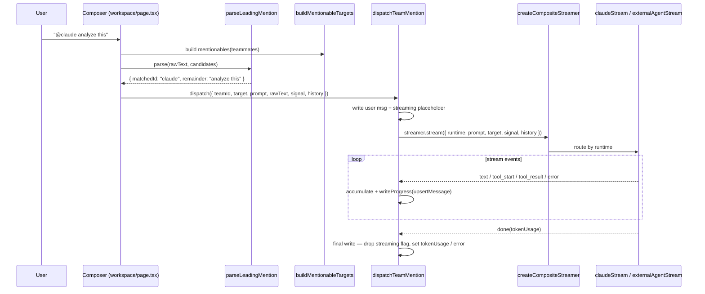

# Workspace Chat & Mention Dispatch

The team workspace Chat tab is **interactive direct chat**, not the team RUN engine. Typing `@claude analyze this` parses the leading mention, resolves it to a runtime target, opens a runtime stream (Anthropic via the Vercel AI SDK, or an external CLI agent), and reduces the stream events into a single message in the team log. The whole chain lives under `lib/agent-team/` and is fully decoupled from React so it can be unit-tested with plain async generators.

<TLDR>
  `handleSendMention` (workspace/page.tsx:185) runs `parseLeadingMention` (mention-parser.ts:48) against
  candidates from `buildMentionableTargets` (runtime-targets.ts:64), then calls `dispatchTeamMention`
  (team-runtime-dispatcher.ts:121) with a `createCompositeStreamer` (runtime-streamers.ts:221). The streamer
  routes `runtime: "claude"` to `claudeStream` (AI SDK `streamText`, runtime-streamers.ts:49) and everything
  else to `externalAgentStream` (runtime-streamers.ts:111). The dispatcher writes a user message, a streaming
  placeholder, then reduces stream events into the final message — and never throws.
</TLDR>

<StatGrid>
  <Stat label="Mentionable runtimes" value="5" hint="claude · codex · claude-code · gemini-cli · cursor-cli" />
  <Stat label="Virtual targets" value="2" hint="@claude · @codex, always listed first" />
  <Stat label="Availability statuses" value="4" hint="ready · missing-key · no-agent · disconnected" />
  <Stat label="History turn cap" value="20" hint="buildConversationHistory DEFAULT_MAX_TURNS" />
</StatGrid>

## The Dispatch Chain

The chain is four pure stages plus a React-owned streamer factory:



### 1. Parse the mention — `mention-parser.ts:48`

`parseLeadingMention` is a pure function. Only the **first** non-whitespace token is considered; it must start with `@`, and the name runs to the next whitespace. Names match case-insensitively. On a match the remainder (leading whitespace trimmed) becomes the prompt; on a miss it flags `unknownMention` so the caller can prompt for a valid agent.

```ts
// lib/agent-team/mention-parser.ts:48-58 (shape)
export function parseLeadingMention(
  text: string,
  candidates: readonly MentionCandidate[]
): ParsedMention {
  // returns { matchedName, matchedId, remainder, unknownMention, rawToken }
```

### 2. Build mentionable targets — `runtime-targets.ts:64`

`buildMentionableTargets` puts the two virtual targets **first** — `@claude` (runtime `"claude"`) and `@codex` (runtime `"codex"`) — so the demo path works even before any teammate exists, then appends every real teammate. A teammate whose name collides with a reserved name (case-insensitive) keeps its own id but is flagged `nameCollision: true`; because virtuals are appended first, the parser still resolves the reserved name to the virtual.

```ts
// lib/agent-team/runtime-targets.ts:64-78
export function buildMentionableTargets(teammates: readonly AgentTeammate[]): MentionTarget[] {
  const reserved = new Set<string>(RESERVED_MENTION_NAMES)
  const out: MentionTarget[] = [...VIRTUAL_TARGETS]
  for (const tm of teammates) {
    out.push({
      kind: "teammate",
      id: tm.id,
      name: tm.name,
      runtime: tm.config.runtime ?? DEFAULT_TEAMMATE_RUNTIME,
      teammate: tm,
      description: tm.description,
      nameCollision: reserved.has(tm.name.toLowerCase()),
    })
  }
  return out
}
```

The five supported runtimes are `claude`, `codex`, `claude-code`, `gemini-cli`, and `cursor-cli` (the last being `DEFAULT_TEAMMATE_RUNTIME` for real teammates whose config omits one).

### 3. Stream by runtime — `runtime-streamers.ts:221`

`createCompositeStreamer` returns a single `RuntimeStreamer` whose `.stream(...)` keys off `runtime`: `"claude"` routes to `claudeStream`, everything else to `externalAgentStream`.

**Claude path** (`runtime-streamers.ts:49`) runs the Vercel AI SDK `streamText` against the user's Anthropic key — no Tauri sidecar dependency, so it works in web mode too. Prior turns are passed as role-merged `messages` where assistant turns carry a `[SpeakerName]:` prefix:

```ts
// lib/agent-team/runtime-streamers.ts:49-67
export async function* claudeStream(
  prompt: string,
  options: ClaudeStreamerOptions,
  signal: AbortSignal,
  history?: readonly ConversationTurn[]
): AsyncIterable<RuntimeStreamEvent> {
  const priorMessages = historyAsClaudeMessages(history ?? [])
  const messages = [...priorMessages, { role: "user" as const, content: prompt }]
  const result = streamText({
    model: options.model,
    system: options.systemPrompt ?? DEFAULT_SYSTEM_PROMPT,
    messages,
    abortSignal: signal,
  })
  // yields text deltas, then a done event with token usage
```

**External path** (`runtime-streamers.ts:111`) resolves the configured external agent for the runtime, sets it active, then translates each `ExternalAgentEvent` into the dispatcher's `RuntimeStreamEvent` via `translateExternalEvent`. ACP-style runtimes have no structured `messages` parameter, so history is flattened into a text preamble:

```ts
// lib/agent-team/runtime-streamers.ts:111-135
export async function* externalAgentStream(
  prompt: string,
  runtime: TeammateRuntime,
  hooks: ExternalAgentStreamerHooks,
  history?: readonly ConversationTurn[]
): AsyncIterable<RuntimeStreamEvent> {
  const agentId = hooks.resolveAgentId(runtime)
  if (!agentId) {
    yield { kind: "error", message: "No external agent configured ..." }
    yield { kind: "done" }
    return
  }
  hooks.setActiveAgent(agentId)
  const fullPrompt =
    history && history.length > 0
      ? `${historyAsTextPreamble(history)}\n[New request]\n${prompt}`
      : prompt
  for await (const event of hooks.executeStreaming(fullPrompt)) {
    const translated = translateExternalEvent(event)
    if (translated) yield translated
  }
}
```

When no agent matches the runtime, the stream emits an error card pointing the user to Settings → External Agents — see the [external agents runtime](./external-agents) docs.

## Dispatcher Message Lifecycle

`dispatchTeamMention` (`team-runtime-dispatcher.ts:121`) owns the four-step write lifecycle. Every dependency — the streamer and the store writer — is injected so tests mock them with async generators.

1. **User message** — persist an `AgentTeamMessage` with `senderId = TEAM_USER_SENDER_ID`, content = the verbatim `rawText`, `recipientId/Name` = the target.
2. **Streaming placeholder** — persist an empty agent message with `metadata.streaming = true`, plus `runtime`, `dispatchTargetId`, and `dispatchPrompt` so the UI knows what is running and Retry can replay it.
3. **Stream loop** — for each event, `writeProgress` re-upserts the placeholder: `text` accumulates content; `tool_start` / `tool_result` mirror into `metadata.toolCalls`; `error` swaps in an error indicator; `done` records `tokenUsage`.
4. **Final write** — drop the streaming flag and set either the error or the final `tokenUsage`.

The function **never throws** — every failure (including a thrown streamer) surfaces as an error-indicator message so the demo path stays deterministic. The persisted metadata keys are a single re-exported block:

```ts
// lib/agent-team/team-runtime-dispatcher.ts:304-312
export const TEAM_MESSAGE_METADATA_KEYS = {
  STREAMING: STREAMING_METADATA_KEY,
  ERROR: ERROR_METADATA_KEY,
  RUNTIME: RUNTIME_METADATA_KEY,
  TOOL_CALLS: TOOL_CALLS_METADATA_KEY,
  TOKEN_USAGE: TOKEN_USAGE_METADATA_KEY,
  DISPATCH_TARGET_ID: DISPATCH_TARGET_ID_KEY,
  DISPATCH_PROMPT: DISPATCH_PROMPT_KEY,
} as const
```

## Conversation History — `conversation-context.ts:40`

`buildConversationHistory` turns the raw `AgentTeamMessage[]` log into runtime-ready turns. It filters out streaming placeholders, errored cards, structured-payload messages, empty content, and any non-conversational type (only `direct` and `broadcast` survive), sorts chronologically, and caps to the most recent 20 turns (`DEFAULT_MAX_TURNS`).

```ts
// lib/agent-team/conversation-context.ts:54-72 (loop)
for (const m of sorted) {
  if (excluded?.has(m.id)) continue
  if (!CONVERSATIONAL_TYPES.has(m.type)) continue
  if (m.structuredPayload) continue
  if (!m.content || !m.content.trim()) continue
  if (m.metadata?.[TEAM_MESSAGE_METADATA_KEYS.STREAMING] === true) continue
  if (m.metadata?.[TEAM_MESSAGE_METADATA_KEYS.ERROR] === true) continue
  turns.push({ role: m.senderId === TEAM_USER_SENDER_ID ? "user" : "assistant", ... })
}
```

Two projections feed the two streamer shapes: `historyAsClaudeMessages` merges consecutive same-role turns into an AI SDK `messages` array (assistant turns prefixed `[SpeakerName]:`), while `historyAsTextPreamble` flattens everything into one text block for ACP runtimes.

## Runtime Availability — `use-runtime-availability.ts:38`

`useRuntimeAvailability` reports a status per runtime so the mention chips can dim and the chat banner can warn before a send. There are four statuses — `"ready"`, `"missing-key"`, `"no-agent"`, `"disconnected"` — with per-runtime rules:

- **claude** — `"ready"` when `AppSettings.apiKey` is non-empty (Settings → Providers); otherwise `"missing-key"`.
- **external** (`codex`, `claude-code`, `gemini-cli`, `cursor-cli`) — find an `enabled` `ExternalAgentConfig` whose `metadata.preset === runtime`. No match → `"no-agent"`; matched but not `"connected"` in `connectionStatus` → `"disconnected"`; connected → `"ready"`.

```ts
// lib/agent-team/use-runtime-availability.ts:43-61
map.claude = apiKey && apiKey.length > 0 ? "ready" : "missing-key"
const externals: TeammateRuntime[] = ["codex", "claude-code", "gemini-cli", "cursor-cli"]
for (const runtime of externals) {
  const match = Object.values(agents).find((a) => {
    if (!a.enabled) return false
    const preset = (a.metadata as Record<string, unknown> | undefined)?.preset
    return typeof preset === "string" && preset === runtime
  })
  if (!match) { map[runtime] = "no-agent"; continue }
  const status = connectionStatus[match.id]
  map[runtime] = status === "connected" ? "ready" : "disconnected"
}
```

Any chip whose runtime is not `"ready"` renders dimmed with a status hint, so the user sees which `@<name>`s will succeed before hitting send.

## React Wiring — `workspace/page.tsx`

The detail page glues the chain together. The key lines:

| Line | What it wires |
| --- | --- |
| 112 | `mentionables = buildMentionableTargets(teammates)` (memoized) |
| 137 | `streamer = createCompositeStreamer({ claude: { model }, external: {...} })` |
| 146 | `history = buildConversationHistory(messagesRef.current)` |
| 154 | `dispatchTeamMention({ teamId, target, prompt, rawText, signal, history }, { writer, streamer })` |
| 189 | `parseLeadingMention(rawText, candidates)` inside `handleSendMention` |
| 210 | `dispatchPair({ targetId, prompt, rawText })` after a successful parse |

`dispatchPair` builds the streamer with the Anthropic model from `getProviderModel` and an `external` block that resolves agent ids by preset, aborts any in-flight dispatch via an `AbortController` ref, toggles `isSending`, and surfaces a toast on failure (the dispatcher itself never throws, so the toast covers only setup errors).

## End-to-End Example: `@claude analyze this`

1. User types `@claude analyze this` and submits; `handleSendMention` (page.tsx:185) runs.
2. `parseLeadingMention` matches the first token `@claude` → `{ matchedId: "claude", remainder: "analyze this" }`.
3. `findTargetById(mentionables, "claude")` resolves the **virtual** `@claude` target (runtime `"claude"`).
4. `dispatchPair` builds a composite streamer and calls `dispatchTeamMention`, which writes the user message and a streaming placeholder.
5. `createCompositeStreamer` routes `"claude"` to `claudeStream`, which calls AI SDK `streamText` with the 20-turn history as role-merged messages plus the `"analyze this"` user turn.
6. Each `text` delta is accumulated and `writeProgress` re-upserts the placeholder, so the message grows live in the log.
7. On `done`, the dispatcher drops the streaming flag and records token usage; the final message renders with its runtime badge, any tool-call cards, and a token-usage line.

This is one-off interactive chat — distinct from a team **run**, which synthesizes a workflow and executes tasks (see [Lifecycle & Synthesis](./lifecycle-and-synthesis)).

## Related

<Cards>
  <Card title="Workspace UI" href="./workspace-ui" />
  <Card title="Lifecycle & Synthesis" href="./lifecycle-and-synthesis" />
  <Card title="External Agents" href="./external-agents" />
</Cards>
