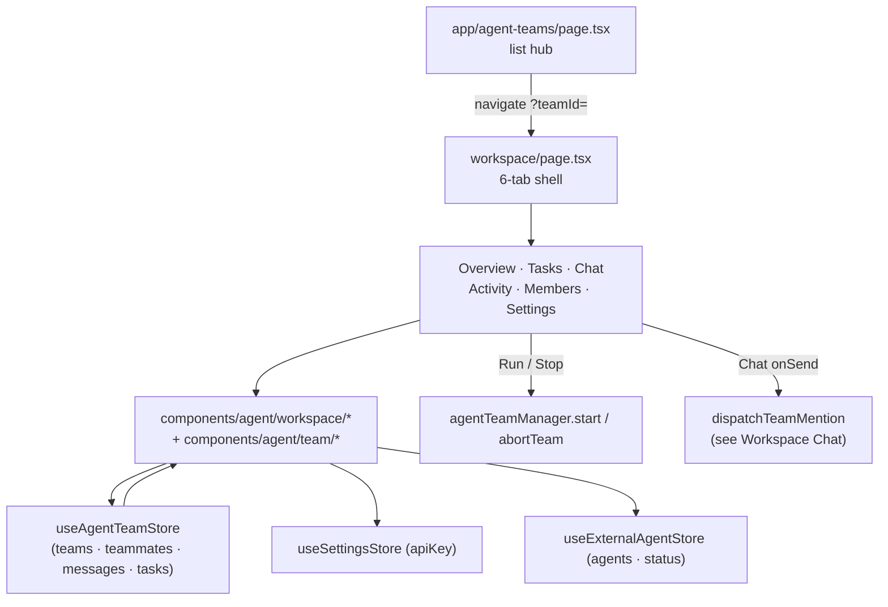

# Workspace UI

The Agent Teams UI is two routes: a **list hub** (`/agent-teams`) where you create, search, clone, and delete teams or instantiate templates, and a **workspace** (`/agent-teams/workspace?teamId=…`) that opens a single team in a six-tab shell. Both bind the same `useAgentTeamStore` and hand interactions down to `agentTeamManager` and the dispatch chain documented in [Workspace Chat & Mention Dispatch](./workspace-chat).

<TLDR>
  The hub `app/agent-teams/page.tsx` (1–854) renders My Teams / Templates tabs over `useAgentTeamStore`;
  templates merge local + plugin-projected entries via `useMergedTemplates` (page.tsx:86–99). The workspace
  `app/agent-teams/workspace/page.tsx` keys on a `?teamId=` query param (static-export safe) and renders the
  six `ALL_TABS` (workspace/page.tsx:64). Overview wires Run / Run Ultracode / Stop into `agentTeamManager`;
  Chat wires the dispatch chain; the rest are CRUD/config surfaces backed by `components/agent/workspace/*`
  and the HITL surfaces in `components/agent/team/*`.
</TLDR>

<StatGrid>
  <Stat label="Workspace tabs" value="6" hint="overview · tasks · chat · activity · members · settings" />
  <Stat label="HITL gate variants" value="4" hint="budget · deadlock · plan · teammate_fix" />
  <Stat label="Settings sections" value="5" hint="overview · plugins · governance · ultracode · memory" />
  <Stat label="Template categories" value="9" hint="all + review · research · development · debugging · analysis · general · documentation · security" />
</StatGrid>

## Routes

| Route | File | Role |
| --- | --- | --- |
| `/agent-teams` | app/agent-teams/page.tsx:1 | List hub — My Teams / Templates tabs, search, CRUD, sample team |
| `/agent-teams/workspace` | app/agent-teams/workspace/page.tsx:67 | Per-team workspace, keyed by `?teamId=` |
| `/agent-teams/[teamId]` | app/agent-teams/[teamId]/page.tsx | Legacy redirect shim → `workspace?teamId=…` |

The workspace deliberately uses a **search param, not a dynamic segment**. The app ships as a Next static export (`output: "export"`, required by the Tauri build), so runtime-created team ids cannot be enumerated at build time — a `[teamId]` route would need them. The detail page reads the id from the URL instead:

```tsx
// app/agent-teams/workspace/page.tsx:67-69
function AgentTeamWorkspaceInner() {
  const searchParams = useSearchParams()
  const teamId = searchParams.get("teamId")
```

The legacy `[teamId]/page.tsx` is a thin client-side shim that redirects to the canonical `workspace?teamId=…` URL, so old bookmarks keep working without forcing the static export to pre-render arbitrary ids.

The hub is pinned into the sidebar by default:

```ts
// types/shell/sidebar.ts:41
{ id: "agent-teams", route: "/agent-teams", i18nKey: "agentTeams", group: "feature" }
```

with the `Users2Icon` glyph mapped in `lib/shell/sidebar-nav.ts:44`. On mobile the same route renders inside the Capacitor shell with a responsive layout; the workspace tabs collapse but the `?teamId=` contract is identical.

## The Team List Hub

`app/agent-teams/page.tsx` binds `useAgentTeamStore` for `teams`, `teammates`, `templates`, and the writers `createTeam`, `deleteTeam`, `updateTeam`, `addTeammate`. The page splits into two tabs:

- **My Teams** — rich cards per team (status badge via `TEAM_STATUS_CONFIG`, member count, relative `timeAgo`), a search `Input`, a per-card `DropdownMenu` (rename / clone / delete), and an `AlertDialog` delete confirm. An empty state offers the **sample team** built by `createSampleTeam` (`lib/ai/agent/sample-team.ts`).
- **Templates** — a category filter plus a grid of instantiable templates. Creating from a template opens a `Dialog` (name / description) and on success navigates to `workspace?teamId=…`.

### Merged templates

Templates are the union of locally defined templates and plugin-projected ones. `useMergedTemplates` performs the merge and collects per-entry warnings:

```tsx
// app/agent-teams/page.tsx:86-99
function useMergedTemplates(localTemplates: AgentTeamTemplate[]): {
  merged: AgentTeamTemplate[]
  warningsById: Map<string, readonly PluginAgentTeamTemplateWarning[]>
} {
  return useMemo(() => {
    const warningsById = new Map<string, readonly PluginAgentTeamTemplateWarning[]>()
    const pluginProjected = listAgentTeamTemplateEntries().map((entry) => {
      const projected = projectPluginTemplate(entry)
      const warnings = getTemplateWarnings(entry.id)
      if (warnings.length > 0) warningsById.set(projected.id, warnings)
      return projected
    })
    return { merged: [...localTemplates, ...pluginProjected], warningsById }
  }, [localTemplates])
}
```

`projectPluginTemplate` (`lib/agent-team/project-plugin-template.ts:21`) maps a `PluginAgentTeamTemplateDef` onto a host `AgentTeamTemplate`, namespacing its id as `<pluginId>:<id>` and carrying `systemPrompt`, `capabilities`, `governanceHints`, `tags`, and `iconKey` (ADR-0032). The category filter list (`TEMPLATE_CATEGORIES`, page.tsx:102) is:

```ts
// app/agent-teams/page.tsx:102-112
const TEMPLATE_CATEGORIES = [
  "all", "review", "research", "development", "debugging",
  "analysis", "general", "documentation", "security",
] as const
```

## Workspace Tabs

The workspace shell drives a `Tabs` from the store's `workspaceTab`, with the ordered tab set:

```ts
// app/agent-teams/workspace/page.tsx:64
const ALL_TABS = ["overview", "tasks", "chat", "activity", "members", "settings"] as const
```

Selectors materialise fresh arrays on every store change, so each is wrapped in `useShallow` to keep `useSyncExternalStore`'s snapshot caching stable (workspace/page.tsx:80–89).

### Overview — `workspace/overview.tsx:22`

Identity card, config summary (mode / pattern / concurrency / budget / plan-approval), runtime info (lead, teammates, duration, token usage), final result, and the embedded plan-approval panel. Props: `team`, `teammates`, `onStart`, `onStartUltracode`, `onAbort`, `onUpdateTeam`. The three run buttons map straight onto the manager:

- **Run** → `agentTeamManager.start()` (standard synthesis).
- **Run Ultracode** → `onStartUltracode` → `agentTeamManager.start()` with the ultracode pattern.
- **Stop** → `abortTeam(...)` (`lib/ai/agent/agent-team-runtime.ts`).

When `requirePlanApproval` is set and `lead.status === "awaiting_approval"`, the overview renders `plan-approval-panel.tsx:26`, which reads `lead.proposedPlan` and exposes approve / reject.

### Tasks — `workspace/tasks.tsx:57`

A create form (title / description / priority / assignee) plus the task list with status and priority badges and per-row delete confirms. Writes `createTask` / `deleteTask`.

### Chat — `workspace/chat.tsx:154`

The interactive `@mention` surface — message list with sender avatars, runtime + type badges, tool-call cards, token-usage lines, error indicators, structured-payload rendering, a streaming banner with Stop, and mention chips. Props: `teamId`, `messages`, `mentionables`, `onSend`, `onStop`, `isSending`, `availability`, `onRetry`, `onDelete`. The dispatch mechanics behind `onSend` are documented in [Workspace Chat & Mention Dispatch](./workspace-chat).

### Activity — `workspace/activity.tsx:72`

The execution-report timeline (checkpoints) plus the rich report widgets and the consensus surface:

- `ReportKpiCards` — headline run KPIs.
- `ReportTaskline` — per-task progress line.
- `ReportTokenBurn` — token spend over time.
- `ReportPluginSlot` — plugin-contributed report panels.
- `ConsensusPanel` (`consensus-panel.tsx`) — consensus decision UI.

### Members — `workspace/members.tsx:95`

Roster cards (lead highlighted), status badges, a per-member runtime selector, and add / remove / configure actions. Configure opens `teammate-config-dialog.tsx`, a wrapper around `PresetEditor` (ADR-0032) for system prompt, capabilities, and governance hints — see [Capabilities & Plugins](./capabilities-and-plugins).

### Settings — `workspace/settings.tsx:47`

An accordion over five sections plus a danger zone delete:

| Section | File | Config fields |
| --- | --- | --- |
| Overview | section-overview.tsx | name, description, executionMode, preferredExecutionPattern, maxConcurrentTeammates, tokenBudget |
| Plugins | section-plugins.tsx | team capability-bundle picker + plugin templates |
| Governance | section-governance.tsx | governancePolicy: approval flags, budget thresholds (warning / critical), escalation actions, refusal detection |
| Ultracode | section-ultracode.tsx | ultracode.enabled, autoMode (auto / always / never), skepticsPerFinding, judgesPerAttempt, maxFinderRounds, workingDir |
| Memory | section-memory.tsx | shared-memory adapter config, entry CRUD, import / export, filter toolbar |

Section Memory composes `memory-composer.tsx` and `memory-filter-toolbar.tsx`; rows use `editable-setting-row.tsx` (label + edit + debounced save) and surface progress through `settings-save-indicator.tsx`. The danger-zone delete routes through `confirm-action-dialog.tsx` (type-to-confirm).

## Component Inventory — `components/agent/workspace/`

| File | Purpose |
| --- | --- |
| chat.tsx | Message list + composer shell; per-type left-border color (see below) |
| overview.tsx | Identity + config + Run / Run Ultracode / Stop into `agentTeamManager.start` |
| tasks.tsx | Task CRUD board |
| activity.tsx | Execution report + event timeline |
| members.tsx | Roster + teammate config dialog |
| settings.tsx | Accordion + danger zone |
| team-composer.tsx | Chat input wrapper (mentionables, onSend, onStop, isStreaming) |
| team-mention-chips.tsx | Quick agent-picker row |
| agent-mention-picker.tsx | Single agent row |
| runtime-badge.tsx | Runtime label badge |
| message-actions-menu.tsx | Per-message retry / delete |
| tool-call-card.tsx | Tool-call detail card |
| token-usage-line.tsx | Token-usage display line |
| consensus-panel.tsx | Consensus decision UI |
| editable-field.tsx | Inline name / description edit |
| activity-report/* | KPI / taskline / token-burn / plugin-slot widgets |
| teammate-config-dialog.tsx | `PresetEditor` wrapper (ADR-0032) |

### Message border-color coding

`chat.tsx` maps each message `type` to a left-border color so the log reads at a glance:

```tsx
// components/agent/workspace/chat.tsx:36-55
function typeBorderColor(type: string): string {
  switch (type) {
    case "broadcast":
      return "border-l-blue-500"
    case "direct":
      return "border-l-green-500"
    case "plan_approval":
    case "plan_feedback":
      return "border-l-amber-500"
    case "task_update":
      return "border-l-purple-500"
    case "result_share":
      return "border-l-emerald-500"
    case "shutdown":
      return "border-l-red-500"
    case "consensus":
      return "border-l-cyan-500"
    default:
      return "border-l-muted-foreground/30"
  }
}
```

## HITL Surfaces — `components/agent/team/`

| File | Purpose |
| --- | --- |
| approval-gate-dialog.tsx:1 | Shared HITL modal — four gate variants (see below) |
| plan-approval-panel.tsx:26 | Plan text + approve / reject; reads `lead.proposedPlan` |
| runs-list.tsx | Team run history from `workflowRuns` (triggerKind "team") |
| use-approval-gate.ts:13 | Hook binding approval-bus scope + id → `{ approve(payload?), reject(feedback?) }` |

`approval-gate-dialog.tsx` (1–132) renders four gate variants by `gateType`, each resolving a distinct payload:

- **budget** — extra-tokens input, resolves `{ extraTokens }`.
- **deadlock** — reset all or select teammates, resolves `{ resetAll }` or `{ teammateIds }`.
- **plan** — approve / reject of the proposed plan.
- **teammate_fix** — rejoin a teammate, resolves `{ action: "rejoin" }`.

The full gate semantics live in [HITL Gates](./hitl-gates). Adjacent helpers: `components/agent/plan/` (`plan-approval-card.tsx` for inline `AgentPlan` approve / reject / refine, `plan-tracker-panel.tsx`) and `components/agent/mode/` (`mode-selector.tsx` for built-in + custom agent modes, plus `custom-mode-editor/`).

## Store Bindings

The primary binding is `useAgentTeamStore`, which the UI reads for `teams` / `teammates` / `messages` / `tasks` / `events` / `templates` / `workspaceTab` and writes through `createTeam`, `addTeammate`, `updateTeam`, `updateTeamConfig`, `createTask`, `deleteTask`, `upsertMessage`, `removeMessage`, `setWorkspaceTab`. Two secondary stores feed runtime availability: `useSettingsStore` (the Anthropic `apiKey`) and `useExternalAgentStore` (`agents` + `connectionStatus`).



## Related

<Cards>
  <Card title="Agent Teams" href="./index" />
  <Card title="Workspace Chat & Mention Dispatch" href="./workspace-chat" />
  <Card title="HITL Gates" href="./hitl-gates" />
  <Card title="Capabilities & Plugins" href="./capabilities-and-plugins" />
</Cards>
