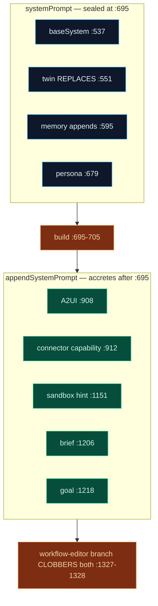

# Build-options Pipeline

`lib/claude/build-options.ts` exists so that **every** capability — character, skills, Twin, memory, goal, A2UI, computer-use, sandbox, plugins, routing — influences a turn through exactly one function. `resolveSendOptions` (`:336`) mutates a single `opts: SendOptions` object across ~40 ordered sections and returns it (`:1380`). Nothing else in the codebase constructs a `SendOptions`.

<TLDR>
  `resolveSendOptions(ctx)` (`build-options.ts:336`) builds one `opts` object. Contributors run in a
  fixed order and follow a **precedence chain** — generally `session > activeProject > memberOverride
  > agentMode > character > appSettings`. The system prompt is assembled once at `:695` from a
  six-element array joined by `\n\n---\n\n`; everything after only appends to `appendSystemPrompt`.
  Twin (`:551`) *replaces* the base prompt; memory (`:595`) *appends*. Tools accrete into an `allowed`
  set committed at `:864`. The workflow-editor branch (`:1264`) overwrites the prompt and tools
  wholesale. Every optional injection is wrapped in try/catch and degrades silently.
</TLDR>

## Entry Points

| Export | Line | Role |
| --- | --- | --- |
| **`resolveSendOptions(ctx)`** | `:336-1381` | The pipeline. Async; returns the full `SendOptions`. |
| `resolveMemberConfig(team, member, character)` | `:307-323` | Pure per-teammate override resolution (`systemPrompt`/`model`/`allowedTools`/`mcpServerIds`). Reused by UI preview. |
| `listTeamMembers(ids)` | `:1387-1389` | Pre-resolve teammate character rows. |
| `BRIEF_OUTPUT_SNIPPET` | `:52` | The brief-mode appendix (also reused by the ACP route). |

The input is `BuildOptionsContext` (`:105-221`): `session`, `character`, `appSettings`, `activeProject` (cwd chain), `memberOverride`, `referencedPaths`, `agentMode`, `twinDeps`/`twinUserMessage`, `memoryDeps`/`memoryUserMessage`, `activeGoal`, `conversationKey`, `platformBinding`, `inboxPolicy`. The output `SendOptions` is declared in `lib/claude/types.ts:73`.

## The Assembly Flow

The function is a straight-line accretion. This diagram groups the 40 sections into phases; each node is annotated with its line.

```mermaid
flowchart TB
  subgraph IDENT["Identity & routing"]
    C["character resolve :340"]
    SK["skills resolve :350"]
    MODE["agent mode :377"]
    IM["IM channel override :396"]
    MDL["model precedence :422"]
    PRV["provider + routing :431-535"]
  end
  subgraph PROMPT["System prompt (sealed at :695)"]
    BASE["baseSystem :537"]
    TWIN["twin REPLACES base :551"]
    MEM["memory APPENDS :595"]
    PERSONA["v2 persona :679"]
    JOIN["array join :695"]
  end
  subgraph DIRS["Workdir & permissions"]
    CWD["cwd :707"]
    ADD["additionalDirectories :719"]
    PM["permissionMode :741"]
    RULE["permissionRuleset (Layer A) :752"]
  end
  subgraph TOOLS["Tools (committed :864)"]
    ALLOW["allowed union :763"]
    A2UI["A2UI capability :777"]
    BIS["built-in skills :822"]
    COMMIT["allowedTools/disallowedTools :864"]
    FILTER["toolFilter overlay :867"]
    MCP["mcpServers subset :922"]
    PT["pluginTools → sidecar :995"]
    CU["computer-use verdict :975 / native :1042"]
    SBX["sandbox replace :1112"]
  end
  subgraph APPEND["Late appenders + branches"]
    ENV["account/proxy env :1159"]
    CONV["bare/debug/brief :1179"]
    GOAL["active goal :1211"]
    INBOX["inbox suppression :1224"]
    THINK["thinking budget :1253"]
    WF["workflow-editor OVERRIDE :1264"]
    TEAM["team subagents :1348"]
    RESUME["resume/fork :1364"]
  end

  IDENT --> PROMPT --> DIRS --> TOOLS --> APPEND --> RET["return opts :1380"]

  classDef a fill:#1e293b,stroke:#a78bfa,color:#ede9fe
  classDef b fill:#0f172a,stroke:#38bdf8,color:#e0f2fe
  classDef c fill:#7c2d12,stroke:#fb923c,color:#fed7aa
  classDef d fill:#064e3b,stroke:#34d399,color:#d1fae5
  class C,SK,MODE,IM,MDL,PRV a
  class BASE,TWIN,MEM,PERSONA,JOIN b
  class CWD,ADD,PM,RULE c
  class ALLOW,A2UI,BIS,COMMIT,FILTER,MCP,PT,CU,SBX,ENV,CONV,GOAL,INBOX,THINK,WF,TEAM,RESUME d
```

## Contributors in Order

The exhaustive list. "Precedence" reads left-to-right, highest first.

### Identity & routing

| # | Contributor | Injects | Line |
| --- | --- | --- | --- |
| 1 | Character resolve | `character` (ADR-0030 plugin-overlay fallback) | `:340` |
| 2 | Skills resolve | `skillIds ∪ ephemeral − disabled`, de-duped; `recordSkillUsage` | `:350` |
| 3 | Agent mode | `activeMode` + `buildAgentModeSessionUpdate` | `:377` |
| 4 | IM channel override | one-shot `readForResolution(conversationKey)` → `imOverrideRow` (reused at `:991`) | `:396` |
| 5 | Model | IM > session > member > mode > character > appDefault | `:422` |
| 6 | Provider | IM > session > character > appDefault > `"anthropic"` | `:431` |
| 7 | Alias/routing | `ProviderRoutingEngine.selectProvider`; stamps `aliasResolution`/`routingDecision` | `:444` |
| 8 | Credentials commit | `opts.model` / `opts.provider` / `opts.providerCredentials` | `:490` |

### System prompt

| # | Contributor | Injects | Line |
| --- | --- | --- | --- |
| 9 | Base system | session > member > character > appDefault | `:537` |
| 10 | **Twin** (opt-in) | **replaces** `baseSystem` with a 4-segment prompt; `twinReplacedBase=true` | `:551` |
| 11 | **Memory** (opt-in) | `memorySection` — **appended, never replaces** (see [Memory](./memory)) | `:595` |
| 12 | Skill + mode sections | `renderSkillsSection` + `activeMode.systemPrompt` | `:635` |
| 13 | Plugin skills (M4) | `pluginSkillSection`, `pluginAllowedTools`, `containerSkillIds` | `:638` |
| 14 | v2 persona | tone/personality — **suppressed when `twinReplacedBase`** | `:679` |
| 15 | **System-prompt join** | `[base, persona, memory, mode, skill, pluginSkill].filter().join("\n\n---\n\n")` | `:695` |

### Working directory & permissions

| # | Contributor | Injects | Line |
| --- | --- | --- | --- |
| 16 | cwd | session.workingDir > activeProject.rootDir > character > appDefault | `:707` |
| 17 | additionalDirectories | union of activeProject.additionalDirs + referencedPaths | `:719` |
| 18 | permissionMode | session > mode > character > appDefault | `:741` |
| 19 | **permissionRuleset** | `{ Bash: appSettings.agentPermissions.commandRules }` → [Layer A](./permissions). **No default ruleset is ever serialized.** | `:752` |

### Tools, MCP & native capabilities

| # | Contributor | Injects | Line |
| --- | --- | --- | --- |
| 20 | Tool whitelist union | base (member replaces character) ∪ skills ∪ plugin ∪ mode | `:763` |
| 21 | A2UI per-channel capability | `buildCapabilityPromptSection`; folds A2UI tool names into `allowed` | `:777` |
| 22 | Built-in skills manifest | gated by IM-binding or `enableBuiltInSkills` | `:822` |
| 23 | Commit allow/disallow | `opts.allowedTools` / `opts.disallowedTools` | `:864` |
| 24 | toolFilter overlay | allow→intersect, deny→union | `:867` |
| 25 | Tool-search policy | `toolSearchEnabled` / `alwaysLoadServers` / `alwaysLoadTools` | `:893` |
| 26–27 | A2UI + connector prompt append | onto `appendSystemPrompt` | `:908` / `:912` |
| 28 | MCP server subset | member > character > team > all-enabled; `buildMcpServerMap` | `:922` |
| 29 | Built-in tools toggles | `opts.builtinTools` (sidecar `cognia-tools` MCP) | `:965` |
| 30 | **Computer-use verdict** | `enableComputerUse && (!imSession ‖ allowImComputerUse)` — **IM blacklist default-deny** | `:975` |
| 31 | Plugin tools → sidecar | `buildPluginToolsManifest`; merges built-in skills manifest | `:995` |
| 32 | Anthropic native tools | `applyComputerUseTools` → `anthropicTools` + beta header (ADR-0020) | `:1042` |
| 33 | Sandbox replacement | disallow `Bash/Edit/Write`, strip native editor (ADR-0028) | `:1112` |

### Late appenders & branches

| # | Contributor | Injects | Line |
| --- | --- | --- | --- |
| 34 | Account / proxy env | `resolveAccountEnv` + `resolveProxyEnv` → `opts.env` | `:1159` |
| 35 | Convenience modes | bare (`settingSources:[]`) / debug (env) / brief (`BRIEF_OUTPUT_SNIPPET`) | `:1179` |
| 36 | Active `/goal` | `appendGoalContext` (ADR-0013/0019) | `:1211` |
| 37 | Inbox suppression | manual > muted > quietHours → `opts.suppressedReason` | `:1224` |
| 38 | Thinking budget | session > character > appDefault | `:1253` |
| 39 | **Workflow-editor branch** | **overwrites** `systemPrompt`/`appendSystemPrompt`/`allowedTools`/`additionalDirectories`; deletes `mcpServers` | `:1264` |
| 39b | Team branch | unions `resolveAllSubagents({context:"team"})` into `opts.agents` | `:1348` |
| 40 | Resume / fork | `forkFromSessionId` or `resumeSessionId` | `:1364` |

## The Precedence Chain

Most scalar options follow the same ladder. The full chain is rarely all present; each contributor takes the first defined value:

The IM channel override (`imOverrideRow`, fetched once at `:407`) sits *above* the session for **model**, **provider**, and the **computer-use** gate only — so a per-channel binding can pin a cheaper model without touching the session.

## System-Prompt vs Append-System-Prompt

This is the single most important rule for anyone adding a contributor.

- Anything that must **replace** the base prompt (like Twin) runs at/before `:695`.
- Anything that **adds** runs after, appending to `opts.appendSystemPrompt` with the join idiom (keep the existing value, separate the new section with a blank line).
- The **workflow-editor branch** (`:1264`) overwrites both `systemPrompt` (`:1327`) and `appendSystemPrompt` (`:1328`) wholesale, so a new appender must run *before* it to survive in that session kind.

## Adding a Contributor

1. Resolve a value through the precedence chain (`session > activeProject > memberOverride > agentMode > character > appSettings`).
2. For prompt text, append to `opts.appendSystemPrompt` (preserve existing via the join idiom). For a base-prompt replacement, do it before `:695`.
3. For tools, add to the `allowed` set **before** the commit at `:864`; the `toolFilter` overlay (`:867`) and computer-use filters narrow the committed set afterward.
4. Add the field to `SendOptions` in `lib/claude/types.ts`, and to the Rust `SendOptions` struct (`commands.rs:15`) if the sidecar must read it.
5. Wrap any I/O (Dexie, IPC) in try/catch — every optional injection is **fail-open** (twin `:590`, memory `:629`, plugin skills `:669`, MCP `:960`, plugin tools `:1036`, computer-use `:1106`).

<Callout type="warn" title="Don't re-read the IM override">
  `imOverrideRow` is fetched once at `:407` and reused for the computer-use gate at `:991`. Re-reading
  Dexie for the same row is explicitly flagged against in the comments (`:986-989`).
</Callout>

## Known Limitations

- **Routing engine deps are skeletons** — `getHealthMetrics`/`getPricing` return `undefined`, `getCircuitBreakerState` returns `"closed"` until P6 wires real samples (`:455-467`).
- **`opts.anthropicTools` is currently ignored by the Agent SDK** (MCP-only); the native-tools call is kept only to emit the `anthropic-beta` header and for External-Bridge introspection (`:1048-1053`).
- **`resolveActiveAgentMode` is client-only** (`useCustomModeStore.getState()`, `:294`) — safe only because called from React hooks.

## Next

<Cards>
  <Card title="Permissions & Auto-mode" href="./permissions" description="What opts.permissionRuleset feeds into Layer A." />
  <Card title="Long-term memory" href="./memory" description="The applyMemoryContext call at :595." />
  <Card title="Tools, MCP & skills" href="./tools-mcp" description="How the tool/MCP/skill fields are consumed in the sidecar." />
  <Card title="Runtime loop" href="./runtime-loop" description="Where the assembled SendOptions is carried across the IPC seam." />
</Cards>
