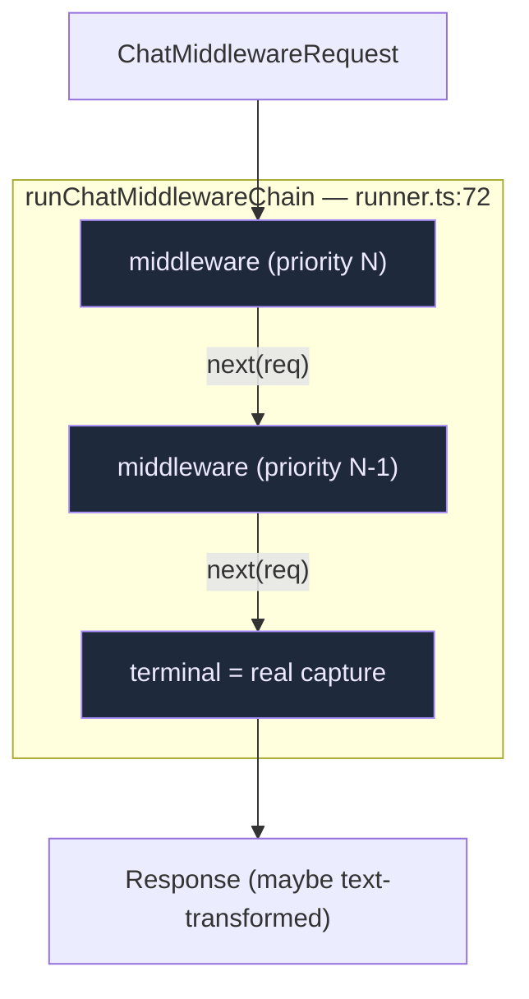
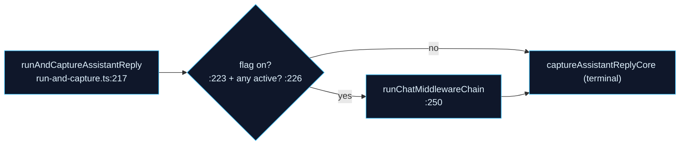

# Chat Middleware

Chat middleware lets a plugin wrap the agent's **full reply** — inspect or transform the request and the response, Koa-style — without touching the streaming UI path. It is the one capability module that sits on the *non-streaming* `run-and-capture` path rather than inside `resolveSendOptions`.

<TLDR>
  A middleware is `(req, next) => Promise<Response>` (`plugin-chat-middleware.ts:116`). Plugins register
  via `ctx.chat.use` → `registerChatMiddleware` (`registry.ts:79`). The runner builds the chain
  **back-to-front** by priority and calls each with a per-middleware timeout (`runner.ts:72`); a
  timeout or error **skips** that middleware (calls `next` unchanged) and trips a **circuit breaker**
  after 3 failures. Execution is **off by default** (`feature-flag.ts:15`) and only wraps the
  full-reply path in `run-and-capture.ts` — never the streaming chat, because the text is already on
  screen there.
</TLDR>

<StatGrid>
  <Stat label="Default state" value="off" hint="chatMiddlewareExecutionEnabled = false" />
  <Stat label="Default timeout" value="5s" hint="cap 60s, per middleware" />
  <Stat label="Breaker threshold" value="3" hint="consecutive failures → disabled" />
  <Stat label="Runs on" value="full-reply" hint="run-and-capture.ts, not streaming chat" />
</StatGrid>

## The Chain

The runner reads the active chain fresh (`listActiveChatMiddlewares()`, `runner.ts:77`) and **builds it back-to-front** (`for i = chain.length-1 → 0`, `:90`) so the highest-priority middleware is outermost and sees the original request first. The innermost `next` is the **terminal** (`:87`) — the real send/capture.

## Registry

`registry.ts` is a module-level `Map` keyed `<pluginId>:<middlewareId>`:

| Function | Line | Role |
| --- | --- | --- |
| `registerChatMiddleware(args)` | `:79` | dup-throws; returns an unregister disposer |
| `unregisterChatMiddleware` / `clearChatMiddlewaresForPlugin` | `:101` / `:113` | teardown |
| `listActiveChatMiddlewares()` | `:126` | filters `!disabled`, sorts **priority desc** then id (deterministic) |
| `recordMiddlewareFailure` / `recordMiddlewareSuccess` | `:151` / `:164` | circuit breaker |
| `resetChatMiddlewareBreaker` | `:177` | manual reset |
| `subscribeChatMiddlewareRegistry` | `:187` | UI events (`registered`/`unregistered`/`breaker-tripped`/`breaker-reset`) |

### Circuit breaker

`recordMiddlewareFailure` (`:151`) increments a per-middleware counter; at `CIRCUIT_BREAKER_THRESHOLD = 3` (`:26`) it sets `disabled = true` and emits `breaker-tripped`. `recordMiddlewareSuccess` resets the counter. A tripped middleware is skipped by `listActiveChatMiddlewares` until reset — so a flaky plugin can't keep degrading every reply.

## Runner Semantics

`runChatMiddlewareChain(request, terminal, options)` (`runner.ts:72`). For each middleware (`:93`):

- **timeout** — `Promise.race` against `entry.timeoutMs` (`raceWithTimeout`, `:136`). Default 5s, cap 60s (`registry.ts:24`).
- **on timeout** (`:98`) — push to `timedOut[]`, `recordMiddlewareFailure`, **skip → `next(req)`** unchanged.
- **on error** (`:107`) — same skip behavior.
- **on success** (`:116`) — push `succeeded[]`, `recordMiddlewareSuccess`, return its value.

An `AbortSignal` is threaded through (`:122`). The skip-on-failure design means a broken middleware degrades to a pass-through, never a failed reply — the same fail-open philosophy as the rest of the runtime.

## Where It Hooks In

Chat middleware is **not** in `build-options.ts` or `use-claude-chat.ts`. It sits on the full-reply capture path, `lib/claude/run-and-capture.ts`:

`runAndCaptureAssistantReply` (`:217`) short-circuits straight to the core capture when the flag is off (`:223`) **or** no middleware is active (`:226`). When on, it builds a `ChatMiddlewareRequest` (`:231`), runs the chain with the real capture as `terminal` (`:250`), and applies any returned text transform (`:260`). Streaming chat is deliberately excluded — its text is already rendered, so a post-hoc transform would be a visible flicker (rationale comment, `:208`).

## Plugin Wiring

| Surface | File |
| --- | --- |
| `ctx.chat.use(middleware)` | `lib/plugin/api/chat-api.ts:53` → `registerChatMiddleware` |
| Bridge | `lib/plugin/bridge/chat-middleware-bridge.ts:30` |
| Contract | `lib/plugin/contracts/plugin-points.ts:752` (`"chat.middleware"`) |
| Types | `types/plugin/plugin-chat-middleware.ts` (`ChatMiddlewareRequest:71`, signature `:116`) |

Registration always happens on plugin enable; only the **runner call-site** consults the default-off feature flag (`feature-flag.ts:18`), so a deployment can ship middlewares dormant and flip them on centrally.

## Next

<Cards>
  <Card title="Runtime loop" href="./runtime-loop" description="The streaming path that chat middleware deliberately does not wrap." />
  <Card title="Plugin system" href="../subsystems/plugin-system" description="How ctx.chat.use is exposed and gated." />
  <Card title="Build-options pipeline" href="./build-options" description="The other (streaming) place plugins influence a turn — onUserPromptSubmit." />
</Cards>
