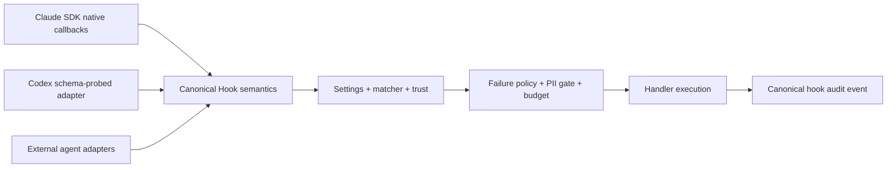

# Hooks

Cognia loads Claude-Code-compatible lifecycle Hooks from `settings.json`. The built-in Claude Agent SDK uses native SDK callbacks; Codex and external agents use provider adapters. All paths share the same event, decision, trust, and audit semantics without executing the same event twice.

<TLDR>
  Runtime capabilities are evidence-based. The pinned Claude Agent SDK exposes **31 events** and
  five handler kinds. Codex installation probes the local schema before registering its audited
  **11-event** ceiling. User Hooks fail open with diagnostics; managed Hooks fail closed. Every
  outbound or model-backed handler passes through redaction plus a residual PII gate, and every
  matched handler emits a structured canonical audit event.
</TLDR>

<StatGrid>
  <Stat label="Claude events" value="31" hint="Pinned SDK 0.3.220 surface" />
  <Stat label="Codex ceiling" value="11" hint="Intersected with the local runtime schema" />
  <Stat label="Handler kinds" value="5" hint="command, http, mcp_tool, prompt, agent" />
  <Stat label="Nested depth" value="1" hint="Model-backed Hooks cannot recurse" />
</StatGrid>

## Architecture



The product/plugin Hook API remains a separate in-process extension surface. It may observe the same agent activity, but it does not become a second lifecycle executor.

## Runtime capabilities

A provider manifest is only an audited ceiling. Cognia enables the intersection of the manifest, the installed runtime probe, and the selected adapter implementation.

### Claude Agent SDK

The pinned SDK catalog contains:

`PreToolUse`, `PostToolUse`, `PostToolUseFailure`, `PostToolBatch`, `Notification`, `UserPromptSubmit`, `UserPromptExpansion`, `SessionStart`, `SessionEnd`, `Stop`, `StopFailure`, `SubagentStart`, `SubagentStop`, `PreCompact`, `PostCompact`, `PermissionRequest`, `PermissionDenied`, `Setup`, `TeammateIdle`, `TaskCreated`, `TaskCompleted`, `Elicitation`, `ElicitationResult`, `ConfigChange`, `WorktreeCreate`, `WorktreeRemove`, `InstructionsLoaded`, `CwdChanged`, `FileChanged`, `DirectoryAdded`, and `MessageDisplay`.

The SDK callback is the sole owner of built-in execution. Cognia does not pre-run `UserPromptSubmit` or `PreToolUse` in Rust and then register them again in the SDK.

### Codex

Before installation, Cognia runs:

```text
codex app-server generate-json-schema --out <temporary-directory>
```

It recursively extracts `HookEventName.enum` and intersects it with the audited ceiling:

`PreToolUse`, `PermissionRequest`, `PostToolUse`, `PreCompact`, `PostCompact`, `SessionStart`, `SessionEnd`, `UserPromptSubmit`, `SubagentStart`, `SubagentStop`, and `Stop`.

A failed probe produces a degraded capability report and registers no unproven event. Script and `hooks.json` writes are transactional: if configuration merge/write fails, the previous script bytes are restored and external handlers remain untouched.

## Handler kinds

| Type | Behavior | Outbound PII gate | Notes |
| --- | --- | --- | --- |
| `command` | Runs a local command with event JSON on stdin | No network boundary | Exit/JSON output follows the Hook decision contract. |
| `http` | POSTs redacted event JSON | Yes | Canonical name for new settings. |
| `webhook` | Same as `http` | Yes | Legacy read-compatible alias. |
| `mcp_tool` | Calls exactly one declared MCP tool | Yes | Tool allowlist is narrowed to that tool. |
| `prompt` | Runs one model evaluation | Yes | No tools; maximum one turn. |
| `agent` | Runs a bounded agent task | Yes | Maximum three turns. |

The Settings UI filters event and handler choices using the effective runtime capability report. “Unsupported” and “probe unavailable” are explicit states rather than silent no-ops.

## Failure policy

- **User Hooks:** timeout, crash, non-2xx response, or unavailable adapter produces a warning and fail-open behavior.
- **Managed Hooks:** the same failure is converted to a blocking result (`policyClass: "managed"`).
- **Explicit deny:** blocking decisions always remain blocking regardless of policy class.
- **Deterministic merge:** matching handlers execute concurrently, but outcomes merge in configuration order; the first block in that order wins.

## Outbound data safety

For `http`/`webhook`, `mcp_tool`, `prompt`, and `agent`, Cognia:

1. serializes the canonical event payload;
2. redacts sensitive text;
3. runs a deep residual PII check on the redacted representation;
4. blocks dispatch if sensitive data remains.

This gate runs before `fetch`, MCP, or model execution. It is not a best-effort logging filter.

## Model-backed Hooks

Nested Hook work is isolated from the parent turn:

- the prompt begins with `<hook-origin depth="1" />`;
- nested SDK queries use `settingSources: []` and register no Hooks;
- maximum turns are 1 for `prompt`, 2 for `mcp_tool`, and 3 for `agent`;
- a shared budget governor defaults to USD 0.25 per execution context;
- depth ≥ 1 is rejected, and exhausted budget blocks before another model call.

## Trust and project settings

Project/local settings load only when the workspace appears in Cognia's trusted-workspace ledger. The renderer syncs that ledger to Rust, and Rust enforces the final path check. Missing synchronization or an untrusted path falls back to user-scope settings only.

## Canonical audit

Every matched handler emits a structured record with hook id, event, provider, handler kind, policy class, outcome, latency, redaction status, and block/error detail. The SDK mapper stores it as a canonical `kind: "hook"`, `phase: "completed"` event. UI notices and logs are derived diagnostics.

## External agents

External-agent adapters normalize their native lifecycle and permission events before invoking the shared Hook semantics. A control is exposed only when the provider protocol or runtime probe proves it. There is no terminal-keystroke fallback and no capability inferred merely from the provider name.

## Related

<Cards>
  <Card title="Permissions & Auto-mode" href="./permissions" description="The policy gate that runs alongside lifecycle Hooks." />
  <Card title="Runtime loop" href="./runtime-loop" description="How the built-in Agent SDK session is executed and streamed." />
  <Card title="Plugin system" href="../subsystems/plugin-system" description="The separate in-process product/plugin Hook API." />
</Cards>
