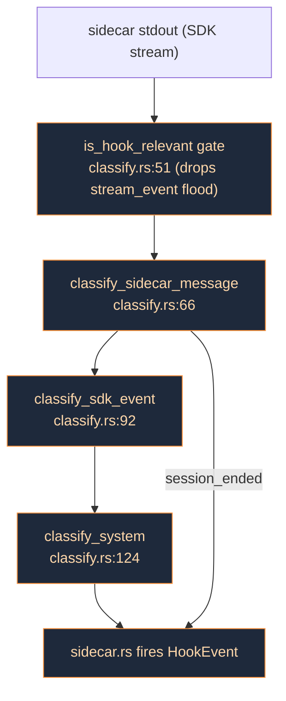
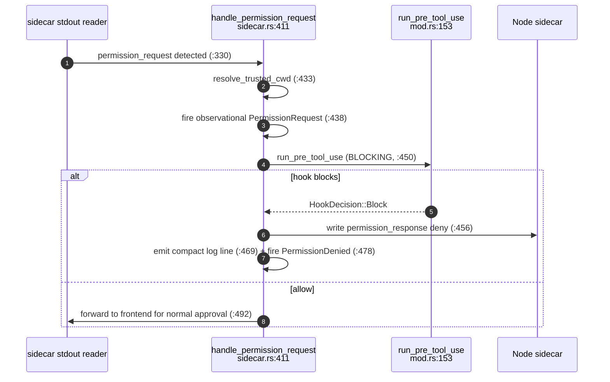
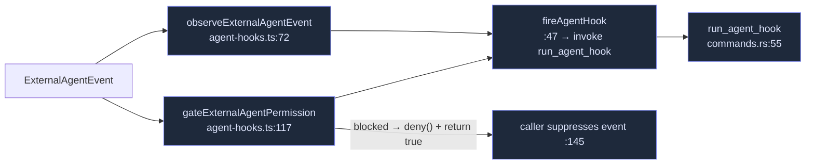

# Hooks

Cognia ships a Claude-Code-compatible **hooks runtime**: shell commands and webhooks that fire on agent lifecycle events declared in `settings.json`. ADR-0040 completed the mechanism — the full 27-event lifecycle, `PreToolUse` blocking, a Rust-enforced trust gate, webhooks, and external-agent wiring.

<TLDR>
  Two systems coexist. **System A** is in-process plugin hooks (`lib/plugin/messaging/hooks-system.ts`,
  74+ kinds). **System B** is the Claude-Code-style `settings.json` runtime in Rust
  (`src-tauri/src/hooks/`). For the built-in agent, the Rust sidecar reader is *already* watching the
  SDK stream, so hook injection happens **in Rust**: `classify.rs` maps each SDK message to a
  `HookEvent` (27 variants), `sidecar.rs` fires them, and `PreToolUse` can deny a tool by writing a
  `permission_response` deny back to the sidecar with no UI round-trip. External agents inject in TS
  (only TS parses ACP/opencode) and reach the same Rust runtime through the `run_agent_hook` command.
  Everything **fails open**.
</TLDR>

<StatGrid>
  <Stat label="Lifecycle events" value="27" hint="HookEvent enum, types.rs:14" />
  <Stat label="Blocking event" value="1" hint="only PreToolUse can deny on the round-trip" />
  <Stat label="Handler kinds" value="2" hint="command + webhook (others round-trip as Unsupported)" />
  <Stat label="No-trigger events" value="11" hint="round-trippable in settings, never fire" />
</StatGrid>

## Two Hook Systems

| | System A — plugin hooks | System B — settings.json runtime |
| --- | --- | --- |
| Lives in | `lib/plugin/messaging/hooks-system.ts` (TS, in-process) | `src-tauri/src/hooks/` (Rust) |
| Declared by | plugin manifests / `ctx` listeners (74+ kinds) | user `settings.json` (Claude-Code format) |
| Runs | JS callbacks | shell `command` / HTTP `webhook` |
| Built-in agent path | dispatched from TS (`adapter-hooks.ts`) | fired from the **Rust** sidecar reader |

This page is about **System B** for the built-in agent. The two are bridged: external-agent events touch both (System A for plugin observers, System B for settings.json hooks).

## SDK Stream → Lifecycle

For the built-in agent, the Rust sidecar reader already sees every SDK message. `classify.rs` is the **pure** classifier that turns a sidecar message into zero or more `HookEvent`s.

The canonical enum is `HookEvent` (`types.rs:14`, serde PascalCase, 27 variants), mirrored in TS at `lib/claude/hooks.ts:7`. Mapping highlights:

| Event | Fires from | Line |
| --- | --- | --- |
| `UserPromptSubmit` | `claude_send` (pre-SDK) | `commands.rs:209` |
| `PreToolUse` | sidecar `permission_request` (**blocking**) | `sidecar.rs:450` |
| `PermissionRequest` / `PermissionDenied` | sidecar (observational / after deny) | `sidecar.rs:438` / `:478` |
| `PostToolUse` / `PostToolUseFailure` | tool_result correlation | `sidecar.rs:555` |
| `SessionStart` / `SessionEnd` | `system/init` / `session_ended` | `classify.rs:126` / `:70` |
| `Stop` / `StopFailure` | `result/success` / `result/error` | `classify.rs:107` / `:109` |
| `PostCompact` / `Notification` | `system/compact_boundary` / `system/notification` | `classify.rs:133` / `:141` |
| `TaskCreated` / `TaskCompleted` + `SubagentStop` | `system/task_*` | `classify.rs:149` / `:166` |

**No-trigger events** (11) round-trip in settings but never fire — annotated as `NO_TRIGGER_EVENTS` in `components/settings/hooks/hooks-section.tsx:84` with a badge (`:314`): `PreCompact, WorktreeCreate/Remove, FileChanged, CwdChanged, InstructionsLoaded, ConfigChange, Elicitation/Result, UserPromptExpansion, TeammateIdle`.

## PreToolUse Blocking

`PreToolUse` is the only event that can stop a tool on the round-trip. The path is entirely in Rust — no UI.

This is the built-in-agent equivalent of `respondToPermission`. All other lifecycle hooks are **observational** — they can contribute `additionalContext`, but only as a frontend log line (`sidecar.rs:500`); they cannot re-inject mid-stream.

## The Rust Runtime

All under `src-tauri/src/hooks/`:

| Module | Responsibility | Key fns |
| --- | --- | --- |
| `mod.rs` | matcher + sequential runner | `groups_for_event:32`, `matcher_matches:53`, `run_event:82` (**first block wins**, `:109`), `run_handler:118`, wrappers `run_user_prompt_submit:137` / `run_pre_tool_use:153` / `run_session_scoped:187` / `run_tool_scoped:205` |
| `classify.rs` | pure SDK→lifecycle classifier | `classify_sidecar_message:66`, `is_hook_relevant:51`, `extract_tool_uses:177` |
| `trust.rs` | project/local-scope gate | `resolve_trusted_cwd:61` (the single chokepoint), `set_trusted_paths:35`, `is_trusted:47` |
| `command.rs` | shell handler | `run_command_handler:28` (exit 2 = Block, 0 = parse output, `extract_decision:142`) |
| `webhook.rs` | HTTP handler | `run_webhook_handler:25` (default 5s / cap 30s; reuses the same decision parser) |
| `commands.rs` | Tauri bridge | **`run_agent_hook:55`** (external-agent seam), `set_trusted_workspaces:102` |
| `types.rs` | wire types | `HookEvent:14`, `HookHandler:59`, `HookDecision:99` (`merge:111` first-block-wins, `is_blocked:139`) |

### The trust gate

Every project/local hook load must pass `trust::resolve_trusted_cwd` (`trust.rs:61`) — it returns `Some(cwd)` only if the path is trusted, else `None` (→ user-scope hooks only). The trusted set is seeded **exclusively** through `set_trusted_workspaces` (`commands.rs:102`), called by `hook-trust-sync.ts:21` (`syncTrustedWorkspacesToRust`) at startup and after every trust change. So a compromised renderer cannot load untrusted project hooks — the gate is enforced in Rust. If sync never runs, project hooks silently stay user-scope (fail-safe, not fail-open).

## TS Side

- `lib/claude/hooks.ts` (52 lines) — pure surface types only: `HookEvent:7`, `HookHandler:36`, `HookGroup:45`, `HooksConfig:52`.
- `lib/claude/adapter-hooks.ts` — thin no-op-when-idle wrappers over the two plugin-hook singletons: `dispatchUserPromptSubmit:66` (proceed/modify/block), `dispatchPreToolUse:92` (allow/deny/modify), `dispatchPostToolUse:115`, `dispatchOnAssistantMessage:135`, stream/error/usage dispatchers. These realize the ADR's onSend/onResponse/onError intent.
- `lib/claude/hook-trust-sync.ts` — `syncTrustedWorkspacesToRust:17` reads the Dexie trust ledger and pushes paths into Rust (no-op on web/mobile).

## External-Agent Wiring

External agents (Codex / OpenCode / Claude Code CLI) inject in **TS** — only TS parses their ACP/opencode streams — and reach the same Rust runtime through `run_agent_hook`.

`gateExternalAgentPermission` (`agent-hooks.ts:117`) fires the System-A plugin hook, the observational `PermissionRequest`, then the blocking `PreToolUse`; on block it calls `deny(...)` and returns `true` so the manager suppresses the event. The manager seams are `manager.ts:1638` (interactive, true suppression) and `:1804` (headless, deny still enforced). `run_agent_hook` (`commands.rs:55`) applies the same `resolve_trusted_cwd` gate (`:65`) before routing to `run_tool_scoped` / `run_session_scoped`.

This also wired the two previously-orphaned System-A hook kinds: `dispatchExternalAgentPermissionRequest` (`hooks-system.ts:2095`) and `dispatchExternalAgentToolCall` (`:2115`).

## Injection Asymmetry

The key design decision (ADR §28-34): the SDK's native `hooks` option is deliberately **not** used inside the Node sidecar — that would bypass or duplicate the Rust runtime.

- **Built-in agent** injects in **Rust** — the sidecar reader already sees the SDK stream.
- **External agents** inject in **TS** — only TS parses ACP/opencode — and forward to Rust via `run_agent_hook`.

Both converge on the same `mod.rs` runner and the same trust gate.

## Extension Points & Gotchas

- **A new `HookEvent` variant needs three edits**: `types.rs:14` (Rust enum), `hooks.ts:7` (TS union), and — if it has no trigger — `hooks-section.tsx:84` (`NO_TRIGGER_EVENTS`). The serde PascalCase wire name is derived (`hook_event_name`, `mod.rs:175`) so it can't drift.
- **A new SDK→lifecycle mapping** edits the pure `classify.rs` *and* must be accepted by `is_hook_relevant` (`:51`) or it's dropped with the stream flood.
- **Fail-open everywhere**: timeouts/crashes/non-2xx all soft-allow (`types.rs:129`, `command.rs:97`, `webhook.rs:72`); missing settings → empty (`mod.rs:224`).
- **First-block-wins**: `run_event` returns on the first block (`mod.rs:109`); `HookDecision::merge` keeps the earliest reason (`types.rs:125`).
- **`HookHandler::Unsupported`** (`types.rs:76`) absorbs MCP-tool/prompt/agent handler types so settings.json round-trips, but only `command` + `webhook` actually execute.
- **Per-session cwd** is recorded at send time (`commands.rs:202`) so later lifecycle events resolve project-scope settings; cleared on `session_ended` (`sidecar.rs:586`).

## Next

<Cards>
  <Card title="Permissions & Auto-mode" href="./permissions" description="The other gate on a tool call — Layer A/B run alongside PreToolUse." />
  <Card title="Runtime loop" href="./runtime-loop" description="The sidecar reader that classifies and fires hook events." />
  <Card title="Plugin system" href="../subsystems/plugin-system" description="System A — in-process plugin hooks." />
</Cards>
