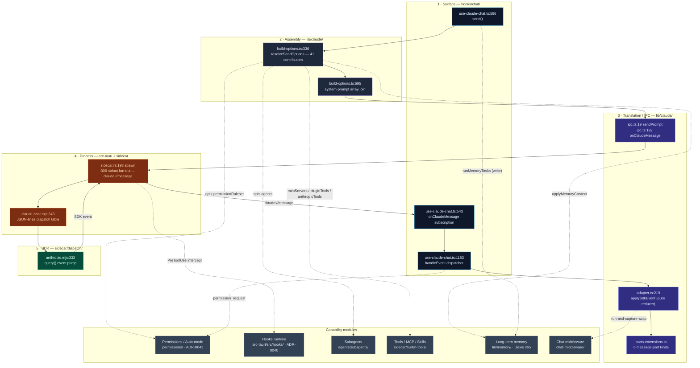

# Built-in Agent

The **built-in agent** is the Claude agent that runs *inside* Cognia: the one you talk to in the chat pane. Unlike [Agent Teams](./agent-teams) (multi-role squads) or external CLI agents (Codex / Cursor / Claude Code, spawned as subprocesses), the built-in agent is a single, long-lived session driven by the official [`@anthropic-ai/claude-agent-sdk`](https://www.npmjs.com/package/@anthropic-ai/claude-agent-sdk) hosted in the bundled Node **sidecar**.

<TLDR>
  One chat turn is a pipeline: the composer calls `send` in
  `hooks/chat/use-claude-chat.ts:596`, which calls `resolveSendOptions`
  (`lib/claude/build-options.ts:336`) to collapse **all** UI state — character prompt, skills,
  Twin, long-term memory, goal, A2UI capability, tools, MCP, permissions — into one `SendOptions`
  payload. That payload crosses the Tauri IPC seam (`lib/claude/ipc.ts:19`) into Rust
  (`src-tauri/src/claude/sidecar.rs`), which spawns the Node host (`sidecar/claude-host.mjs`) and
  runs the SDK `query()` loop (`sidecar/dispatch/anthropic.mjs:333`). SDK events stream back over a
  single Tauri channel (`claude://message`), get reduced into `UIMessage`s by the **pure**
  `applySdkEvent` (`lib/claude/adapter.ts:219`), and rendered. Permissions, hooks, subagents,
  tools, and memory are cross-cutting modules that hook into well-defined points along this spine.
</TLDR>

<StatGrid>
  <Stat label="Assembly contributors" value="41" hint="ordered sections in resolveSendOptions, build-options.ts:336-1380" />
  <Stat label="Sidecar protocol msgs" value="5 / 6" hint="inbound send/interrupt/permission_response/plugin_tool_response/close · outbound event/permission_request/…" />
  <Stat label="Permission layers" value="2" hint="sidecar canUseTool (Layer A) + use-claude-chat Auto-mode (Layer B)" />
  <Stat label="Hook lifecycle events" value="27" hint="HookEvent enum, src-tauri/src/hooks/types.rs:14" />
  <Stat label="Built-in subagents" value="4" hint="workflow designer/debugger/refactorer/doc-writer" />
  <Stat label="Memory types" value="3" hint="semantic · episodic · procedural — Dexie v65" />
</StatGrid>

## What It Is

The built-in agent is not a single file — it is a **spine** (chat → assembly → IPC → process → SDK) with **capability modules** clipped onto fixed seams. The architecture exists to satisfy three constraints at once:

1. **The Agent SDK is Node-only.** Its filesystem / `child_process` / native dependencies cannot run in a webview, so it lives in a separate process. See [Sidecar & Claude Agent SDK](../core/sidecar-and-claude-sdk) for *why a sidecar*.
2. **Static export has no server.** `next.config.ts` forces `output: "export"`; there is no `app/api/` at runtime. Anything needing a long-lived process (the sidecar, hooks, permission interception) lives in Rust, not Next.js routes.
3. **Every capability must be composable.** Skills, Twin, memory, computer-use, A2UI, plugins, and goals all need to influence the same turn without knowing about each other. They converge in exactly one function — `resolveSendOptions` — and nowhere else.

## Architecture at a Glance

Each box is annotated with the file and line where the work happens. The five-stage spine runs top-to-bottom; the capability modules on the right clip into it.



## Module Map

Read the per-module page for line-accurate internals. Each card is one documentation page.

<Cards>
  <Card title="Runtime loop" href="./runtime-loop" description="The send → stream → render spine: use-claude-chat, adapter, the JSON-lines sidecar protocol, the Rust lifecycle, and the SDK query() pump." />
  <Card title="Build-options pipeline" href="./build-options" description="resolveSendOptions — the single convergence point. All 41 ordered contributors, the precedence chains, and the system-prompt assembly." />
  <Card title="Permissions & Auto-mode" href="./permissions" description="ADR-0041 two-layer safety gate: sidecar canUseTool short-circuit + the small-model command judge in the chat hook." />
  <Card title="Hooks" href="./hooks" description="ADR-0040 settings.json lifecycle runtime in Rust: 27 events, PreToolUse blocking, the trust gate, webhooks, external-agent wiring." />
  <Card title="Subagents" href="./subagents" description="The 4 built-in workflow subagents, how they reach opts.agents, the runtime→UI bridge, and the external-subagent import pipeline." />
  <Card title="Long-term memory" href="./memory" description="Autonomous conversation-derived memory: extract → consolidate → retrieve → inject. Three memory types, BM25+vector fusion, fail-open everywhere." />
  <Card title="Tools, MCP & skills" href="./tools-mcp" description="The in-process cognia-tools MCP server, built-in MCP resolution, the skills→SDK bridge, computer-use tools, and the preset gallery." />
  <Card title="Chat middleware" href="./chat-middleware" description="The plugin-contributed around-style middleware chain on the full-reply path, with circuit breaker and default-off feature flag." />
</Cards>

## The Request Lifecycle

One full turn, end to end. The numbers are the actual call sites.

```mermaid
sequenceDiagram
  autonumber
  participant U as User
  participant H as use-claude-chat.ts
  participant B as build-options.ts
  participant I as ipc.ts / Rust sidecar.rs
  participant N as claude-host.mjs
  participant Q as anthropic.mjs query()
  participant A as adapter.ts

  U->>H: submit composer
  H->>H: onUserPromptSubmit plugin hook (674)
  H->>B: buildSendOptions → resolveSendOptions (634→336)
  Note over B: 41 contributors mutate one opts object;<br/>system prompt joined at 695
  B-->>H: SendOptions
  H->>I: sendPrompt(sessionId, content, opts) (867)
  Note over I: Rust runs UserPromptSubmit hooks (commands.rs:209)<br/>then writes {type:"send"} to sidecar stdin
  I->>N: stdin · JSON line
  N->>Q: query({ prompt, options }) (333)
  loop streaming
    Q-->>N: SDK event
    N-->>I: stdout · {type:"event"}
    I-->>H: claude://message (SIDECAR_EVENT)
    H->>A: applySdkEvent(current, evt) (1383→219)
    A-->>H: {messages, turnComplete, result?}
    H->>H: write to mirror / store (1466)
  end
  alt model wants a tool
    Q->>Q: canUseTool — Layer A static ruleset (anthropic.mjs:263)
    Q-->>I: permission_request (if not resolved)
    Note over I: Rust PreToolUse hook may deny (sidecar.rs:450)
    I-->>H: permission_request event
    H->>H: Auto-mode — Layer B judge (1324) or prompt user
    H->>I: claude_approve(decision)
  end
  Q-->>N: result (usage)
  N-->>H: turnComplete → merge twin+memory sources (1445), seal (1475)
```

## Key Invariants

These are the load-bearing rules that make the spine composable. Break one and turns silently corrupt.

| Invariant | Where | Why |
| --- | --- | --- |
| **One convergence point.** All context injection happens in `resolveSendOptions`; no other code mutates a `SendOptions`. | `build-options.ts:336-1380` | A new capability needs to touch exactly one file. The [build-options page](./build-options) is the contract. |
| **`systemPrompt` is sealed early; `appendSystemPrompt` accretes late.** Anything replacing the base prompt must run at/before `:695`; everything after only appends. | `build-options.ts:695` vs A2UI `:908`, goal `:1218`, sandbox `:1151` | The workflow-editor branch (`:1285`) clobbers both wholesale, so new appenders must run before it. |
| **The adapter is pure.** `applySdkEvent` has zero `invoke`/`listen`; the Tauri seam is `ipc.ts` only. | `adapter.ts` (no IPC) · `ipc.ts:192` | The reducer is unit-testable without Tauri; events arrive push-based through one channel. |
| **`SendOptions` skips `null`.** Passing an explicit `null` (not absent) for `systemPrompt` etc. crashes the SDK option parser. | `commands.rs:11-14`, `anthropic.mjs:327` | serde `skip_serializing_if` + a strip-undefined pass enforce it on both sides. |
| **Every injection is fail-open.** Twin, memory, plugin skills, connector capability, MCP, computer-use are each wrapped in try/catch that degrades silently. | `build-options.ts:590,629,669,…` | A broken capability must never block a send. Memory in particular: see [its fail-open table](./memory). |
| **Two enforcement layers, explicit-only.** Layer A (sidecar) never honors a wildcard `*:allow`; Layer B (chat hook) runs the deterministic + small-model judge. | `anthropic.mjs:263`, `use-claude-chat.ts:1324` | A compromised renderer cannot auto-approve dangerous tools. See [Permissions](./permissions). |

## How It Differs From Agent Teams

| Aspect | Built-in agent | [Agent Teams](./agent-teams) |
| --- | --- | --- |
| Runtime | Single long-lived SDK session in the sidecar | Lead + N teammates, each Claude / Codex / external CLI |
| Entry | `use-claude-chat.ts:send` → `resolveSendOptions` | `runTeamLifecycle` → per-teammate `resolveSendOptions` |
| Concurrency | One turn at a time per session | `maxConcurrentTeammates` sliding window |
| Permissions | Two-layer gate (this section) | Per-teammate `allowedTools` union + plan approval |
| Where state lives | Dexie sessions + messages | Mostly Zustand `agent-team-store` |

The team path still funnels each teammate's Claude turn through the **same** `resolveSendOptions` and the **same** sidecar — so everything on the [build-options](./build-options) and [runtime-loop](./runtime-loop) pages applies to teammates too.

## Next

<Cards>
  <Card title="Sidecar & Claude Agent SDK" href="../core/sidecar-and-claude-sdk" description="The process boundary, JSON-lines protocol, and credential discovery in depth." />
  <Card title="Chat, Characters, Skills & Teams" href="./chat-and-skills" description="The user-facing surfaces that call send and how a Character is resolved." />
  <Card title="Skills system" href="./skills-system" description="How a skill materializes into prompts, MCP servers, and tool allow-lists." />
  <Card title="Runtime & Tauri" href="../core/runtime-and-tauri" description="The Rust side that owns the sidecar lifecycle and event channels." />
</Cards>
