# Long-term Memory

The memory subsystem gives the built-in agent **durable, self-maintaining recall** of facts about the user across sessions — without the user curating anything. It reads conversations, decides what is worth keeping, dedupes against what it already knows, and injects the most relevant memories into the next turn's system prompt.

<Status variant="experimental" />

<TLDR>
  One Dexie table (`memories`, schema **v65**) holds three memory types — `semantic` (durable facts),
  `episodic` (distilled events), `procedural` (evolving working instructions, ≈ a self-grown
  CLAUDE.md). Two paths: the **write path** (fire-and-forget per turn) runs salience → LLM extract →
  PII gate → consolidate (ADD/UPDATE/DELETE/NOOP); the **read path** (at send time) runs
  `applyMemoryContext` → BM25 + vector retrieval → RRF fusion → Generative-Agents scoring → a system-
  prompt section. It reuses the Twin's vector store and the shared RAG toolkit. Every stage is
  **fail-open** — memory must never break a turn — and embeddings stay local unless the user opts into
  cloud.
</TLDR>

<StatGrid>
  <Stat label="Memory types" value="3" hint="semantic · episodic · procedural" />
  <Stat label="Dexie version" value="v65" hint="memories table, schema.ts:1692" />
  <Stat label="Default top-K" value="8" hint="DEFAULT_MEMORY_CONFIG, memory.ts:120" />
  <Stat label="Recall decay half-life" value="30d" hint="decayHalfLifeDays default" />
  <Stat label="Failure mode" value="open" hint="every stage degrades silently" />
</StatGrid>

## Data Model

`types/memory/memory.ts` — the `Memory` entity (`:51-87`):

| Field group | Fields | Notes |
| --- | --- | --- |
| Identity | `id`, `scope` (global/character), `characterId?`, `type` | character overrides global on collision |
| Content | `text` (redacted, self-contained), `key?` (procedural dedupe), `tags` | |
| Ranking | `importance` (LLM 1..10, set once), `lastAccessedAt`, `accessCount` | drive recency + scoring |
| Lifecycle | `status` (active/invalidated), `version`, `supersededById?`, `pinned` | soft-delete, never discard |
| Provenance | `provenance` (user/explicit/inbound/system), `sourceSessionId?` | the **trust model** |

`MemoryConfig` (`:93`) is persisted on `AppSettings` (JSON, no migration): `enabled`, `autoExtract`, `hybridEnabled`, `allowCloudEmbedding` (default **false**), `retrievalTopK` (8), `relevanceFloor` (0.35), `maxActivePerScope` (500), `decayHalfLifeDays` (30), `temporary` (incognito). The **provenance trust rule**: only `user`/`explicit` may yield `procedural` memories; `inbound` (from IM connectors) can never be global or procedural — so a third party cannot poison your working instructions.

## Two Paths

```mermaid
flowchart TB
  subgraph WRITE["WRITE — fire-and-forget per turn (use-claude-chat.ts:269 runMemoryTasks)"]
    SAL["assessSalience<br/>salience.ts:49"]
    EXT["extractMemories (LLM)<br/>extractor.ts:74"]
    PII["hasNoLeakingPii gate<br/>run-memory-extraction.ts:87"]
    CON["consolidate ADD/UPDATE/DELETE/NOOP<br/>consolidator.ts:110"]
    DB["createMemory + vector upsert<br/>memories.ts:36"]
  end
  subgraph READ["READ — at send time (build-options.ts:595)"]
    APPLY["applyMemoryContext<br/>apply-memory-context.ts:76"]
    RET["retrieveMemories<br/>retriever.ts:51"]
    BM["BM25 leg :72"]
    VEC["vector leg (best-effort) :77"]
    RRF["reciprocalRankFusion :96"]
    SCORE["scoreMemories :69"]
    PROC["assembleProceduralBlock<br/>procedural.ts:33"]
    SEC["memorySection → system prompt :695"]
  end

  SAL --> EXT --> PII --> CON --> DB
  APPLY --> RET
  RET --> BM & VEC --> RRF --> SCORE
  APPLY --> PROC
  SCORE & PROC --> SEC

  classDef w fill:#7c2d12,stroke:#fb923c,color:#fed7aa
  classDef r fill:#064e3b,stroke:#34d399,color:#d1fae5
  class SAL,EXT,PII,CON,DB w
  class APPLY,RET,BM,VEC,RRF,SCORE,PROC,SEC r
```

## The Write Path

`runMemoryTasks(sessionId, messages)` (`use-claude-chat.ts:269`) fires after a turn completes, never awaited. The pure orchestrator is `runMemoryExtraction(input, deps)` (`run-memory-extraction.ts:62`), gated left-to-right with short-circuit:

1. `enabled && autoExtract && !temporary` (`:69`)
2. `provenance !== "inbound"` (`:71`)
3. **`assessSalience`** (`:73`) — is this turn worth extracting?
4. **`deps.extract`** (`:79`) — LLM pulls candidates
5. **PII gate** `isPiiSafe` (default `hasNoLeakingPii`, `:87`)
6. **`deps.consolidate`** (`:91`) — dedupe against existing

### Salience — cheap recall-first filter

`assessSalience` (`salience.ts:49`) is pure and bilingual (EN + 中文). It errs toward recall: a turn is salient if it has any of explicit-capture ("remember…/记住…"), a self-fact, a possessive, a preference verb, or ≥2 named entities. No LLM — it's the gate that decides whether to *spend* an LLM call.

### Extract → Consolidate

`extractMemories` (`extractor.ts:74`) calls the utility LLM (temp 0, 512 tokens), parses JSON, filters to allowed types, clamps importance — and `catch → []` (fail-open). `consolidate` (`consolidator.ts:110`) decides per candidate via `findSimilar`: **no neighbors → unambiguous ADD with no LLM** (`:121`); otherwise an LLM picks `ADD / UPDATE / DELETE / NOOP`, and any parse/LLM error **falls back to ADD** (`:135`) — never a destructive guess. UPDATE merges text; DELETE soft-invalidates the old row and links `supersededById` (Zep "update, don't discard").

## The Read Path

build-options calls `applyMemoryContext` at `:595-633` (guarded, `catch` non-fatal). The result `memorySection` becomes element 3 of the system-prompt array (`[base, persona, memory, mode, skill, pluginSkill]`, `:695`) — it **appends, never replaces** the base prompt.

`applyMemoryContext` (`apply-memory-context.ts:76`) runs retrieval and procedural assembly in parallel, then dedupes against the turn's Twin chunks (`overlapsTwin`, `:59`) so memory and Twin don't double-spend the token budget, and `catch → {degraded:true}`.

### Retrieve + fuse + score

`retrieveMemories` (`retriever.ts:51`):

- **Keyword leg always runs** — `BM25Index` + `search` (`:72`).
- **Vector leg is best-effort** — only if an embedder + vector search are wired; `catch → []` (`:77`).
- **Fuse** — `reciprocalRankFusion` if both legs hit, else keyword-only (`:96`); normalize; apply `relevanceFloor` (`:103`).
- **Score** — `scoreMemories(...).slice(0, topK)` (`:111`); best-effort `touch` to bump recency (`:119`).

`scoreMemories` (`scoring.ts:69`) is the Generative-Agents three-factor formula — `score = recency + importance + relevance`, each min-max normalized, all weights 1. Recency is `decay^daysSinceLastAccess` (`:64`). Pure (only an injected `now`).

The whole memory subsystem **reuses the shared RAG toolkit**: `BM25Index` / `normalizeScores` / `reciprocalRankFusion` from `@/lib/ai/rag/hybrid-search`, the context manager from `@/lib/ai/rag/context-manager`, and the LLM contract from `@/lib/twin/distill/llm`.

## Procedural Memory

`assembleProceduralBlock(memories, options)` (`procedural.ts:33`) folds active procedural memories into one capped instruction block (default 600 tokens, heading "Working preferences you've learned"), ordered **pinned → importance desc → lastAccessedAt desc**, greedily fitted to the token budget. Because procedural rows are never auto-extracted from inbound content, this block cannot be poisoned by a third party.

## Persistence

`lib/db/memories.ts` is purely mechanical (no LLM, no gating — the gate is in the callers). The retriever's candidate pool is `listActiveForReader(characterId?)` (`:143`) — global base ∪ character override via the `[scope+status]` index. `touchMemories` (`:100`) bumps recency on a hit. Only the management panel calls `hardDeleteMemory` / `clearMemories` — consolidation only ever soft-invalidates.

Schema: `version(65).stores({ memories })` at `schema.ts:1692`; index string includes `[scope+type]`, `[scope+status]`, `[type+status]` (`:1694`). Additive, no upgrade hook.

## Privacy & Backend

`resolveMemoryBackend(config)` (`build-deps.ts:36`) gates embeddings once: they run **only** when a vector store exists *and* (`allowCloudEmbedding` OR the provider is local `transformersjs`). Otherwise the system is BM25-only and personal facts never leave the machine. Memory borrows the Twin's vector store + embedder via `tryBuildTwinDeps` (`:37`), so a Twin-configured user gets memory recall for free.

## Fail-open Everywhere

Memory must never break a turn. Every stage degrades:

| Stage | Failure behavior | Line |
| --- | --- | --- |
| extract | `catch → []` | `extractor.ts:100` |
| consolidate | parse/LLM error → ADD (non-destructive) | `consolidator.ts:135` |
| write orchestration | outer `catch → empty` | `run-memory-extraction.ts:98` |
| apply (read) | `catch → {degraded:true}` | `apply-memory-context.ts:127` |
| build-options injection | `catch` non-fatal | `build-options.ts:629` |
| retriever vector leg / touch | swallow | `retriever.ts:88` / `:119` |

`opts.memoryContext` (`types.ts:381`) is **transparency-only** — stripped before the SDK call, used to render a "Memory" `SourcesPart` so the user can see what was recalled.

## Next

<Cards>
  <Card title="Build-options pipeline" href="./build-options" description="The applyMemoryContext call at :595 and the system-prompt array at :695." />
  <Card title="Runtime loop" href="./runtime-loop" description="runMemoryTasks (write) and the memory-sources merge on turnComplete." />
  <Card title="Employee Digital Twin" href="../subsystems/employee-twin" description="The persona layer whose vector store and embedder memory reuses." />
</Cards>
