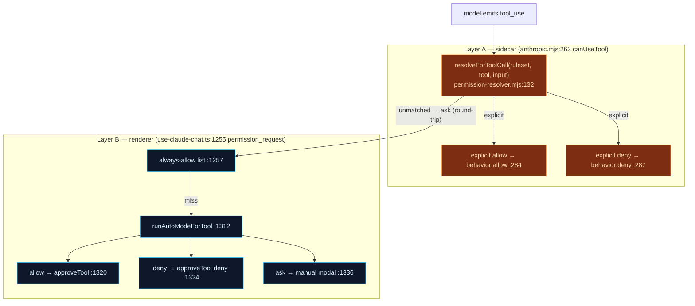
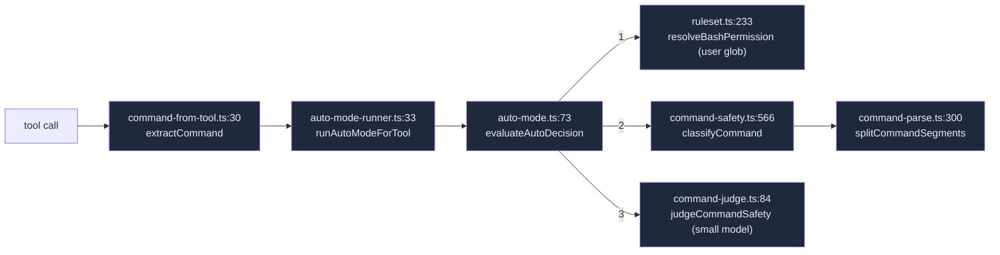
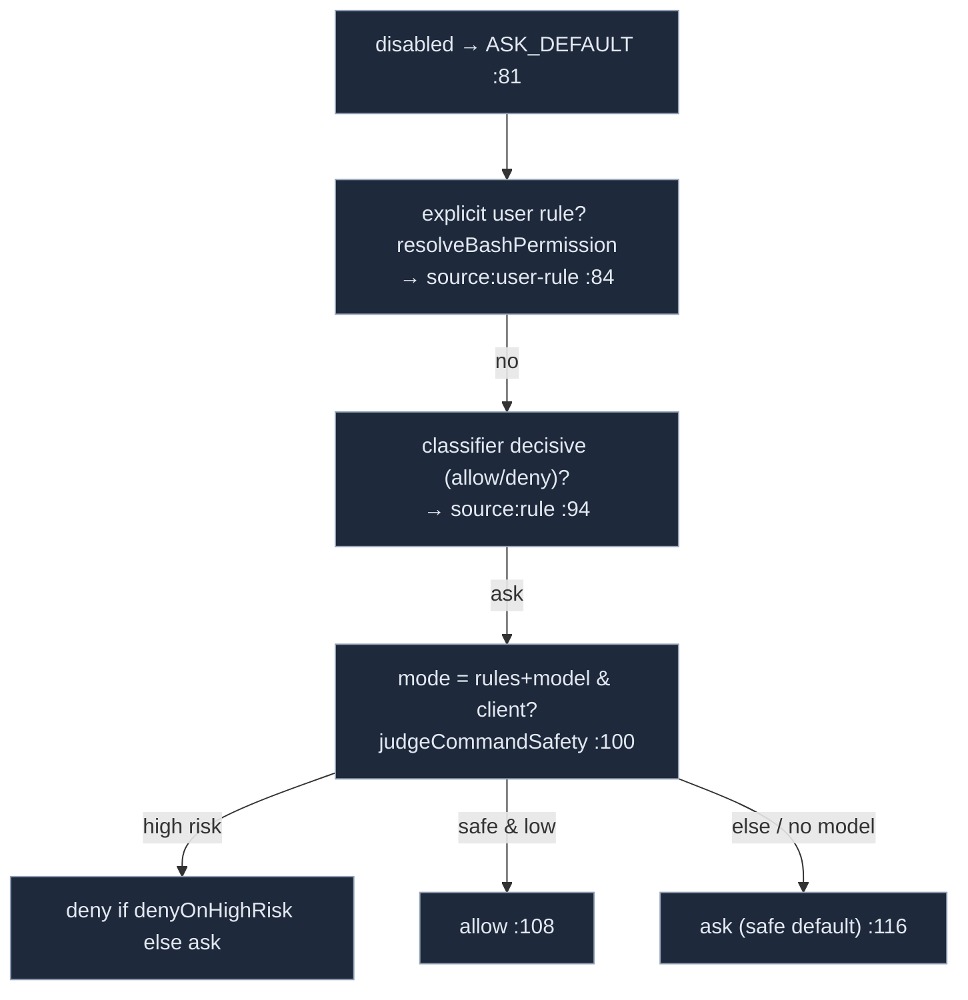

# Permissions & Auto-mode

When the model wants to run a tool — especially a shell command — Cognia decides **allow / ask / deny** through two independent layers. Both **fail open** (a bug degrades to "always prompt", never to "silently run"), and the central ADR-0041 invariant is that there is **no blanket `*: allow`** that could bypass every approval.

<TLDR>
  **Layer A** lives in the sidecar: the SDK's `canUseTool` callback (`anthropic.mjs:263`) consults the
  static `permissionRuleset` serialized by build-options and short-circuits *only* on an explicit
  allow/deny — unmatched calls round-trip to the renderer. **Layer B** lives in the chat hook: the
  `permission_request` handler (`use-claude-chat.ts:1300`) runs Auto-mode, a precedence ladder of
  **user glob rule → deterministic classifier → optional small-model judge**, and auto-approves /
  auto-denies or falls through to the manual modal. The pure core is
  `command-parse → command-safety → command-judge → auto-mode` in `lib/claude/permissions/`.
</TLDR>

<StatGrid>
  <Stat label="Enforcement layers" value="2" hint="sidecar canUseTool + renderer Auto-mode" />
  <Stat label="Auto-mode tiers" value="4" hint="user-rule · rule · model · default" />
  <Stat label="Safe heads" value="~120" hint="command-safety SAFE_HEADS auto-allow" />
  <Stat label="Default judge model" value="off" hint="model tier only when mode = rules+model" />
</StatGrid>

## Two Layers



### Layer A — sidecar static ruleset

The bridge is build-options: only a **non-empty** `appSettings.agentPermissions.commandRules` is serialized as `opts.permissionRuleset = { Bash: commandRules }` (`build-options.ts:752-761`). No default ruleset is ever written, so an empty config means Layer A is a pass-through.

In the sidecar, `canUseTool` (`anthropic.mjs:263`) reads `sendOptions.permissionRuleset` (`:280`) and calls `resolveForToolCall` (`permission-resolver.mjs:132`):

- explicit **allow** → `{behavior:"allow"}`, no round-trip (`:284`)
- explicit **deny** → `{behavior:"deny", message:"denied by permission ruleset"}` (`:287`)
- anything else → fall through to a `permission_request` emit (`:297`)

The resolver is a deliberately **weaker** JS mirror of `ruleset.ts`: `splitBash` (`permission-resolver.mjs:99`) is a naive top-level split that ignores quotes, and there is **no** baked-in `"*": "allow"`. Any segment that denies wins; allow is returned only when *every* segment is explicitly allowed (`:143/:153`). The full compound-command parser lives in Layer B, and unmatched calls round-trip there — so weakening Layer A is safe.

### Layer B — renderer Auto-mode

The `permission_request` case (`use-claude-chat.ts:1255-1350`):

1. **Always-allow list** (`:1257`) — pre-existing per-session grants.
2. **Inactive/remote session** (`:1265`) — remote-control routing with a backstop deny; not Auto-mode.
3. **Auto-mode** (`:1300`): builds the judge client (`buildUtilityLlmClient`, featureId `command-safety`, `:1306`), calls `runAutoModeForTool` (`:1312`) with `pluginRules: getPluginCommandRulesets()`. `allow` → `approveTool(..., "allow")` (`:1320`); `deny` → `approveTool(..., "deny", reason)` (`:1324`); `try/catch` fail-open (`:1333`).
4. `ask`/`null` → the manual modal `pushApproval` (`:1336`).

## The Pure Core Pipeline

All under `lib/claude/permissions/`, dependency-free and unit-tested. The renderer glue (`auto-mode-runner.ts`) maps a tool call to a command and runs the decision.



### command-parse.ts — the tokenizer

`splitCommandSegments(command)` (`:300`) is quote/paren-depth-aware (`splitTopLevel`, `:46`) and **recurses into substitutions** — `extractSubstitutions` (`:162`) pulls `$(...)`, backticks, and `(...)` out as inner segments, so `echo $(rm -rf /)` surfaces the buried `rm`. Recursion is capped at `MAX_DEPTH = 20` (`:30`).

### command-safety.ts — the deterministic tier

`classifyCommand(command)` (`:566`) splits, classifies each segment, and takes the **worst** verdict (`RANK` loop, `:574`); a whole-command catastrophe scan can override to `deny` (`:579`). Verdicts are `allow | ask | deny`.

| Set | Meaning | Lines |
| --- | --- | --- |
| `SAFE_HEADS` | auto-allow: inspection, text, sysinfo, interpreters, build/test/lint, VCS, package runners | `:45-195` |
| `ASK_HEADS` | always-confirm: mv/chmod/kill/mount/network/global PM/cloud/containers/disk | `:198-300` |
| `DELETE_HEADS` | rm/rmdir/del/erase/unlink | `:303` |
| `GIT_ASK_SUBS` / `PM_ASK_SUBS` | risky git / package-manager subcommands | `:305` / `:317` |
| `WRAPPERS` | sudo/doas/env/timeout/xargs (unwrapped, never *lower* a verdict) | `:330` |

Specialized classifiers: `matchCatastrophic` (pipe-to-shell RCE, fork bombs → whole-command **deny**, `:372`), `classifyRm` (`-rf` + critical target → deny, `:400`), `classifyCurl` (write methods → ask, `:456`), `classifyDd` (`of=/dev/…` → deny, `:485`). `sudo` escalates allow→ask but never lowers (`:548`); an unrecognized head defaults to **ask** (`:509`).

### command-judge.ts — the optional small-model tier

`judgeCommandSafety(client, command, opts)` (`:84`) returns `{safe, risk, reason} | null`. It is **off unless `mode === "rules+model"`**. Before any LLM call it runs the shared **PII gate** `hasNoLeakingPii` and returns `null` if the command might leak (`:96`) — the model never sees PII. Results are LRU-cached 5 min (`:42`). Every failure path returns `null` (fail-open).

### auto-mode.ts — the orchestrator

`evaluateAutoDecision(args)` (`:73`) is the precedence ladder, highest authority first:



The full ladder (highest → lowest): **user `commandRules` glob → plugin rules → deterministic classifier → model judge → ask**. `auto-mode-runner.ts:54` encodes it by array order — plugin rules first, then the user `{Bash: commandRules}` pushed last so the user always outranks plugins.

## command-from-tool — which tools are commands

`COMMAND_TOOLS = {Bash, shell_execute_advanced, start_process}` (`command-from-tool.ts:12`). `extractCommand(toolName, input)` (`:30`) maps each to a shell string (`Bash`→`command`, the others→`program/command` + joined `args`); non-shell tools return `null` and skip the pipeline entirely. This set is mirrored on the sidecar side by `permission-resolver.mjs:135` + `extractTarget` (`:108`) — keep them in sync.

## Settings & UI

`AppSettings.agentPermissions` (`lib/claude/types.ts:907-932`):

```ts
agentPermissions?: {
  autoApprove?: {
    enabled?: boolean              // off by default            (:911)
    mode?: "rules" | "rules+model" // default "rules"           (:917)
    denyOnHighRisk?: boolean       // default true              (:922)
    judgeModel?: UtilityModelConfig                            // (:924)
  }
  commandRules?: ToolRules         // glob→verdict, highest authority (:931)
}
```

The card is `CommandAutoModeCard` (`components/settings/agent-runtime/command-auto-mode-card.tsx:32`), mounted in **Agent Runtime → Permissions & Tools** (`tabs/permissions-tools-tab.tsx:75`). It persists via `save({ agentPermissions })`.

## terminal:safety — plugin-contributed rules

Plugins extend Layer B with their own command rules through `ctx.terminal`:

| Surface | Where | Permission |
| --- | --- | --- |
| `registerCommandSafetyRule(rules)` | `lib/plugin/api/terminal-api.ts:287` | `terminal:safety` |
| `classifyCommand(command)` | `:304` | `terminal:safety` (consent-exempt — pure/sync) |
| Registry merge | `registries/command-safety-registry.ts:30` | — |
| `getPluginCommandRulesets()` → `Ruleset[]` | `:48` (low→high; below user rules) | — |

`terminal:safety` is **not** a dangerous permission (it only classifies, it cannot execute). It is wired in the standard five places — type union (`types/plugin/plugin.ts:292`), validation whitelist (`core/validation.ts:88`), guard catalog + description (`security/permission-guard.ts:102/152`), unregister-on-disable (`core/manager.ts:2789`) — plus **Rust parity** in `cmd_lint`'s `VALID_PERMISSIONS` (`crates/cognia-cli/src/cmd_lint.rs:51`), so a manifest using it passes the CLI linter.

## Invariants & Gotchas

- **Fail-open on both layers** (ADR §56): Layer A catch (`anthropic.mjs:293`), Layer B catch (`use-claude-chat.ts:1333`), judge returns `null` on every failure, `evaluateAutoDecision` never throws (`auto-mode.ts:70`).
- **No blanket `*: allow` in Layer A** — the sidecar resolver omits `DEFAULT_RULESET`'s `"*":"allow"`; only explicit serialized rules act (`permission-resolver.mjs:6-11`). The full default (incl. `*.env`→ask) lives renderer/SDK-side only (`ruleset.ts:49`).
- **Privacy** — the model tier never sees PII (`command-judge.ts:96`) and is off unless explicitly enabled (`auto-mode.ts:100`).
- **Substitution-hiding defense** — the parser recurses into `$(...)`/backticks (`command-parse.ts:162`) so a buried `rm -rf /` denies the whole chain via worst-verdict-wins (`command-safety.ts:574`).
- **Two parallel command-tool definitions** must stay in sync: `command-from-tool.ts:12` (renderer) and `permission-resolver.mjs:135` (sidecar). `ruleset.ts` (TS) and `permission-resolver.mjs` (JS) are intentional mirrors with the documented divergence (no `*` default, naive split).

## Next

<Cards>
  <Card title="Hooks" href="./hooks" description="PreToolUse hooks can also deny a tool, before the permission round-trip." />
  <Card title="Build-options pipeline" href="./build-options" description="Where opts.permissionRuleset is serialized for Layer A." />
  <Card title="Runtime loop" href="./runtime-loop" description="The permission_request event path and the backstop-deny timing." />
</Cards>
