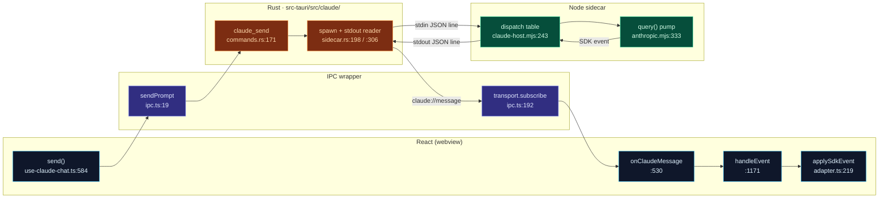
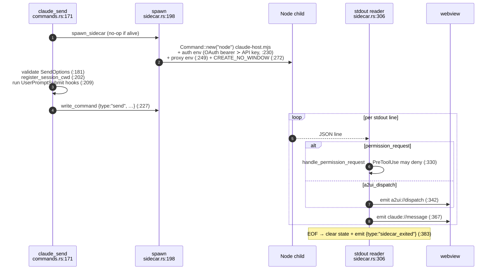
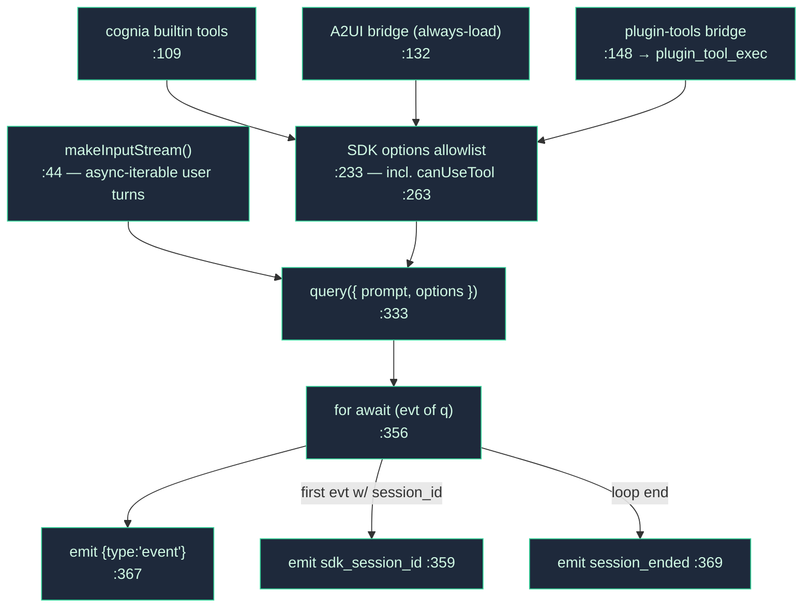

# Runtime Loop

This is the spine every built-in-agent turn travels. A React hook builds the payload and fires it; a Rust process owns the Node sidecar; the sidecar runs the SDK `query()` loop; events stream back over one Tauri channel and a **pure** reducer folds them into messages.

<TLDR>
  `send` (`use-claude-chat.ts:584`) builds options, optimistically appends the user message, and
  calls `sendPrompt` (`ipc.ts:19`). The Rust sidecar (`sidecar.rs:198`) spawns `node
  claude-host.mjs`, writes a `{type:"send"}` JSON line to its stdin, and fans every sidecar stdout
  line out on the `claude://message` Tauri event. A single subscription (`use-claude-chat.ts:530`)
  funnels events through a per-session serialized queue into `handleEvent` (`:1171`), whose `event`
  branch calls the pure reducer `applySdkEvent` (`adapter.ts:219`) and writes the result to a
  frame-coalesced mirror + the store. Streaming input/output is the SDK's
  `query({ prompt: asyncIterable })` (`anthropic.mjs:333`).
</TLDR>

## The Five Stages

## Stage 1 — `send` (the React entry)

`send` is a `useCallback` at `hooks/chat/use-claude-chat.ts:584-882`, signature `send(content, opts?, callOptions?)`. It is **fire-and-write**: it does not consume the stream (that is push-based, Stage 5).

| Step | What happens | Line |
| --- | --- | --- |
| Validate | resolve active session id, reject empty content | `:594-602` |
| Goal pause | ADR-0019 pause-on-fresh-user-turn | `:609-612` |
| **Build options** | `opts ?? await buildSendOptions(session, text)` — wraps [`resolveSendOptions`](./build-options) | call `:622`, wrapper `:1140` |
| Command frontmatter | merge per-slash-command overrides | `:633-646` |
| Plugin `onUserPromptSubmit` | may **block** / modify / inject `additionalContext` | `:662-698` |
| **Optimistic append** | `makeUserMessage` → `replaceMessages`; status → `"streaming"` | `:715-721` |
| External-agent branch | non-SDK path (bypasses the sidecar entirely) | `:726-823` |
| Persist + title | write messages, touch session, derive title | `:826-835` |
| Trace span | `startSpan("invoke_agent")`, stamp `traceId`/`spanId` onto `opts` | `:842-854` |
| **Invoke** | `await sendPrompt(sessionId, content, opts)` | `:855` |
| Cache send | `lastSendBySession[sid] = {options}` (fallback retry + twin/memory readback) | `:861-865` |

`sendRef.current = send` is kept fresh (`:886-891`) so module-scope event handling can fire silent goal-continuation sends.

## Stage 2 — IPC wrapper (`lib/claude/ipc.ts`)

`ipc.ts` is the **only** front↔back seam. Everything goes through `transport` from `@/lib/tauri`.

| Function | Line | Wire |
| --- | --- | --- |
| `sendPrompt` | `:19` | `invoke("claude_send", …)` |
| `interruptSession` | `:27` | `claude_interrupt` |
| `approveTool` | `:131` | `claude_approve` (allow / allow_always / deny) |
| `closeSession` | `:147` | `claude_close_session` |
| `setApiKey` / `setProviderEnv` | `:155` / `:167` | in-memory credential state |
| `restartSidecar` | `:188` | `claude_restart_sidecar` |
| **`onClaudeMessage(handler)`** | `:192` | `transport.subscribe(SIDECAR_EVENT, handler)` |

`SIDECAR_EVENT = "claude://message"` (`ipc.ts:17`, mirrored in `sidecar.rs:17`) is the single inbound channel; A2UI dispatches ride a separate `a2ui://dispatch` channel (`sidecar.rs:23`).

## Stage 3 — Rust lifecycle (`src-tauri/src/claude/sidecar.rs`)

`SidecarState` (`sidecar.rs:26-149`) holds the child handle, stdin, ready flag, session set, and a restart counter.

Key lifecycle triggers:

- **First `claude_send`** lazily spawns; subsequent sends reuse the process (`sidecar.rs:199-204`).
- **`claude_set_api_key`** (`lib.rs:70`) writes `ApiKeyState` in memory — never to disk.
- **`claude_restart_sidecar`** (`lib.rs:118`) calls `kill_sidecar` (`:593`); the next send respawns so the SDK re-reads env at init.
- **App exit** kills the sidecar from `RunEvent::ExitRequested` to avoid orphaned Node processes.
- Auth is mutually exclusive: the OAuth bearer path `env_remove`s `ANTHROPIC_API_KEY` (`:221-238`).

## Stage 4 — The JSON-lines protocol (`sidecar/claude-host.mjs`)

Each message is one JSON object per line. The dispatch table is the `switch(msg.type)` in the readline loop (`claude-host.mjs:243-261`).

| Dir | Type | Handler | Line |
| --- | --- | --- | --- |
| → | `send` | `handleSend` (cwd change forces restart) | `:118` |
| → | `interrupt` | `handleInterrupt` | `:144` |
| → | `permission_response` | `handlePermissionResponse` | `:158` |
| → | `plugin_tool_response` | `handlePluginToolResponse` | `:187` |
| → | `close` | `handleClose` | `:197` |
| ← | `event` | the SDK stream envelope `{sessionId, event}` | `anthropic.mjs:367` |
| ← | `permission_request` | model wants a tool, not statically resolved | `anthropic.mjs:297` |
| ← | `plugin_tool_exec` | proxy a plugin tool back to the renderer | `anthropic.mjs:148` |
| ← | `session_ended` / `ready` / `log` / `sdk_session_id` / `a2ui_dispatch` | lifecycle + telemetry | various |

`fetch-interceptor.mjs` **must** be the first import (`claude-host.mjs:24`) so the global `fetch` patch is in place before the SDK loads. At boot the host emits `{type:"ready", …}` (`:271`).

## Stage 5 — The SDK pump (`sidecar/dispatch/anthropic.mjs`)

`dispatch()` (`dispatch/index.mjs:23`) routes by `sendOptions.provider`: `anthropic` → `dispatchAnthropic`, anything else → `dispatchAiSdk` (Vercel AI SDK, **no tools/MCP/A2UI** — P2 path).

`dispatchAnthropic` (`anthropic.mjs:43`) assembles the in-process MCP servers and runs the pump:

Only an explicit allowlist of fields reaches `query()` (`:233-325`). The `canUseTool` callback (`:263-324`) is **Layer A** of the permission gate — see [Permissions](./permissions). The env spread keeps `process.env` intact (`:186-194`); collapsing to `sendOptions.env` alone loses `PATH` on Windows.

The non-Anthropic path (`dispatch/ai-sdk.mjs`) maps Vercel-AI-SDK events into SDK-message shape via `event-adapter.mjs` so the same renderer reducer works unchanged.

## Stage 5′ — The pure reducer (`lib/claude/adapter.ts`)

`adapter.ts` has **zero** Tauri calls. It is a pure translation layer the renderer drives event-by-event.

| Export | Line | Role |
| --- | --- | --- |
| **`applySdkEvent(messages, evt)`** | `:219` | core reducer → `{messages, turnComplete, result?}`. `assistant`→append (`:247`), `user`→apply tool results (`:266`), `result`→attach usage + `turnComplete` (`:234`) |
| `extractUsage(result)` | `:356` | input/output/cache tokens, cost, duration |
| `makeUserMessage(content, id?)` | `:392` | text / multimodal blocks → `UIMessage` |
| `mergeTwinSourcesIntoLastAssistant` | `:467` | Twin RAG + style → `SourcesPart` (idempotent) |
| `mergeMemorySourcesIntoLastAssistant` | `:551` | recalled memories → `SourcesPart` |

Inside, `blockToPart` maps `text`→text, `thinking`→reasoning, `tool_use`→`tool-${name}` with `state:"input-available"` (`:160-194`); `applyToolResults` patches the tool part to `output-available`/`output-error` by `tool_use_id` (`:266-325`). Message id keys on `evt.message.id ?? evt.uuid`, so a partial-stream message is *replaced* by the canonical full one.

### Message-part extensions (`parts-extensions.ts`)

A pure type/guard module (222 lines) defining the six non-text part kinds the renderer understands:

| `type` | Interface | Guard | Lines |
| --- | --- | --- | --- |
| `a2ui` | `A2UIPart` (source ∈ codeblock/tool-result/acp-stream/mcp-bridge) | `isA2UIPart` | `27` / `42` |
| `subagent` | `SubagentPart` | `isSubagentPart` | `62` / `79` |
| `agent-team-dispatch` | `AgentTeamDispatchPart` | `isAgentTeamDispatchPart` | `95` / `107` |
| `artifact` | `ArtifactPart` (code/react/html/svg/mermaid/document/chart/math) | `isArtifactPart` | `126` / `138` |
| `sources` | `SourcesPart` (origin ∈ anthropic/twin-rag/twin-style/memory/footnote) | `isSourcesPart` | `185` / `190` |
| `canvas` | `CanvasInlinePart` | `isCanvasInlinePart` | `202` / `213` |

## Stage 2′ — Event handling (`handleEvent`)

Events are not consumed inside `send`. A single subscription (`use-claude-chat.ts:530-576`) funnels every event into a **per-session serialized promise queue** (`eventQueuesRef`, `:540-562`) so out-of-order writes can't interleave, then calls `handleEvent` (`:1171`). The `switch(evt.type)` (`:1193`):

| Event | Action | Line |
| --- | --- | --- |
| `sdk_session_id` | persist the resume id | `:1198` |
| `session_ended` | on error try routing fallback, else flush + `setError` + `endSpan`; clean end → flush + idle | `:1206` |
| `permission_request` | allowlist auto-allow → Auto-mode judge → prompt user | `:1257` (see [Permissions](./permissions)) |
| **`event`** | read mirror-first base → `applySdkEvent` (`:1367`) → tool spans → on `turnComplete` merge twin (`:1429`) + memory (`:1440`) sources → write | `:1351` |
| `result` | `recordResultUsage` + `endSpan(extractUsage)` | `:1487` |

### Why a mirror and frame coalescing

The store commit is `requestAnimationFrame`-throttled (`commit`, `:494`) and the persist is debounced 250ms (`persistDebounced`, `:503`). So the authoritative read base for the *next* event is the synchronous **mirror** (`messagesMirrorRef`, set at `:1454`), not the store — which is a frame behind. On `turnComplete` the hook uses an explicit synchronous `replaceMessages` + `persistMessages` (`:1455-1464`) rather than `commit.flush()`, because the twin/memory merge rewrote `nextMessages` *after* the last `commit.call`. Twin and memory sources come from the `lastSendBySession` cache (runtime context), **not** the SDK stream.

## Gotchas

- **`SendOptions` skip-null is load-bearing.** Explicit `null` (vs absent) for `systemPrompt` crashes the SDK option parser (`commands.rs:11-14`; strip pass `anthropic.mjs:327`).
- **fetch-interceptor import order** must be first or the global fetch patch misses the SDK (`claude-host.mjs:24`).
- **cwd change forces a session restart** — other option changes need an explicit `close` (`claude-host.mjs:131-138`).
- **`allow_always` is parent-enforced** — the sidecar only allows the individual call; the parent stops re-asking (`claude-host.mjs:168-174`).
- **A2UI bridge is always-load** — interactive surfaces must never be deferred behind tool search (`anthropic.mjs:129-132`).
- **Permission backstop** — the sidecar `canUseTool` has no timeout; remote-routed approvals arm a backstop deny that the next SDK event cancels (`use-claude-chat.ts:1271-1291`).
- **AI-SDK provider path has no tools/MCP/A2UI** — the composer disables non-Anthropic providers when `allowedTools` is set (`dispatch/index.mjs:6-9`).

## Next

<Cards>
  <Card title="Build-options pipeline" href="./build-options" description="What resolveSendOptions puts into the payload that this loop carries." />
  <Card title="Permissions & Auto-mode" href="./permissions" description="The two-layer gate that fires on permission_request." />
  <Card title="Sidecar & Claude Agent SDK" href="../core/sidecar-and-claude-sdk" description="The process boundary and credential discovery." />
</Cards>
