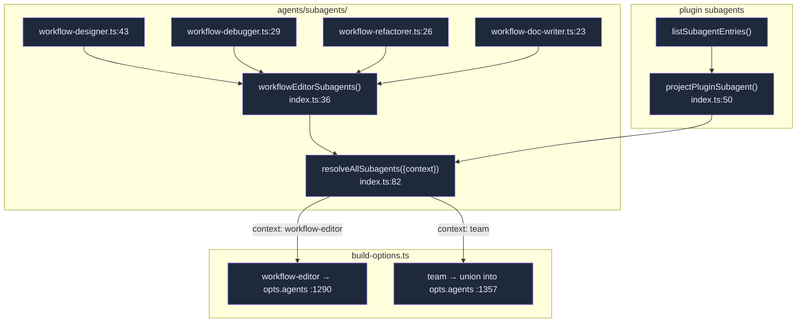
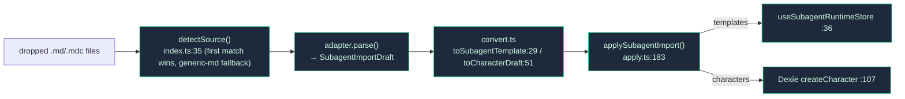

# Subagents

A **subagent** is a scoped sub-persona the SDK can delegate to mid-turn — its own prompt, tool whitelist, model, and turn budget. Cognia ships four built-in workflow subagents, exposes plugin-contributed ones, and can import subagent definitions from other tools' formats.

<TLDR>
  The four built-ins (`workflow-designer/debugger/refactorer/doc-writer`) are `AgentDefinition`s in
  `lib/claude/agents/subagents/`. `resolveAllSubagents({context})` (`index.ts:82`) returns them keyed
  by name; build-options spreads them into `opts.agents` for workflow-editor sessions (`:1290`) or
  unions them with plugin subagents for team sessions (`:1357`). A separate **runtime→UI** bridge
  (`subagent-bridge.ts:24`) projects spawned-subagent state into a `SubagentPart` on the assistant
  message — it does *not* feed the SDK. The `subagent-importers/` pipeline parses external tools'
  markdown (Claude Code, Codex, Cursor, Cline, generic) into a normalized draft that becomes a
  template or a character.
</TLDR>

## The AgentDefinition Shape

`lib/claude/agents/subagents/types.ts:13` re-exports the SDK's `AgentDefinition`: `description`, `prompt`, optional `tools[]`, `disallowedTools[]`, `model`, `maxTurns`, `effort` (`low|medium|high|xhigh|max`). The four built-ins set only `description`, `prompt`, `tools`, and `maxTurns` — model and effort inherit from the parent turn.

## The Four Built-in Workflow Subagents

All four operate on the [Visual Workflows](../subsystems/visual-workflows) editor through `mcp__cognia-plugin-tools__wf_*` tools.

| Subagent | Export | Tools | maxTurns | Can mutate? |
| --- | --- | --- | --- | --- |
| **Workflow Designer** | `workflow-designer.ts:43` | 15 (read/add/remove/connect/configure/propose_batch/templates/auto_layout/group) | 20 | yes (builds graphs) |
| **Workflow Debugger** | `workflow-debugger.ts:29` | 5 **read-only** (read_graph/selection/node/validation_errors/last_run) | 10 | no (diagnostic) |
| **Workflow Refactorer** | `workflow-refactorer.ts:26` | 11 (read + mutate + `wf_batch_apply` + layout + group) | 15 | yes |
| **Workflow Doc Writer** | `workflow-doc-writer.ts:23` | 5 (read + add + configure + focus — **cannot remove**) | 15 | annotate only |

Each file's `SYSTEM_PROMPT` constant is the `prompt`. The tool whitelist is what enforces the role: the debugger physically cannot mutate because it holds only read tools.

## Markdown agents (dormant)

A sibling module, `lib/claude/agents/markdown-agents.ts` (added in `665a6b81`), parses user-authored `*.md` agent files — YAML frontmatter + Markdown body — into the **same** SDK `AgentDefinition` shape via `buildMarkdownAgents()` (`:101`) and `markdownAgentsToSdkMap()` (`:120`). Its docstring intends the result to merge into `resolveAllSubagents` (`markdown-agents.ts:13`), but it has **no production caller yet** — `buildMarkdownAgents` is referenced only by its own test, so user markdown agents do **not** currently reach `opts.agents`. This is distinct from the `subagent-importers/` pipeline below, which materializes *templates / characters*, not live `opts.agents` entries.

## How They Reach the SDK

`resolveAllSubagents({context})` (`index.ts:82`):

- `"workflow-editor"` → the 4 built-ins only (`:86`).
- `"team"` → the built-ins **unioned** with every plugin subagent (`:90`).

Plugin subagents are projected through `projectPluginSubagent()` (`index.ts:50`); the runtime id is `<pluginId>:<id>` (`:67`). Both build-options branches are fail-soft — a projection error only `console.warn`s (`:1293` / `:1360`).

## Runtime → UI Bridge (not SDK exposure)

`subagent-bridge.ts` is the *other* direction: it turns spawned-subagent runtime state into a `SubagentPart` on the assistant message that spawned it. It has **zero** SDK or store imports — it is a pure message transform consumed by `use-claude-chat.ts` (which subscribes to `useSubagentRuntimeStore`).

`applySubagentUpdate(messages, subAgent, opts?)` (`:24`) finds or inserts an idempotent `SubagentPart` (built `:29-44`). `pickTargetMessageIndex()` (`:71`) attaches it to the right message: by `parentMessageId` (`:76`), then by `metadata.parentAgentId` (`:82`), falling back to the most-recent assistant (`:91`).

## Importing External Subagents

The `subagent-importers/` pipeline reads subagent definitions from *other* tools and normalizes them. Four stages: **adapters → convert → apply → UI dialog**.

| Stage | File | What it does |
| --- | --- | --- |
| Adapters | `claude-code.ts`, `codex-cli.ts`, `cursor.ts`, `cline.ts`, `generic-md.ts` | each `detect()` + `parse()` tool-specific frontmatter (`SUBAGENT_SOURCE_ADAPTERS`, `index.ts:11`; generic-md last) |
| Normalize | `types.ts:38` | every adapter emits a `SubagentImportDraft` (`source`, `sourceKey`, `name`, `systemPrompt`, `tools?`, `model?`, `warnings[]`) |
| Convert | `convert.ts:29/51` | draft → `SubAgentTemplate` or `CharacterDraft` (gemini→`"google"` provider mapping, `:16`) |
| Apply | `apply.ts:183` | dispatch by target; **merge strategies** skip / overwrite (built-ins protected → `failed[]`) / duplicate (`nextAvailableName()`, `:25`) |

`detectSource()` (`index.ts:35`) returns the first `"match"`, else the first `"maybe"` (so generic-md is the fallback), and `null` only when no file is accepted. Per-draft failures isolate into `failed[]` and never abort the batch.

## Extension Points

- **Add a built-in subagent**: create `<role>.ts` exporting an `AgentDefinition`, add it to `workflowEditorSubagents()` (`index.ts:36`). The tool whitelist *is* the safety boundary.
- **Plugin subagent**: declare it in the manifest; the manager registers it into `listSubagentEntries()` and it shows up in team sessions automatically.
- **Import a new tool format**: add an adapter implementing `SubagentSourceAdapter` (`detect`/`parse`) and register it in `SUBAGENT_SOURCE_ADAPTERS` before generic-md.

## Next

<Cards>
  <Card title="Build-options pipeline" href="./build-options" description="The :1290 / :1357 sites that spread subagents into opts.agents." />
  <Card title="Visual Workflows" href="../subsystems/visual-workflows" description="The editor the four built-in subagents operate on." />
  <Card title="Agent Teams" href="./agent-teams" description="Team sessions union plugin subagents with the built-ins." />
</Cards>
