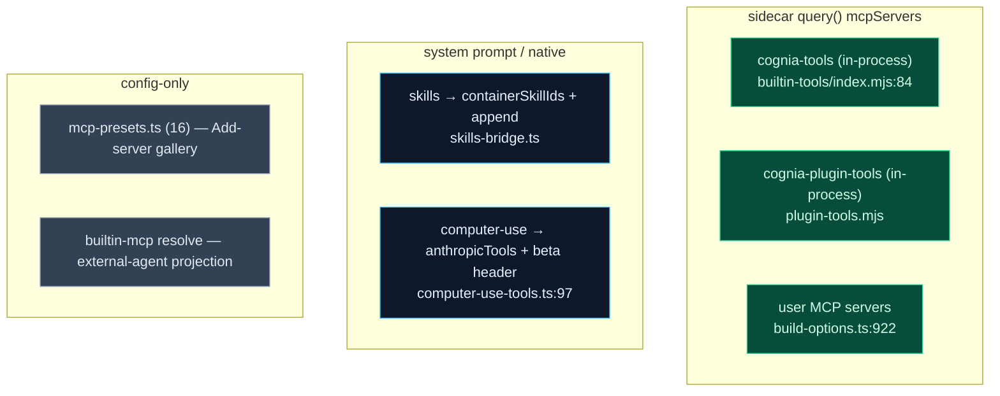
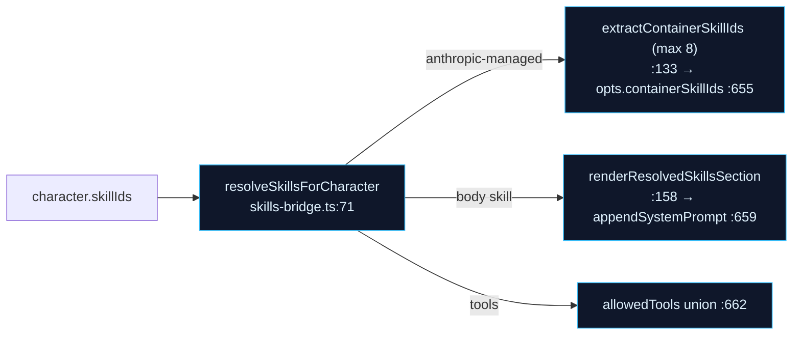

# Tools, MCP & Skills

The built-in agent gets its tool surface from five sources, all converging in the sidecar's SDK `query()` call. This page maps each: the in-process `cognia-tools` MCP server, the built-in MCP placeholder resolver, the skills→SDK bridge, computer-use native tools, and the preset gallery.

<TLDR>
  The sidecar builds an **in-process MCP server** (`cognia-tools`) from `sidecar/builtin-tools/` —
  file/git/process/env/shell/terminal/LSP tools, gated by category. A second in-process server
  (`cognia-plugin-tools`) proxies renderer-side plugin tools and resolves the workflow subagents'
  `wf_*` names. Skills become tool surface two ways: anthropic-managed skills pass through as
  `containerSkillIds`, body skills fold into `appendSystemPrompt` (`skills-bridge.ts`). Computer-use
  emits Anthropic *native* tools plus an `anthropic-beta` header, with an IM blacklist that
  default-denies on connector channels. The preset gallery (`mcp-presets.ts`, 16 presets) is just the
  "Add server" UI catalog.
</TLDR>

## Where Tools Come From

## cognia-tools — the in-process MCP server

`buildCogniaToolsServer({enabled, alwaysLoad, lspResolver})` (`sidecar/builtin-tools/index.mjs:69`) composes a `createSdkMcpServer` named `cognia-tools` (`:84`), or returns `null` when no category is enabled. Tools are grouped by category (`TOOLS_BY_CATEGORY`, `:25`); disabled categories' namespaced names are pushed onto `disallowedTools` as defence-in-depth (`namesForDisabledCategories`, `:100`). Every tool is namespaced `mcp__cognia-tools__<tool>`.

| Category | File | Tools | Count |
| --- | --- | --- | --- |
| fileExtras | `file-extras.mjs` | hash/diff/info/exists/search/content_search/append/binary_write/copy/rename/move/dir_create/dir_delete | 13 |
| git | `git.mjs` | status/diff/log/branch/remote/tag/repo_inspect/changes/history | 9 |
| process | `process.mjs` | list/get/search/top_memory/check_allowed/manager_status/tracked/start/terminate | 9 |
| environment | `environment.mjs` | list_env/get_env/system_info | 3 |
| shellAdvanced | `shell-advanced.mjs` | shell_execute_advanced | 1 |
| terminalRepl | `terminal-repl-tool.mjs` | spawn/write/read/kill (node-pty private REPL) | 4 |
| lsp | `lsp.mjs` | goto_definition/find_references/hover/document_symbols/diagnostics | 5 |

LSP tools are **resolver-bound and per-session** — added via `createLspTools(resolver)` (`lsp.mjs:85`) only when `enabled.lsp && lspResolver`, not in the static map. `shell_execute_advanced` and `start_process` route through `safety.mjs` (path-traversal guard + allowlist/blocklist/dangerous-pattern scan), mirrored from the Cognia shell tool.

The toggle source is `opts.builtinTools` (`build-options.ts:965`) — the settings JSON that enables/disables each category.

## cognia-plugin-tools — the renderer proxy

`buildPluginToolsServer` (`plugin-tools.mjs`) builds a second in-process server (`cognia-plugin-tools`) that wraps renderer-relayed plugin tools: each tool, when called, emits a `plugin_tool_exec` back to the renderer and awaits the `plugin_tool_response`. This is the server the workflow subagents' `mcp__cognia-plugin-tools__wf_*` names resolve against. The manifest is built in build-options (`buildPluginToolsManifest`, `:995`), which also folds in the built-in-skills manifest and drops `cognia-computer-use` when computer-use is not authorized.

## Built-in MCP resolution

`lib/claude/builtin-mcp/` is **not** part of the chat send path — it is the placeholder resolver for the **external-agent config projection** (writing `~/.claude.json` etc.). `resolveBuiltinMcpConfig(server, ctx)` (`resolve.ts:93`) is pure: it substitutes `${COGNIA_SIDECAR_DIR}` in `command`/`args`/`env`, and for the a2ui-bridge row injects `env.COGNIA_BRIDGE_SOCKET = ctx.socketPath` so the spawned `a2ui-mcp.mjs` connects back to the renderer. `getBuiltinMcpRuntimeContext()` (`runtime-context.ts:38`) fetches the paths from Rust (`a2ui_bridge_runtime_paths`), process-lifetime cached. It is consumed by `sync.ts:88`. (The actual chat-path MCP servers come from `listEnabledMcpServers` + `buildMcpServerMap`, `build-options.ts:929`.)

## Skills → SDK surface

`skills-bridge.ts` produces a uniform `ResolvedSkill` (`:38`) across chat skills and plugin skills, then exposes them to the SDK two ways:

- **Managed skills** (`anthropic-managed`) resolve to a `containerSkillId` only; build-options forwards up to 8 (`MAX_CONTAINER_SKILLS`, `:126`) to the sidecar as `container.skill_id`.
- **Body skills** have their markdown read by `resolveSkillMarkdown` (`skills-io.ts:273`) — inline / local-folder / local-bundle / archive — and folded into one `## Skill: <name>` section via `renderResolvedSkillsSection` (`:158`).

Plugin skills win on id collision; everything is fail-soft (browser / fs failure → `undefined`, never throws). See the [Skills system](./skills-system) for authoring.

## Computer-use native tools

`applyComputerUseTools(input)` (`computer-use-tools.ts:97`) resolves Anthropic's *native* computer-use tools for a turn — distinct from MCP tools. Flow:

1. early return if `!enableComputerUse` (clears cached settings, `:100`)
2. **IM blacklist short-circuit** (`:118`): `if (imSession && allowImComputerUse !== true) return {attachedCount:0}` — connector channels default-deny screen control
3. read the native-tool registry, filter by `allowedToolIds`, apply consent/tier logic (`:139`)
4. map to `opts.anthropicTools` (`:186`) and compose the `anthropic-beta` header (`:205`)

`COMPUTER_USE_PLUGIN_TOOL_NAMES` (`:39`) is the suppress set fed to `opts.suppressApprovalForTools` (so a session-grant / auto consent doesn't re-prompt), mirrored in `use-claude-chat.ts:39`. The IM gate is computed in build-options at `:990` (`imSession = Boolean(session.platformBinding?.adapterId)`) and passed at the `:1075` call site. See [ADR-0020](../adr/0020-computer-use-completeness) for the full gate.

## Preset MCP gallery

`mcp-presets.ts` is a **code-only** catalog (`MCP_PRESETS`, `:46`) of 16 one-click servers: filesystem, github, gitlab, brave-search, puppeteer, fetch, memory, sqlite, postgres, slack, time, deepwiki (http), http-generic, sse-generic, custom. `applyPresetFields(preset, values)` (`:365`) places user values into env / args / url / headers. This populates the "Add server" UI only — distinct from the in-process `cognia-tools` server.

## Cross-module Summary

| Source | Reaches SDK as | Build-options site |
| --- | --- | --- |
| cognia-tools | `query()` mcpServers (in-process) | `opts.builtinTools` `:965` |
| plugin tools | `cognia-plugin-tools` (in-process proxy) | `opts.pluginTools` `:995` |
| user MCP | `opts.mcpServers` | `:922` |
| skills (managed) | `opts.containerSkillIds` | `:655` |
| skills (body) | `appendSystemPrompt` | `:659` |
| computer-use | `opts.anthropicTools` + beta header | `:1075` |

## Next

<Cards>
  <Card title="Build-options pipeline" href="./build-options" description="Where every tool/MCP/skill field is assembled into the payload." />
  <Card title="Skills system" href="./skills-system" description="Authoring chat skills and the SKILL.md format." />
  <Card title="Sidecar MCP server" href="../subsystems/mcp-server-sidecar" description="The standalone a2ui-mcp.mjs server and protocol." />
  <Card title="ADR-0020 Computer Use" href="../adr/0020-computer-use-completeness" description="The native computer-use gate and consent tiers." />
</Cards>
