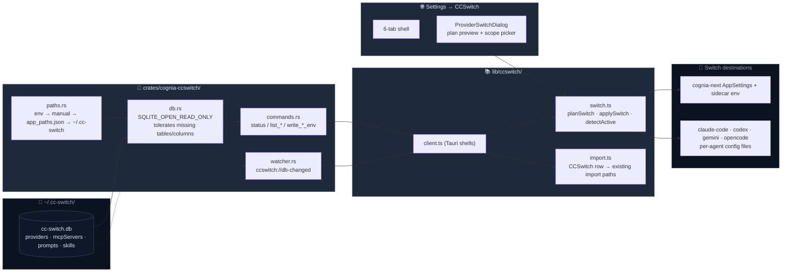

# CCSwitch Interop

<Status variant="stable">stable</Status>

<TLDR>
CCSwitch is a community open-source Claude multi-account switcher. Cognia opens its `cc-switch.db` read-only, surfaces 50+ providers, MCP servers, prompts, and skills directly in Settings, and switches cognia-next itself plus any checked external agents in one action (Claude Code's `~/.claude/settings.json`, Codex's `~/.codex/auth.json`, Gemini's `~/.gemini/settings.json`, OpenCode's `auth.json`). We **never write** to the CCSwitch database.
</TLDR>

CCSwitch interop has two independent capabilities:

1. **Read-only browsing** — directly display the 4 tables from the CCSwitch database in Settings, providing a one-click "import into cognia-next" shortcut.
2. **Coordinated switching** — when the user selects a CCSwitch provider as the current active one, write its API key and base URL simultaneously into (a) cognia-next's own `AppSettings`, and (b) the settings file of every external agent the user has checked — so after one switch, both cognia-next and Claude Code CLI use the same credentials.

<Callout type="warn">
  CCSwitch interop and Subscription Account Center have separate ownership. CCSwitch rows are external,
  read-only source records until the user explicitly performs a supported import/switch action. Account
  Center “Deactivate” changes only Cognia's active credential projection, and “Remove from Cognia” deletes
  only Cognia's local vault entry/reference. Neither action writes the CCSwitch database, edits an agent
  login, revokes a token, or logs out CCSwitch/Claude Code/Codex/OpenCode. “Default for new sessions” is a
  Cognia resolver preference and is not a CCSwitch switch.
</Callout>

## Code Locations

```
crates/cognia-ccswitch/src/
  paths.rs      # db-path resolution chain (env → manual → app_paths.json → default)
  db.rs         # read-only SQLite + tolerant column mapping
  commands.rs   # 5 read commands + 3 agent-env write commands
  watcher.rs    # ccswitch_watch_start/stop → ccswitch://db-changed events

src-tauri/src/settings.rs   # write_claude_settings_env (the claude-code writer)
src-tauri/src/lib.rs        # `pub use cognia_ccswitch as ccswitch` (ADR-0067 split)

types/ccswitch/  # CcswitchProvider / SwitchPlan / ActiveProviderState / CcswitchAgentId …

lib/ccswitch/
  client.ts     # thin wrappers around the Tauri commands
  switch.ts     # planSwitch / applySwitch / detectActive / buildProviderRegistration
  import.ts     # adapters from CCSwitch rows to existing import paths
  hooks.ts      # useCcswitchStatus / useCcswitchProviders … (+ live db watch)

components/settings/ccswitch/
  ccswitch-section.tsx
  provider-switch-dialog.tsx
  tabs/{overview,providers,mcp,prompts,skills,sync}-tab.tsx
```

## Architecture



## Path Resolution and Liveness Check

`crates/cognia-ccswitch/src/paths.rs` resolves `cc-switch.db` through a priority chain rather than assuming a fixed location:

1. `CC_SWITCH_HOME` env var — a cognia-specific test/debug override.
2. `ccswitchSync.manualDataDir` — the manual data-dir override from Settings (threaded into every command as `manualDataDir`).
3. CCSwitch's own `app_paths.json` → `app_config_dir_override` — this is how cloud-sync redirects (Dropbox / iCloud / WebDAV) are followed. A redirect whose target no longer exists on disk falls back to the default.
4. `~/.cc-switch/cc-switch.db` — the default, consistent across OSes.

`CcswitchStatus.resolutionSource` (`"env" | "manual" | "redirect" | "default"`) is reported back so the Overview tab can show where the path actually came from.

`ccswitch_status()` always succeeds and returns one of three states:

- `exists: false, error: undefined` — user has not installed CCSwitch; Settings shows an "install prompt" card.
- `exists: true, counts: {...}` — everything normal; all 6 tabs enabled.
- `exists: true, error: "..."` — file exists but cannot be opened (corrupted, permissions); shows a degraded banner + troubleshooting button.

## Tolerant Column Mapping

The CCSwitch schema is not under our control. The core constraints of `db.rs`:

| Scenario       | Behavior                                                           |
| -------------- | ------------------------------------------------------------------ |
| Missing table  | Returns empty array, no error                                      |
| Missing column | Corresponding field is `None` / empty string                       |
| Extra columns  | Ignored                                                            |
| Corrupted file | `status` returns `error`, `list_*` returns Err                     |
| Renamed schema | We map a generated superset of column names; whatever matches wins |

```rust title="crates/cognia-ccswitch/src/db.rs"
let conn = Connection::open_with_flags(
    path,
    OpenFlags::SQLITE_OPEN_READ_ONLY | OpenFlags::SQLITE_OPEN_NO_MUTEX,
)?;
```

`SQLITE_OPEN_NO_MUTEX` is used because CCSwitch is a single-threaded writer; read-only connections do not need SQLite's built-in connection lock.

## Tauri Commands

```ts title="lib/ccswitch/client.ts"
// reads — the first five open the CCSwitch DB read-only
ccswitchStatus() // always returns, 3 states
ccswitchListProviders() // CcswitchProvider[]
ccswitchListMcpServers() // CcswitchMcpServer[]
ccswitchListPrompts() // CcswitchPrompt[]
ccswitchListSkills() // CcswitchSkill[]

// live watch — emits `ccswitch://db-changed` on debounced db mutations
ccswitchWatchStart()
ccswitchWatchStop()

// writes — never touch the CCSwitch DB; they patch each agent's own file
writeClaudeSettingsEnv(envUpdates)   // env block of ~/.claude/settings.json
writeCodexAuthEnv(envUpdates)        // OPENAI_API_KEY + auth_mode in ~/.codex/auth.json
writeGeminiSettingsEnv(envUpdates)   // env block of ~/.gemini/settings.json
writeOpencodeAuthEnv(envUpdates)     // {type:"api",key} entry in opencode's auth.json
```

The claude-code writer lives in `src-tauri/src/settings.rs`; the other three live alongside the readers in `crates/cognia-ccswitch/src/commands.rs`. Every writer:

- resolves the target file itself (e.g. `writeClaudeSettingsEnv` patches the `env` block of `~/.claude/settings.json` — where the Claude Code CLI reads environment variables, **not** `~/.claude.json`, which is the MCP config);
- refuses when the agent isn't installed (missing `~/.codex/` etc. — we never materialise an auth file for a CLI the user never set up);
- writes atomically with an **mtime drift check** — if the agent's own app (or cc-switch) touched the file between our read and write, the command returns the `drift_detected` error instead of clobbering it;
- keeps a bounded `.bak.<ts>` backup history (10 retained, rotated after each write).

## Switch Flow

Switching is a three-layer action — preview, confirm, execute:

<Steps>
  <Step>
    **User clicks "Switch to Kimi K2" in the Providers tab** — `ProviderSwitchDialog` opens,
    rendering two panels: "what will change" and "which agents are affected".
  </Step>
  <Step>
    **plan** — `planSwitch(provider, scope, current)` is a pure function (no I/O) that turns "switch
    to this provider" into a `SwitchPlan`: - `cogniaChanges`: before/after for
    apiKey/baseUrl/activeProviderId, whether a sidecar restart is needed, and `useSubscription`
    (true for official Claude providers — a Claude-kind entry with no API key, meaning "use the
    Anthropic subscription"). - `agentChanges[]`: one row per checked agent — target path
    (`~/.claude/settings.json` etc.), whether we support it, and the envUpdates array.
  </Step>
  <Step>**confirm** — user reviews the preview and clicks "Apply"; only then does I/O begin.</Step>
  <Step>
    **applySwitch** — execution order is deliberate: 1. Save through the settings store — apiKey,
    apiBaseUrl, activeProviderId, plus the relay's tiered model list registered under the built-in
    `anthropic` provider by `buildProviderRegistration` (cheap, rollback-capable). 2. Call
    `setProviderEnv` to push the new env — including the relay's forwarded headers — to the sidecar;
    for an official Claude provider, activate the Anthropic subscription first (vault account, or
    adopt the local Claude Code CLI login); restart the sidecar when the key, URL, or headers
    changed. 3. For each supported agent, call its write command to apply the env patch. A failed
    agent does not abort the whole operation — each row is recorded individually as `ok / error`,
    and the UI shows a partial-success result.
  </Step>
</Steps>

```ts title="lib/ccswitch/switch.ts (env updates, per agent)"
// claude-code → ~/.claude/settings.json env block
[
  { key: "ANTHROPIC_API_KEY", value: provider.apiKey?.trim() || null },
  { key: "ANTHROPIC_BASE_URL", value: provider.baseUrl?.trim() || null },
]
// codex → ~/.codex/auth.json (baseUrl intentionally not propagated)
[{ key: "OPENAI_API_KEY", value: provider.apiKey?.trim() || null }]
// gemini → ~/.gemini/settings.json env block
[
  { key: "GEMINI_API_KEY", value: provider.apiKey?.trim() || null },
  { key: "GOOGLE_GEMINI_BASE_URL", value: provider.baseUrl?.trim() || null },
]
// opencode → auth.json; "__provider" is consumed by the Rust writer, never persisted
[
  { key: "OPENCODE_API_KEY", value: provider.apiKey?.trim() || null },
  { key: "__provider", value: opencodeProviderFor(provider) },
]
```

`value: null` explicitly _deletes_ the key, preventing a stale endpoint from routing requests to the wrong proxy. Codex and OpenCode don't get `baseUrl` — codex-cli reads base URLs from `config.toml` model-provider tables and OpenCode from its own `opencode.json`, so the dialog surfaces a warning instead of writing a guessed location.

## detectActive — Drift Detection

When Settings regains focus — or the live db watcher fires `ccswitch://db-changed` — the UI calls `detectActive(providers, { agentReaders })` to determine the current CCSwitch provider id used by each surface. Comparison is by `(apiKey, baseUrl)` tuple: provider records with the same key+URL pair are equivalent regardless of name. Agent reads are injected (`agentReaders`) — the Overview tab passes a reader that calls `read_claude_user_settings` to fill the `claude-code` slot:

```ts title="types/ccswitch/switch.ts"
interface ActiveProviderState {
  cognia: string | undefined
  agents: Partial<Record<CcswitchAgentId, string | undefined>>
  drift: boolean // true if any agent is inconsistent with cognia
}
```

When `drift: true`, the Overview tab renders a drift banner at the top, letting the user re-select the active provider or ignore it. "Drift" usually happens when the user switched directly via the CCSwitch GUI without going through cognia-next's picker.

## Integration with Existing Import Paths

We **do not create separate tables for CCSwitch** — MCP servers, prompts, and skills all map to cognia's own corresponding Dexie tables (`mcpServers` / `promptPresets` / `skills`). `lib/ccswitch/import.ts` contains 4 adapters:

| Source type         | Converted to      | Target import function          |
| ------------------- | ----------------- | ------------------------------- |
| `CcswitchMcpServer` | `McpImportDraft`  | `bulkImportMcpServers`          |
| `CcswitchPrompt`    | direct field map  | `createPreset`                  |
| `CcswitchSkill`     | direct field map  | `createSkill`                   |
| `CcswitchProvider`  | via `applySwitch` | (not imported, only referenced) |

Providers are not imported — they are only referenced as active: writing to `AppSettings.activeProviderId = "ccswitch:<id>"` means the sidecar uses the current env directly at spawn time, with no catalog entries to maintain.

## Settings UI — Six Tabs

`Settings → CCSwitch` (`?section=ccswitch&ccswitchTab=…`):

<Cards>
  <Card title="Overview" description="Status card + drift banner + counts.">
    overview-tab.tsx
  </Card>
  <Card
    title="Providers"
    description="50+ providers grouped by kind; row-level active badge + one-click switch."
  >
    providers-tab.tsx
  </Card>
  <Card title="MCP" description="MCP servers bundled with CCSwitch; one-click import into cognia.">
    mcp-tab.tsx
  </Card>
  <Card title="Prompts" description="Prompt preset browsing + import.">
    prompts-tab.tsx
  </Card>
  <Card title="Skills" description="Rendered by sourcePath or inline content + import.">
    skills-tab.tsx
  </Card>
  <Card title="Sync" description="Drift detection, bulk import, re-check status.">
    sync-tab.tsx
  </Card>
</Cards>

## Related Subsystems

<Cards>
  <Card
    title="Claude Subscription OAuth"
    href="./claude-subscription-oauth"
    description="OAuth and API key are mutually exclusive; switching to a CCSwitch provider clears the OAuth bearer."
  />
  <Card
    title="Provider System"
    href="./provider-system"
    description="activeProviderId in the form ccswitch:agentId is a Provider field."
  />
</Cards>

## Known Limitations

- **v1 only writes `claude-code`** — other agents (codex / gemini / opencode / openclaw) are shown grayed out with `unsupported: true` in the switch dialog. To add a new agent: add it to the `SUPPORTED_AGENTS` Set, provide its path in `targetPathFor`, and extend the Rust write command to support the new file format.
- **Two-writer risk** — CCSwitch itself also writes `~/.claude/settings.json`; we rely on `detectActive` to converge on focus, but concurrent writes may still race. `writeClaudeSettingsEnv` creates a backup (returning `backupPath`) before writing, to allow rollback.
- **CCSwitch redirected directory** — when the user redirects `.cc-switch` to another location via Dropbox / iCloud, we cannot see it. The user needs to switch CCSwitch back to the default location, or we need to add support for CCSwitch's marker file protocol in a future version.
- **OAuth precedence** — a projected Claude OAuth bearer takes precedence over a CCSwitch provider. Use
  “Deactivate” in Account Center before an explicit CCSwitch switch. This does not log out Claude Code or
  revoke the OAuth credential; it only clears Cognia's active projection.
