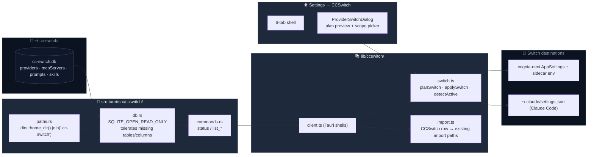

# CCSwitch Interop

<Status variant="stable">stable</Status>

<TLDR>
  CCSwitch is a community open-source Claude multi-account switcher. Cognia opens its
  `~/.cc-switch/cc-switch.db` in read-only mode, surfacing 50+ providers, MCP servers, prompts, and
  skills directly in Settings, and can simultaneously switch cognia-next itself plus any set of
  external agents in a single action (v1 currently only writes `claude-code`'s
  `~/.claude/settings.json`). We **never write** to the CCSwitch database.
</TLDR>

<StatGrid>
  <Stat label="Read-only IPC" value="5" hint="status / list 4 kinds" />
  <Stat label="Write action" value="1" hint="write_claude_settings_env" />
  <Stat
    label="Settings tab"
    value="6"
    hint="overview / providers / mcp / prompts / skills / sync"
  />
  <Stat label="Switchable agents" value="1" hint="claude-code (v1)" />
</StatGrid>

CCSwitch interop has two independent capabilities:

1. **Read-only browsing** — directly display the 4 tables from the CCSwitch database in Settings, providing a one-click "import into cognia-next" shortcut.
2. **Coordinated switching** — when the user selects a CCSwitch provider as the current active one, write its API key and base URL simultaneously into (a) cognia-next's own `AppSettings`, and (b) the settings file of every external agent the user has checked — so after one switch, both cognia-next and Claude Code CLI use the same credentials.

## Code Locations

```
src-tauri/src/ccswitch/
  paths.rs      # cross-platform resolution for ~/.cc-switch/cc-switch.db
  db.rs         # read-only SQLite + tolerant column mapping
  commands.rs   # 5 Tauri commands

lib/ccswitch/
  types.ts      # CcswitchProvider / SwitchPlan / ActiveProviderState …
  client.ts     # thin wrappers around the 5 Tauri commands
  switch.ts     # planSwitch / applySwitch / detectActive
  import.ts     # adapter from CCSwitch rows to existing import paths
  hooks.ts      # useLiveCcswitchStatus / useLiveCcswitchProviders …

components/settings/ccswitch/
  ccswitch-section.tsx
  provider-switch-dialog.tsx
  tabs/{overview,providers,mcp,prompts,skills,sync}-tab.tsx
```

## Architecture



## Database Liveness Check

`src-tauri/src/ccswitch/paths.rs` defines the DB path as `~/.cc-switch/cc-switch.db` — consistent across OSes. CCSwitch itself allows redirecting this path via a cloud-sync directory (Dropbox / iCloud / WebDAV); v1 does not follow the redirect; the user needs to switch CCSwitch back to the default location.

`ccswitch_status()` always succeeds and returns one of three states:

- `exists: false, error: undefined` — user has not installed CCSwitch; Settings shows an "install prompt" card.
- `exists: true, counts: {...}` — everything normal; all 6 tabs enabled.
- `exists: true, error: "..."` — file exists but cannot be opened (corrupted, permissions); shows a degraded banner + troubleshooting button.

## Tolerant Column Mapping

The CCSwitch schema is not under our control. The core constraints of `db.rs`:

| Scenario       | Behavior                                                           |
| -------------- | ------------------------------------------------------------------ |
| Missing table  | Returns empty array, no error                                      |
| Missing column | Corresponding field is `None` / empty string                       |
| Extra columns  | Ignored                                                            |
| Corrupted file | `status` returns `error`, `list_*` returns Err                     |
| Renamed schema | We map a generated superset of column names; whatever matches wins |

```rust title="src-tauri/src/ccswitch/db.rs"
let conn = Connection::open_with_flags(
    path,
    OpenFlags::SQLITE_OPEN_READ_ONLY | OpenFlags::SQLITE_OPEN_NO_MUTEX,
)?;
```

`SQLITE_OPEN_NO_MUTEX` is used because CCSwitch is a single-threaded writer; read-only connections do not need SQLite's built-in connection lock.

## Five Tauri Commands

```ts title="lib/ccswitch/client.ts"
ccswitchStatus() // always returns, 3 states
ccswitchListProviders() // CcswitchProvider[]
ccswitchListMcpServers() // CcswitchMcpServer[]
ccswitchListPrompts() // CcswitchPrompt[]
ccswitchListSkills() // CcswitchSkill[]

// the only write command — does not write to CCSwitch DB, writes to Claude Code's settings.json
writeClaudeSettingsEnv(envUpdates)
```

The target of `writeClaudeSettingsEnv` is the `env` block in `~/.claude/settings.json` — where the Claude Code CLI reads environment variables, **not** `~/.claude.json` (that is the MCP config). The Rust side handles path resolution, atomic writes, and backups.

## Switch Flow

Switching is a three-layer action — preview, confirm, execute:

<Steps>
  <Step>
    **User clicks "Switch to Kimi K2" in the Providers tab** — `ProviderSwitchDialog` opens,
    rendering two panels: "what will change" and "which agents are affected".
  </Step>
  <Step>
    **plan** — `planSwitch(provider, scope, current)` is a pure function (no I/O) that turns "switch
    to this provider" into a `SwitchPlan`: - `cogniaChanges`: before/after for
    apiKey/baseUrl/activeProviderId, and whether a sidecar restart is needed. - `agentChanges[]`:
    one row per checked agent — target path (`~/.claude/settings.json` etc.), whether v1 supports
    it, and the envUpdates array.
  </Step>
  <Step>**confirm** — user reviews the preview and clicks "Apply"; only then does I/O begin.</Step>
  <Step>
    **applySwitch** — execution order is deliberate: 1. Write Dexie `settings` (cheap,
    rollback-capable). 2. Call `setProviderEnv` to push the new env to the sidecar; if key or URL
    changed, call `restartSidecar()`. 3. For each supported agent, call `writeClaudeSettingsEnv` to
    write the env patch. A failed agent does not abort the whole operation — each row is recorded
    individually as `ok / error`, and the UI shows a partial-success result.
  </Step>
</Steps>

```ts title="lib/ccswitch/switch.ts (env updates)"
function envUpdatesForProvider(provider: CcswitchProvider) {
  return [
    { key: "ANTHROPIC_API_KEY", value: provider.apiKey?.trim() || null },
    { key: "ANTHROPIC_BASE_URL", value: provider.baseUrl?.trim() || null },
  ]
}
```

`value: null` explicitly _deletes_ the key, preventing a stale endpoint from routing requests to the wrong proxy.

## detectActive — Drift Detection

When Settings regains focus, the UI calls `detectActive()` to determine the current CCSwitch provider id used by each surface:

```ts title="lib/ccswitch/types.ts"
interface ActiveProviderState {
  cognia: string | undefined
  agents: Partial<Record<AgentId, string | undefined>>
  drift: boolean // true if any agent is inconsistent with cognia
}
```

When `drift: true`, the Overview tab renders a drift banner at the top, letting the user re-select the active provider or ignore it. "Drift" usually happens when the user switched directly via the CCSwitch GUI without going through cognia-next's picker.

## Integration with Existing Import Paths

We **do not create separate tables for CCSwitch** — MCP servers, prompts, and skills all map to cognia's own corresponding Dexie tables (`mcpServers` / `promptPresets` / `skills`). `lib/ccswitch/import.ts` contains 4 adapters:

| Source type         | Converted to      | Target import function          |
| ------------------- | ----------------- | ------------------------------- |
| `CcswitchMcpServer` | `McpImportDraft`  | `bulkImportMcpServers`          |
| `CcswitchPrompt`    | direct field map  | `createPreset`                  |
| `CcswitchSkill`     | direct field map  | `createSkill`                   |
| `CcswitchProvider`  | via `applySwitch` | (not imported, only referenced) |

Providers are not imported — they are only referenced as active: writing to `AppSettings.activeProviderId = "ccswitch:<id>"` means the sidecar uses the current env directly at spawn time, with no catalog entries to maintain.

## Settings UI — Six Tabs

`Settings → CCSwitch` (`?section=ccswitch&ccswitchTab=…`):

<Cards>
  <Card title="Overview" description="Status card + drift banner + counts.">
    overview-tab.tsx
  </Card>
  <Card
    title="Providers"
    description="50+ providers grouped by kind; row-level active badge + one-click switch."
  >
    providers-tab.tsx
  </Card>
  <Card title="MCP" description="MCP servers bundled with CCSwitch; one-click import into cognia.">
    mcp-tab.tsx
  </Card>
  <Card title="Prompts" description="Prompt preset browsing + import.">
    prompts-tab.tsx
  </Card>
  <Card title="Skills" description="Rendered by sourcePath or inline content + import.">
    skills-tab.tsx
  </Card>
  <Card title="Sync" description="Drift detection, bulk import, re-check status.">
    sync-tab.tsx
  </Card>
</Cards>

## Related Subsystems

<Cards>
  <Card
    title="Claude Subscription OAuth"
    href="./claude-subscription-oauth"
    description="OAuth and API key are mutually exclusive; switching to a CCSwitch provider clears the OAuth bearer."
  />
  <Card
    title="Provider System"
    href="./provider-system"
    description="activeProviderId in the form ccswitch:agentId is a Provider field."
  />
</Cards>

## Known Limitations

- **v1 only writes `claude-code`** — other agents (codex / gemini / opencode / openclaw) are shown grayed out with `unsupported: true` in the switch dialog. To add a new agent: add it to the `SUPPORTED_AGENTS` Set, provide its path in `targetPathFor`, and extend the Rust write command to support the new file format.
- **Two-writer risk** — CCSwitch itself also writes `~/.claude/settings.json`; we rely on `detectActive` to converge on focus, but concurrent writes may still race. `writeClaudeSettingsEnv` creates a backup (returning `backupPath`) before writing, to allow rollback.
- **CCSwitch redirected directory** — when the user redirects `.cc-switch` to another location via Dropbox / iCloud, we cannot see it. The user needs to switch CCSwitch back to the default location, or we need to add support for CCSwitch's marker file protocol in a future version.
- **OAuth mutual exclusion** — CCSwitch provider priority is lower than OAuth bearer: if the user is logged into Claude Subscription, the sidecar prefers OAuth; before switching to a CCSwitch provider, log out in the Subscription tab first.
