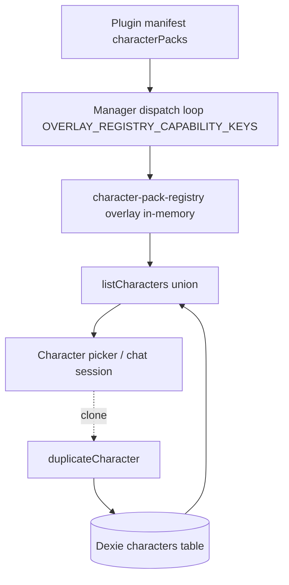

# Character Packs

A **character pack** is a portable bundle of ready-to-use characters (system prompt + model defaults + skill / MCP / native-tool wiring) that a plugin contributes through its manifest. ADR-0030 makes `character-pack` the 5th entry in `OVERLAY_REGISTRY_CAPABILITIES`: packs register into an in-memory overlay registry on plugin enable and are dropped on disable. Plugin-contributed characters **never persist to Dexie** — only a user *clone* of an overlay character becomes a Dexie row. The host derives a synthetic runtime id at projection time so collisions with user `char_*` ids are impossible.

<TLDR>
- Manifest field `characterPacks: PluginCharacterPackDef[]` — `types/plugin/plugin.ts:572`; capability `"character-pack"` dispatched at `lib/plugin/contracts/capability-bridge-map.ts:228`.
- Overlay registry (in-memory, never Dexie): `lib/plugin/registries/character-pack-registry.ts:37`.
- Runtime id `cognia-pack:<pluginId>:<packId>:<localId>` — `buildOverlayCharacterId` at `character-pack-registry.ts:162`.
- SDK author helper `defineCharacterPack` — `lib/plugin/sdk/define-character-pack.ts:46` (soft cap 50, 64 KB avatar warn).
- `requires` is warn-not-block — `lib/plugin/character-pack/validate-requires.ts:56`.
- First-party built-ins ride the overlay too — `plugins/cognia-builtin-characters/src/index.ts:32`.
</TLDR>

## Manifest types

A pack contains one or more characters. Each character is a strict, portable subset of the Dexie `Character` shape — host-managed identity / lifecycle / Twin-binding fields are filled in by the host at projection time, not declared by the author.

```ts
// types/plugin/plugin-character-pack.ts:37-42
export interface PluginCharacterAvatarImage {
  /** Filesystem-style path relative to the plugin bundle (Tauri only). */
  tauriPath?: string
  /** `data:image/*` URL — works in every shell, larger payload. */
  webDataUrl?: string
}
```

```ts
// types/plugin/plugin-character-pack.ts:48-57
export interface PluginCharacterPersona {
  /** Free-form tone descriptor (e.g. "warm, encouraging"). */
  tone?: string
  /** Persona prose (e.g. "Former kindergarten teacher, prefers analogies."). */
  personality?: string
  /** Opening line shown when the user starts a new chat with the character. */
  openingMessage?: string
  /** Few-shot exemplar prompts surfaced as quick-action chips. */
  exemplarPrompts?: string[]
}
```

```ts
// types/plugin/plugin-character-pack.ts:69-76
export interface PluginCharacterVoiceProfile {
  provider: TTSProvider
  voiceId: string
  /** TTS rate multiplier. Inherits global `ttsRate` when undefined. */
  rate?: number
  pitch?: number
  volume?: number
}
```

```ts
// types/plugin/plugin-character-pack.ts:88-141 (trimmed)
export interface PluginCharacterDef {
  /** Unique id within the pack. Host derives the runtime id from this. */
  localId: string
  name: string
  description?: string
  avatarColor: string
  avatarEmoji?: string
  /** Required. The persona's system prompt. */
  systemPrompt: string

  // ---- Optional Character subset (mirrors lib/claude/types.ts:Character) ----
  model?: string
  providerId?: string
  permissionMode?: SendOptions["permissionMode"]
  allowedTools?: string[]
  disallowedTools?: string[]
  mcpServerIds?: string[]
  skillIds?: string[]
  pluginSkillIds?: string[]
  workingDir?: string
  bareMode?: boolean
  debugMode?: boolean
  briefMode?: boolean
  enableComputerUse?: boolean
  computerUseSettings?: Character["computerUseSettings"]
  sandboxEnabled?: boolean
  sandboxTier?: Character["sandboxTier"]
  platformDefaults?: CharacterPlatformDefaults
  a2uiEnabled?: boolean
  a2uiCatalogId?: string
  /** Restrict to specific host profiles; unset = available everywhere. */
  availableOnPlatforms?: PluginRuntimeProfile[]

  // ---- v2 fields (schemaVersion: 2) ----
  avatarImage?: PluginCharacterAvatarImage
  persona?: PluginCharacterPersona
  voiceProfile?: PluginCharacterVoiceProfile
}
```

```ts
// types/plugin/plugin-character-pack.ts:147-176
export interface PluginCharacterPackDef {
  /** Pack id; must be unique within the contributing plugin's manifest. */
  id: string
  name: string
  description?: string
  /** Semver. Drives the user-clone "Update available" comparison. */
  version: string
  /** At least one character. SDK helper soft-caps at 50; see ADR-0030. */
  characters: PluginCharacterDef[]

  /** Cross-capability dependencies — validated as warnings, never blockers. */
  requires?: {
    skills?: string[]
    pluginSkillIds?: string[]
    mcpServerPresets?: string[]
    nativeAnthropicTools?: string[]
    a2uiCatalogId?: string
  }

  /** Optional cosmetic. Default for character avatars that omit one. */
  icon?: { emoji?: string; color?: string }
  /** Free-form tags surfaced in the Settings UI search. */
  tags?: string[]
}
```

Names are plain `string` (ADR-0030 §D7) — plugins wanting localised labels register their own bundle via `lib/i18n/plugin-i18n-registry.ts:registerPluginI18n` and the host renders `plugin.<pluginId>.<key>`. The v2 fields are optional and backward-compatible: a v1 pack leaves them undefined and the runtime falls back to `avatarEmoji + avatarColor` for display and AppSettings TTS for voice.

## SDK author surface — `defineCharacterPack`

`defineCharacterPack()` is a typed pass-through that also enforces the structural rules at author time: at least one character, unique `localId`s, the 50-character soft cap, and non-blocking warnings for unknown voice providers / oversized avatars.

```ts
// lib/plugin/sdk/define-character-pack.ts:46-69
export function defineCharacterPack(def: PluginCharacterPackDef): PluginCharacterPackDef {
  if (!def.characters || def.characters.length === 0) {
    throw new Error(`defineCharacterPack: pack "${def.id}" must declare at least one character`)
  }
  if (def.characters.length > PLUGIN_CHARACTER_PACK_SOFT_LIMIT) {
    throw new Error(
      `defineCharacterPack: pack "${def.id}" declares ${def.characters.length} characters; ` +
        `the soft limit is ${PLUGIN_CHARACTER_PACK_SOFT_LIMIT}. Split into multiple packs.`
    )
  }
  const seen = new Set<string>()
  for (const ch of def.characters) {
    if (seen.has(ch.localId)) {
      throw new Error(`defineCharacterPack: pack "${def.id}" has duplicate localId "${ch.localId}"`)
    }
    seen.add(ch.localId)
    warnIfUnknownVoiceProvider(def.id, ch.localId, ch.voiceProfile?.provider)
    warnIfOversizedAvatarImage(def.id, ch.localId, ch.avatarImage?.webDataUrl)
  }
  return def
}
```

| Constant | Value | file.ts:line |
| --- | --- | --- |
| `PLUGIN_CHARACTER_PACK_SOFT_LIMIT` | 50 (throws above) | `define-character-pack.ts:35` |
| `PLUGIN_CHARACTER_AVATAR_WEB_DATA_URL_SOFT_BYTES` | 64 KB (warn only) | `define-character-pack.ts:44` |

Example author usage:

```ts
const workplace = defineCharacterPack({
  id: "workplace",
  name: "Workplace Suite",
  version: "1.0.0",
  characters: [
    {
      localId: "alice",
      name: "Alice the Analyst",
      avatarColor: "oklch(0.7 0.15 250)",
      systemPrompt: "...",
    },
  ],
})
```

## Overlay registry

The registry is a `createValidatingOverlayRegistry` closure keyed on the pack `id`, with `validatePackRequires` wired in as the validator so `requires` warnings are captured at register time.

```ts
// lib/plugin/registries/character-pack-registry.ts:37-43
const registry = createValidatingOverlayRegistry<
  PluginCharacterPackDef,
  PluginCharacterPackWarning
>({
  name: "character-pack",
  validate: (pack) => validatePackRequires(pack).warnings,
})
```

| API | file.ts:line | Purpose |
| --- | --- | --- |
| `registerCharacterPack` | `character-pack-registry.ts:51` | Add or replace a pack (idempotent). |
| `getCharacterPack` / `getCharacterPackEntry` | `:64` / `:66` | Pack lookup; entry adds the `pluginId` tag. |
| `listCharacterPackIds` | `:68` | Registered ids in registration order. |
| `getPackWarnings` | `:76` | `requires` warnings collected at register time. |
| `getPackCharacterWarnings` | `:85-92` | Pack-level plus matching character-level warnings. |
| `listAllPackCharacters` | `:95-111` | Flattened `{ pack, character, pluginId }[]` for the union. |
| `getPackCharacterByRuntimeId` | `:122-154` | Parse a synthetic id back to its pack + character. |
| `buildOverlayCharacterId` | `:162-168` | Construct the synthetic runtime id. |
| `isOverlayCharacterId` | `:171-173` | Predicate — true for overlay ids, false for Dexie row ids. |

The synthetic id splits into at most four parts so a `localId` may itself contain colons. The resolver also tolerates an empty `pluginId` segment so local-imported packs (no contributing plugin) resolve.

```ts
// lib/plugin/registries/character-pack-registry.ts:162-173
export function buildOverlayCharacterId(
  pluginId: string | undefined,
  packId: string,
  localId: string
): string {
  return `cognia-pack:${pluginId ?? ""}:${packId}:${localId}`
}

/** True if `id` is a synthetic overlay character id; false for Dexie row ids. */
export function isOverlayCharacterId(id: string): boolean {
  return id.startsWith("cognia-pack:")
}
```

## Manifest wiring & dispatch

The manifest declares `characterPacks` (`types/plugin/plugin.ts:572`) and lists the `"character-pack"` capability. The plugin manager walks `OVERLAY_REGISTRY_CAPABILITY_KEYS` with **zero per-capability surgery** — the descriptor at `capability-bridge-map.ts:228` maps the manifest field to the registry and refreshes sibling template warnings on every register/unregister.

```ts
// lib/plugin/contracts/capability-bridge-map.ts:228-245
"character-pack": defineOverlayCapability<PluginCharacterPackDef>({
  manifestField: "characterPacks",
  registerEntry: (def, ctx) => {
    registerCharacterPack(def.id, def, ctx)
    refreshAllTemplateWarnings()
  },
  unregisterAllByPlugin: (pluginId) => {
    const n = unregisterCharacterPacksByPlugin(pluginId)
    refreshAllTemplateWarnings()
    return n
  },
}),
```

## `requires` validation (warn, don't block)

`validatePackRequires` checks the in-memory sibling overlays (skills / MCP presets / native tools) synchronously and emits warnings — the pack registers regardless. Characters that reference a missing dependency degrade gracefully through the existing `resolveSendOptions` paths (unknown skill ids are silently dropped).

```ts
// lib/plugin/character-pack/validate-requires.ts:23-35
export interface PluginCharacterPackWarning {
  code:
    | "missing-skill"
    | "missing-plugin-skill"
    | "missing-mcp-preset"
    | "missing-native-tool"
    | "missing-a2ui-catalog"
  missingId: string
  characterLocalId?: string
}
```

<Status type="warning">
Dexie-backed chat `skillIds` are NOT checked at register time — that would require an async DB call inside the synchronous register loop. UI-level validation in characters-section.tsx catches those misses at render time instead.
</Status>

## First-party built-in pack

ADR-0030 §D5 originally kept the six built-in personas out of the overlay; the v50 amendment reverses that so they benefit from the same Apply-Update flow as third-party packs. They now live in a real first-party plugin.

```ts
// plugins/cognia-builtin-characters/src/index.ts:32-39 (head)
export const BUILTIN_PACK = defineCharacterPack({
  id: "builtin",
  name: "Cognia Built-ins",
  description: "The six default Cognia personas. Bundled with the app.",
  version: "1.0.0",
  icon: { emoji: "✨", color: "oklch(0.7 0.13 250)" },
  tags: ["builtin"],
  characters: [ /* coding, writer, research, brainstorm, translator, goal-tracker */ ],
})
```

The legacy `char_builtin_*` Dexie rows are tagged with this plugin id + pack id by the Dexie v50 upgrade hook, and the `clone-hides-overlay` dedupe rule keeps the visible picker unchanged. The lift-and-shift map is the single source of truth — **changing a `localId` orphans existing user customisations**.

```ts
// plugins/cognia-builtin-characters/src/index.ts:108-117
export const BUILTIN_LEGACY_ID_TO_LOCAL_ID: Readonly<Record<string, string>> = Object.freeze({
  char_builtin_coding: "coding",
  char_builtin_writer: "writer",
  char_builtin_research: "research",
  char_builtin_brainstorm: "brainstorm",
  char_builtin_translator: "translator",
  char_builtin_goal_tracker: "goal-tracker",
})

export const BUILTIN_PLUGIN_ID = "cognia-builtin-characters"
```

## Lifecycle

| Event | Behaviour |
| --- | --- |
| Plugin enable | Manager walks `OVERLAY_REGISTRY_CAPABILITY_KEYS` and calls `registerCharacterPack` per pack; Settings + picker re-render via Zustand. |
| Plugin disable | `unregisterCharacterPacksByPlugin` drops every pack in one Map scan; Dexie clones untouched; in-flight overlay sessions get a `CharacterMissingBanner`. |
| Re-enable, newer version | Clone rows matching `sourcePluginId` + `sourcePackId` show "Update available" — user Re-clones or Dismisses; never auto-overwrites. |
| User clones overlay | `duplicateCharacter(syntheticId)` writes a Dexie row with `sourcePluginId` / `sourcePackId` / `clonedFromPackCharacterId` / `packVersionAtClone` plus a `pristineSnapshot`. |
| Local-pack import | `importLocalPack` validates, writes the file, and registers under `local:imported`; conflict with a real plugin pack id rejects. |
| Local-pack delete | `deleteLocalPack` unregisters and removes the file; Dexie clones survive. |

### Invariants

1. **Overlay-only storage** — plugin packs never persist to Dexie; deletion is atomic.
2. **Namespaced ids** — the `cognia-pack:` prefix can never collide with user `char_*` ids.
3. **Dexie wins on the union** — a user clone takes precedence over its overlay source.
4. **Clones survive disable** — re-enabling a newer version surfaces "Update available".
5. **Built-ins ride the overlay** (v50) with Dexie attribution tags.
6. **`requires` warns, never blocks.**
7. **i18n via the plugin bundle** (`plugin.<id>.<key>`), not a manifest shape.
8. **Local packs bypass the plugin manager** via their own disk store.

## Data flow



## Related

<Cards>
  <Card title="Data model & clone attribution" href="./data-model" />
  <Card title="Local Packs & Apply Update" href="./packs-local-and-updates" />
  <Card title="Editor & Discover" href="./editor-and-discover" />
  <Card title="ADR-0030 — overlay capability" href="../adr/0030-character-pack-overlay-capability" />
  <Card title="Plugin system" href="../subsystems/plugin-system" />
</Cards>
