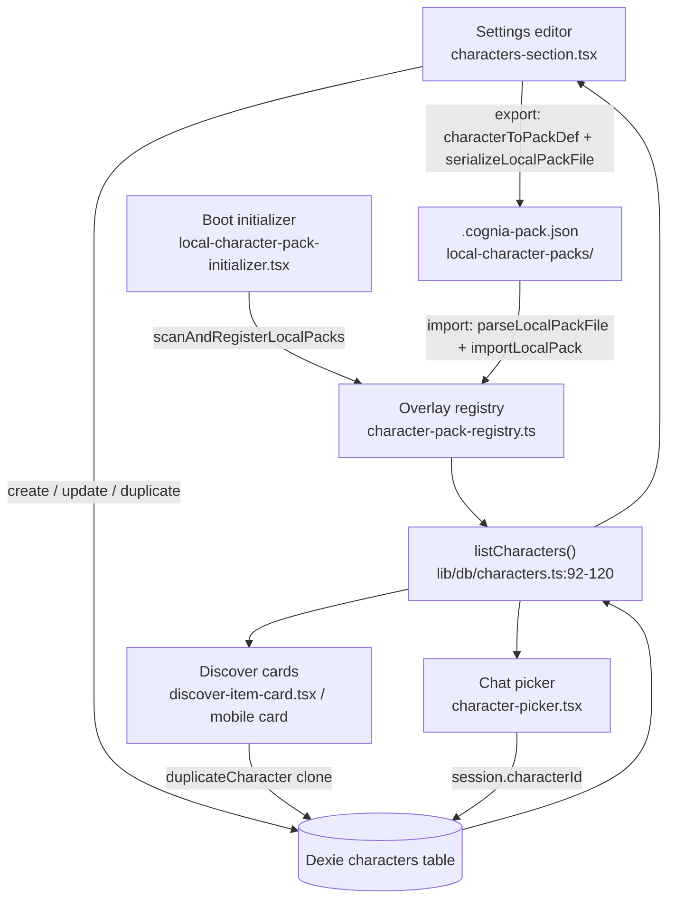

# Editor, Picker & Discover

The four UI surfaces that let a user author, choose, update, and discover characters all read from the same Dexie-∪-overlay union (`lib/db/characters.ts:listCharacters` 92–120) and write back through the same CRUD module. This page covers the **settings editor** (full field inventory + pack import/export), the **Apply-Update diff dialog**, the **chat picker** (three-bucket grouping + platform filter), the **Discover** projection cards (desktop grid + mobile sheet), and the **boot initializer** that scans local pack files.

<TLDR>
- Editor: `components/settings/characters-section.tsx` — source-filtered list (`filterCharacters` / `classifyCharacterSource` `editor-projection.ts:20–41`), grouped per-character form, `.cognia-pack.json` import/export (`characterToPackDef` + `serializeLocalPackFile` line 117), built-in rows read-only with Duplicate.
- Update dialog: `components/settings/character-pack-update-dialog.tsx` — `previewPackUpdate` dry-run (line 25/65), two-column `PackUpdateDiff` render (line 29/99–113), `noBaseline` warning, Apply → `applyPackUpdate`.
- Picker: `components/chat/character-picker.tsx` — `groupCharacters` (38–64) into builtIn / per-plugin / user, `isOverlayCharacterId` (15) + `LOCAL_PACK_PLUGIN_ID` (16) + `isAvailableOnProfile` (17), `avatarImage.webDataUrl` fallback glyph (94).
- Discover: `components/discover/discover-item-card.tsx:50–66` projection; mobile `components/mobile/discover/character-card.tsx` (avatar 48–49, Plugin badge 71–75).
- Boot: `components/providers/initializers/local-character-pack-initializer.tsx:1–62` — `scanAndRegisterLocalPacks` on first paint, skip-toast, web no-op.
</TLDR>

## Settings editor

`components/settings/characters-section.tsx` is the authoring surface. The left list is filtered by **source** — `classifyCharacterSource()` (`editor-projection.ts:20–24`) buckets each row into `builtin | plugin | user`, and `filterCharacters()` (`editor-projection.ts:30–41`) applies the active filter plus the search box. Built-in rows render **read-only** with a single Duplicate action; selecting any row opens the per-character form.

### Form field inventory

The form is grouped so the long field list stays scannable. Every field maps onto a `Character` property (`lib/claude/types.ts:2059–2317`).

| Group | Fields | Character property |
|---|---|---|
| Identity | avatar emoji + `COLOR_PALETTE` swatch (line 125–134), name, description | avatarEmoji, avatarColor, name, description |
| Prompt | system prompt textarea | systemPrompt |
| Model routing | model preset (`MODEL_PRESET_VALUES`), provider, account override | model, providerId, accountIdOverride |
| Permissions | permission mode (`PERMISSION_MODE_VALUES`) | permissionMode |
| Tools | whitelist, blacklist, MCP subset, skills picker | allowedTools, disallowedTools, mcpServerIds, skillIds + pluginSkillIds |
| Working dir | working directory | workingDir |
| Modes | bare / debug / brief toggles, thinking budget | bareMode, debugMode, briefMode, maxThinkingTokens |
| A2UI | enable toggle + catalog id | a2uiEnabled, a2uiCatalogId |
| Twin | `TwinBindingSection` | twinId, twinSettings |
| Computer use | opt-in + sub-settings (consent mode, screen-off, allowed tool ids) | enableComputerUse, computerUseSettings |
| Sandbox | tier selector | sandboxEnabled, sandboxTier |
| Voice | provider + voice (from `VOICE_CATALOG` 139–149) + rate / pitch / volume sliders | voiceProfile |
| Persona | tone, personality, openingMessage, exemplarPrompts | persona |
| Availability | platform checkboxes (`PLATFORM_OPTIONS` line 151) | availableOnPlatforms |

The voice editor is backed by the shared TTS catalogs — `system` has no static catalog so its voice id is free-text:

```typescript
const VOICE_CATALOG = Object.fromEntries(
  ORDERED_TTS_PROVIDERS.flatMap((provider) => {
    const voices = TTS_PROVIDER_SETTINGS[provider].voices
    return voices ? [[provider, voices]] : []
  })
)
```

The persona exemplar textarea round-trips through `parseLines()` (`editor-projection.ts:44–49`); the persona object itself is rebuilt by `buildPersona()` (61–73) and the voice overlay by `buildVoiceProfile()` (85–94).

### Import / export

Export serializes the current row into a portable pack file. `characterToPackDef()` (`editor-projection.ts:102–141`) drops host-managed fields (createdAt, twinId, isBuiltIn…) into a `PluginCharacterDef`, then `serializeLocalPackFile()` (`schema.ts:247–259`) emits a v2 `.cognia-pack.json` with 2-space indent + trailing newline:

```typescript
// components/settings/characters-section.tsx:116-118
import { characterToPackDef, filterCharacters } from "@/lib/plugin/character-pack/editor-projection"
import { serializeLocalPackFile } from "@/lib/plugin/character-pack/schema"
import { downloadBlob } from "@/lib/files/download"
```

Import runs the inverse — file picker → `parseLocalPackFile()` (`schema.ts:83–120`, schema versions 1–2) → `importLocalPack()` (`local-pack-store.ts:243–287`), which validates, writes the file under `<appData>/cognia/local-character-packs/`, and registers it as `LOCAL_PACK_PLUGIN_ID`. Web mode is a no-op (no filesystem).

<Status type="warning">
Built-in rows cannot be edited or deleted. The form is read-only and only the Duplicate action is offered — it clones the overlay into an editable Dexie row via duplicateCharacter.
</Status>

## Apply-Update dialog

`components/settings/character-pack-update-dialog.tsx` previews what a newer pack version will change before the user commits. On open it runs the dry-run diff:

```typescript
// components/settings/character-pack-update-dialog.tsx:64-68
const result = await previewPackUpdate(characterId)
if (cancelled) return
setPreview(result ?? null)
```

`previewPackUpdate()` (`characters.ts:411–421`) returns a `PackUpdateDiff` (`diff-pack-update.ts:111–118`). The dialog renders it as two columns — **Will update** (overwrites) and **Preserved** (user-edited, kept) — via the local `DiffColumn` component:

```tsx
// components/settings/character-pack-update-dialog.tsx:98-113
{preview.diff.willOverwrite.length > 0 && (
  <DiffColumn heading={tDialog("willUpdate")} changes={preview.diff.willOverwrite} tone="overwrite" ... />
)}
{preview.diff.preserved.length > 0 && (
  <DiffColumn heading={tDialog("preserved")} changes={preview.diff.preserved} tone="preserved" ... />
)}
```

When the diff carries `noBaseline` (a legacy clone that predates `pristineSnapshot` capture), a yellow warning banner is shown (line 88–92) and **every** pack-managed field is eligible for overwrite. Confirm is disabled when there is nothing to overwrite and no `noBaseline` flag (line 75–76). Apply calls back to `applyPackUpdate()` (`characters.ts:385–403`). See [Local Packs & Updates](./packs-local-and-updates) for the diff rules.

## Chat picker

`components/chat/character-picker.tsx` is a `CommandDialog` palette mounted by `DesktopChatWorkspace`. It first hides anything a pack restricted off this host, then groups the rest:

```typescript
// components/chat/character-picker.tsx:81-82
const visible = characters.filter((c) => isAvailableOnProfile(c.availableOnPlatforms))
const groups = groupCharacters(visible)
```

`groupCharacters()` (38–64) produces three buckets — `builtIn`, `byPlugin` (a `Map` keyed by `sourcePluginId`, anonymous overlays falling back to `LOCAL_PACK_PLUGIN_ID`), and `user` — using `isOverlayCharacterId()` (import line 15) to tell synthetic `cognia-pack:` ids apart from user `char_*` rows:

```typescript
// components/chat/character-picker.tsx:42-62 (trimmed)
for (const c of characters) {
  if (c.isBuiltIn) { builtIn.push(c); continue }
  if (isOverlayCharacterId(c.id) && c.sourcePluginId) {
    const list = byPlugin.get(c.sourcePluginId) ?? []
    list.push(c); byPlugin.set(c.sourcePluginId, list); continue
  }
  if (isOverlayCharacterId(c.id) && !c.sourcePluginId) { /* → LOCAL_PACK_PLUGIN_ID */ }
  user.push(c)
}
```

Each row renders through `AvatarBadge`, threading the optional v2 pack image so Radix can fall back to the colour + glyph when it is absent:

```tsx
// components/chat/character-picker.tsx:93-97
<AvatarBadge
  subject={{ ...c, avatarImageUrl: c.avatarImage?.webDataUrl }}
  size={24}
  textClassName="text-xs"
/>
```

The `CommandInput` filter runs cross-group (the `value` is `name + description`), so typing finds a character regardless of bucket. Selecting one calls `onPick(c)` which sets `session.characterId`. The chat header then renders the active character (avatar, name · description, model badge) at `chat-header.tsx:387–433` — see [Runtime Consumption](./runtime-consumption) for header detail.

## Discover surfaces

Discover projects characters into install cards. The desktop grid (`discover-desktop-body.tsx`) and mobile sheet both feed off the same `DiscoverItem` of kind `"character"`. `discover-item-card.tsx` flattens the row into display fields:

```typescript
// components/discover/discover-item-card.tsx:54-66
case "character": {
  const c = item.data
  return {
    name: c.name,
    description: c.description,
    builtIn: Boolean(c.isBuiltIn),
    badge: undefined,
    avatar: { kind: "color", color: c.avatarColor ?? "#888", glyph: c.avatarEmoji ?? c.name.slice(0, 2).toUpperCase() },
  }
}
```

The mobile card (`components/mobile/discover/character-card.tsx`) renders the v2 avatar image when present and surfaces a single Plugin pill for plugin-overlay or cloned-from-plugin rows:

```tsx
// components/mobile/discover/character-card.tsx:48-49
{character.avatarImage?.webDataUrl ? (
  <AvatarImage src={character.avatarImage.webDataUrl} alt="" />
) : null}
```

```tsx
// components/mobile/discover/character-card.tsx:71-75
{character.sourcePluginId ? (
  <Badge variant="outline" className="text-[10px]">
    {t("pluginBadge")}
  </Badge>
) : null}
```

A companion `character-detail-sheet.tsx` opens the full description. The **install / apply** flow depends on source: an overlay pack character is cloned via `duplicateCharacter()` (`characters.ts:276–329`) into an editable Dexie row; a built-in is referenced directly by id; either way the session binds with `session.characterId = character.id`.

## Boot initializer

`components/providers/initializers/local-character-pack-initializer.tsx` (1–62) is mounted under `app/layout.tsx`. On first paint it runs `scanAndRegisterLocalPacks()` (`local-pack-store.ts:175–222`) once (guarded by a `useRef`), registering every valid `.cognia-pack.json` into the in-memory overlay registry. Files that fail validation surface a skip toast so disk packs are not silently invisible:

```tsx
// components/providers/initializers/local-character-pack-initializer.tsx:41-49
const result = await scanAndRegisterLocalPacks()
if (result.skipped.length > 0) {
  log.warn("local-pack-store: some packs were skipped during boot scan", { skipped: result.skipped })
  toast.warning(t("packs.skippedToast", { count: result.skipped.length }))
}
```

It is a no-op in web mode (`appDataDir()` cannot resolve), mirroring the `ExternalAgentInitializer` shape.

## Data flow



## Related

<Cards>
  <Card title="Data Model" href="./data-model" />
  <Card title="Character Packs" href="./character-packs" />
  <Card title="Local Packs & Updates" href="./packs-local-and-updates" />
  <Card title="Runtime Consumption" href="./runtime-consumption" />
</Cards>
