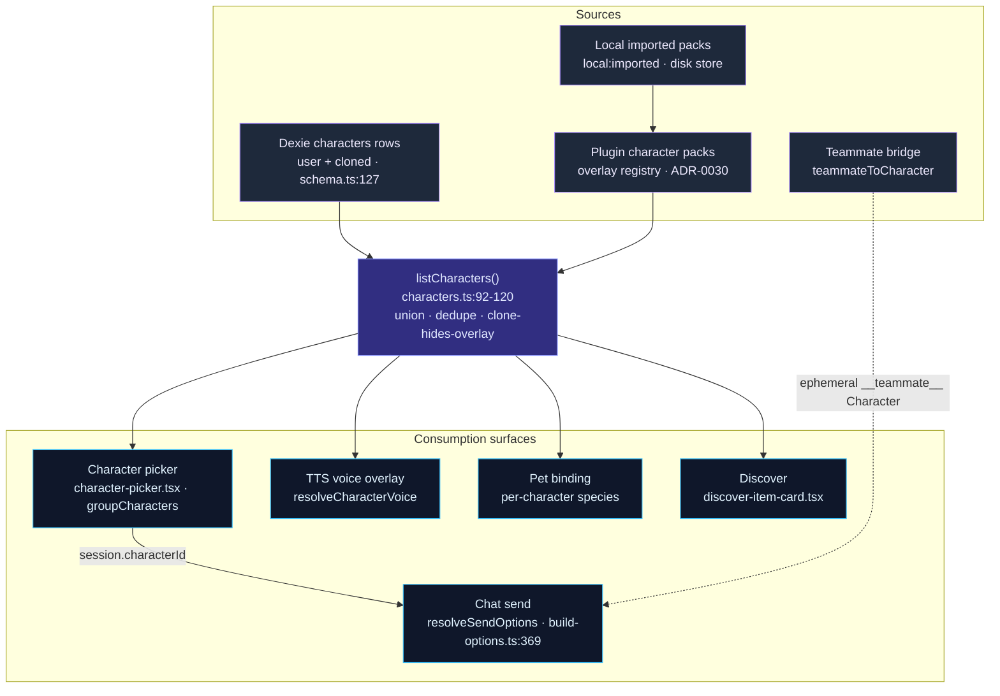

# Characters

A **Character** (角色) is the unit Cognia uses to package *who the assistant is* and *how a send is configured* into a single, reusable, selectable object. It is far more than a system prompt: one Character carries the persona prompt, model/provider routing, a tool and MCP subset, a permission mode, skills, an optional Employee Digital Twin binding, a TTS voice overlay, and the on/off gates for computer use, sandbox, OCR, and A2UI. When you pick a Character in the composer, every one of those fields flows into the next turn through exactly one function — `resolveSendOptions` in `lib/claude/build-options.ts`.

<TLDR>
  A Character is a row in the Dexie `characters` table (`lib/db/schema.ts:127`) **unioned** at
  read time with plugin **character-pack overlays** (ADR-0030) by `listCharacters`
  (`lib/db/characters.ts:92-120`). Overlay rows get synthetic ids
  `cognia-pack:<plugin>:<pack>:<local>`; a Dexie clone with a matching
  `clonedFromPackCharacterId` **hides** its overlay (108-118). The selected Character is resolved by
  `resolveCharacterById` (`characters.ts:134-141`) and collapsed into one `SendOptions` payload by
  `resolveSendOptions` (`build-options.ts:369-376`). The six default personas now ship as the
  first-party <Term>cognia-builtin-characters</Term> plugin pack, seeded into Dexie with attribution
  by `seedBuiltInCharacters` (`characters.ts:497-560`).
</TLDR>

<StatGrid>
  <Stat label="Character fields" value="~50" hint="lib/claude/types.ts:2059-2317 — identity, prompt, routing, tools, permissions, twin, gates, pack v2, attribution" />
  <Stat label="Built-in personas" value="6" hint="Coding · Writing · Research · Brainstorm · Translator · Goal Tracker — cognia-builtin-characters BUILTIN_PACK" />
  <Stat label="System-prompt presets" value="12" hint="SystemPromptPreset built-ins, lib/db/preset-built-ins.ts:18-173" />
  <Stat label="Pack-managed fields" value="20" hint="PACK_MANAGED_FIELDS eligible for Apply Update, diff-pack-update.ts:65-88" />
  <Stat label="Pack file schema" value="v2" hint="CHARACTER_PACK_FILE_SCHEMA_VERSION, schema.ts:28 — supports v1 + v2" />
  <Stat label="Consumption surfaces" value="6" hint="chat send · agent teams · TTS · pet · discover · IM platforms" />
</StatGrid>

## What a Character Is

A Character is **per-send configuration with a face**. It exists so that all the knobs that shape a turn — prompt, model, tools, permissions, capability gates — can be saved once, named, given an avatar, and re-selected, instead of being re-typed into the composer every time. Selecting a Character binds it to the session (`session.characterId`); every subsequent send re-resolves it.

The Character does **not** run anything on its own. It is data. The execution spine is the [built-in agent](./built-in-agent): `resolveSendOptions` reads the Character and folds its fields into the single `SendOptions` payload that crosses the IPC seam into the sidecar. That convergence is the whole point — a new capability touches the Character schema and one branch of `resolveSendOptions`, and nothing else.

What a single Character resolves into, by field group:

| Concern | Character fields | Resolved by |
| --- | --- | --- |
| Persona prompt | `systemPrompt`, `persona` | `build-options.ts:589-594`, persona section `:744-753` |
| Model routing | `model`, `providerId`, `accountIdOverride` | precedence over `AppSettings` defaults |
| Skills | `skillIds`, `pluginSkillIds` | `:709-737` resolveSkillsForCharacter |
| Tools and MCP | `allowedTools`, `disallowedTools`, `mcpServerIds`, `toolFilter` | union at `:827-836`, MCP subset `:987-1005` |
| Permissions and modes | `permissionMode`, `bareMode`, `briefMode`, `maxThinkingTokens` | folded across the pipeline |
| Twin binding | `twinId`, `twinSettings` | `applyTwinContext` at `:606-643` |
| Capability gates | `enableComputerUse`, `sandboxEnabled`, `enableOcr`, `a2uiEnabled` | computer-use gate `:1052-1053` |
| Voice overlay | `voiceProfile` | TTS at send-adjacent surfaces |

## The Two-Tier Source Model

Characters come from **two sources unioned at read time**, never one canonical store:

1. **Dexie `characters` rows** — user-created characters, plus *clones* of pack characters. These persist; they are the writable tier.
2. **Plugin character-pack overlays** (ADR-0030) — characters contributed by an enabled plugin's `characterPacks`. They live **only** in the in-memory overlay registry and are projected into transient `Character` objects by `projectOverlayCharacter` (`characters.ts:46-90`) with a synthetic runtime id `cognia-pack:<pluginId>:<packId>:<localId>`. Disable the plugin and the overlay characters vanish; your clones survive.

`listCharacters` (`characters.ts:92-120`) performs the union and the dedupe. Two rules keep it deterministic:

- **Dexie-first dedupe** — on an id collision, the persisted row wins over the overlay.
- **Clone-hides-overlay** (`:108-118`) — if a Dexie row carries `clonedFromPackCharacterId`, the matching overlay character is suppressed so a cloned character does not appear twice.

The six default personas are **not** hand-seeded rows anymore. They ship as the first-party `cognia-builtin-characters` plugin pack (`BUILTIN_PACK`, 6 characters: Coding, Writing, Research, Brainstorm, Translator, Goal Tracker) and are lifted into Dexie with builtin-pack attribution by the idempotent `seedBuiltInCharacters` (`characters.ts:497-560`, v50). Built-ins therefore ride the same overlay-and-clone machinery as every other pack. The full data contract is on the [Data Model](./data-model) page.

## Sources to Surfaces

The teammate bridge is a fourth, ephemeral producer: `teammateToCharacter` (`lib/ai/agent/team/teammate-character.ts:56`) synthesizes a transient Character (id `__teammate__:<id>`) so each Agent Team member rides the **same** `resolveSendOptions` path as a chat send — never persisted, never in `listCharacters`.

## How This Section Is Organized

Each sibling page is a line-accurate deep dive into one slice of the subsystem.

<Cards>
  <Card title="Data Model" href="./data-model" description="The full Character interface, the Dexie table, the lib/db/characters.ts CRUD API, the built-in seed story, and SystemPromptPreset." />
  <Card title="Runtime consumption" href="./runtime-consumption" description="How resolveSendOptions folds a Character into one send — precedence chains for prompt, model, tools, MCP, twin, and the capability gates." />
  <Card title="Character packs" href="./character-packs" description="ADR-0030 overlay model: the pack types, the registry, runtime ids, lifecycle on plugin enable/disable, and the SDK defineCharacterPack helper." />
  <Card title="Local packs and updates" href="./packs-local-and-updates" description="The .cognia-pack.json file schema, the local disk store, the Apply Update diff (pristine snapshot vs latest), and clone survival." />
  <Card title="Editor and Discover" href="./editor-and-discover" description="The characters settings editor, import/export, the character picker grouping, and the Discover install-and-clone flow." />
</Cards>

## Related Subsystems

<Cards>
  <Card title="Chat, Characters, Skills & Teams" href="./chat-and-skills" description="The concept overview this section deep-dives: where Characters sit among chat surfaces, skills, and teams." />
  <Card title="Built-in Agent" href="./built-in-agent" description="The resolveSendOptions spine that consumes a Character on every send." />
  <Card title="Agent Teams" href="./agent-teams" description="The teammate bridge that turns each team member into an ephemeral Character." />
  <Card title="Employee Digital Twin" href="../subsystems/employee-twin" description="The twinId binding that injects RAG + style few-shot into the system prompt." />
  <Card title="Plugin system" href="../subsystems/plugin-system" description="How a plugin contributes character packs through the overlay registry." />
</Cards>
