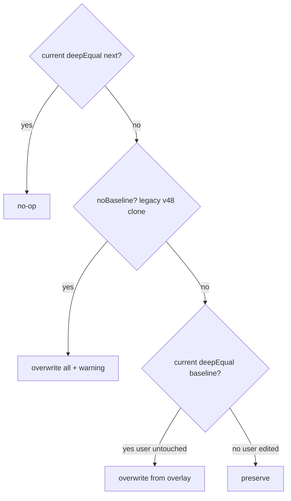

# Local Packs & Apply Update

A character pack can travel as a standalone `.cognia-pack.json` file imported outside the marketplace install pipeline, and a user's *clone* of an overlay character can receive a **selective update** when the pack ships a newer version. This page covers the file format, the disk-backed local-pack store, the per-field diff engine that decides overwrite-vs-preserve, the editor projections, and voice/platform resolution.

<TLDR>
- File format: `CHARACTER_PACK_FILE_SCHEMA_VERSION = 2`, `SUPPORTED_SCHEMA_VERSIONS = Set([1, 2])` — `lib/plugin/character-pack/schema.ts:28` / `:37`.
- Parser `parseLocalPackFile` — `schema.ts:83-120`; serializer `serializeLocalPackFile` — `schema.ts:247-259`.
- Local disk store under `local:imported` — `lib/plugin/character-pack/local-pack-store.ts:51`; boot scan `scanAndRegisterLocalPacks` — `:175-222`.
- Diff engine `diffPackUpdate` — `lib/plugin/character-pack/diff-pack-update.ts:153-192`; `USER_OWNED_CHARACTER_FIELDS` — `:44-62`.
- Voice resolver `resolveCharacterVoice` — `lib/plugin/character-pack/character-voice.ts:53-73`.
- Platform gate `isAvailableOnProfile` — `lib/plugin/character-pack/platform-availability.ts:22-28`.
</TLDR>

## File format — `.cognia-pack.json`

The file is a thin wrapper carrying a **file-format** `schemaVersion` (independent of the pack's semantic `version`) plus the pack payload and an optional signature. Versioning is two-step: bumping the file format is a host concern; the pack content versions itself via `PluginCharacterPackDef.version`.

```ts
// lib/plugin/character-pack/schema.ts:28-40
export const CHARACTER_PACK_FILE_SCHEMA_VERSION = 2 as const

export const SUPPORTED_SCHEMA_VERSIONS = new Set<number>([1, 2])

export type CharacterPackFileSchemaVersion = 1 | 2
```

```ts
// lib/plugin/character-pack/schema.ts:51-62
export interface LocalCharacterPackSignature {
  algo: "ed25519"
  pubKey: string
  sig: string
}

export interface LocalCharacterPackFile {
  schemaVersion: CharacterPackFileSchemaVersion
  pack: PluginCharacterPackDef
  signature?: LocalCharacterPackSignature
}
```

<Status type="warning">
The Ed25519 signature field (`schema.ts:51-55`) is reserved for forward compatibility with the WASM verifier. The local-pack store does NOT yet verify signatures — unsigned files are accepted today, and a malformed signature shape is rejected only on its structure. Verification is a documented follow-up.
</Status>

`parseLocalPackFile` validates and narrows arbitrary JSON. Validation rules:

- Top-level must be `{ schemaVersion, pack }`; `schemaVersion` must be a number in `SUPPORTED_SCHEMA_VERSIONS`. A higher version is refused with an "Upgrade Cognia" message; a lower-than-supported version asks the author to re-export.
- Pack-level required: non-empty `id`, `name`, `version`, and a `characters` array (non-empty, up to `PLUGIN_CHARACTER_PACK_SOFT_LIMIT`).
- Each character requires non-empty `localId`, `systemPrompt`, `name`, `avatarColor`, with `localId` unique within the pack.
- v2 optional fields (`avatarImage`, `persona`, `voiceProfile`) are shape-checked only when present; unknown TTS providers are NOT rejected here (that belongs in `defineCharacterPack`, warn-not-block).
- A present `signature` must declare `algo: "ed25519"` and string `pubKey` / `sig`.

```ts
// lib/plugin/character-pack/schema.ts:247-259
export function serializeLocalPackFile(
  pack: PluginCharacterPackDef,
  signature?: LocalCharacterPackSignature
): string {
  const file: LocalCharacterPackFile = {
    schemaVersion: CHARACTER_PACK_FILE_SCHEMA_VERSION,
    pack,
    ...(signature ? { signature } : {}),
  }
  return JSON.stringify(file, null, 2) + "\n"
}
```

The 2-space indent plus trailing newline keeps diffs reviewable when packs are checked into git for share / fork workflows.

## Local-pack store

Standalone files are NOT plugins — the marketplace install pipeline expects a Tauri-extracted tarball. Instead a dedicated store reads / writes them on disk and registers them into the same overlay with `pluginId = "local:imported"`.

```ts
// lib/plugin/character-pack/local-pack-store.ts:51
export const LOCAL_PACK_PLUGIN_ID = "local:imported"
```

A `LocalPackFsAdapter` (`local-pack-store.ts:67-84`) abstracts the filesystem. The production `defaultTauriFs` resolves the directory under `appDataDir()/cognia/local-character-packs/<id>.cognia-pack.json`; tests inject a synchronous in-memory adapter via `__setLocalPackFsForTesting`. In **web mode every operation is a no-op or returns an error** — the Settings Import button is gated on `isTauri()`.

| Operation | file.ts:line | Behaviour |
| --- | --- | --- |
| `scanAndRegisterLocalPacks` | `:175-222` | Boot scan; returns `{ registered[], skipped[] }`; bad files skipped with a reason, never blocking siblings. |
| `importLocalPack` | `:243-287` | Validate, write file, register; rejects when the id already belongs to a real plugin. |
| `deleteLocalPack` | `:295-318` | Unregister plus remove file; Dexie clones survive. |
| `exportPack` | `:327-348` | Any registered pack to a `.cognia-pack.json` string (plugin identity stripped). |

The boot scan is idempotent — the overlay registry's `register` replaces a previous entry, so re-scanning after an import / delete simply refreshes the view.

```ts
// lib/plugin/character-pack/local-pack-store.ts:212-216
registerCharacterPack(result.file.pack.id, result.file.pack, {
  pluginId: LOCAL_PACK_PLUGIN_ID,
})
registered.push(result.file.pack.id)
```

Import enforces the conflict policy: a pack id already registered by a real plugin (pluginId other than `local:imported`) is refused — the local tier never shadows a real plugin's contribution.

```ts
// lib/plugin/character-pack/local-pack-store.ts:266-272
const existingEntry = getCharacterPackEntry(pack.id)
if (existingEntry && existingEntry.pluginId && existingEntry.pluginId !== LOCAL_PACK_PLUGIN_ID) {
  return {
    ok: false,
    error: `Pack id "${pack.id}" is already provided by plugin "${existingEntry.pluginId}". Rename the pack before importing.`,
  }
}
```

The boot initializer `components/providers/initializers/local-character-pack-initializer.tsx` runs the scan once on first paint and raises a toast when files are skipped, so disk files that fail to register are not silently invisible.

## Apply Update engine

When a plugin re-enables with a newer `pack.version`, a user's clone shows "Update available". The update is **selective**: pack-managed fields the user never touched are overwritten from the new overlay; fields the user edited are preserved. The decision is a pure diff with no Dexie access, shared between the dialog preview and the actual write.

Two field policies drive it. `USER_OWNED_CHARACTER_FIELDS` are never overwritten:

```ts
// lib/plugin/character-pack/diff-pack-update.ts:44-62
export const USER_OWNED_CHARACTER_FIELDS: ReadonlySet<keyof Character> = new Set<keyof Character>([
  "id",
  "name",
  "isBuiltIn",
  "twinId",
  "twinSettings",
  "accountIdOverride",
  "workingDir",
  "bareMode",
  "debugMode",
  "briefMode",
  "sandboxEnabled",
  "maxThinkingTokens",
  "embeddingProviderId",
  "disablePluginTools",
  "enableBuiltInSkills",
  "createdAt",
  "updatedAt",
])
```

The 20 `PACK_MANAGED_FIELDS` (`diff-pack-update.ts:65-88`) are the overwrite-eligible set: `systemPrompt`, `description`, `avatarColor`, `avatarEmoji`, `model`, `providerId`, `permissionMode`, `allowedTools`, `disallowedTools`, `mcpServerIds`, `skillIds`, `pluginSkillIds`, `enableComputerUse`, `computerUseSettings`, `sandboxTier`, `a2uiEnabled`, `a2uiCatalogId`, `platformDefaults`, `availableOnPlatforms`, plus the v2 trio `avatarImage` / `persona` / `voiceProfile`.

```ts
// lib/plugin/character-pack/diff-pack-update.ts:111-118
export interface PackUpdateDiff {
  overwrites: Partial<Character>
  preserved: PackUpdateFieldChange[]
  willOverwrite: PackUpdateFieldChange[]
  nextSnapshot: PackPristineSnapshot
  /** True when row.pristineSnapshot was missing — we can't tell user edits apart. */
  noBaseline: boolean
}
```

`buildPristineSnapshot` (`diff-pack-update.ts:124-151`) deep-copies every pack-managed field of the latest overlay character via JSON round-trip, so later overlay mutations don't leak through the reference. `diffPackUpdate` (`:153-192`) then compares the row, its stored `pristineSnapshot` baseline, and the overlay per field:

```ts
// lib/plugin/character-pack/diff-pack-update.ts:162-189 (decision core)
for (const field of PACK_MANAGED_FIELDS) {
  if (USER_OWNED_CHARACTER_FIELDS.has(field as keyof Character)) continue
  const current = (row as unknown as Record<string, unknown>)[field]
  const next = (nextSnapshot as unknown as Record<string, unknown>)[field]

  if (deepEqual(current, next)) continue // no-op: already latest

  if (noBaseline) {
    overwrites[field as keyof Character] = next as never
    willOverwrite.push({ field, current, next })
    continue
  }

  const baselineValue = (baseline as Record<string, unknown>)[field]
  if (deepEqual(current, baselineValue)) {
    overwrites[field as keyof Character] = next as never // user untouched -> overwrite
    willOverwrite.push({ field, current, next })
  } else {
    preserved.push({ field, current, next }) // user edited -> preserve
  }
}
```

### Per-field decision



A legacy v48 clone with no `pristineSnapshot` is the `noBaseline` case: we cannot distinguish user edits from a stale copy, so every changed field lands in `willOverwrite` and the dialog renders a warning.

## Update flow

1. **"Update available" badge** — surfaced when a clone's `packVersionAtClone` differs from the registry's current pack `version`.
2. **`previewPackUpdate`** — dry-run that produces the `PackUpdateDiff` without writing.
3. **`character-pack-update-dialog.tsx`** — two-column diff (current vs next) per field, with the `noBaseline` warning when applicable.
4. **Apply / dismiss** — `applyPackUpdate(id)`, `applyPackUpdateForPack(sourcePluginId, sourcePackId)` for all pending clones of a pack, or `dismissPackUpdate(id, version)`. Wiring lives in `components/settings/characters-section.tsx` (`:457`, `:472`, `:552`).

## Editor projections

`editor-projection.ts` holds the pure mappings extracted from the Settings editor so the "blank → undefined" rules are unit-testable.

| Symbol | file.ts:line | Purpose |
| --- | --- | --- |
| `classifyCharacterSource` | `editor-projection.ts:20-24` | `"builtin"` / `"plugin"` / `"user"` for the source filter. |
| `filterCharacters` | `:30-41` | Free-text plus source-bucket filter for the search bar. |
| `buildPersona` | `:61-73` | Form fields to `PluginCharacterPersona`, or undefined when all blank. |
| `buildVoiceProfile` | `:85-94` | Form fields to `PluginCharacterVoiceProfile`, or undefined when no provider/voice. |
| `characterToPackDef` | `:102-141` | Dexie `Character` to portable `PluginCharacterDef`, dropping host-managed fields. |

`characterToPackDef` keeps only the pack-portable subset and omits `undefined` fields to keep exported files lean — identity, lifecycle, and Twin-binding columns never reach the file.

## Voice resolution

A character's optional `voiceProfile` projects to a `Partial<SpeechSettings>` overlay that the caller spreads onto the AppSettings-derived speech settings before calling `TTSOrchestrator.speak()`. It never mutates `AppSettings`.

```ts
// lib/plugin/character-pack/character-voice.ts:25-36
const PROVIDER_VOICE_FIELD: Record<TTSProvider, keyof SpeechSettings> = {
  system: "systemVoice",
  openai: "openaiVoice",
  gemini: "geminiVoice",
  edge: "edgeVoice",
  elevenlabs: "elevenlabsVoice",
  lmnt: "lmntVoice",
  hume: "humeVoice",
  cartesia: "cartesiaVoice",
  deepgram: "deepgramVoice",
  xiaomi: "xiaomiVoice",
}
```

```ts
// lib/plugin/character-pack/character-voice.ts:53-73
export function resolveCharacterVoice(
  character: CharacterVoiceSource
): CharacterVoiceOverlay | undefined {
  const profile = character.voiceProfile
  if (!profile) return undefined
  if (!isKnownTtsProvider(profile.provider)) return undefined
  if (!profile.voiceId.trim()) return undefined

  const overlay: CharacterVoiceOverlay = {
    ttsProvider: profile.provider,
  }
  const voiceField = PROVIDER_VOICE_FIELD[profile.provider]
  ;(overlay as Record<string, unknown>)[voiceField] = profile.voiceId
  if (profile.rate !== undefined) overlay.ttsRate = profile.rate
  if (profile.pitch !== undefined) overlay.ttsPitch = profile.pitch
  if (profile.volume !== undefined) overlay.ttsVolume = profile.volume
  return overlay
}
```

`isKnownTtsProvider` (`character-voice.ts:75-77`) fails open: an unknown provider yields no overlay so the caller falls back to global defaults. The resolver is consumed by `lib/tts/speak-chat-message.ts`.

## Platform availability

`platform-availability.ts` gates a character against the current shell. `currentRuntimeProfile` returns `"tauri"` or `"browser"`; an undefined / empty `availableOnPlatforms` means "available everywhere".

```ts
// lib/plugin/character-pack/platform-availability.ts:22-28
export function isAvailableOnProfile(
  availableOnPlatforms: PluginRuntimeProfile[] | undefined,
  profile: PluginRuntimeProfile = currentRuntimeProfile()
): boolean {
  if (!availableOnPlatforms || availableOnPlatforms.length === 0) return true
  return availableOnPlatforms.includes(profile)
}
```

## Related

<Cards>
  <Card title="Character Packs (overlay capability)" href="./character-packs" />
  <Card title="Editor & Discover" href="./editor-and-discover" />
  <Card title="Runtime consumption" href="./runtime-consumption" />
</Cards>
