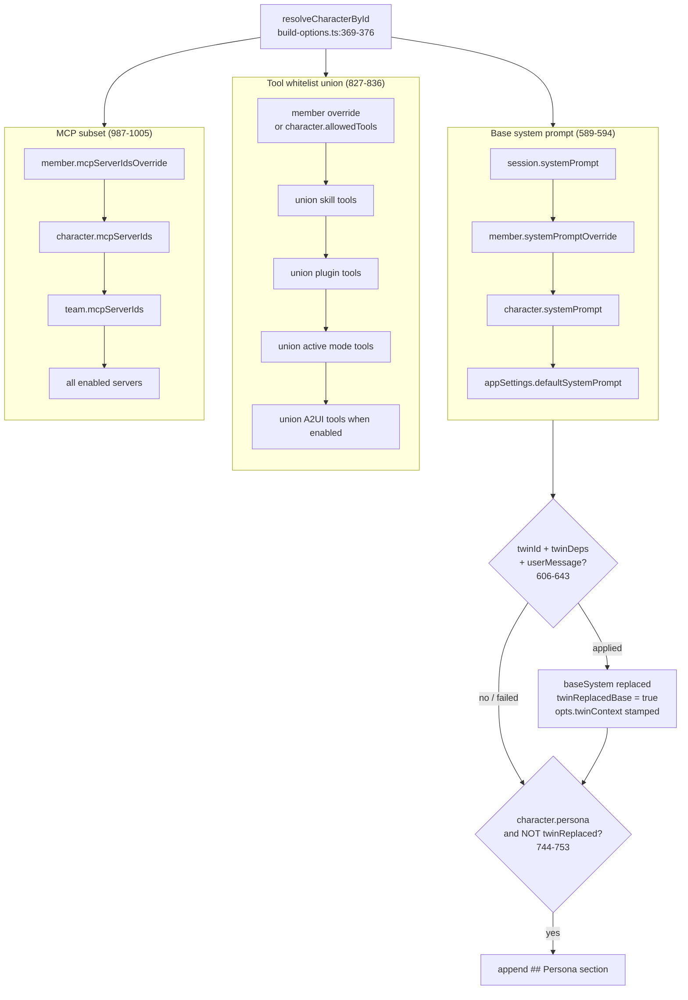

# Runtime Consumption

A Character is a passive record until something *resolves* it. This page is the exhaustive list of every runtime seam that reads a selected Character and changes behavior accordingly: the `resolveSendOptions` precedence chains, the chat header surfaces, TTS voice overlay, pet species binding, and the team bridge that lets teammates ride the same pipeline. Field definitions live in [Data Model](./data-model); this page is about *consumption*.

<TLDR>
The convergence point is `lib/claude/build-options.ts:resolveSendOptions`. Character resolution at <Term>369–376</Term>; base system precedence at <Term>589–594</Term>; twin injection <Term>606–643</Term>; persona section <Term>744–753</Term>; plugin skills <Term>709–737</Term>; tool whitelist union <Term>827–836</Term>; MCP subset <Term>987–1005</Term>; computer-use gate <Term>1052–1053</Term>; plugin-tools filter <Term>1088–1089</Term>. Chat header reads it at `components/chat/chat-header.tsx:387–433`. TTS overlay at `lib/tts/speak-chat-message.ts:19–54`. Pet binding at `components/pet/console/binding-tab.tsx:14–70`. Teammates synthesize an ephemeral Character at `lib/ai/agent/team/teammate-character.ts:56`.
</TLDR>

## The build-options resolution pipeline

Once a session binds a Character (`session.characterId`), `resolveSendOptions` is the single funnel through which every capability flows. Anthropic chat, non-Anthropic providers, team dispatches, and connector auto-mode all converge here, so a behavior described once applies everywhere.

| Concern | Source line | Behavior |
|---|---|---|
| Character resolution | `build-options.ts:369–376` | `ctx.character` if supplied, else `resolveCharacterById(session.characterId)` |
| Team member prompt | `build-options.ts:346` | `member.systemPromptOverride` falls back to `character.systemPrompt` |
| Base system precedence | `build-options.ts:589–594` | session prompt &rarr; member override &rarr; character prompt &rarr; app default |
| Twin context injection | `build-options.ts:606–643` | when twin-bound + deps + user message, `applyTwinContext` replaces base; stamps `opts.twinContext`; fail-open |
| Persona section | `build-options.ts:744–753` | `## Persona` (tone + personality) appended only when twin did NOT replace base |
| Plugin skills | `build-options.ts:709–737` | `resolveSkillsForCharacter` over `pluginSkillIds` &rarr; container skill ids + section + tool union |
| Tool whitelist union | `build-options.ts:827–836` | member override or character whitelist, unioned with skill, plugin, mode, and A2UI tools |
| MCP subset | `build-options.ts:987–1005` | member override &rarr; character subset &rarr; team subset &rarr; all enabled |
| Computer-use gate | `build-options.ts:1052–1053` | enabled only when opted-in and not blocked by the IM blacklist |
| Plugin-tools filter | `build-options.ts:1088–1089` | non-computer-use chat drops `cognia-computer-use` plugin entries |

### Precedence chains, visualized



### Base system prompt precedence

The system prompt is a strict nullish-coalescing chain. A session-level prompt wins outright; otherwise a team member override; otherwise the character's own prompt; otherwise the app default.

```typescript
// lib/claude/build-options.ts:589-594
let baseSystem =
  session?.systemPrompt ??
  memberOverride?.systemPromptOverride ??
  character?.systemPrompt ??
  appSettings?.defaultSystemPrompt ??
  undefined
```

### Twin context injection (opt-in, fail-open)

When the resolving character is twin-bound *and* the caller supplied `twinDeps` plus a non-empty `twinUserMessage`, the four-segment twin prompt **replaces** `baseSystem`. The runtime never throws — any failure degrades to the original prompt. On success it sets `twinReplacedBase = true` (which suppresses the persona section below) and stamps `opts.twinContext` so the chat hook can render a Twin `SourcesPart` on the assistant message.

```typescript
// lib/claude/build-options.ts:606-643 (trimmed)
if (character?.twinId && ctx.twinDeps && ctx.twinUserMessage && ctx.twinUserMessage.trim()) {
  try {
    const { applyTwinContext } = await import("@/lib/twin/runtime")
    const result = await applyTwinContext({ character, userMessage: ctx.twinUserMessage, ... })
    if (result.applied) {
      baseSystem = result.applied.systemPrompt
      twinReplacedBase = true
    }
    // stamped when the runtime ran (even degraded) so the UI can show context
    opts.twinContext = {
      twinId: character.twinId,
      retrievedChunks: result.retrievedChunks,
      selectedStyleSamples: result.selectedStyleSamples.map(/* id/contextLabel/summary/tone */),
      degraded: result.degraded,
    }
  } catch {
    // Twin runtime failure is non-fatal — keep the original baseSystem.
  }
}
```

<Status type="info">
The twin prompt already encodes personality, so when `twinReplacedBase` is set the v2 persona section (`744–753`) is intentionally skipped to avoid contradictory guidance. Bind fields live on `Character.twinId` / `twinSettings`; the deep-dive is in the Employee Twin subsystem (linked below).
</Status>

### Persona section, plugin skills, tool & MCP unions

The persona section (`744–753`) emits a `## Persona` block from `character.persona` (tone + personality) only when the twin did not already replace the base. Plugin skills (`709–737`) run through `resolveSkillsForCharacter(character.pluginSkillIds)`, yielding `containerSkillIds`, a rendered skill section, and tool names that feed the union.

The tool whitelist (`827–836`) is a **union**, not a single source: it starts from `memberOverride.allowedToolsOverride ?? character.allowedTools`, then unions skill `allowedTools`, plugin tool names, the active mode's tools, and — when `a2uiEnabled` — `namespacedA2UIToolNames()`. The MCP subset (`987–1005`) is a precedence chain: member override, then `character.mcpServerIds`, then the team's subset (team sessions), then all enabled servers when nothing narrows it.

The computer-use gate (`1052–1053`) admits tools only when `character.enableComputerUse === true` and the session is not an IM session blocked by the blacklist; the plugin-tools filter (`1088–1089`) strips `cognia-computer-use` entries from non-computer-use chat.

## Chat surfaces

The header is the most visible consumer. It renders the avatar from `avatarColor(character)` / `avatarGlyph(character)`, then `name · description`, a model badge that prefers `session.model` over `character.model`, the account switcher seeded with the character's provider routing, and a twin badge when bound.

```tsx
// components/chat/chat-header.tsx:387-433 (trimmed)
{character && (
  <Avatar className="size-7 shrink-0" title={character.name}>
    <AvatarFallback style={{ backgroundColor: avatarColor(character) }} aria-hidden>
      {avatarGlyph(character)}
    </AvatarFallback>
  </Avatar>
)}
{/* name · description ... */}
{(session.model || character?.model) && (
  <Badge variant="secondary" className="font-mono text-[10px]">
    {session.model || character?.model}
  </Badge>
)}
<HeaderAccountSwitcher
  session={session}
  characterProviderId={character?.providerId}
  characterAccountIdOverride={character?.accountIdOverride}
/>
{character?.twinId && (
  <TwinHeaderBadge twinId={character.twinId} twinSettings={character.twinSettings} />
)}
```

The picker groups characters into built-in, by-plugin, and user buckets — see [Editor & Discover](./editor-and-discover) for grouping and platform filtering. `directCharacter` is threaded from `ChatView` down to `MessageList` so the read-aloud button and auto-play can resolve the speaking character's voice (next section).

## TTS voice overlay

When a chat message is read aloud, the global speech settings are the base and the character's `voiceProfile` is projected into an overlay merged on top. A `null`/`undefined` character falls through to the global voice — this is what gives team members distinct voices.

```typescript
// lib/tts/speak-chat-message.ts:19-54 (trimmed)
import {
  resolveCharacterVoice,
  type CharacterVoiceSource,
} from "@/lib/plugin/character-pack/character-voice"
// ...
const base = selectSpeechSettings(store.settings)
const overlay = character ? resolveCharacterVoice(character) : undefined
const speechSettings = overlay ? { ...base, ...overlay } : base
```

The `voiceProfile` fields are `provider`, `voiceId`, `rate`, `pitch`, and `volume`. The per-provider field mapping (how each TTS provider consumes those fields) lives in `character-voice.ts` — see [Packs, Local & Updates](./packs-local-and-updates).

## Pet binding

The pet console maps each character to a pet species. The binding tab lists characters via `useLiveQuery(getDb().characters.toArray())` alongside `listPetBindings()`; selecting a species per character calls `upsertPetBinding({ characterId, species })`, and clearing it calls `deletePetBinding(characterId)`, which falls back to the global pet. CRUD lives in `lib/db/pet.ts`.

```tsx
// components/pet/console/binding-tab.tsx:14-70 (shape)
const characters = useLiveQuery(() => getDb().characters.toArray())
const bindings = useLiveQuery(() => listPetBindings())
// per character: upsertPetBinding({ characterId, species }) | deletePetBinding(characterId)
```

## Team bridge

Teammates do not have a parallel resolution pipeline — they ride the *same* `resolveSendOptions`. `teammateToCharacter()` synthesizes an ephemeral `Character` (id pattern `__teammate__:` + the teammate id) from the teammate config plus resolved capabilities.

```typescript
// lib/ai/agent/team/teammate-character.ts:56 (mapping summary)
// systemPrompt   ← teammate.config.systemPrompt > team.defaultSystemPrompt > DEFAULT
// model          ← modelHint > teammate.config.model > team.defaultModel
// providerId     ← teammate.config.provider > team.defaultProvider
// mcpServerIds   ← resolvedCaps.mcpServerIds (empty → undefined = inherit all)
// skillIds + pluginSkillIds ← resolvedCaps.skillIds (both fields; resolvers drop unowned ids)
// allowedTools   ← teammate.config.tools
// enableComputerUse + computerUseSettings.allowedToolIds ← resolvedCaps.nativeAnthropicToolIds
// workingDir     ← cwd
```

Setting `skillIds` and `pluginSkillIds` to the same set is deliberate: each resolver silently drops ids it does not own, so a skill is never lost regardless of whether it is a host or plugin skill. Subagents are enabled at the session level (`kind: "team"`), not on the synthesized character. For how teammate capabilities are resolved before this synthesis, see [Agent Team capabilities & plugins](../agent-teams/capabilities-and-plugins).

## Pointers to subsystem deep-dives

- **Twin** — `Character.twinId` / `twinSettings` are consumed by `lib/twin/runtime`'s `applyTwinContext`. Full pipeline in the [Employee Twin](../subsystems/employee-twin) subsystem.
- **IM / platform defaults** — `Character.platformDefaults` is consumed by connector binding when a character is bound to an inbound conversation. See [Platform Connectors](../subsystems/platform-connectors).

<Cards>
  <Card title="Data Model" href="./data-model" description="Every Character field and its meaning." />
  <Card title="Character Packs" href="./character-packs" description="v2 packs, persona, voice profiles, and avatar images." />
  <Card title="Build Options" href="../built-in-agent/build-options" description="The full resolveSendOptions pipeline beyond character concerns." />
</Cards>
