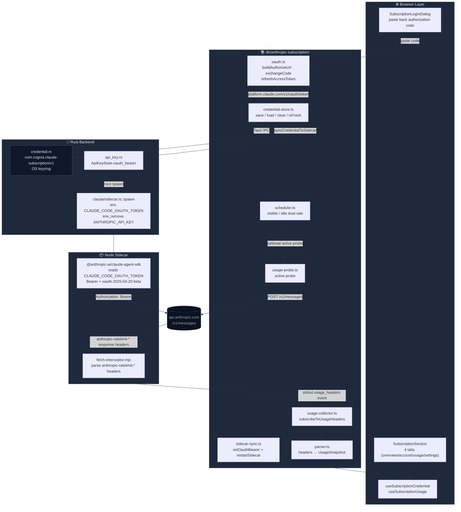

# Claude Subscription OAuth

<Status variant="stable">stable · ADR-0010</Status>

<TLDR>
  Log in to Claude Pro/Max or Console via a paste-back-authorization-code PKCE flow; credentials are
  kept in the OS keyring, and the sidecar automatically receives Bearer auth through the
  `CLAUDE_CODE_OAUTH_TOKEN` environment variable. Every real `/v1/messages` response is intercepted
  by `fetch-interceptor.mjs`, which parses the `anthropic-ratelimit-unified-*` headers and writes
  them to Dexie, making the 5h / 7d progress bars visible for free.
</TLDR>

<StatGrid>
  <Stat label="OAuth modes" value="2" hint="subscription / console" />
  <Stat label="Tauri commands" value="3" hint="save / load / clear" />
  <Stat label="Dexie table (v20)" value="1" hint="subscriptionUsage · 1000 rows" />
  <Stat label="Settings tabs" value="4" hint="overview / account / usage / settings" />
</StatGrid>

The subscription OAuth subsystem lets Cognia coexist alongside the official `claude login` CLI without mutual interference:

- We **do not write** `~/.claude/.credentials.json` — that file belongs to the Claude Code CLI.
- We **only read** the `anthropic-ratelimit-*` response headers — active probes are off by default.
- The sidecar is **strongly bound** to the OAuth bearer — when a bearer exists, `ANTHROPIC_API_KEY` is explicitly removed,
  preventing undefined behavior from mixed auth on the SDK side.

## Code Locations

```
lib/anthropic-subscription/
  constants.ts       # client_id, token endpoint, required beta header
  oauth.ts           # buildAuthorizeUrl / exchangeCodeForTokens / refreshAccessToken
  parser.ts          # parse anthropic-ratelimit-* headers into UsageSnapshot
  credential-store.ts # thin wrapper around the three Tauri commands
  sidecar-sync.ts    # push access_token to sidecar and restart it
  scheduler.ts       # dual-rate probe scheduler for visible / hidden states
  usage-collector.ts # passive sample ingestion into Dexie (debounced 60s, capped at 1000)
  usage-probe.ts     # active probe (opt-in, ~10 input + 1 output token each)
  types.ts           # OAuthMode / SubscriptionCredential / UsageSnapshot ...

src-tauri/src/anthropic_subscription/
  credential.rs      # OS keyring read / write / clear
  commands.rs        # claude_sub_save_token / load_token / clear_token

src-tauri/src/api_key.rs           # ApiKeyState.oauth_bearer field
src-tauri/src/claude/sidecar.rs    # inject CLAUDE_CODE_OAUTH_TOKEN at spawn
sidecar/fetch-interceptor.mjs      # wrap globalThis.fetch to capture usage

components/settings/subscription/
  subscription-section.tsx
  login-dialog.tsx
  tabs/{overview,account,usage,settings}-tab.tsx
```

## Architecture Overview



## OAuth Flow

Cognia-next uses the **paste-back-authorization-code (manual code)** variant. We have not registered a loopback redirect,
so Anthropic's callback page displays the authorization code directly to the user, who copies it back into the Login dialog.

<Steps>
<Step>
**Generate PKCE parameters** — `buildAuthorizeUrl({ mode })` constructs `code_verifier` and derives `code_challenge` from `SHA-256` using `crypto.randomUUID` in the browser, and derives `state` from the same entropy.
</Step>
<Step>
**Open the authorization URL** — the dialog calls `tauri-plugin-opener` to push the following URL into the system browser:
- subscription mode: `https://claude.ai/oauth/authorize`
- console mode: `https://console.anthropic.com/oauth/authorize`

Both share the client_id `9d1c250a-e61b-44d9-88ed-5944d1962f5e` (the public value from Claude Code CLI);
the server distinguishes modes by host + redirect URI.

</Step>
<Step>
**User pastes the authorization code** — `extractAuthorizationCode` tolerates three paste shapes: full URL, `code#state` form, and plain code string.
</Step>
<Step>
**Exchange** — `exchangeCodeForTokens` sends an `application/x-www-form-urlencoded` POST to `https://platform.claude.com/v1/oauth/token`. A JSON body will be rejected by the server with `400 invalid_grant` — all token requests must be form-encoded.
</Step>
<Step>
**Persist** — `saveCredential` goes through the Tauri `claude_sub_save_token` command to serialize `SubscriptionCredential` as JSON and write it to the OS keyring (service `com.cognia.claude-subscription/v1`, account `default`).
</Step>
<Step>
**Push to sidecar** — `syncCredentialToSidecar` calls `setOauthBearer(token)` → `restartSidecar()`. Rust injects the token into the `CLAUDE_CODE_OAUTH_TOKEN` environment variable on the next spawn, and the SDK automatically adds the Bearer header + `oauth-2025-04-20` beta.
</Step>
</Steps>

### Refresh

`refreshAccessToken({ refreshToken, mode })` triggers when any of the following conditions are met:

- On Overview startup, if `isCredentialFresh` returns false (less than 60s remaining);
- When an active probe returns `reason: "auth"` (401/403) — `scheduler.ts` automatically retries once;
- When the user clicks the "Refresh token" button in the Account tab.

The server **may rotate the refresh_token on every refresh**, so `buildCredential` always prefers the `refresh_token` from the response, falling back to the input only when absent — any implementation that discards the new refresh_token from the response will be logged out by the server within days.

### Required Beta Header

When making requests to `api.anthropic.com` in OAuth mode, the SDK must carry:

```ts title="lib/anthropic-subscription/constants.ts"
export const OAUTH_REQUIRED_BETA_FEATURES = [
  "interleaved-thinking-2025-05-14",
  "fine-grained-tool-streaming-2025-05-14",
  "claude-code-20250219",
  "oauth-2025-04-20",
] as const

export const OAUTH_REQUEST_HEADERS = {
  "anthropic-version": "2023-06-01",
  "anthropic-beta": OAUTH_REQUIRED_BETA_FEATURES.join(","),
  "x-app": "cli",
} as const
```

Without `oauth-2025-04-20` the server returns _"OAuth authentication is currently not supported"_;
without `claude-code-20250219` + `x-app: cli`, the Sonnet/Opus 4 series will 429 OAuth callers. `user-agent`
is set on the SDK client config rather than here, because Node's undici fetch disallows `customFetch` from overriding it on some paths.

## Credential Storage

<TypeTable
  type={{
    accessToken: {
      type: "string",
      description:
        "OAuth bearer, used by the sidecar as Authorization: Bearer ...; treated as secret.",
    },
    refreshToken: {
      type: "string",
      description:
        "Long-term refresh token, may be rotated on every refresh; always write back the latest value.",
    },
    expiresAtMs: {
      type: "number",
      description:
        "Absolute expiration time, milliseconds since epoch. `Date.now() + expires_in * 1000`.",
    },
    mode: {
      type: '"subscription" | "console"',
      description: "Determines authorize URL, redirect URI, and scope.",
    },
    scope: { type: "string?", description: "OAuth scope string echoed by the server." },
    email: { type: "string?", description: "Account email, displayed in the Account tab." },
    plan: { type: "string?", description: "Plan label: pro / max / team / console / other." },
    storedAtMs: {
      type: "number",
      description: "Most recent write time, milliseconds since epoch.",
    },
  }}
/>

**Tauri-only**: the keyring is unavailable in Web mode; Overview renders an explanatory banner. `isCredentialFresh`
includes a 60s safety margin, so refresh starts one minute before expiration rather than at the last second.

## Usage Collection — Zero Extra Cost

The `anthropic-ratelimit-unified-*` headers are returned with every real `/v1/messages` response. We collect them **passively** — no extra requests, no extra token consumption:

<Steps>
<Step>
When the sidecar process starts, `sidecar/fetch-interceptor.mjs` runs **first** and replaces `globalThis.fetch` with a wrapped version. All subsequent SDK fetches go through this layer.
</Step>
<Step>
For responses on the `api.anthropic.com` domain, extract all headers with the `anthropic-ratelimit-` prefix, assemble them into `{ type: "usage_headers", headers }` as a single JSON line, and write it to stdout.
</Step>
<Step>
Rust's stdout pump in `claude/sidecar.rs` forwards this line as a Tauri event `claude://message`, received by the browser-side `onClaudeMessage`.
</Step>
<Step>
`subscribeToUsageHeaders` listens for `usage_headers` events, calls `parser.parseUsageHeaders` to obtain a `UsageSnapshot`, then writes it to Dexie via `recordUsageSnapshot`.
</Step>
<Step>
**Debounced 60s** — multiple writes from the same `source` within 60s keep only the first. Streaming responses may fire 5 times per second, but the unified-* scale is 5h / 7d, so debouncing does not lose precision.
</Step>
<Step>
**Capacity cap of 1000 rows** — after each write, `count()` + `orderBy("fetchedAt").limit(overflow)` trims the oldest. The Usage tab pulls the most recent 200 rows for the timeline chart.
</Step>
</Steps>

### Active Probe (opt-in)

After enabling `Settings → Subscription → Settings: Enable active probe`, `scheduler.ts` starts a visible / hidden dual-rate loop:

| State   | Default Interval | Purpose                                                                                  |
| ------- | ---------------- | ---------------------------------------------------------------------------------------- |
| Visible | 5 minutes        | When the user stays on the subscription page, the progress bar stays fresh to the second |
| Hidden  | 30 minutes       | Background tab, preventing a forgotten browser from burning through quota                |
| Floor   | 60 seconds       | The UI does not allow either rate to be set below this value                             |

Each probe sends a `max_tokens: 1`, single-character request to `claude-haiku-4-5-20251001` — the cheapest model that still returns the full unified-\* headers. **Each probe consumes approximately 10 input + 1 output token**; there is no official free quota. The UI displays this notice when the checkbox is toggled. `ProbeOutcome` distinguishes 5 failure reasons:

```ts title="lib/anthropic-subscription/usage-probe.ts"
reason: "auth" | "rate-limited" | "no-headers" | "transport" | "http"
```

`scheduler.ts` automatically runs `refreshAccessToken` + `saveCredential` + sidecar sync once on `"auth"`, then retries; other errors enter backoff.

## Database Table

```ts title="lib/db/schema.ts (v20)"
this.version(20).stores({
  subscriptionUsage: "++localId, fetchedAt, status, source, [source+fetchedAt]",
})
```

`subscriptionUsage` is the only table:

- `localId` — Dexie auto-increment primary key.
- `fetchedAt` — Collection timestamp, milliseconds since epoch.
- `status` — `"allowed" | "allowed_warning" | "rate_limited" | "unknown"`.
- `source` — `"passive" | "probe"`, used by the Usage tab to color the chart.
- `[source+fetchedAt]` — Composite index for queries like "all passive samples in the past 24h".

`UsageSnapshot` also keeps `rawHeaders` (the original `anthropic-ratelimit-*` map) to help debug issues like "why did the progress bar suddenly regress".

## Settings UI — Four Tabs

`Settings → Subscription` (`?section=subscription&subTab=…`) is hosted by `SubscriptionSection`, using the same URL-sync pattern.

<Cards>
  <Card
    title="Overview"
    description="Status badge, 5h/7d progress bars, reset countdown; CTA when not logged in."
  >
    `tabs/overview-tab.tsx`
  </Card>
  <Card title="Account" description="Email / plan / expiry; manual refresh + sign out.">
    `tabs/account-tab.tsx`
  </Card>
  <Card title="Usage" description="Most recent 200 samples table; filter by source / status.">
    `tabs/usage-tab.tsx`
  </Card>
  <Card
    title="Settings"
    description="Active probe toggle, visible/hidden rates, warning threshold."
  >
    `tabs/settings-tab.tsx`
  </Card>
</Cards>

`SubscriptionLoginDialog` is the login entry point — it knows the URL / scope differences between the two modes, but
**does not persist OAuth flow state**: `OAuthFlowState` (`state` + `codeVerifier` + `mode` + `redirectUri`)
lives only in the dialog component's state and is discarded when the dialog closes, consistent with PKCE's single-use assumption.

## Sidecar Auth Priority

Auth selection inside `src-tauri/src/claude/sidecar.rs::spawn` follows strict priority:

```rust title="src-tauri/src/claude/sidecar.rs"
if let Some(token) = api_key_state.get_oauth_bearer().await {
    cmd.env("CLAUDE_CODE_OAUTH_TOKEN", token);
    // Defensive removal: prevent a leftover API key from the parent process leaking into the sidecar
    cmd.env_remove("ANTHROPIC_API_KEY");
} else if let Some(key) = api_key_state.get().await {
    cmd.env("ANTHROPIC_API_KEY", key);
}
```

In other words: **when an OAuth bearer exists, force OAuth** — and explicitly wipe the API key. `ANTHROPIC_BASE_URL`
is orthogonal to auth mode and is forwarded regardless (needed when the user routes through a third-party proxy via CCSwitch).

## Related Subsystems

<Cards>
  <Card
    title="Provider System"
    href="./provider-system"
    description="The API key path — OAuth is a parallel alternative."
  />
  <Card
    title="CCSwitch"
    href="./ccswitch"
    description="One-click switching among 50+ third-party Claude providers; mutually exclusive with OAuth."
  />
  <Card
    title="Sidecar & Claude SDK"
    href="../core/sidecar-and-claude-sdk"
    description="How environment variables flow into the SDK."
  />
</Cards>

## Related ADR

- [ADR-0010 — Claude Subscription OAuth](../adr/0010-claude-subscription-oauth) —
  Full design rationale: why manual-code, why we do not write `~/.claude/.credentials.json`, and why the client_id can be public.

## Known Limitations

- **Single account**: the `ACCOUNT` constant is hard-coded to `"default"`; multi-account switching is not yet implemented. When multi-account lands, the service string must be upgraded to `com.cognia.claude-subscription/v2`, with a v1 read path retained as a migration source.
- **Cognia-next is not an Anthropic-certified third-party OAuth client** — the `client_id` is public knowledge extracted from Claude Code CLI; if Anthropic changes the flow we must update `constants.ts` in sync.
- **No credentials in Web mode** — browser `keyring` does not exist; the Subscription page degrades to an explanatory banner.
- **`/v1/oauth/token` expects form-encoded** — all fetches must use `URLSearchParams`; JSON bodies are rejected by the server.
- **Probes have no official free quota** — the UI must clearly inform users that each probe costs tokens; if Anthropic ever opens a free ping endpoint, we should migrate to it.
