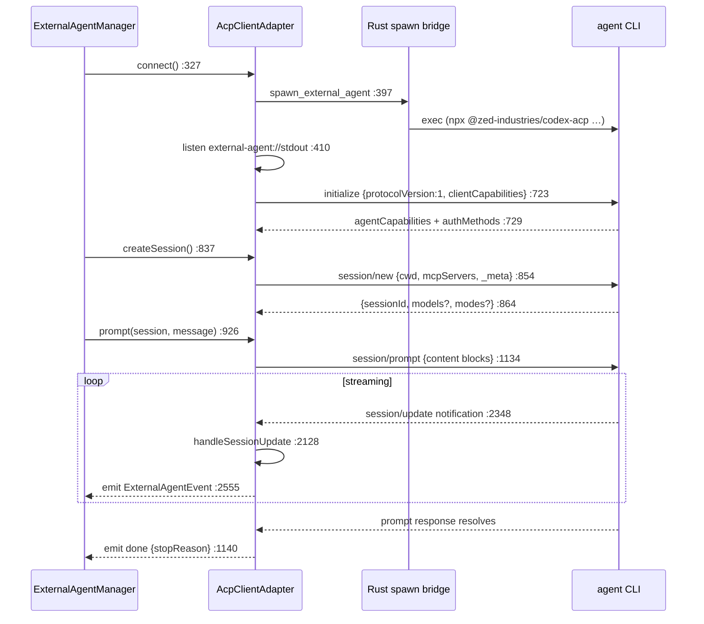

# ACP Client

<Status variant="stable" />

<TLDR>
  `AcpClientAdapter` (`acp-client.ts:286`) speaks the [Agent Client Protocol](https://agentclientprotocol.com):
  **JSON-RPC 2.0** framed as **newline-delimited JSON** (`split("\n")` at `:1747`). On the desktop it
  spawns the agent CLI through the Rust bridge (`spawn_external_agent` invoke at `:397`) and listens
  on `external-agent://stdout|stderr|exit`; remote agents use http/ws/sse. The connect handshake
  sends `initialize` with `protocolVersion: 1` (`:714`) and advertises the client's `fs` + `terminal`
  capabilities (only under Tauri, `:704`). ACP **inverts** the usual client/server roles: once a
  session is running, the *agent* calls back into Cognia for `fs/read_text_file`, `terminal/create`,
  and `session/request_permission` — all dispatched by `handleAgentRequest` (`:1796`). Streaming
  arrives as `session/update` notifications, which `handleSessionUpdate` (`:2128`) turns into the
  canonical `ExternalAgentEvent` stream the manager yields.
</TLDR>

<StatGrid>
  <Stat label="File size" value="2632 lines" hint="lib/ai/agent/external/acp-client.ts" />
  <Stat label="Protocol version" value="1" hint="sent in initialize, acp-client.ts:714" />
  <Stat label="Client-side handlers" value="8" hint="fs ×2 · terminal ×5 · permission ×1 — switch :1796" />
  <Stat label="Session-update kinds" value="11" hint="handleSessionUpdate switch :2128" />
  <Stat label="Request timeout" value="30s" hint="sendRequest default :1630 · permission 300s :2001" />
  <Stat label="Max reconnects" value="3" hint="exponential backoff, attemptReconnection :2602" />
</StatGrid>

## Transport & Framing

The adapter extends `BaseProtocolAdapter` and declares `protocol = "acp"`. `connect` (`:327`)
branches by transport:

- **stdio (desktop)** — `connectViaStdio` (`:377`) invokes `spawn_external_agent` (`:397`) with the
  spawn args from `buildSpawnArgs` (`:271`, the exported pure helper that appends `--bare`/`--debug`
  idempotently), then subscribes to `external-agent://stdout` → `handleIncomingMessage` (`:410`).
- **http / websocket / sse** — `connectViaNetwork` (`:447`) for remote agents, tolerating 404/405
  during the connect probe (`:462`).

Incoming bytes are buffered and split on `\n` in `processMessageBuffer` (`:1739`/`:1747`); each line
is JSON-parsed and routed by `routeMessage` (`:1752`): an object with a non-null `id` **and** a
`method` is an **agent→client request** (§ Inverted handlers); `method` with no `id` is a
**notification** (§ Streaming); a bare `id` is a **response** to one of our requests
(`handleResponse` `:1777`).

## The Handshake & Prompt Turn

| Method | Line | Sends / receives |
| --- | --- | --- |
| `initialize` | 702 | `{protocolVersion:1, clientCapabilities, clientInfo}`; stores `_protocolVersion`/`_agentCapabilities`/`_authMethods` (`:729`). Client caps = `{fs:{read,write}, terminal:true}` only under Tauri (`:704`). |
| `session/new` (`createSession`) | 837 | `{cwd, mcpServers, _meta}` (meta via `buildSessionRequestMeta` `:590`); derives the initial mode from `configOptions`/`modes` (`:864`). |
| `session/load` (`loadSession`) | 1286 | Guarded by `_agentCapabilities.loadSession` (throws if absent); state restored via later `session/update`s. |
| `prompt` (the turn) | 926 | Async generator: builds content blocks (text/image/resource + injected files, `:967`), fires `session/prompt` fire-and-forget (`:1026`/`:1134`), yields queued events, resolves to `done` (`:1140`). |
| `cancel` | 1117 | Notification `session/cancel` (`:1124`), only if executing. |
| `authenticate` | 741 | Validates against `_authMethods`, sends `authenticate {method, …credentials}` (`:753`). |

`prompt` does **not** await the `session/prompt` request inline — the response is the *end-of-turn*
signal, while the actual content streams in as notifications between the request and its resolution.

## Inverted Handlers — the Agent Calls Back

This is what makes ACP different from a normal RPC client: once a turn is running, the agent issues
requests **to Cognia**. `handleAgentRequest` (`:1796`) is the switch.

| ACP method | Handler (line) | Bridges to |
| --- | --- | --- |
| `fs/read_text_file` | `handleReadTextFile` (1891) | Tauri `readTextFile`; honors `line`/`limit` slicing (`:1899`); browser → throws. |
| `fs/write_text_file` | `handleWriteTextFile` (1915) | Tauri `writeTextFile`. |
| `session/request_permission` | `handlePermissionRequest` (1931) | The permission bridge (below). |
| `terminal/create` | `handleTerminalCreate` (2034) | `acpTerminalCreate` → `{terminalId}`. |
| `terminal/output` | `handleTerminalOutput` (2057) | `acpTerminalOutput`. |
| `terminal/kill` | `handleTerminalKill` (2072) | `acpTerminalKill`. |
| `terminal/release` | `handleTerminalRelease` (2084) | `acpTerminalRelease`. |
| `terminal/wait_for_exit` | `handleTerminalWaitForExit` (2096) | `acpTerminalWaitForExit` → `{exitCode, exitStatus}`. |
| `_`-prefixed extension | `extensionHandlers.get(method)` (1839) | Plugin-registered via `registerExtensionHandler` (`:1584`); unknown → `-32601`. |

The terminal methods bridge to `@/lib/native/external-agent`, which calls the Rust ACP-terminal
sub-protocol (`acp_terminal_*` in `src-tauri/src/external_agent/commands.rs`). Successful handler
results go back as `sendResponse` (`:1862`); a throw becomes `-32603` (`:1855`).

## The Permission Bridge

When the agent wants to run a tool, it sends `session/request_permission`.
`handlePermissionRequest` (`:1931`) is the bridge:

1. **Auto-decide first.** `bypassPermissions` mode auto-selects an allow option (`:1984`);
   `acceptEdits` + a write-kind tool auto-selects too (`:1994`).
2. **Otherwise surface it.** It normalizes the params into an `AcpPermissionRequest` (`:1963`),
   emits a `permission_request` event (`:2017`), and returns a Promise stored in
   `pendingPermissions` keyed by `requestId` (`:2009`), with a **5-minute** timeout that resolves
   `cancelled` (`:2001`).
3. **Resolve.** `respondToPermission` (`:1067`) looks up the pending Promise and resolves it to
   `{outcome: granted ? "selected" : "cancelled", optionId}` (`:1071`), then emits
   `permission_response` (`:1077`).

Which allow option gets picked is `pickAllowPermissionOption` (`:1605`): prefer
`allow_once`, then the default `allow`, then any `allow`. This is the seam the
[hooks gate](./observability-hooks) intercepts in the manager — a settings.json `PreToolUse` hook
can deny *before* the user ever sees the request.

## Session Extensions

`session/list`, `session/fork`, and `session/resume` are **unstable** ACP extensions. The adapter
tracks per-method support (`createDefaultSessionExtensionSupport` `:253`, all `"unknown"` until
probed) and degrades silently when an agent doesn't implement one.

| Extension | Method (line) | Behavior |
| --- | --- | --- |
| `session/list` | `listSessions` (1324) | Short-circuits if cached-unsupported; on `-32601`/unsupported, caches `"unsupported"` and throws a typed `UnsupportedSessionExtensionError`. |
| `session/fork` | `forkSession` (1372) | Gated on `sessionCapabilities.fork === false`; same error classification. |
| `session/resume` | `resumeSession` (1457) | Falls back to `session/load` when `loadSession` capability is present (`:1466`, `:1538`) instead of failing. |

Error classification is delegated to [`session-extension-errors.ts`](./canonical-readiness)
(`isExternalAgentMethodNotFoundError`, `isExternalAgentSessionExtensionUnsupportedForMethod`).

## Streaming — session/update → Events

Notifications route through `handleNotification` (`:2117`) → `notificationToEvent` (`:2341`). The
primary path is `session/update` (`:2348`) → `handleSessionUpdate` (`:2128`), a switch on
`update.sessionUpdate`:

| ACP update | → canonical event | Line |
| --- | --- | --- |
| `agent_message_chunk` | `message_delta` (text) | 2139 |
| `thought_message_chunk` | `thinking` | 2151 |
| `user_message_chunk` | `message_delta` | 2159 |
| `tool_call` | `tool_use_start` | 2171 |
| `tool_call_update` (completed/error/failed) | `tool_result` | 2199 |
| `tool_call_update` (other) | `tool_call_update` / `tool_use_delta` | 2217 / 2232 |
| `plan` | `plan_update` (with progress %) | 2253 |
| `available_commands_update` | `commands_update` | 2272 |
| `current_mode_update` | `mode_update` | 2297 |
| `config_options_update` | `config_options_update` | 2321 |

`emitEvent` (`:2555`) fans the event out to per-session listeners; the `prompt` generator registered
its listener at `:965` and yields whatever lands in its queue. Legacy notification methods
(`message/*`, `tool/*`, `thinking`, `progress`, `error`) are also mapped in `notificationToEvent`
(`:2351`–`:2504`) for agents that predate the unified `session/update`.

## Reliability

- **Request timeout** — `sendRequest` defaults to 30 s (`:1630`); `healthCheck` pings at 5 s
  (`:1574`).
- **Process exit** — `handleProcessExit` (`:2575`) rejects all pending requests, marks sessions
  closed, and (if `restartOnCrash`) triggers `attemptReconnection` (`:2602`) with exponential
  backoff up to 3 attempts (`:2608`).
- **Disconnect cleanup** — clears pending permissions to `cancelled`, pending requests, and the
  extension-support cache (`:821`–`:827`).
