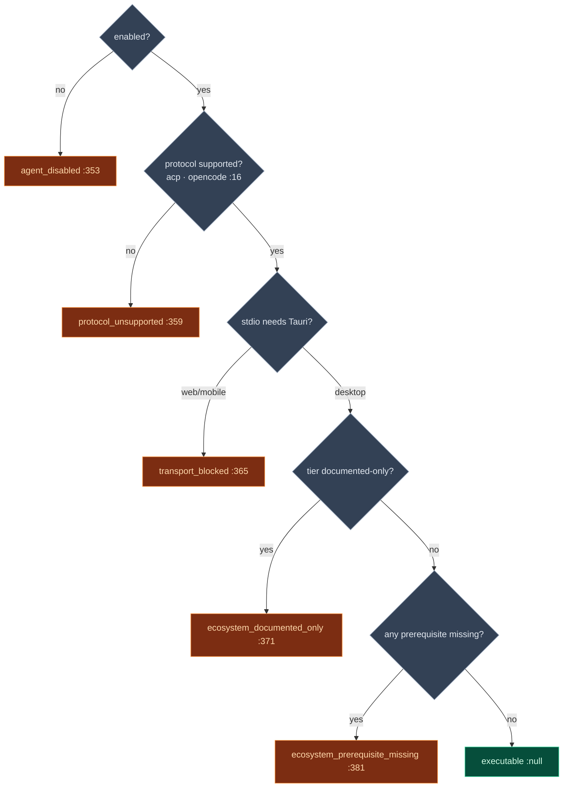

# Canonical Contract & Readiness

<Status variant="stable" />

<TLDR>
  Three modules answer one question: **can this agent run, and if not, why, and what should the user
  do?** `canonical-contract.ts` owns the projection — `normalizeExternalAgentValiditySnapshot`
  (`:172`) takes a partial `ExternalAgentValiditySnapshot` and fills in reason code, human reason,
  execution eligibility, branch outcome, lifecycle stage, and recovery hints, so the manager's
  `updateInstanceState` always produces consistent diagnostics. `config-normalizer.ts` turns a raw
  `CreateExternalAgentInput` into a fully-defaulted config (`:400`) and computes *whether launch is
  blocked* via a 5-rung **execution-block ladder** (`:349`) plus a live **ecosystem readiness probe**
  (`:238`). `session-extension-errors.ts` is the taxonomy that lets the clients silently degrade when
  an agent doesn't implement `session/list|fork|resume`.
</TLDR>

<StatGrid>
  <Stat label="Contract version" value="1" hint="EXTERNAL_AGENT_CANONICAL_CONTRACT_VERSION — canonical-contract.ts:13" />
  <Stat label="Projection entry" value="normalize…:172" hint="the only partial→complete snapshot path" />
  <Stat label="Block ladder rungs" value="5" hint="getExternalAgentExecutionBlock — config-normalizer.ts:349" />
  <Stat label="Supported protocols" value="acp · opencode" hint="SUPPORTED_EXTERNAL_AGENT_PROTOCOLS :16" />
  <Stat label="Normalize defaults" value="300s / 3 retries" hint="DEFAULT_TIMEOUT · DEFAULT_RETRY_CONFIG" />
  <Stat label="Extension errors" value="7 helpers" hint="session-extension-errors.ts classifiers" />
</StatGrid>

## canonical-contract.ts — One Projection

This is the single place a partial validity snapshot becomes a complete one. The manager funnels
*every* status change through it (`manager.ts:928`), so the UI never sees an inconsistent
reason-code/outcome pair.

| Symbol | Line | Role |
| --- | --- | --- |
| `EXTERNAL_AGENT_CANONICAL_CONTRACT_VERSION` | 13 | Stamped into every normalized snapshot (`= 1`). |
| `createUnknownSessionExtensionSupport` | 15 | Default all-`unknown` extension support map. |
| `normalizeExternalAgentValiditySnapshot` | 172 | **The projection** — partial → complete snapshot. |
| `validateExternalAgentBenchmarkCapabilityEntry` | 246 | Gate ledger: a `validated` entry needs evidence; an intentional deviation needs a full deviation record. |
| `createExternalAgentBenchmarkBaseline` | 299 | Seeds the 4 baseline capability entries used by the [agent-eval](../../subsystems/observability) gap ledger. |

### The projection pipeline

`normalizeExternalAgentValiditySnapshot` (`:172`) orchestrates a fixed sequence of internal
resolvers:

**`resolveBranchOutcome` (`:86`)** is the canonical reason→outcome map (an explicit `branchOutcome`
always wins, `:91`):

| Reason code | Outcome |
| --- | --- |
| `strict_failure` | `strict_failure` |
| `fallback_to_builtin` | `fallback` |
| `agent_not_found` / `configuration_missing` | `builtin` |
| else + eligibility `blocked` | `blocked` |
| else + eligibility `eligible` | `external` |

**`resolveCanonicalReasonCode` (`:23`)** derives a code when none is explicit and the agent isn't
executable: a `documented-only` ecosystem tier → `ecosystem_documented_only` (`:33`); an
`action-required` prerequisite → `ecosystem_prerequisite_missing` (`:36`); otherwise it falls back
through `canonicalReasonCode ?? blockingReasonCode ?? lastBranchReasonCode ?? "ok"`.

**`resolveRecoveryHints` (`:125`)** maps each reason code to actionable strings (e.g.
`transport_blocked` → "run on desktop", `health_check_failed` → "reconnect"); ecosystem
`recommendedActions` take precedence over these when present (`:201`).

**`mapSourceToLifecycleStage` (`:106`)** records how far the lifecycle got: outcome `fallback` →
stage `fallback`; `strict_failure` → `recovery`; source `config`/`connect`/`health` → the matching
stage; else `execution`. `blockedStage` is set only when eligibility is `blocked` (`:192`).

## config-normalizer.ts — Defaults, Blocks & Readiness

`normalizeExternalAgentConfigInput` (`:400`) is the front door: raw input → defaulted
`ExternalAgentConfig` carrying an initial `validitySnapshot`.

| Step | Line | What it does |
| --- | --- | --- |
| Protocol-support flagging | 416 | Unsupported protocols get `metadata.unsupported*` keys; supported ones cleared. |
| Defaults | 427 | `id` = `nanoid()` if absent, `enabled` default true, `defaultPermissionMode` `"default"`, `timeout` **300000** (`:440`), `retryConfig` from `DEFAULT_RETRY_CONFIG` (3 / 1s / exponential / 30s cap). |
| Readiness merge | 455 | `projectExternalAgentReadinessMetadata` flattens ecosystem facts into `metadata.ecosystem*`. |
| Validity seed | 463 | Block assessment → `normalizeExternalAgentValiditySnapshot` → the initial snapshot (`:464`). |

### The execution-block ladder

`getExternalAgentExecutionBlock` (`:349`) is the gate the manager calls before connecting
(`manager.ts:1082`). **First match wins:**

### Ecosystem readiness

`getExternalAgentEcosystemReadiness` (`:107`) builds the prerequisite list synchronously (resolving
the surface from metadata, falling back to stored `metadata.ecosystem*` strings), and
`resolvePrerequisiteStatus` (`:91`) rolls them up: `documented-only` → `not-applicable`, any missing
→ `action-required`, any unknown → `unknown`, else `ready`. The async
`probeExternalAgentEcosystemReadiness` (`:238`) adds a **live PATH check** — when executable + Tauri +
stdio + a `checkCommandExists` probe is available, it pushes a satisfied/missing `local-command`
prerequisite (`:252`), and for Codex on Windows appends a WSL2 recommendation (`:278`). The manager
re-runs this probe on every connect (`enrichConfigWithDynamicReadiness`, `manager.ts:1080`).

Supporting predicates: `isSupportedExternalAgentProtocol` (`:316`),
`isTransportSupportedOnCurrentPlatform` (`:331`, stdio requires Tauri), and `isExternalAgentExecutable`
(`:393`, block reason === null).

## session-extension-errors.ts — Degrade Quietly

The `session/list|fork|resume` extensions are optional and unstable. This module is the taxonomy the
[ACP client](./acp-client) uses to decide whether a failure means "this agent doesn't support it"
(cache and move on) versus a real error.

| Helper | Line | Purpose |
| --- | --- | --- |
| `ExternalAgentUnsupportedSessionExtensionError` | 32 | Typed error; `code = "extension_unsupported"`, carries the `method`. |
| `createExternalAgentUnsupportedSessionExtensionError` | 46 | Factory. |
| `getExternalAgentUnsupportedSessionExtensionMethod` | 66 | Extract the method (`session/list|fork|resume`) from a typed error or message text. |
| `isExternalAgentMethodNotFoundError` | 91 | Detect JSON-RPC `-32601` / "method not found". |
| `isExternalAgentSessionExtensionUnsupportedForMethod` | 99 | Per-method unsupported check (typed → extracted → heuristic). |
| `isExternalAgentSessionExtensionUnsupportedError` | 129 | General detector combining session-context + unsupported/method-not-found signals. |

The classification ladder is: typed error (fast path) → method extraction from message → JSON-RPC
code → heuristic on lowercased message text (`"session" + (not supported | unsupported)`). A match
becomes branch reason code `extension_unsupported`, which the manager turns into a `blocked` outcome
for that capability — without failing the whole agent.
