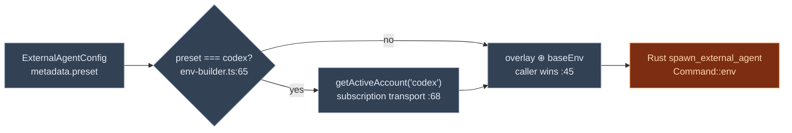

# Ecosystem & Presets

<Status variant="stable" />

<TLDR>
  This cluster answers "**which** external agents can a user pick, and how is each launched?"
  `ecosystem-adapters.ts` is the static product catalog: 4 adapters (**Codex**, **Claude Code**,
  **Gemini CLI**, **Cursor**) exposing 10 surfaces (`:48`), each tagged `executable`, `guided`, or
  `documented-only`. Only 4 surfaces are `executable` — those become the 4 built-in **presets** in
  `presets.ts` (`:105`): `codex`, `claude-code`, `gemini-cli`, `cursor-cli`, all ACP-over-stdio.
  `createAgentFromPreset` (`:242`) materializes a full `ExternalAgentConfig` from a preset id, and a
  runtime overlay lets plugins register their own presets without touching the closed type union.
  At spawn time, `env-builder.ts` (`:36`) injects the active Codex subscription account's env vars —
  the one preset that needs credentials beyond a plain API key.
</TLDR>

<StatGrid>
  <Stat label="Product adapters" value="4" hint="codex · claude-code · gemini-cli · cursor — ecosystem-adapters.ts:48" />
  <Stat label="Surfaces" value="10" hint="4 executable · 6 documented-only" />
  <Stat label="Executable presets" value="4" hint="presets.ts:105 (+ custom:null)" />
  <Stat label="All ACP / stdio" value="yes" hint="every executable preset is acp + stdio" />
  <Stat label="Default timeout" value="30s" hint="createAgentFromPreset :278 (vs config-normalizer 300s)" />
  <Stat label="Env overlay" value="codex only" hint="env-builder.ts:62 — subscription-backed" />
</StatGrid>

## The Product Catalog

`EXTERNAL_AGENT_ECOSYSTEM_ADAPTERS` (`:48`) is the catalog. Each adapter is a product; each surface is
a way that product can be reached, tagged with a **support tier**:

- **executable** — Cognia can spawn it directly (has a `presetId` + process config).
- **documented-only** — the product offers this integration, but it runs outside Cognia; the UI
  shows a docs link and a `limitationNote` instead of a launch button.

| Adapter | Surface | Tier | Protocol/Transport | Spawn command | Prereq | Def line |
| --- | --- | --- | --- | --- | --- | --- |
| **codex** | acp-stdio (Codex CLI) | executable | acp/stdio | `npx -y @zed-industries/codex-acp` | `OPENAI_API_KEY` / `CODEX_API_KEY` | 59 |
| codex | official-cli | documented-only | custom/stdio | — | install official Codex CLI | 81 |
| codex | ide-extension | documented-only | custom/http | — | install IDE extension | 98 |
| codex | slack | documented-only | http/http | — | configure Slack app | 116 |
| codex | cloud | documented-only | http/http | — | ChatGPT/OpenAI cloud | 134 |
| **claude-code** | acp-stdio (Claude Code) | executable | acp/stdio | `npx -y @anthropics/claude-code --stdio` | `ANTHROPIC_API_KEY` | 160 |
| **gemini-cli** | acp-stdio (Gemini CLI) | executable | acp/stdio | `npx -y @google/gemini-cli --stdio` | `GOOGLE_API_KEY` | 188 |
| **cursor** | acp-stdio (Cursor CLI) | executable | acp/stdio | `cursor-agent` (on PATH) | install Cursor CLI | 216 |
| cursor | mcp-config | documented-only | acp/http | — | Cursor-side MCP config | 236 |
| cursor | background-agent | documented-only | acp/http | — | hosted background agents | 253 |

The adapter blocks start at: codex `:52`, claude-code `:153`, gemini-cli `:181`, cursor `:209`.
Lookup/resolution helpers: `getExternalAgentEcosystemAdapter` (`:274`),
`findExternalAgentSurfaceByPresetId` (`:284`), `findExternalAgentSurface` (`:297`),
`checkSurfaceExecutability` (`:324`, returns a block when `documented-only`), `listAllSurfacesWithTier`
(`:348`), and `resolveExternalAgentSurfaceFromMetadata` (`:387`, used by the manager's readiness
probe).

> **OpenCode is not in this catalog.** It is a *protocol* (`config-normalizer.ts:16`), not a packaged
> product surface — users point it at a running OpenCode server rather than picking a preset.

## The Four Presets

`presets.ts` derives the built-in presets *from* the executable surfaces — each preset is built by
`buildPresetConfig(presetId)` (`:76`), which looks the surface up by `presetId`. The catalog is
`EXTERNAL_AGENT_PRESETS` (`:105`):

| Preset id | Name | Protocol | Transport | Spawn | Built at |
| --- | --- | --- | --- | --- | --- |
| `codex` | Codex CLI | acp | stdio | `npx -y @zed-industries/codex-acp` | 109 |
| `claude-code` | Claude Code | acp | stdio | `npx -y @anthropics/claude-code --stdio` | 110 |
| `gemini-cli` | Gemini CLI | acp | stdio | `npx -y @google/gemini-cli --stdio` | 111 |
| `cursor-cli` | Cursor CLI | acp | stdio | `cursor-agent` | 112 |
| `custom` | — | — | — | `null` (user-defined) | 113 |

`ExternalAgentPresetId` (`:25`) is a closed union, but presets are not — see the next section.

### Materializing a config

`createAgentFromPreset(presetId, overrides?)` (`:242`) turns a preset into a runnable
`ExternalAgentConfig`: it generates an id (`nanoid()`, `:252`) unless overridden, defaults `timeout`
to **30000** (`:278`), merges process `args`/`env` with overrides (`:262`), and stamps provenance
metadata — `metadata.preset`, `ecosystemAdapterId`, `ecosystemSurfaceId`, `ecosystemSupportTier`,
`ecosystemDocsUrl` (`:279`). `isFromPreset` (`:297`) reads that provenance back; `getPresetDisplayInfo`
(`:313`) is the UI subset.

### Plugin-contributed presets

Plugins extend the gallery without touching the closed union. A runtime overlay map backs:

| Symbol | Line | Role |
| --- | --- | --- |
| `registerPreset` | 145 | Add/replace a dynamic preset (returns the previous). |
| `unregisterPreset` | 156 | Drop one. |
| `unregisterPresetsByPlugin` | 165 | Drop all of a plugin's presets (returns count). |
| `getPresetConfig` | 230 | Resolve a preset id — **dynamic wins** over static. |
| `getAvailablePresets` | 217 | Built-ins ∪ dynamic ids. |
| `listDynamicPresetEntries` | 195 | All dynamic entries (the "Contributed" UI tab). |

These are driven by the `externalAgentPresets` manifest field and `ctx.registerExternalAgentPreset`
— see [Integration seams](./integration).

## env-builder.ts — Credentials at Spawn Time

Most presets need only a single API-key env var, supplied by the user. **Codex is the exception**: it
can sign in with a ChatGPT account through the unified subscription system (ADR-0025), so its env
must be injected at launch.

`buildAgentEnv(config, baseEnv = {})` (`:36`) computes a `codexEnvOverlay` (`:40`); if there is none
it returns `baseEnv` unchanged (`:41`), otherwise it merges the overlay **first** so the caller's
`baseEnv` still wins (`:45`). `codexEnvOverlay` (`:62`) returns `null` unless
`metadata.preset === "codex"` (`:65`), then pulls the active Codex account via `getActiveAccount("codex")`
(`:68`) from the subscription transport and copies its env pairs (`:72`). Any error is swallowed with
a warning (`:77`) so a credential hiccup never blocks a launch. The result is handed to the Rust
`spawn_external_agent` command, which applies it via `Command::env`.

No `PATH` or `CLAUDE_CODE_OAUTH_TOKEN` injection happens here — that token belongs to the in-process
sidecar, not external agents. Claude Code, Gemini, and Cursor receive the base env unchanged.
