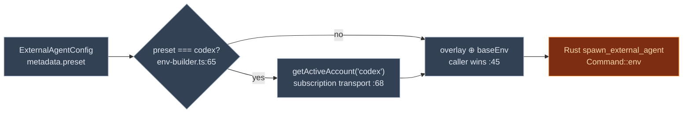

# Ecosystem & Presets

<Status variant="stable" />

<TLDR>
  This cluster answers "**which** external agents can a user pick, and how is each launched?"
  `ecosystem-adapters.ts` is the static product catalog: 9 adapters (**Codex**, **Claude Code**,
  **Gemini CLI**, **Copilot CLI**, **Kiro**, **Qwen Code**, **Pi**, **Factory Droid**, **Cursor**)
  exposing 16 surfaces (`:48`), each tagged `executable`, `guided`, or `documented-only`. The 10
  `executable` surfaces become the built-in **presets** in `presets.ts`: `codex`, `codex-app-server`,
  `claude-code`, `gemini-cli`, `cursor-cli`, `copilot-cli`, `kiro`, `qwen-code`, `pi`, `droid` —
  all ACP-over-stdio except the native codex app-server.
  `createAgentFromPreset` materializes a full `ExternalAgentConfig` from a preset id, and a
  runtime overlay lets plugins register their own presets without touching the closed type union.
  At spawn time, `env-builder.ts` (`:36`) injects the active Codex subscription account's env vars —
  the one preset that needs credentials beyond a plain API key.
</TLDR>

<StatGrid>
  <Stat label="Product adapters" value="9" hint="codex · claude-code · gemini-cli · copilot-cli · kiro · qwen-code · pi · droid · cursor — ecosystem-adapters.ts:48" />
  <Stat label="Surfaces" value="16" hint="10 executable · 6 documented-only" />
  <Stat label="Executable presets" value="10" hint="EXTERNAL_AGENT_PRESETS (+ custom:null)" />
  <Stat label="All ACP / stdio" value="yes" hint="every executable preset is acp + stdio" />
  <Stat label="Default timeout" value="30s" hint="createAgentFromPreset :278 (vs config-normalizer 300s)" />
  <Stat label="Env overlay" value="codex only" hint="env-builder.ts:62 — subscription-backed" />
</StatGrid>

## The Product Catalog

`EXTERNAL_AGENT_ECOSYSTEM_ADAPTERS` (`:48`) is the catalog. Each adapter is a product; each surface is
a way that product can be reached, tagged with a **support tier**:

- **executable** — Cognia can spawn it directly (has a `presetId` + process config).
- **documented-only** — the product offers this integration, but it runs outside Cognia; the UI
  shows a docs link and a `limitationNote` instead of a launch button.

| Adapter | Surface | Tier | Protocol/Transport | Spawn command | Prereq | Def line |
| --- | --- | --- | --- | --- | --- | --- |
| **kimi** | acp-stdio (Kimi Code) | executable | acp/stdio | `kimi acp` | `kimi login` subscription | — |
| **cline** | acp-stdio (Cline CLI) | executable | acp/stdio | `cline --acp --auto-approve false` | `cline auth` / `CLINE_API_KEY` + provider/model | 52 |
| **codex** | acp-stdio (Codex CLI) | executable | acp/stdio | `npx -y @zed-industries/codex-acp` | `OPENAI_API_KEY` / `CODEX_API_KEY` | 59 |
| codex | official-cli | documented-only | custom/stdio | — | install official Codex CLI | 81 |
| codex | ide-extension | documented-only | custom/http | — | install IDE extension | 98 |
| codex | slack | documented-only | http/http | — | configure Slack app | 116 |
| codex | cloud | documented-only | http/http | — | ChatGPT/OpenAI cloud | 134 |
| **claude-code** | acp-stdio (Claude Code) | executable | acp/stdio | `npx -y @anthropics/claude-code --stdio` | `ANTHROPIC_API_KEY` | 160 |
| **gemini-cli** | acp-stdio (Gemini CLI) | executable | acp/stdio | `npx -y @google/gemini-cli --stdio` | `GOOGLE_API_KEY` | 210 |
| **copilot-cli** | acp-stdio (GitHub Copilot CLI) | executable | acp/stdio | `copilot --acp` | `COPILOT_GITHUB_TOKEN` / `/login` | 238 |
| **kiro** | acp-stdio (Kiro CLI) | executable | acp/stdio | `kiro-cli acp` | AWS Builder ID login | 269 |
| **qwen-code** | acp-stdio (Qwen Code) | executable | acp/stdio | `npx -y @qwen-code/qwen-code --acp` | Qwen OAuth / `OPENAI_API_KEY` | 298 |
| **droid** | acp-stdio (Factory Droid) | executable | acp/stdio | `droid exec --output-format acp` | `FACTORY_API_KEY` / device login | 359 |
| **cursor** | acp-stdio (Cursor CLI) | executable | acp/stdio | `cursor-agent` (on PATH) | install Cursor CLI | 390 |
| cursor | mcp-config | documented-only | acp/http | — | Cursor-side MCP config | 410 |
| cursor | background-agent | documented-only | acp/http | — | hosted background agents | 427 |

The adapter blocks start at: codex `:52`, claude-code `:175`, gemini-cli `:203`, copilot-cli `:231`,
kiro `:262`, qwen-code `:291`, pi `:320`, droid `:352`, cursor `:383`.
Lookup/resolution helpers: `getExternalAgentEcosystemAdapter` (`:274`),
`findExternalAgentSurfaceByPresetId` (`:284`), `findExternalAgentSurface` (`:297`),
`checkSurfaceExecutability` (`:324`, returns a block when `documented-only`), `listAllSurfacesWithTier`
(`:348`), and `resolveExternalAgentSurfaceFromMetadata` (`:387`, used by the manager's readiness
probe).

> **OpenCode is not in this catalog.** It is a *protocol* (`config-normalizer.ts:16`), not a packaged
> product surface — users point it at a running OpenCode server rather than picking a preset.

## The Built-in Presets

`presets.ts` derives the built-in presets *from* the executable surfaces — each preset is built by
`buildPresetConfig(presetId)`, which looks the surface up by `presetId`. The catalog is
`EXTERNAL_AGENT_PRESETS`:

| Preset id | Name | Protocol | Transport | Spawn |
| --- | --- | --- | --- | --- |
| `codex` | Codex CLI | acp | stdio | `npx -y @zed-industries/codex-acp` |
| `codex-app-server` | Codex (app-server) | codex-app-server | stdio | `codex app-server` |
| `claude-code` | Claude Code | acp | stdio | `npx -y @anthropics/claude-code --stdio` |
| `gemini-cli` | Gemini CLI | acp | stdio | `npx -y @google/gemini-cli --stdio` |
| `cursor-cli` | Cursor CLI | acp | stdio | `cursor-agent` |
| `copilot-cli` | GitHub Copilot CLI | acp | stdio | `copilot --acp` |
| `kiro` | Kiro CLI | acp | stdio | `kiro-cli acp` |
| `qwen-code` | Qwen Code | acp | stdio | `npx -y @qwen-code/qwen-code --acp` |
| `droid` | Factory Droid | acp | stdio | `droid exec --output-format acp` |
| `custom` | — | — | — | `null` (user-defined) |

`ExternalAgentPresetId` (`:26`) is a closed union, but presets are not — see the next section.
Pi has no ACP entry: it is driven natively over `pi-rpc` by the `pi-rpc` preset. The community
`pi-acp` bridge that used to appear here was removed along with its runtime and its `npx`
allowlist entry — see the Pi adapter page.

### Materializing a config

`createAgentFromPreset(presetId, overrides?)` (`:242`) turns a preset into a runnable
`ExternalAgentConfig`: it generates an id (`nanoid()`, `:252`) unless overridden, defaults `timeout`
to **30000** (`:278`), merges process `args`/`env` with overrides (`:262`), and stamps provenance
metadata — `metadata.preset`, `ecosystemAdapterId`, `ecosystemSurfaceId`, `ecosystemSupportTier`,
`ecosystemDocsUrl` (`:279`). `isFromPreset` (`:297`) reads that provenance back; `getPresetDisplayInfo`
(`:313`) is the UI subset.

### Plugin-contributed presets

Plugins extend the gallery without touching the closed union. A runtime overlay map backs:

| Symbol | Line | Role |
| --- | --- | --- |
| `registerPreset` | 145 | Add/replace a dynamic preset (returns the previous). |
| `unregisterPreset` | 156 | Drop one. |
| `unregisterPresetsByPlugin` | 165 | Drop all of a plugin's presets (returns count). |
| `getPresetConfig` | 230 | Resolve a preset id — **dynamic wins** over static. |
| `getAvailablePresets` | 217 | Built-ins ∪ dynamic ids. |
| `listDynamicPresetEntries` | 195 | All dynamic entries (the "Contributed" UI tab). |

These are driven by the `externalAgentPresets` manifest field and `ctx.registerExternalAgentPreset`
— see [Integration seams](./integration).

A preset only configures launch over one of the built-in protocols. To contribute a **new protocol**
(the adapter behaviour itself), a plugin uses the `external-agent-adapter` capability
(`externalAgentAdapters` / `ctx.agent.registerExternalAgentAdapter`), which registers a
`() => ProtocolAdapter` factory under `${pluginId}:${id}` and pairs with a matching preset — see
[Contributing a new protocol](./integration) and [ADR-0051](../../adr/0051-external-agent-adapter-plugin-type).

## Goose installation and sessions

The `goose` preset uses Goose's native ACP server: `goose acp --with-builtin developer`.
It is a system-owned runtime on macOS and Linux. Cognia detects the executable and probes
`goose --version`; it does not install a community bridge or claim ownership of the binary.

On macOS, install with `brew install block-goose-cli`. The CLI/TUI install action uses this
formula when Homebrew is available, otherwise the official installer:

```sh
curl -fsSL https://github.com/aaif-goose/goose/releases/download/stable/download_cli.sh | CONFIGURE=false bash
```

Run `goose configure` to choose the provider and model, or supply `GOOSE_PROVIDER`, `GOOSE_MODEL`,
and the provider's API key in the agent environment. DeepSeek can use the OpenAI-compatible
provider with `GOOSE_PROVIDER=openai`, `GOOSE_MODEL=deepseek-flash`,
`OPENAI_BASE_URL=https://api.deepseek.com/v1`, and `OPENAI_API_KEY` supplied locally.
Desktop settings and the chat Agent manager expose the same preset and installation guidance.
Update a Homebrew installation with `brew upgrade block-goose-cli`, or a script installation
with `goose update`. Removing the agent in Cognia removes its saved configuration; uninstall
Goose with the package manager or remove the script-installed binary separately.

Cognia starts Goose in `approve` mode so requests reach its permission broker. `plan` maps to
Goose `chat`; explicit `bypassPermissions` maps to `auto`. `default`, `acceptEdits`, and `dontAsk`
keep Goose in `approve` and let Cognia apply its existing approval policy. Temporary files use
an existing sandbox-writable Goose state directory; the sandbox is never disabled.

The shared ACP client provides streaming, native tools, per-session MCP servers, model/mode
configuration, session listing/loading, cancellation, and session deletion. Windows is not
advertised because Cognia's strict external-agent sandbox currently supports macOS/Linux.

For an opt-in live regression, install Goose on PATH, supply provider credentials locally, and run
`node scripts/smoke/build-and-run-smoke.mjs --goose-acp`. It creates and removes a temporary
workspace and isolates Goose configuration with `GOOSE_PATH_ROOT`.

Sources: [Goose installation](https://goose-docs.ai/docs/getting-started/installation/),
[native ACP](https://goose-docs.ai/docs/gdk/acp/),
[environment variables](https://goose-docs.ai/docs/guides/environment-variables/).

## Qoder installation, authentication and ACP

The `qoder` preset uses Qoder's official ACP server on macOS and Linux. Cognia reuses the shared ACP client; it does not install a community bridge or a separate SDK adapter.

Install the native standalone CLI with the recommended official installer:

```sh
curl -fsSL https://qoder.com/install | bash
qoder --version
qoder login
```

The CLI/TUI missing-command flow offers this installer when `curl` and `bash` are available. It is a **user-managed system installation**, not a pinned Cognia-managed distribution. The runtime catalog probes `qoder --version`; Qoder remains uncertified until authenticated acceptance evidence is available, so the existing version-consent policy applies. Update a native installation separately with `qoder update`. The legacy npm package is supported upstream but is not the recommended installation path for new users.

The preset launches:

```sh
qoder --acp --permission-mode default --strict-mcp-config --settings '{"general":{"enableAutoUpdate":false}}'
```

Explicit default permissions prevent the saved default mode from silently starting the agent in bypass mode. The per-process settings disable background auto-update without editing the user's `settings.json`. Strict MCP configuration ignores implicit user/project/plugin MCP servers; Cognia passes the selected servers through ACP `session/new`, `session/load` or `session/resume`, subject to negotiated capabilities.

Authenticate through an existing Qoder CLI login, or supply `QODER_PERSONAL_ACCESS_TOKEN` in the masked agent environment editor. Create the token on [Qoder account integrations](https://qoder.com/account/integrations); do not paste it into chats or commit it. `QODER_CONFIG_DIR` or `--config-dir` selects a separate state root; the CLI argument takes precedence. Both host launchers give that root the required sandbox write scope without copying login data or writing to the default login root. Temporary files are placed under the selected state root (`tmp/`) so startup stays within the sandbox. Isolated Bot configuration must stay under the owned Bot state directory; only the host installation’s `.qoder/entry` and `.qoder/bin` program directories are exposed read-only. A provider API key alone does not replace Qoder authentication. BYOK provider/model availability is controlled by the Qoder account's supported catalog.

Qoder's ACP page documents Default and Bypass Permissions. Newer versions can advertise additional modes: Cognia maps `acceptEdits`, `bypassPermissions` and `dontAsk` to Qoder's `accept_edits`, `bypass_permissions` and `dont_ask`, respectively, only when offered. Plan is rejected when absent from the negotiated mode catalog; it never silently falls back to a writable mode. Models and session listing/loading/resuming/forking/closing/deleting are negotiated, not guaranteed merely by choosing ACP. Removing a saved agent keeps the system executable and Qoder's native data. Windows local hosting is not offered because Cognia requires its existing strict macOS/Linux sandbox.

Account-free acceptance through the real Cognia adapter and sandbox:

```sh
node scripts/smoke/build-and-run-smoke.mjs --qoder-acp
```

This smoke uses temporary configuration, clears the PAT for its child, checks ACP v1 initialization, authentication refusal and reconnection, then removes its temporary workspace. Qoder 1.1.65 was checked on 2026-10-01. It advertised image/embedded context, HTTP/SSE MCP and session lifecycle capabilities, and refused `session/new` without authentication. An opt-in authenticated check is also available: `node scripts/smoke/build-and-run-smoke.mjs --qoder-acp --authenticated`. It uses the existing browser login in `~/.qoder`, sends a short tool-free prompt, checks session listing and reconnect/load, and deletes only its own test session. On 2026-10-01, Qoder 1.1.65 passed this authenticated check with Qwen3.8-Max. The official native installer was also checked: its binary `install` subcommand provisions a versioned binary, `qoder` entry point and shell PATH. Native edits and MCP tool execution remain unverified.

Sources: [ACP](https://docs.qoder.com/cli/acp), [installation](https://docs.qoder.com/cli/installation), [authentication](https://docs.qoder.com/cli/authentication), [CLI parameters](https://docs.qoder.com/cli/cli-reference), [custom models](https://docs.qoder.com/cli/custom-models).

## env-builder.ts — Credentials at Spawn Time

Most presets need only a single API-key env var, supplied by the user. **Codex is the exception**: it
can sign in with a ChatGPT account through the unified subscription system (ADR-0025), so its env
must be injected at launch.

`buildAgentEnv(config, baseEnv = {})` (`:36`) computes a `codexEnvOverlay` (`:40`); if there is none
it returns `baseEnv` unchanged (`:41`), otherwise it merges the overlay **first** so the caller's
`baseEnv` still wins (`:45`). `codexEnvOverlay` (`:62`) returns `null` unless
`metadata.preset === "codex"` (`:65`), then pulls the active Codex account via `getActiveAccount("codex")`
(`:68`) from the subscription transport and copies its env pairs (`:72`). Any error is swallowed with
a warning (`:77`) so a credential hiccup never blocks a launch. The result is handed to the Rust
`spawn_external_agent` command, which applies it via `Command::env`.


```mermaid
flowchart LR
  CFG["ExternalAgentConfig<br/>metadata.preset"]
  OVL{"preset === codex?<br/>env-builder.ts:65"}
  ACC["getActiveAccount('codex')<br/>subscription transport :68"]
  MERGE["overlay ⊕ baseEnv<br/>caller wins :45"]
  SPAWN["Rust spawn_external_agent<br/>Command::env"]

  CFG --> OVL
  OVL -- no --> MERGE
  OVL -- yes --> ACC --> MERGE
  MERGE --> SPAWN

  classDef step fill:#334155,stroke:#94a3b8,color:#e2e8f0
  classDef proc fill:#7c2d12,stroke:#fb923c,color:#fed7aa
  class CFG,OVL,ACC,MERGE step
  class SPAWN proc
```

No `PATH` or `CLAUDE_CODE_OAUTH_TOKEN` injection happens here — that token belongs to the in-process
sidecar, not external agents. Claude Code, Gemini, and Cursor receive the base env unchanged.

## Aider installation and sessions

The `aider` preset uses the official CLI through `aider-cli`; each turn launches
`aider --message-file` with separate Cognia-owned chat/input history. This supports
streamed text, file edits, cancellation, model changes and recovery by a known
session ID. Listing covers sessions opened in the current adapter, not a scan of
all native Aider histories. Native ACP approvals, structured tool events and MCP
are unavailable.

Install the tested 0.86.2 release in an isolated Python environment:

```sh
uv tool install --force --python python3.12 --with pip aider-chat==0.86.2
```

Select Aider in Settings → Agents, set a workspace, add `--model deepseek/deepseek-flash`
and `DEEPSEEK_API_KEY` to the agent environment, or use your provider's Aider model
ID and key. Native `.aider.conf.yml`, dotenv, OAuth key and model-settings discovery
is isolated to prevent startup commands or credentials from replacing this configuration.
Git commits, repository-map context, automatic lint/test and suggested shell execution
are disabled. Pass required files explicitly through Cognia. Cognia checks supplied
prompts, files and restored history for PII; Aider owns its internal model calls.

`bypassPermissions` automatically confirms Aider actions inside the mandatory host
sandbox. `plan` uses `--chat-mode ask --dry-run`. Other permission modes and per-tool
allowlists are refused. Aider slash commands in Cognia prompts are treated as model
task text. Update using uv; Cognia never deletes this system-owned installation.
Closing retains the session history; deleting removes only the selected Cognia history.

An opt-in live regression is `node scripts/smoke/build-and-run-smoke.mjs --aider-cli`,
with Aider on PATH and `AIDER_MODEL` plus provider credentials supplied locally.

Sources: [Aider installation](https://aider.chat/docs/install.html),
[Aider scripting](https://aider.chat/docs/scripting.html),
[Aider CLI options](https://aider.chat/docs/config/options.html).


## Cline installation, authentication and native ACP

The `cline` preset launches the official CLI with `cline --acp --auto-approve false` inside Cognia's mandatory macOS/Linux sandbox. Settings → Agents and the external-agent manager offer the preset, working directory, arguments, and masked environment editor. CLI/TUI and Agent Teams use the same runtime catalog.

```sh
npm install -g cline@3.0.67
cline auth
```

The missing-command installer offers the exact tested npm version. This is a **user-managed system installation**: Cognia probes `cline --version`, requires identity-bound uncertified-version consent, and never removes or rolls back the installation or its native data. To update separately, use `cline update` or your package manager; hosted processes set `CLINE_NO_AUTO_UPDATE=1`.

Authentication can use Cline, ClinePass, or ChatGPT OAuth through the existing ACP authentication UI. Existing OAuth credentials from `cline auth` are reused. For other providers, set `CLINE_PROVIDER`, `CLINE_MODEL`, and `CLINE_API_KEY` locally in the masked environment editor; pinning the provider disables the native provider picker. ACP 3.0.67 only restores persisted OAuth providers, so a saved BYOK key alone must not be assumed sufficient. Never pass keys in command-line arguments or commit them.

Use `CLINE_DIR` or `--config <root>` to isolate ACP settings, credentials and sessions. The actual default root is `~/.cline`; `--config` takes precedence over the environment selector. Cognia scopes writes and temporary files to the selected root, and refuses an isolated Bot selector escaping its owned state. Cline 3.0.67 branches into ACP before `--data-dir` setup, so Cognia rejects that ineffective ACP flag rather than granting misleading isolation.

Plan maps to native `plan`; Default, Accept edits, Bypass permissions and Don't ask map to native `act`, while retaining Cognia's per-tool permission policy. Native tool auto-approval starts off. Model/provider/config controls, cancellation, streamed text and `session/load` reuse the shared ACP client. The existing Cline portable history and subagent importers remain available.

**Upstream limits in 3.0.67:** ACP advertises images but its prompt handler reads only text, and accepts session MCP declarations without forwarding them to the core. Cognia therefore rejects image inputs and session MCP declarations instead of silently losing them; the capability surface marks Cognia tool projection unavailable. Native Cline MCP can still be configured with `cline mcp` against the same config root. Listing and deleting native ACP sessions are not advertised; removing a Cognia agent removes its configuration, not the CLI or native history. This integration does not embed the separate `@cline/sdk` package.

Account-free acceptance on **2026-10-01**, with the actual official CLI **3.0.67**: Cognia's Node host + native sandbox negotiated ACP v1, rejected an unauthenticated session, reconnected, created a configuration-only session with a synthetic key, switched Plan/Act, and verified native auto-approval remained false. No model prompt, OAuth login, native edit or MCP call was made. Reproduce with Cline on PATH and the existing host launcher:

```sh
node scripts/smoke/build-and-run-smoke.mjs --cline-acp
```

Sources: [official ACP documentation](https://docs.cline.bot/usage/acp), [CLI reference](https://docs.cline.bot/cli/cli-reference), [ACP implementation](https://github.com/cline/cline/blob/cli-v3.0.67/apps/cli/src/acp/acpAgent.ts), [CLI startup/config routing](https://github.com/cline/cline/blob/cli-v3.0.67/apps/cli/src/main.ts).

## Kimi Code: subscription login and native ACP

The `kimi` preset launches the actively maintained Node.js **Kimi Code CLI** with `kimi acp`. It uses the shared ACP client for streamed text and thinking, image inputs, tool approvals, model/config controls, cancellation, MCP and native persisted sessions. The archived Python `MoonshotAI/kimi-cli` is a different runtime and is not installed by this preset.

```bash
# Node.js >=22.19
npm install -g @moonshot-ai/kimi-code@2.1.1
kimi --version
kimi login
```

The CLI/TUI missing-command installer offers this exact npm package/version. The official standalone installer is also documented upstream at `https://code.kimi.com/kimi-code/install.sh`. This is a **user-managed system installation**: Cognia probes its version, requires identity-bound uncertified-runtime consent, and does not uninstall or roll it back. Use `kimi upgrade` or your package manager outside hosted sessions to update. Removing a Cognia agent removes its configuration while preserving the installation and native Kimi data.

Use `kimi login` to sign in to your Kimi Code subscription; the ACP authentication method also supports the shared terminal-login flow. A subscription does **not** require a Moonshot API key. The existing Cognia Kimi subscription provider plugin remains a separate provider integration and is not required for this native CLI agent.

`KIMI_CODE_HOME` selects the state/config/credential/session root (default `~/.kimi-code`). Cognia scopes sandbox writes and temporary files to this root and isolates Bot state. The environment editor masks values. To override the native subscription model with a custom provider, configure `KIMI_MODEL_NAME`, `KIMI_MODEL_PROVIDER_TYPE`, `KIMI_MODEL_BASE_URL` and `KIMI_MODEL_API_KEY` locally; keep secrets out of command-line arguments. Models and thinking options offered by the connected CLI are discovered from ACP session configuration rather than guessed from Moonshot API model names.

Native ACP advertises loading, listing, resuming, closing, deleting and forking sessions, image input and stdio/HTTP/SSE MCP servers. Cognia uses the negotiated capability and shared session/permission controls. Native history stays in Kimi storage; this change does not claim a portable session importer or migration provider. Native approval mode starts at `default` so tool requests stay visible to Cognia's permission policy.

Settings → Agents, the external-agent manager, CLI/TUI and Agent Teams share the preset/runtime catalog. No independent SDK, shell-output bridge or on-demand unpinned `npx` fetch is introduced. Cognia accepts Node CLI versions `>=2.1.1 <3.0.0` and rejects the archived Python 1.x CLI. The Kimi preset enables the shared ACP session-fork preview control. The pinned version remains uncertified until the runtime certification process is completed; account-free checks and authenticated acceptance are distinct evidence.

Sources: [official getting started](https://www.kimi.com/code/docs/en/kimi-code-cli/guides/getting-started), [command reference](https://www.kimi.com/code/docs/en/kimi-code-cli/reference/kimi-command.html), [current CLI source](https://github.com/MoonshotAI/kimi-code).

On 2026-10-01, Kimi Code 2.1.1 passed account-free ACP negotiation and session new/list/fork/close/load/resume/delete through Cognia's native macOS sandbox. A subscribed-login run also verified a nonce-bearing streamed reply, an actual stdio MCP tool receipt, creating and reading a marker in an owned scratch workspace, native tool approval/response, model selection, image input identifying a red 64×64 image, cancelling an in-flight turn, and session cleanup. HTTP/SSE MCP are advertised/source-backed capabilities and were not exercised in that live run. The upstream CLI does not expose the ACP `provider/*` controller API; custom provider configuration uses the native CLI configuration or documented environment overrides.
