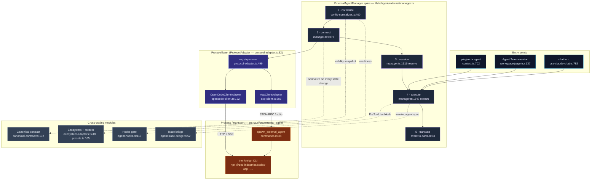

# External Agents

<Status variant="stable" />

<TLDR>
  Cognia has **three** agent runtimes that render into the same chat pane: the
  [built-in agent](../built-in-agent) (in-process Claude Agent SDK), [Agent Teams](../agent-teams)
  (multi-role squads), and **external CLI agents** — Codex, Claude Code, Gemini, Cursor, and any
  OpenCode server — spawned as **child processes**. The external runtime lives in
  `lib/ai/agent/external/` (14 modules, ~15.4k lines). One singleton, `ExternalAgentManager`
  (`manager.ts:199`), runs the whole spine: **normalize** a raw config (`config-normalizer.ts:400`)
  → **connect** through a protocol adapter picked from a registry (`protocol-adapter.ts:474`) →
  open a **session** → **execute** a prompt turn (`manager.ts:1547` streaming / `:1734` headless) →
  **translate** the agent's native events into one canonical `ExternalAgentEvent` stream →
  **project** that stream into `UIMessage.parts` (`event-to-parts.ts:53`). Every blocking outcome
  is captured in one canonical contract — `ExternalAgentValiditySnapshot` — so the UI always knows
  whether a turn ran externally, fell back to the built-in agent, or was blocked, and why.
</TLDR>

<StatGrid>
  <Stat label="Core size" value="~15.4k LOC" hint="lib/ai/agent/external/ — 14 runtime modules" />
  <Stat label="Protocols" value="2" hint="ACP (acp-client.ts) · OpenCode (opencode-client.ts), unified by ProtocolAdapter" />
  <Stat label="Executable presets" value="4" hint="codex · claude-code · gemini-cli · cursor-cli — presets.ts:105" />
  <Stat label="Ecosystem surfaces" value="10" hint="4 executable · 6 documented-only — ecosystem-adapters.ts:48" />
  <Stat label="Branch reason codes" value="18" hint="ExternalAgentBranchReasonCode — external-agent.ts:36" />
  <Stat label="Branch outcomes" value="5" hint="external · fallback · strict_failure · builtin · blocked" />
</StatGrid>

## What It Is

An **external agent** is a third-party coding agent that Cognia does not host in-process. Instead of
running the Claude Agent SDK inside the bundled Node sidecar, Cognia **spawns the agent's own CLI**
(or connects to its server) and speaks its wire protocol. Two protocols are implemented:

- **ACP** — the [Agent Client Protocol](https://agentclientprotocol.com), JSON-RPC 2.0 over
  newline-delimited stdio. This is the path for Codex, Claude Code, Gemini, and Cursor. The client
  is `acp-client.ts` (2632 lines).
- **OpenCode** — the official `@opencode-ai/sdk` over HTTP + Server-Sent Events. The client is
  `opencode-client.ts` (1659 lines).

Both implement one interface, `ProtocolAdapter` (`protocol-adapter.ts:32`), so the manager and
everything above it (chat, plugins, Agent Teams) never branch on protocol. The architecture exists
to satisfy three constraints:

1. **The agent is a foreign process.** Its filesystem, terminal, and permission model are its own;
   Cognia is the *client*. ACP inverts the usual direction — the agent calls back **into** Cognia
   for `fs/read_text_file`, `terminal/create`, and `session/request_permission`
   (`acp-client.ts:1796`). Cognia must answer those as a well-behaved ACP client.
2. **Static export has no server.** `next.config.ts` forces `output: "export"`; spawning a child
   process needs Rust. The actual `spawn`/stdin/stdout plumbing is a pure pass-through in
   `src-tauri/src/external_agent/` (`commands.rs:34`), so external agents only run on the Tauri
   desktop shell — web/mobile see them as `transport_blocked`.
3. **Every runtime must look identical downstream.** The chat renderer, the trace dashboard, and the
   permission dialogs cannot care whether a turn came from Claude-SDK or a Codex subprocess. The
   external runtime therefore **normalizes everything** — events, validity, branch decisions — into
   the same shapes the built-in agent already produces.

## Architecture at a Glance

The five-stage spine runs left-to-right; the cross-cutting modules underneath clip into it. Each box
is annotated with the file and line where the work happens.

## Module Map

Read the per-module page for line-accurate internals. Each card is one documentation page.

<Cards>
  <Card title="Type & contract" href="./type-contract" description="types/agent/external-agent.ts (2168 lines): the protocol/transport taxonomy, the full ACP type surface, config/session/event models, and the validity + branch-reason canonical types." />
  <Card title="Manager (the spine)" href="./manager" description="ExternalAgentManager — addAgent, connect with retry, executeStreaming/execute, the branch decision, validity & health, lifecycle listeners, delegation rules." />
  <Card title="ACP client" href="./acp-client" description="The Agent Client Protocol over JSON-RPC/stdio: initialize, session/new, the prompt turn, the client-side fs/terminal handlers, the permission bridge, session extensions, and streaming." />
  <Card title="OpenCode adapter" href="./opencode-adapter" description="The OpenCode SDK + SSE client, plus the ProtocolAdapter interface, BaseProtocolAdapter.execute event fold, and the adapter registry that selects ACP vs OpenCode." />
  <Card title="Canonical contract & readiness" href="./canonical-readiness" description="The single validity/branch/outcome projection, the execution-block ladder, ecosystem readiness probing, and the session-extension error taxonomy." />
  <Card title="Ecosystem & presets" href="./ecosystem-presets" description="The product catalog (4 adapters, 10 surfaces), the 4 executable presets, createAgentFromPreset, plugin-contributed presets, and the codex env overlay." />
  <Card title="Event translation" href="./translation" description="ACP/OpenCode updates → canonical ExternalAgentEvent → UIMessage parts; the JSON-Schema→Zod tool bridge; result ⇄ SubAgentResult conversion." />
  <Card title="Observability & hooks" href="./observability-hooks" description="The invoke_agent trace span, the two hook systems (plugin System A + settings.json System B via Rust run_agent_hook), and the blocking PreToolUse permission gate." />
  <Card title="Integration seams" href="./integration" description="Where the runtime connects to the rest of the app: chat routing, the plugin ctx.agent.runExternalAgent API, settings UI, the Rust process bridge, and localStorage persistence." />
</Cards>

## The Five-Stage Spine

Every external turn — whatever entry point fired it — flows through the same five stages on
`ExternalAgentManager`. The table is the contract between the pages above.

| Stage | Where | Entry symbol | Output |
| --- | --- | --- | --- |
| 1 · Normalize | `config-normalizer.ts:400` | `normalizeExternalAgentConfigInput` | A fully-defaulted `ExternalAgentConfig` + an initial `validitySnapshot` |
| 2 · Connect | `manager.ts:1072` | `connect` | A live `ProtocolAdapter`, retry loop, negotiated capabilities, `connected` validity |
| 3 · Session | `manager.ts:1316` | `resolveExecutionSession` | An `ExternalAgentSession` (new or reused), permission mode applied |
| 4 · Execute | `manager.ts:1547` / `:1734` | `executeStreaming` / `execute` | A stream of canonical `ExternalAgentEvent`s, then an `ExternalAgentResult` |
| 5 · Translate | `event-to-parts.ts:53` | `applyExternalAgentEventToParts` | `UIMessage.parts[]` rendered identically to the built-in agent |

## Where It Plugs In

External agents are never the *default* — a chat turn only routes to one when the runtime store says
so. The three dispatch edges:

- **Chat** — `use-claude-chat.ts:744` reads `useAgentRuntimeStore.runtime`; if `"external"`, it
  dynamically imports `executeOnExternalAgent` and calls it at `:782`, streaming events into a
  pre-allocated assistant message.
- **Agent Team** — `app/agent-teams/workspace/page.tsx:137` wires the manager's `executeStreaming`
  into a composite streamer, dispatched per `@mention`.
- **Plugins** — `ctx.agent.runExternalAgent` (`context.ts:662`) gated by the
  `agent:dispatch-external` permission (`:668`), resolving a preset if needed before calling
  `manager.execute` (`:702`).

See [Integration seams](./integration) for the full wiring, including the Rust process bridge and
how configs persist to `localStorage` (not Dexie).

## Design Invariants

- **One canonical event stream.** Whatever the agent speaks (ACP `session/update` notifications or
  OpenCode SSE), it is translated to the same `ExternalAgentEvent` union before anything else sees
  it. The renderer, the trace bridge, and the result builder all consume that one shape.
- **One canonical validity contract.** `normalizeExternalAgentValiditySnapshot`
  (`canonical-contract.ts:172`) is the *only* place a partial snapshot becomes a complete one —
  every status change in the manager funnels through it (`manager.ts:928`), so reason codes,
  recovery hints, and branch outcomes are computed consistently.
- **Fail toward the built-in agent.** Anything that blocks an external turn — an unsupported
  protocol, a missing CLI, a denied permission, a dead process — resolves to a branch outcome the
  caller can act on (`fallback`, `blocked`, `builtin`, `strict_failure`) rather than a thrown error
  with no context.
- **Desktop-only execution.** stdio transport requires Tauri; the execution-block ladder
  (`config-normalizer.ts:349`) returns `transport_blocked` everywhere else, and the UI surfaces a
  documented-only or guided state instead of a broken launch.
