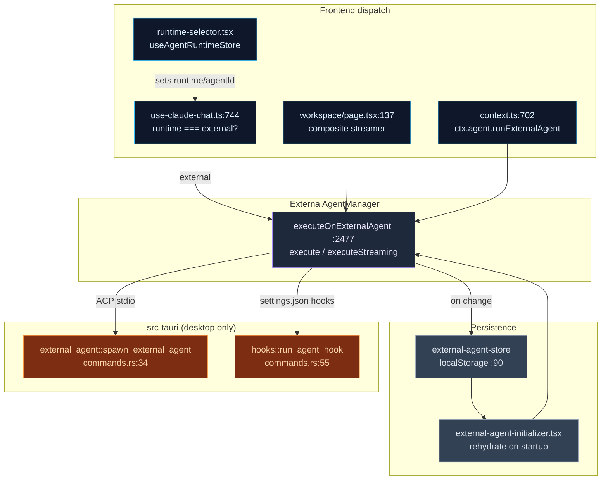
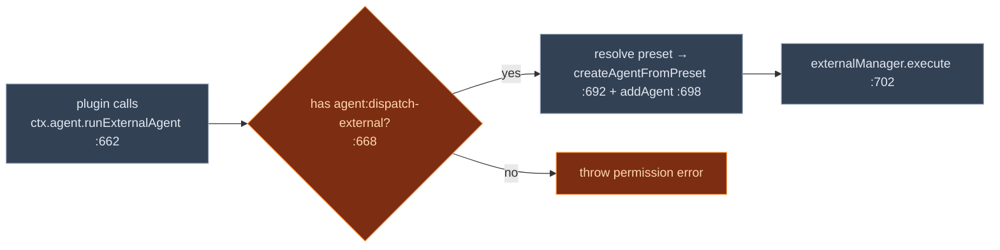

# Integration Seams

<Status variant="stable" />

<TLDR>
  The runtime in `lib/ai/agent/external/` is self-contained; this page is the map of every place it
  touches the rest of the app. A chat turn routes to it only when `useAgentRuntimeStore.runtime ===
  "external"` — checked at `use-claude-chat.ts:744`, dispatched at `:782` via `executeOnExternalAgent`.
  Agent Teams drive it through a composite streamer (`workspace/page.tsx:137`). Plugins reach it
  through `ctx.agent.runExternalAgent` (`context.ts:662`), gated by the `agent:dispatch-external`
  permission (`:668`). Execution itself only happens on the desktop: the Rust `external_agent` module
  spawns the CLI (`commands.rs:34`) as a pure stdio pass-through, and `run_agent_hook`
  (`hooks/commands.rs:55`) runs settings.json hooks. Configs persist to **`localStorage`** (key
  `cognia-external-agents`), not Dexie, and are rehydrated into the manager at startup.
</TLDR>

<StatGrid>
  <Stat label="Chat chokepoint" value="use-claude-chat.ts:782" hint="executeOnExternalAgent, runtime==='external' :744" />
  <Stat label="Plugin API" value="ctx.agent.runExternalAgent" hint="context.ts:662 · gate :668" />
  <Stat label="Permission" value="agent:dispatch-external" hint="permission-api.ts:51 · Rust parity cmd_lint.rs:43" />
  <Stat label="Rust commands" value="2 surfaces" hint="external_agent/* spawn · hooks/run_agent_hook" />
  <Stat label="Persistence" value="localStorage" hint="cognia-external-agents — store.ts:90 (NOT Dexie)" />
  <Stat label="Settings section" value="agents" hint="settings-shell.tsx:330 → ExternalAgentSettings" />
</StatGrid>

## The Integration Map

## 1 · Chat Routing

The runtime is selected by a small store, `useAgentRuntimeStore`, holding `runtime`
(`"claude-sdk" | "external"`) and `externalAgentId`. The UI picker is
`components/agent/mode/runtime-selector.tsx` (`AgentRuntimeSelector`) — radio items for claude-sdk
(`:76`) and external (`:83`); a sibling `<ExternalAgentSelector>` chooses *which* agent record.

The actual dispatch is in `hooks/chat/use-claude-chat.ts` — **not** `use-team-chat.ts`:

1. `const agentRuntime = useAgentRuntimeStore.getState().runtime` (`:744`).
2. `if (agentRuntime === "external")` (`:745`) → read `externalAgentId` (`:746`).
3. Dynamically import `executeOnExternalAgent` (`:762`) and `applyExternalAgentEventToParts` (`:763`).
4. `await executeOnExternalAgent(effectiveText, { agentId, onEvent })` (`:782`) — events stream into
   a pre-allocated assistant message through `onEvent` (`:784`), each one folded into parts by the
   [translation layer](./translation).

`chat-view.tsx` only mounts `<ExternalAgentSessionPanel />` (`:239`), which self-gates on
`runtime === "external"`. The `components/agent/external-agent/` folder holds the management UI
(`manager.tsx`), the ACP-specific `tool-approval-dialog.tsx`, `selector.tsx`, `session-panel.tsx`,
and the `commands`/`config-options`/`plan`/status badges. React glue lives in
`hooks/agent/use-external-agent.ts` — `execute` (`:995`) → `manager.execute` (`:1039`),
`executeStreaming` (`:1088`) → `manager.executeStreaming` (`:1117`).

### Agent Team dispatch

Team turns take a different path: `app/agent-teams/workspace/page.tsx` destructures
`executeStreaming` from `useExternalAgent()` (`:97`) and feeds it into `createCompositeStreamer({ external: … })`
(`:137`), dispatched per `@mention` via `dispatchTeamMention` (`:154`). This is how an external agent
becomes a team member — its result is converted to a `SubAgentResult` by the
[translators](./translation).

## 2 · The Plugin API

Plugins dispatch to external agents through `ctx.agent.runExternalAgent` — desktop-only, defined in
`lib/plugin/core/context.ts` (`:662`):

The permission is wired in five places (the standard plugin-permission recipe):

| Layer | File | Line |
| --- | --- | --- |
| Permission mapping | `lib/plugin/api/permission-api.ts` | 51 |
| Guard registry (description + list) | `lib/plugin/security/permission-guard.ts` | 143 / 185 |
| Valid-permission set | `lib/plugin/core/validation.ts` | 80 |
| Type surface (`PluginAgentAPI.runExternalAgent`) | `types/plugin/plugin.ts` | 1825 |
| Rust parity (lint mirror) | `crates/cognia-cli/src/cmd_lint.rs` | 43 |

Plugins can also **contribute presets** via the `externalAgentPresets` manifest field
(`types/plugin/plugin.ts:564`) / `ctx.registerExternalAgentPreset` (`:1845`), bridged by the
`"external-agent-preset"` overlay capability (`lib/plugin/contracts/capability-bridge-map.ts:210`).
See [Ecosystem & presets](./ecosystem-presets).

## 3 · Settings UI

The settings nav defines section id `"agents"` (`settings-nav-config.ts:158`) with search keywords
`external`, `external agent` (`:557`). `settings-shell.tsx` lazy-loads `ExternalAgentSettings`
(`:123`) and renders it for `case "agents"` (`:330`); the related `agent-runtime` section (`:333`)
hosts the runtime selector. The card component is
`components/settings/agent/external-agent-settings.tsx`.

## 4 · The Rust Process Bridge

External agents only execute on the Tauri desktop shell. There are **two** Rust surfaces:

- **Process bridge** — `src-tauri/src/external_agent/` (`mod` at `lib.rs:14`), a pure stdio
  pass-through that parses nothing. `spawn_external_agent` (`commands.rs:34`) starts the CLI;
  `send_to_external_agent` (`:161`), `kill_external_agent` (`:172`), and
  `receive_external_agent_stderr` (`:219`) drive it; the ACP terminal sub-protocol
  (`acp_terminal_create` `:328`, `_output`, `_kill`, `_write`, …) backs the
  [ACP client's terminal handlers](./acp-client). Registered in the invoke handler at
  `lib.rs:427`–`:444`.
- **Hook runtime** — `src-tauri/src/hooks/commands.rs`: `run_agent_hook` (`:55`, registered
  `lib.rs:308`) runs a settings.json hook for an external-agent lifecycle event (tool- or
  session-scoped), and `set_trusted_workspaces` (`:102`) is the project/local trust gate. The TS
  caller is [`agent-hooks.ts:54`](./observability-hooks).

The split is deliberate: because `external_agent` is stdio-only and parses no protocol, **TypeScript
owns all ACP/OpenCode parsing** — Rust just moves bytes (comment at `commands.rs:5`).

## 5 · Persistence

Configs persist to **`localStorage`, not Dexie** — the Zustand store
`stores/agent/external-agent-store/store.ts` uses `persist` (`:84`) with key `cognia-external-agents`
(`:90`) and a `migrate` function (`:93`). At startup,
`components/providers/initializers/external-agent-initializer.tsx` reads `store.getAllAgents()`
(`:25`) and re-adds each into the runtime manager (`:24`), honoring `autoConnectOnStartup` (`:68`).

**Sessions are not persisted** — they live in-memory in `instance.sessions`, and ACP
`session/list|fork|resume` are extension RPCs back to the live process, not local storage. This is
why a restart re-spawns the agent fresh rather than restoring a transcript.

## Seam Summary

| Seam | Edge | File:line |
| --- | --- | --- |
| Chat | `executeOnExternalAgent` | `use-claude-chat.ts:782` |
| Agent Team | composite streamer | `workspace/page.tsx:137` |
| Plugin | `externalManager.execute` (gated) | `context.ts:702` (gate `:668`) |
| Hooks | `run_agent_hook` | `agent-hooks.ts:54` → `commands.rs:55` |
| Process | `spawn_external_agent` | `commands.rs:34` (`lib.rs:427`) |
| Trace | `invoke_agent` span | `manager.ts:1653` → `agent-trace-bridge.ts` |
| Persistence | localStorage rehydrate | `external-agent-initializer.tsx:25` |
