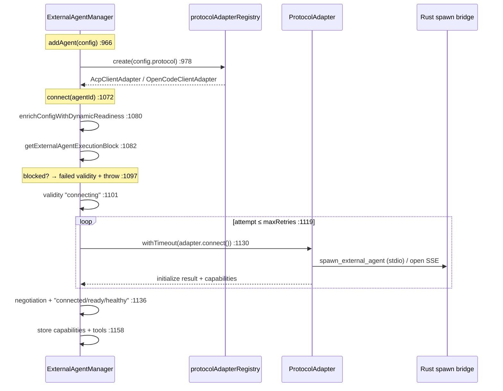
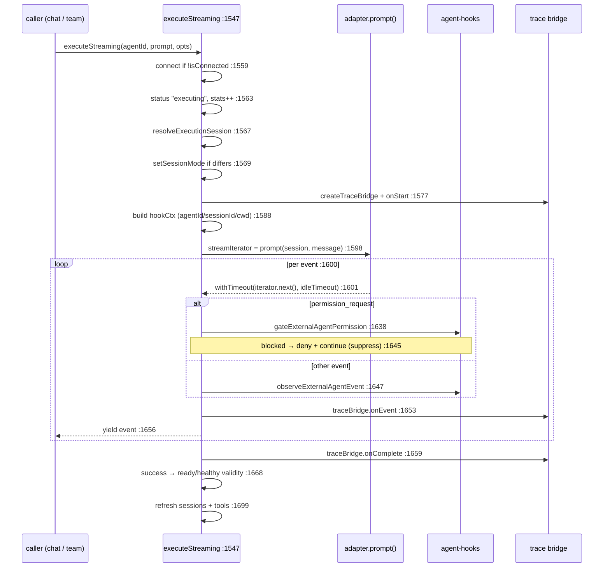

# Manager (the spine)

<Status variant="stable" />

<TLDR>
  `ExternalAgentManager` (`manager.ts:199`) is a process-wide singleton — `getExternalAgentManager()`
  (`:2460`) — that owns the full lifecycle of every external agent. It holds a map of
  `ExternalAgentInstance`s (`:203`) and a parallel map of live `ProtocolAdapter`s (`:204`).
  `addAgent` (`:966`) registers a config, asks the registry for an adapter, and connects;
  `connect` (`:1072`) runs a retry loop with timeout and writes a `validitySnapshot` on every
  transition. The two execution methods are the heart: `executeStreaming` (`:1547`) is the
  interactive async-generator that chat and Agent Teams consume — it resolves a session, builds a
  trace bridge and a hook context, pumps the adapter's event stream, runs the **blocking permission
  gate** per event (`:1638`), and records the outcome; `execute` (`:1734`) is the headless,
  retrying variant. Every status change funnels through `updateInstanceState` (`:830`), which
  normalizes a `validitySnapshot` so reason codes and branch outcomes are always consistent.
</TLDR>

<StatGrid>
  <Stat label="File size" value="2496 lines" hint="lib/ai/agent/external/manager.ts" />
  <Stat label="Public methods" value="40+" hint="from respondToPermission :226 to dispose :2431" />
  <Stat label="Singleton" value="getInstance :542" hint="module helper getExternalAgentManager :2460" />
  <Stat label="Execution paths" value="2" hint="executeStreaming :1547 (interactive) · execute :1734 (headless)" />
  <Stat label="Validity chokepoint" value="updateInstanceState :830" hint="→ normalizeExternalAgentValiditySnapshot :928" />
  <Stat label="State maps" value="3" hint="instances :203 · adapters :204 · delegationRules :205" />
</StatGrid>

## Shape & Singleton

The manager is a class with a private static `_instance` (`:200`); `getInstance(config?)` (`:542`)
lazily constructs and `resetInstance()` (`:552`) disposes for tests. The module-level
`getExternalAgentManager(config?)` (`:2460`) is the canonical accessor used everywhere outside the
class. Construction registers the default protocol adapters (`registerDefaultAdapters` `:562`) and
starts the health-check timer if `healthCheckInterval > 0` (`:217`).

State lives in three maps and a few lists:

| Field | Line | Holds |
| --- | --- | --- |
| `instances` | 203 | `Map<id, ExternalAgentInstance>` — config + connection status + sessions + validity + stats |
| `adapters` | 204 | `Map<id, ProtocolAdapter>` — the live ACP/OpenCode client per agent |
| `delegationRules` | 205 | priority-sorted routing rules for `checkDelegation` |
| `eventListeners` / `lifecycleListeners` | 207 / 208 | per-agent and global subscribers |

Sessions are **not** a top-level map — they live per-instance in `instance.sessions`
(`addAgent` `:1025`).

### The module-level entry helper

`executeOnExternalAgent(prompt, options?)` (`:2477`) is what the chat hook imports. If
`options.agentId` is given it calls `manager.execute(agentId, …)` (`:2485`); otherwise it runs
`checkDelegation(prompt)` (`:2489`) and, if a rule matches, executes on the delegated agent;
otherwise it returns `null` so the caller can fall back to the built-in agent.

## Public API Surface

The 40+ public methods group into six concerns:

| Concern | Methods (line) |
| --- | --- |
| **Lifecycle** | `addAgent` (966) · `removeAgent` (1056) · `connect` (1072) · `disconnect` (1240) · `reconnect` (1270) · `dispose` (2431) |
| **Execution** | `executeStreaming` (1547) · `execute` (1734) · `cancel` (1982) |
| **Sessions** | `createSession` (1495) · `closeSession` (1519) · `getSession` (1535) · `listSessions` (308) · `forkSession` (375) · `resumeSession` (440) |
| **ACP session control** | `respondToPermission` (226) · `setSessionMode` (238) · `setSessionModel` (250) · `getSessionModels` (258) · `setConfigOption` (278) · `getConfigOptions` (295) · `getAuthMethods` (509) · `authenticate` (527) |
| **Introspection** | `getAgent` (2204) · `getAllAgents` (2211) · `getConnectedAgents` (2225) · `getAgentCapabilities` (2239) · `getAgentTools`/`getAllAgentTools` (2005 / 2053) |
| **Delegation & health** | `addDelegationRule` (2076) · `checkDelegation` (2095) · `performHealthCheck` (2276) · `checkAgentHealth` (2331) |

> There is no `createAgentFromPreset` on the manager (that lives in [`presets.ts`](./ecosystem-presets)),
> and "fallback" is not a method — it is an *outcome* encoded into the validity snapshot. ACP
> capability queries return an `AgentCapabilityResult<T>` (`:80`), a discriminated `ok` /
> `unsupported` / `error` so the UI can grey out unsupported controls without throwing.

## Connect Sequence

`connect` (`:1072`) is a retry loop around the adapter's transport open. The adapter itself is chosen
**once**, in `addAgent`, by `protocolAdapterRegistry.create(config.protocol)` (`:978`) — the manager
never branches on protocol again.

On failure each attempt maps the error to a reason code (`mapConnectionErrorToReasonCode` `:737`:
protocol → `protocol_unsupported`, transport → `transport_blocked`, timeout → `external_unavailable`,
else `initialization_failed`), decides `shouldRetry` (`:1183`), cleans up and sleeps, or throws. A
fully-exhausted loop writes an `external_unavailable` snapshot and throws `lastError` (`:1229`).

## executeStreaming — the Interactive Chokepoint

`executeStreaming` (`:1547`) is an async generator. Chat (`use-claude-chat.ts:782`) and Agent Teams
both drive it, yielding canonical `ExternalAgentEvent`s one at a time. This is where the trace span,
the hook gate, and the validity bookkeeping all converge.

Two subtleties make this the *safety* chokepoint:

- **The permission gate can suppress.** When `gateExternalAgentPermission` (`:1638`) returns
  blocked, the manager calls the deny callback (which routes to `adapter.respondToPermission`) and
  `continue`s — the event is **never yielded**, so the user is not prompted for a tool a
  settings.json hook already denied. See [Observability & hooks](./observability-hooks).
- **Idle timeout cancels the turn.** Each `iterator.next()` is wrapped in `withTimeout` (`:1601`)
  with `resolveStreamIdleTimeoutMs`; on timeout it cancels the session, and the catch at `:1704`
  maps it to status `timeout` / reason `external_unavailable`.

## execute — the Headless Retry Loop

`execute` (`:1734`) is the non-streaming path used by `executeOnExternalAgent` and the plugin API. It
wraps `adapter.execute` (which internally drains `prompt()`) in a retry loop (`:1787`). Hooks fire
**fire-and-forget** through a wrapped `onEvent` (`:1799`): the permission gate still runs (`:1804`)
but cannot suppress UI, since there is no interactive stream — the comment at `:1800` documents the
asymmetry. The same trace bridge is created at `:1764`. Retryable failures (`isRetryableError`
`:610`) trigger reconnect-and-retry when `autoReconnect` is on (`:1881`).

## The Branch Decision

Every terminal state resolves to an `ExternalAgentBranchOutcome`. The helper
`inferBranchOutcomeFromReason(reasonCode, eligibility)` (`:160`) is the canonical mapping:

| Reason code | Outcome |
| --- | --- |
| `strict_failure` | `strict_failure` |
| `fallback_to_builtin` | `fallback` |
| `agent_not_found` / `configuration_missing` | `builtin` |
| any other, eligibility `blocked` | `blocked` |
| any other, eligibility `eligible` | `external` |

Outcomes are assigned at the lifecycle edges: `executeStreaming` onComplete `:1665` / onError
`:1724`; `execute` onComplete `:1902` / onError `:1972`; the session-extension gates
(`listSessions`/`forkSession`/`resumeSession`) set `blocked` at `:326` / `:401` / `:470`. All of them
land on `instance.validity` through `updateInstanceState` (`:830`), which sets
`lastBranchReasonCode` / `lastBranchReason` / `branchOutcome` (`:895`) before normalizing.

## Validity & Health

`updateInstanceState` (`:830`) is the **only** place an instance's validity changes. It merges the
base snapshot with the update (`:885`), stamps the branch fields (`:895`), and calls
`normalizeExternalAgentValiditySnapshot` (`:928`) from the [canonical contract](./canonical-readiness),
assigning the result to **both** `instance.validity` and `instance.config.validitySnapshot` (`:932`)
so the persisted config always carries the last known state.

Health runs on a timer: `performHealthCheck` (`:2276`) loops connected agents, calls
`adapter.healthCheck()` (`:2282`), writes a `source: "health"` snapshot, and reconnects unhealthy
agents when `autoReconnect` is on (`:2298`). `checkAgentHealth` (`:2331`) is the manual single-agent
variant.

## Delegation & Listeners

- **Rule-based routing** — `addDelegationRule` (`:2076`) keeps rules priority-sorted;
  `checkDelegation` (`:2095`) evaluates them (`task-type` / `capability` / `keyword` / `tool-needed`
  / `always` / `custom`) into an `ExternalAgentDelegationResult` with a `reasonCode`. This is how a
  built-in turn can be transparently handed to an external agent.
- **Subscriptions** — `addLifecycleListener` (`:2383`) gets `ExternalAgentLifecycleEvent`s (status +
  validity + branch metadata); `addEventListener` (`:2393`) gets per-agent `ExternalAgentEvent`s.
  Both wrap each listener in try/catch (`:2413`) so a bad subscriber can't break a turn.

## Error & Fallback Handling

| Mechanism | Line | Behavior |
| --- | --- | --- |
| `withTimeout` | 696 | Races op vs timer, runs `onTimeout` cleanup (e.g. `adapter.cancel`), then rejects. |
| `isRetryableError` | 610 | Abort → never retry; "unsupported protocol" / "agent not found" / "does not support" → non-retryable; timeout/network/5xx/429 → retryable. |
| `computeRetryDelayMs` | 597 | Exponential backoff capped at `maxRetryDelay`. |
| Connect retry | 1119 | Per-attempt disconnect cleanup + sleep; exhausted → `external_unavailable` throw. |
| Permission suppression | 1645 | Blocked tool's `permission_request` event is dropped, never shown. |
| `dispose` | 2431 | Swallows per-agent disconnect errors, then clears all maps. |
