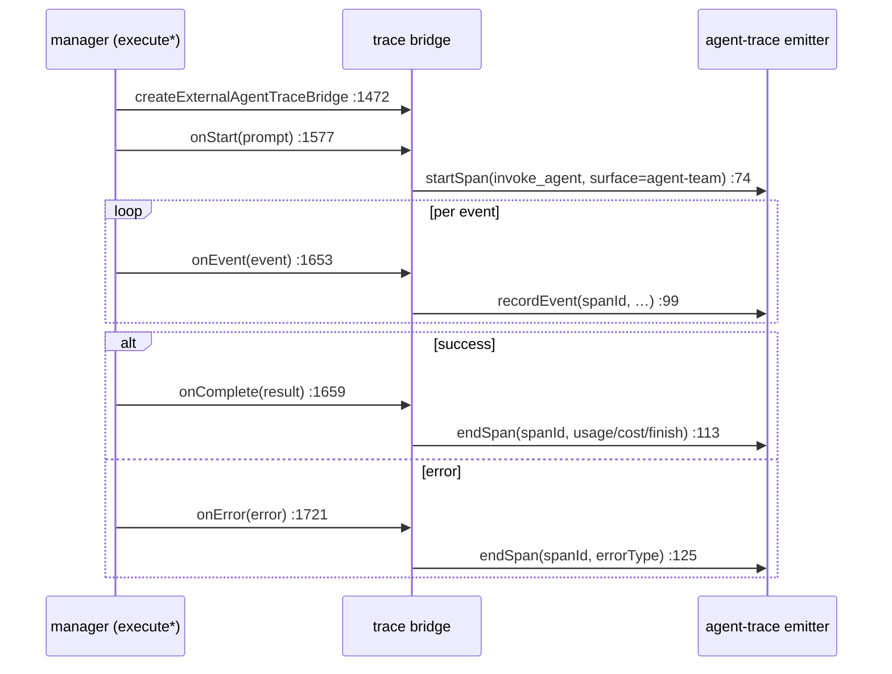
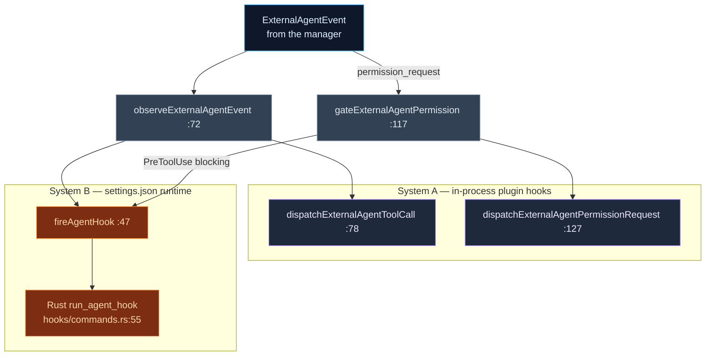

# Observability & Hooks

<Status variant="stable" />

<TLDR>
  Two thin bridges make external turns observable and governable on the same rails as the built-in
  agent. `agent-trace-bridge.ts` turns one external run into one **`invoke_agent` span** with
  `surface = "agent-team"` (`:79`): `createExternalAgentTraceBridge` (`:52`) returns
  `{onStart, onEvent, onComplete, onError}`, which the manager calls at the lifecycle edges
  (`manager.ts:1577`/`:1653`/`:1659`/`:1721`); the span lands in the shared `agentTraces` sink via
  `@cognia/agent-trace/emitter`. `agent-hooks.ts` wires external events into **two** hook systems:
  in-process plugin hooks (System A — `dispatchExternalAgentToolCall`, `PostToolUse`, …) and the
  settings.json hook runtime (System B — `fireAgentHook` `:47` invokes the Rust `run_agent_hook`
  command). Its sharpest tool is `gateExternalAgentPermission` (`:117`): a **blocking `PreToolUse`
  hook** that can deny a tool before the user is ever asked.
</TLDR>

<StatGrid>
  <Stat label="agent-trace-bridge.ts" value="254 lines" hint="one invoke_agent span per run" />
  <Stat label="agent-hooks.ts" value="156 lines" hint="System A (plugin) + System B (settings.json)" />
  <Stat label="Span operation" value="invoke_agent" hint="surface=agent-team, agent-trace-bridge.ts:75" />
  <Stat label="Rust command" value="run_agent_hook" hint="agent-hooks.ts:54 → hooks/commands.rs:55" />
  <Stat label="Blocking gate" value="PreToolUse" hint="gateExternalAgentPermission :117" />
  <Stat label="Tauri-guarded" value="yes" hint="fireAgentHook isTauri() :52 — null on web/mobile" />
</StatGrid>

## agent-trace-bridge.ts — One Span per Run

The bridge wraps the shared emitter (`startSpan`/`recordEvent`/`endSpan` from
`@cognia/agent-trace/emitter`, imported `:16`) so the external runtime produces the same span shape as
every other agent. The manager builds one per run in `createTraceBridge` (`manager.ts:1472`) and
drives it through the turn.

| Method | Line | When the manager calls it | Records |
| --- | --- | --- | --- |
| `onStart(prompt)` | 64 | `executeStreaming:1578` / `execute:1765` | `startSpan({operationName:"invoke_agent", surface:"agent-team", providerName, sessionId, traceId, parentSpanId, agentId, agentName, handoff, inputPreview, metadata})` (`:74`) |
| `onEvent(event)` | 94 | per event `:1653` / `:1815` | `recordEvent(spanId, {name, at, attributes})` (`:99`) |
| `onComplete(result)` | 109 | `:1659` / `:1899` | `endSpan(spanId, buildCompletionInput(result))` — usage, cost, finish reason, output preview |
| `onError(error, context)` | 119 | `:1721` / `:1969` | `endSpan(spanId, {errorType:"external_agent_error", errorMessage, …})` |

Two details worth knowing:

- **`providerFromProtocol` (`:137`)** maps `anthropic`/`claude` → `"anthropic"`, and *everything else*
  (acp/a2a/opencode) → `"cognia.team"`. So in the trace dashboard, a Codex or Cursor run shows under
  the `cognia.team` provider, not a model vendor.
- **It swallows every error.** Tracing must never break a turn, so all four methods are guarded and
  no-op if the span never started.

The span persists downstream through the emitter's `agentTraces` Dexie sink — the same data the
[Observability dashboard](../../subsystems/observability) reads. The bridge itself only emits.

## agent-hooks.ts — Two Hook Systems

External agents participate in the same [hooks mechanism](../built-in-agent/hooks) (ADR-0040) as the
built-in agent. `agent-hooks.ts` is the adapter. Every call is best-effort and Tauri-guarded.

### Observational hooks

`observeExternalAgentEvent(ctx, event)` (`:72`) is called for every non-permission event
(`manager.ts:1647`). It switches on `event.type` and dispatches into both systems:

| Event | Plugin (System A) | settings.json (System B) | Line |
| --- | --- | --- | --- |
| `session_start` | — | `fireAgentHook("SessionStart")` | 75 |
| `tool_use_start` | `dispatchExternalAgentToolCall` | — | 78 |
| `tool_result` | — | `PostToolUse` / `PostToolUseFailure` (on `isError`) | 86 |
| `done` | — | `Stop` + `SessionEnd` | 99 |
| `error` | — | `StopFailure` | 103 |

### The blocking permission gate

`gateExternalAgentPermission(ctx, event, deny)` (`:117`) is the safety chokepoint. When the agent
requests permission for a tool, it:

1. Fires the plugin `dispatchExternalAgentPermissionRequest` and a `PermissionRequest` hook
   (`:127`/`:133`).
2. **Awaits a blocking `PreToolUse` hook** (`:138`) — the only synchronous hook in the flow.
3. If the hook returns `block`, it calls `deny(requestId, reason)` (`:145`, which routes to
   `adapter.respondToPermission`), fires `PermissionDenied`, and returns **`true`** (`:153`).
4. Otherwise returns `false`.

Back in [the manager](./manager), a `true` return means the `permission_request` event is **dropped
and never yielded** to the chat (`manager.ts:1645`) — so a settings.json policy can silently deny a
tool an external agent tried to run, exactly as it would for the built-in agent. In the headless
`execute` path the gate still runs but cannot suppress UI (there is no interactive stream), a
deliberate asymmetry documented at `manager.ts:1800`.

### The Rust seam

`fireAgentHook(event, …)` (`:47`) is guarded by `isTauri()` (`:52`) — it returns `null` on web/mobile
— and otherwise `invoke<AgentHookDecision>("run_agent_hook", …)` (`:54`). On the Rust side,
`run_agent_hook` (`hooks/commands.rs:55`) parses the PascalCase `HookEvent`, resolves a trusted cwd,
runs the matching settings.json hooks, and returns a `HookDecisionDto` — mirrored here as
`AgentHookDecision` (`:30`). TypeScript owns the event mapping because the Rust `external_agent`
module is a pure stdio pass-through that parses nothing (see [Integration seams](./integration)).
